# Master PRD: AI-Powered Therapy Platform - TherapyFlow AI

# Master Product Requirements Document

## TherapyFlow AI: Multi-Agent Therapy Platform

**Version:** 1.0  
**Last Updated:** January 11, 2026  
**Epic:** epic:d969320e-d519-47a7-a258-e04789b8ce0e  
**Status:** In Development  
**Target Launch:** March 2026 (8 weeks)

---

## Executive Summary

TherapyFlow AI transforms an existing therapy platform (SafeSpaceApp) into an **AI-powered, multi-agent system** that automates routine tasks, provides real-time clinical assistance, and enables proactive patient engagement. The platform leverages cutting-edge AI technology (Claude Sonnet 4.5, GPT-5.2, LangGraph.js) to increase therapist capacity by **3x**, reduce administrative overhead by **80%**, and improve patient outcomes through **24/7 intelligent support**.

### Key Metrics


| Metric             | Current State        | Target State         | Impact        |
| ------------------ | -------------------- | -------------------- | ------------- |
| Therapist Capacity | 20 patients/week     | 60 patients/week     | **+200%**     |
| Admin Time         | 10 hours/week        | 2 hours/week         | **-80%**      |
| Patient Engagement | 40% between sessions | 70% between sessions | **+75%**      |
| Response Time      | 24-48 hours          | Instant (24/7)       | **Real-time** |
| Cost per Session   | $120                 | $40                  | **-67%**      |
| HIPAA Compliance   | Manual               | Automated            | **100%**      |


### Investment

- **Development:** 8 weeks, 12-15 developers
- **Infrastructure:** $400/month (Supabase, Netlify, OpenAI)
- **Expected ROI:** 300% within 6 months

---

## 1. Problem Statement

### Current Pain Points

#### For Therapists

1. **Administrative Burden** (30% of time)
  - Manual appointment scheduling and rescheduling
  - Time-consuming SOAP note documentation
  - Reactive patient engagement (only during sessions)
  - Limited capacity (20 patients max per week)
2. **Clinical Challenges**
  - Difficulty tracking patient progress across sessions
  - Risk of missing critical indicators (suicidal ideation, etc.)
  - Limited access to evidence-based intervention suggestions
  - No real-time decision support during sessions
3. **Scalability Issues**
  - Can't serve more patients without hiring more therapists
  - High operational costs
  - Burnout from repetitive tasks

#### For Patients

1. **Access Barriers**
  - Limited availability (business hours only)
  - Long wait times for appointments
  - No support between sessions
  - Difficulty tracking own progress
2. **Engagement Gaps**
  - Forget homework assignments
  - Miss early warning signs
  - Lack of proactive check-ins
  - Limited self-service options

#### For Practice Owners

1. **Operational Inefficiency**
  - High cost per patient
  - Limited therapist utilization
  - Manual compliance tracking
  - Difficulty scaling operations
2. **Competitive Disadvantage**
  - Traditional model vs. AI-powered competitors
  - Limited differentiation
  - Higher prices than alternatives

### Market Opportunity

- **$6.5B** digital mental health market (2026)
- **35% CAGR** through 2030
- **78%** of therapists report administrative burden as top pain point
- **65%** of patients want 24/7 access to support
- **$240B** total addressable market (mental health services)

---

## 2. Solution Overview

### Vision

**"Empower every therapist to serve 3x more patients with AI-powered assistance, while providing patients with 24/7 intelligent support and proactive care."**

### Core Innovation

A **multi-agent AI system** that acts as an intelligent layer between patients, therapists, and the platform, automating routine tasks, providing real-time assistance, and enabling proactive engagement—all while maintaining HIPAA compliance and clinical accuracy.

### How It Works


### Key Differentiators

1. **Multi-Agent Architecture** - Specialized agents for different tasks (vs. single chatbot)
2. **Real-Time Copilot** - Assists therapists during live sessions (vs. post-session only)
3. **Proactive Engagement** - AI initiates check-ins (vs. reactive only)
4. **HIPAA-Compliant RAG** - Secure context retrieval with PII masking
5. **Offline-First Mobile** - Works without internet, syncs later
6. **Hinglish Support** - Voice input in English, Hindi, and Hinglish
7. **Transparency HUD** - Shows AI reasoning (builds trust)

---

## 3. User Personas

### Persona 1: Dr. Priya Sharma (Therapist)

**Demographics:**

- Age: 35
- Location: Mumbai, India
- Experience: 8 years clinical practice
- Specialization: CBT, DBT

**Goals:**

- Serve more patients without burnout
- Reduce administrative time
- Improve clinical outcomes
- Stay updated with evidence-based practices

**Pain Points:**

- Spends 3 hours/day on documentation
- Can only see 20 patients/week
- Struggles to remember patient history across sessions
- Misses subtle risk indicators

**How TherapyFlow AI Helps:**

- **AI Copilot** provides real-time suggestions during sessions
- **Auto-generated SOAP notes** save 2 hours/day
- **RAG system** surfaces relevant patient history instantly
- **Risk detection** flags concerning patterns immediately
- **Capacity increase** from 20 to 60 patients/week

### Persona 2: Rahul Verma (Patient)

**Demographics:**

- Age: 28
- Location: Bangalore, India
- Condition: Anxiety, work stress
- Tech-savvy: High

**Goals:**

- Get help when needed (not just during sessions)
- Track progress over time
- Complete therapy homework
- Affordable mental health support

**Pain Points:**

- Can't reach therapist between sessions
- Forgets homework assignments
- Doesn't know if therapy is working
- Expensive ($120/session)

**How TherapyFlow AI Helps:**

- **24/7 AI chat** for immediate support
- **Proactive reminders** for homework and check-ins
- **Progress tracking** with visual insights
- **Lower cost** ($40/session with AI assistance)
- **Voice input** in Hinglish (comfortable communication)

### Persona 3: Dr. Anjali Mehta (Practice Owner)

**Demographics:**

- Age: 45
- Role: Clinic owner, 5 therapists
- Location: Delhi, India

**Goals:**

- Scale practice profitably
- Maintain high quality of care
- Ensure HIPAA compliance
- Differentiate from competitors

**Pain Points:**

- High operational costs
- Limited therapist availability
- Manual compliance tracking
- Difficulty attracting new patients

**How TherapyFlow AI Helps:**

- **3x capacity** without hiring more therapists
- **80% cost reduction** in admin overhead
- **Automated compliance** tracking and reporting
- **Competitive advantage** with AI-powered care
- **Analytics dashboard** for practice insights

---

## 4. Core User Journeys

### Journey 1: Patient Books Appointment (Conversational)


**Key Features:**

- Natural language booking (no forms)
- Real-time availability checking
- Multi-channel confirmation (WhatsApp + push + email)
- Automatic calendar integration
- Rescheduling and cancellation support

### Journey 2: Therapist Uses AI Copilot During Session

```mermaid
sequenceDiagram
    participant Therapist
    participant CopilotUI as Copilot Sidebar
    participant SessionAgent
    participant RAG as RAG System
    participant Database
    participant RiskAlert as Risk Alert System

    Therapist->>CopilotUI: Start session
    CopilotUI->>SessionAgent: Initialize with patient ID
    SessionAgent->>RAG: Retrieve patient history
    RAG->>Database: Vector similarity search
    Database-->>RAG: Relevant memories (5 results)
    RAG-->>SessionAgent: Patient context
    SessionAgent->>CopilotUI: Display patient summary
    
    Note over Therapist,CopilotUI: Session in progress...
    
    Therapist->>CopilotUI: Patient says: "I don't want to continue living"
    CopilotUI->>SessionAgent: Analyze statement
    SessionAgent->>SessionAgent: Detect: Suicidal ideation (HIGH RISK)
    SessionAgent->>RiskAlert: Flag critical risk
    RiskAlert-->>Therapist: 🚨 IMMEDIATE ALERT
    SessionAgent->>CopilotUI: Suggest: "Use safety planning protocol"
    CopilotUI-->>Therapist: Display intervention suggestions
    
    Therapist->>CopilotUI: End session
    SessionAgent->>Database: Generate SOAP note draft
    Database-->>SessionAgent: SOAP note created
    SessionAgent->>CopilotUI: Display draft for review
    CopilotUI-->>Therapist: Review and finalize
```



**Key Features:**

- Real-time patient context retrieval (RAG)
- Automatic risk detection and alerting
- Evidence-based intervention suggestions
- Auto-generated SOAP notes
- Transparency HUD (shows AI reasoning)

### Journey 3: AI Proactive Wellness Check


**Key Features:**

- Automated wellness checks (configurable frequency)
- Mood trend analysis
- Intelligent escalation to therapist
- Multi-channel support (WhatsApp, SMS, push, email)
- Homework completion tracking

### Journey 4: Patient Tracks Progress (Insights)


**Key Features:**

- Automated progress analysis
- Visual trend charts (mood, anxiety, depression)
- Pattern identification (triggers, coping strategies)
- Evidence-based recommendations
- Outcome metrics (PHQ-9, GAD-7, PCL-5)

---

## 5. Product Features (Prioritized)

### P0: Must-Have for Launch


| Feature                      | Description                             | User Benefit                | Implementation |
| ---------------------------- | --------------------------------------- | --------------------------- | -------------- |
| **LangGraph Orchestrator**   | Intent classification + agent routing   | Intelligent task delegation | Wave 1         |
| **BookingAgent**             | Conversational appointment booking      | 24/7 self-service booking   | Wave 2         |
| **SessionAgent**             | Real-time therapist copilot             | Clinical decision support   | Wave 2         |
| **RAG System**               | Context retrieval with pgvector         | Relevant patient history    | Wave 2         |
| **Embedded Chat (Web)**      | Netlify Edge Functions streaming chat   | Seamless user experience    | Wave 4         |
| **Mobile Chat (GiftedChat)** | Native mobile chat with offline support | Always-available support    | Wave 5         |
| **HIPAA Compliance**         | PII masking, encryption, audit logs     | Legal compliance            | Waves 1-7      |


### P1: Important for Success


| Feature                | Description                           | User Benefit             | Implementation |
| ---------------------- | ------------------------------------- | ------------------------ | -------------- |
| **InsightsAgent**      | Progress analysis and recommendations | Data-driven treatment    | Wave 2         |
| **FollowupAgent**      | Proactive wellness checks             | Continuous engagement    | Wave 3         |
| **Copilot Sidebar**    | Real-time session assistance          | Better clinical outcomes | Wave 4         |
| **Push Notifications** | Proactive engagement alerts           | Timely interventions     | Wave 5         |
| **Voice Input**        | Hinglish speech-to-text               | Accessible communication | Wave 5         |
| **Feature Flags**      | Gradual rollout control               | Safe deployment          | Wave 1         |


### P2: Nice-to-Have


| Feature              | Description                  | User Benefit            | Implementation |
| -------------------- | ---------------------------- | ----------------------- | -------------- |
| **Transparency HUD** | Shows AI reasoning           | Trust and understanding | Wave 4         |
| **Generative UI**    | Dynamic interface generation | Personalized UX         | Wave 4         |
| **Biometric Auth**   | Face ID / Touch ID           | Enhanced security       | Wave 5         |
| **Multi-language**   | English, Hindi, Hinglish     | Broader accessibility   | Wave 7         |
| **Agent Evaluation** | Quality assurance testing    | Continuous improvement  | Wave 7         |


---

## 6. Technical Architecture

### System Architecture


### Technology Stack (2026 Latest)

#### AI & ML

- **LangGraph.js 1.0+** - Multi-agent orchestration (production-ready, LTS)
- **Claude Sonnet 4.5** - Fast, cost-effective reasoning (released 2025)
- **Claude Opus 4.5** - Complex clinical reasoning (released Nov 2025)
- **GPT-5.2** - Analytical tasks (released Dec 2025)
- **Whisper** - Speech-to-text transcription
- **OpenAI Embeddings** - text-embedding-3-small (1536 dimensions)

#### Frontend

- **Next.js 15.1.4** - Web application framework
- **React 18.3.1** - UI library
- **OpenAI SDK** - Direct AI integration
- **Netlify Edge Functions** - Streaming chat interface
- **React Native 0.81.5** - Mobile framework
- **Expo SDK 52** - Mobile development platform
- **GiftedChat** - Mobile chat UI
- **TailwindCSS 4** - Styling

#### Backend

- **Supabase** - PostgreSQL database + Edge Functions (Deno)
- **pgvector** - Vector similarity search for RAG
- **Upstash Redis** - Response caching (30%+ cost reduction)
- **Deno 1.x** - Edge Function runtime

#### Integrations

- **Twilio WhatsApp Business API** - Proactive messaging
- **Daily.co** - Video sessions (existing)
- **PostHog** - Product analytics
- **Rollbar** - Error monitoring (existing)
- **Stripe** - Payments (existing)

#### DevOps

- **Vercel** - Web hosting and deployment
- **EAS (Expo Application Services)** - Mobile builds
- **GitHub Actions** - CI/CD pipeline
- **Playwright** - E2E testing

### Data Architecture

**Existing Tables (25 migrations):**

- `profiles` - User accounts (patients, therapists, admins)
- `practices` - Multi-tenant practice management
- `appointments` - Session scheduling
- `session_recordings` - Video recordings
- `transcripts` - Session transcripts
- `soap_notes` - Clinical documentation
- `payments` - Stripe integration

**New Tables (8 migrations for AI):**

- `agent_conversations` - Chat history with agents
- `agent_memory` - RAG embeddings (pgvector)
- `agent_tools` - Tool registry and validation
- `agent_executions` - Execution logs and cost tracking
- `proactive_notifications` - Scheduled messages
- `user_agent_preferences` - Privacy and frequency settings
- `feature_flags` - Gradual rollout control
- `risk_flags` - Clinical risk indicators

### Security & Compliance

**HIPAA Requirements:**

- ✅ **Encryption at Rest:** AES-256 (Supabase)
- ✅ **Encryption in Transit:** TLS 1.3
- ✅ **Access Control:** Row-Level Security (RLS)
- ✅ **Audit Logging:** All agent interactions logged
- ✅ **PII Masking:** Automated sanitization for logs/analytics
- ✅ **Data Retention:** 7-year retention, automated cleanup
- ✅ **Business Associate Agreements:** Supabase, OpenAI, Anthropic, Twilio

**Security Measures:**

- Multi-factor authentication (2FA)
- Biometric authentication (Face ID / Touch ID)
- Role-based access control (RBAC)
- Rate limiting and abuse prevention
- Circuit breakers for API failures
- Automated security scanning (Trivy, npm audit)

---

## 7. AI Agent Specifications

### Agent 1: BookingAgent

**Purpose:** Automate appointment scheduling through conversational interface

**Capabilities:**

- Check therapist availability
- Create/reschedule/cancel appointments
- Send confirmations (WhatsApp, email, push)
- Suggest alternative slots
- Handle conflicts and double-bookings

**Tools:**

- `check_therapist_availability(therapistId, date)`
- `create_appointment(patientId, therapistId, dateTime, duration)`
- `send_booking_confirmation(appointmentId, channels[])`
- `suggest_alternative_slots(therapistId, preferredDate, flexibilityDays)`

**LLM:** Claude Sonnet 4.5 (fast, accurate, cost-effective)  
**Temperature:** 0.3 (low for booking accuracy)  
**Success Criteria:** 95% booking accuracy, <3 second response time

### Agent 2: SessionAgent (Real-Time Copilot)

**Purpose:** Assist therapists during live therapy sessions

**Capabilities:**

- Retrieve patient history using RAG
- Suggest evidence-based interventions
- Flag risk indicators (suicidal ideation, self-harm, etc.)
- Generate SOAP note drafts
- Provide real-time clinical decision support

**Tools:**

- `retrieve_patient_history(patientId, lookbackDays)`
- `suggest_intervention(symptoms[], therapyType, sessionGoal)`
- `flag_risk_indicator(riskType, severity, evidence)`
- `generate_soap_note_draft(transcript, sessionId)`

**LLM:** Claude Opus 4.5 (complex clinical reasoning)  
**Temperature:** 0.2 (very low for clinical accuracy)  
**Success Criteria:** 90% intervention relevance, <2 second response, 100% risk detection

### Agent 3: InsightsAgent

**Purpose:** Analyze patient data and provide clinical insights

**Capabilities:**

- Analyze patient progress over time
- Identify patterns (symptoms, triggers, coping strategies)
- Generate treatment recommendations
- Calculate outcome metrics (PHQ-9, GAD-7, PCL-5)
- Predict treatment response

**Tools:**

- `analyze_patient_progress(patientId, timeframe)`
- `identify_patterns(patientId, patternType)`
- `generate_treatment_recommendations(patientId, diagnosis[], history)`
- `calculate_outcome_metrics(patientId, metricType)`

**LLM:** GPT-5.2 (analytical tasks, data analysis)  
**Temperature:** 0.1 (very low for analytical accuracy)  
**Success Criteria:** 85% recommendation accuracy, clinically relevant insights

### Agent 4: FollowupAgent

**Purpose:** Proactive post-session engagement and wellness monitoring

**Capabilities:**

- Send automated wellness checks
- Check homework completion
- Analyze mood trends
- Escalate concerns to therapist
- Schedule follow-up reminders

**Tools:**

- `check_homework_completion(patientId, homeworkId)`
- `send_wellness_check(patientId, messageType, channel)`
- `analyze_mood_trend(patientId, days)`
- `escalate_to_therapist(patientId, concern, urgency)`

**LLM:** Claude Sonnet 4.5 (empathetic communication)  
**Temperature:** 0.7 (higher for natural, warm responses)  
**Success Criteria:** 70% patient response rate, 95% escalation accuracy

### RAG System (Retrieval-Augmented Generation)

**Purpose:** Provide relevant context to agents from patient history

**Architecture:**

- **Embedding Model:** OpenAI text-embedding-3-small (1536 dimensions)
- **Vector Store:** pgvector (PostgreSQL extension)
- **Similarity Threshold:** 0.7 (cosine similarity)
- **Cache:** 7-day TTL for embeddings (cost optimization)

**Memory Types:**

- `session_note` - Therapist session notes
- `patient_goal` - Treatment goals and objectives
- `therapist_note` - Clinical observations
- `conversation` - Chat history with agents

**Performance:**

- Retrieval latency: <500ms
- Accuracy: >85% relevance
- Cost: $0.00002 per 1000 tokens (embedding)

---

## 8. User Experience & Interface Design

### Web Application (Next.js)

**Key Screens:**

1. **Patient Dashboard**
  - AI chat interface (embedded)
  - Upcoming appointments
  - Progress insights
  - Mood tracker
  - Homework assignments
2. **Therapist Dashboard**
  - Patient list with AI insights
  - Session schedule
  - AI copilot sidebar (during sessions)
  - Analytics and reports
  - SOAP notes (AI-generated drafts)
3. **Admin Dashboard**
  - Practice analytics
  - Therapist performance
  - Cost tracking
  - Compliance monitoring
  - Feature flag management

**Design Principles:**

- Minimal, clean interface
- Accessibility (WCAG 2.1 AA)
- Dark mode support
- Responsive (mobile-first)
- Keyboard shortcuts for power users

### Mobile Application (React Native + Expo)

**Key Screens:**

1. **Chat Screen**
  - GiftedChat interface
  - Voice input button
  - Offline queue indicator
  - Typing indicators
  - Message status (sent, delivered, read)
2. **Appointments Screen**
  - Calendar view
  - Upcoming sessions
  - Quick booking button
  - Video session join
3. **Progress Screen**
  - Mood chart
  - Insights from AI
  - Homework list
  - Achievement badges
4. **Settings Screen**
  - AI preferences (frequency, channels)
  - Privacy controls
  - Notification settings
  - Biometric authentication toggle

**Mobile-Specific Features:**

- Offline-first architecture (queue + sync)
- Push notifications for proactive engagement
- Haptic feedback for interactions
- Voice input with Hinglish support
- Biometric authentication (Face ID / Touch ID)

---

## 9. Implementation Roadmap

### 7-Wave Execution Plan (8 Weeks)


### Wave Summary


| Wave       | Duration  | Team Size | Key Deliverables                                                   | Dependencies |
| ---------- | --------- | --------- | ------------------------------------------------------------------ | ------------ |
| **Wave 1** | 1 week    | 2-3 devs  | Database schema, LangGraph orchestrator, LLM client, feature flags | None         |
| **Wave 2** | 2 weeks   | 3-4 devs  | RAG system, BookingAgent, SessionAgent, InsightsAgent              | Wave 1       |
| **Wave 3** | 1.5 weeks | 2-3 devs  | FollowupAgent, WhatsApp integration, PII masking, cron jobs        | Waves 1-2    |
| **Wave 4** | 2 weeks   | 3-4 devs  | Web chat, copilot sidebar, transparency HUD, notifications         | Waves 1-3    |
| **Wave 5** | 2 weeks   | 3-4 devs  | Mobile chat, push notifications, offline support, voice input      | Waves 1-4    |
| **Wave 6** | 1.5 weeks | 2-3 devs  | API integrations, analytics, caching, CI/CD                        | Waves 1-5    |
| **Wave 7** | 1.5 weeks | 3-4 devs  | Onboarding, E2E testing, HIPAA audit, documentation                | Waves 1-6    |


**Total:** 8 weeks, 12-15 developers (parallel execution)

### Parallel Execution Strategy

- **Waves 1-3:** Backend-focused (can run in parallel with planning)
- **Waves 4-5:** Frontend-focused (web and mobile teams work in parallel)
- **Wave 6:** Integration team works while frontend finalizes
- **Wave 7:** QA and documentation while preparing launch

---

## 10. Success Metrics & KPIs

### Product Metrics


| Metric                 | Baseline         | Target (3 months) | Target (6 months) | Measurement                   |
| ---------------------- | ---------------- | ----------------- | ----------------- | ----------------------------- |
| **Therapist Capacity** | 20 patients/week | 40 patients/week  | 60 patients/week  | Appointments/therapist        |
| **Admin Time Saved**   | 0%               | 50%               | 80%               | Time tracking                 |
| **Patient Engagement** | 40%              | 55%               | 70%               | Active users between sessions |
| **Response Time**      | 24-48 hours      | <1 hour           | Instant           | Median response time          |
| **Booking Conversion** | 60%              | 75%               | 85%               | Bookings / inquiries          |
| **Session No-Shows**   | 15%              | 10%               | 5%                | No-shows / total appointments |


### AI Performance Metrics


| Metric                    | Target     | Measurement Method                     |
| ------------------------- | ---------- | -------------------------------------- |
| **Agent Accuracy**        | >90%       | Human evaluation of agent responses    |
| **Intent Classification** | >95%       | Correct intent / total classifications |
| **Risk Detection**        | 100%       | Critical risks flagged / total risks   |
| **RAG Relevance**         | >85%       | Relevant results / total retrievals    |
| **SOAP Note Quality**     | >80%       | Therapist approval rate                |
| **Cost per Conversation** | <$0.01     | Total LLM cost / conversations         |
| **Response Latency**      | <2 seconds | P95 response time                      |
| **Cache Hit Rate**        | >30%       | Cached responses / total requests      |


### Business Metrics


| Metric                     | Target | Impact                        |
| -------------------------- | ------ | ----------------------------- |
| **Cost Reduction**         | 67%    | From $120 to $40 per session  |
| **Revenue per Therapist**  | +200%  | 3x capacity = 3x revenue      |
| **Patient Satisfaction**   | >4.5/5 | NPS score                     |
| **Therapist Satisfaction** | >4.0/5 | Reduced burnout, better tools |
| **Churn Rate**             | <10%   | Patient retention             |
| **ROI**                    | 300%   | Within 6 months               |


### Compliance Metrics


| Metric                    | Target | Verification                  |
| ------------------------- | ------ | ----------------------------- |
| **HIPAA Compliance**      | 100%   | Annual audit                  |
| **Data Breach Incidents** | 0      | Security monitoring           |
| **Audit Log Coverage**    | 100%   | All agent interactions logged |
| **PII Masking Accuracy**  | >99%   | Automated testing             |
| **Uptime**                | 99.9%  | Monitoring (UptimeRobot)      |


---

## 11. Risks & Mitigation Strategies

### Technical Risks


| Risk                   | Probability | Impact   | Mitigation                                                                       |
| ---------------------- | ----------- | -------- | -------------------------------------------------------------------------------- |
| **LLM Hallucination**  | High        | High     | RAG for grounding, tool calling for actions, human review for critical decisions |
| **API Failures**       | Medium      | High     | Circuit breaker pattern, automatic fallback (Claude ↔ GPT), retry logic          |
| **Cost Overruns**      | Medium      | Medium   | Response caching (30% reduction), token limits, budget alerts, circuit breakers  |
| **Performance Issues** | Low         | Medium   | Caching layer, CDN, database indexing, load testing                              |
| **Data Loss**          | Low         | Critical | Daily backups, point-in-time recovery, replication                               |


### Compliance Risks


| Risk                    | Probability | Impact   | Mitigation                                                                         |
| ----------------------- | ----------- | -------- | ---------------------------------------------------------------------------------- |
| **HIPAA Violation**     | Low         | Critical | PII masking, encryption, audit logs, BAAs, annual audits                           |
| **Data Breach**         | Low         | Critical | Encryption at rest/transit, access control, security scanning, penetration testing |
| **Unauthorized Access** | Medium      | High     | RBAC, RLS policies, 2FA, biometric auth, session timeouts                          |
| **Audit Failure**       | Low         | High     | Comprehensive logging, automated compliance checks, regular reviews                |


### Clinical Risks


| Risk                          | Probability | Impact   | Mitigation                                                                       |
| ----------------------------- | ----------- | -------- | -------------------------------------------------------------------------------- |
| **Missed Risk Indicators**    | Low         | Critical | 100% risk detection requirement, immediate escalation, therapist review          |
| **Incorrect Recommendations** | Medium      | High     | Evidence-based only, therapist approval required, continuous evaluation          |
| **Patient Harm**              | Low         | Critical | Human-in-the-loop for critical decisions, clear disclaimers, emergency protocols |
| **Over-Reliance on AI**       | Medium      | Medium   | Education, transparency HUD, therapist training, human handoff                   |


### Operational Risks


| Risk                     | Probability | Impact | Mitigation                                                           |
| ------------------------ | ----------- | ------ | -------------------------------------------------------------------- |
| **Therapist Resistance** | Medium      | High   | Training, gradual rollout, feedback collection, feature flags        |
| **Patient Confusion**    | Medium      | Medium | Onboarding flows, clear UI, help documentation, human handoff option |
| **Integration Failures** | Low         | Medium | Comprehensive testing, monitoring, rollback procedures               |
| **Vendor Lock-in**       | Low         | Low    | Multi-provider support (Claude + GPT), open-source where possible    |


---

## 12. Cost Analysis

### Infrastructure Costs (Monthly)


| Service             | Usage                     | Cost           | Notes                                               |
| ------------------- | ------------------------- | -------------- | --------------------------------------------------- |
| **Supabase Pro**    | Database + Edge Functions | $25            | Includes 8GB database, 2M edge function invocations |
| **OpenAI API**      | 10M tokens/month          | $150           | GPT-5.2 ($15/1M tokens), Whisper ($0.006/min)       |
| **Anthropic API**   | 15M tokens/month          | $225           | Claude Sonnet 4.5 ($3/1M input, $15/1M output)      |
| **Upstash Redis**   | 10K requests/day          | $10            | Response caching                                    |
| **Vercel Pro**      | Web hosting               | $20            | Includes 100GB bandwidth                            |
| **Expo EAS**        | Mobile builds             | $0             | Free tier (5 builds/month)                          |
| **Twilio WhatsApp** | 5K messages/month         | $25            | $0.005 per message                                  |
| **PostHog**         | 1M events/month           | $0             | Free tier                                           |
| **Rollbar**         | Error monitoring          | $0             | Existing (already paid)                             |
| **Total**           |                           | **$455/month** |                                                     |


**With Caching (30% reduction):**

- OpenAI: $105 (-$45)
- Anthropic: $157.50 (-$67.50)
- **New Total: $342.50/month**

### Cost per Conversation

- **Without caching:** $0.015
- **With caching:** $0.010
- **Target:** <$0.01 ✅

### Revenue Model

- **Per-session pricing:** $40 (down from $120)
- **Therapist serves:** 60 patients/week (up from 20)
- **Monthly revenue per therapist:** $9,600 (up from $9,600, but 3x capacity)
- **Gross margin:** 96% ($40 - $1.60 infrastructure cost)

---

## 13. Existing Infrastructure (Current State)

### What's Already Built

**Mobile App (React Native + Expo SDK 54):**

- ✅ Authentication (Supabase Auth, Google Sign-In)
- ✅ User profiles (patients, therapists, admins)
- ✅ Appointment booking (manual)
- ✅ Video sessions (Daily.co integration)
- ✅ Session recordings
- ✅ Payments (Stripe integration)
- ✅ WhatsApp messaging (basic templates)
- ✅ Rollbar error monitoring
- ✅ Multi-tenant (practice management)

**Web App (Next.js 15.1.4):**

- ✅ Authentication
- ✅ Therapist dashboard
- ✅ Admin dashboard
- ✅ Video sessions
- ✅ Payment processing
- ✅ Analytics (Plausible)

**Backend (Supabase):**

- ✅ 25 database migrations
- ✅ Row-Level Security (RLS) policies
- ✅ 12 Edge Functions:
  - `transcribe-audio` (Whisper integration)
  - `generate-soap-note` (GPT-4o)
  - `send-whatsapp-message` (Twilio)
  - `create-video-room` (Daily.co)
  - `verify-payment` (Stripe)
  - `create-payment-order` (Stripe)
  - `request-refund` (Stripe)
  - And 5 more...

**Key Tables:**

- `profiles` (users)
- `practices` (multi-tenant)
- `appointments`
- `session_recordings`
- `transcripts`
- `soap_notes`
- `payments`
- `therapist_patient_relationships`

### What's Being Added (AI Transformation)

**New Infrastructure:**

- ✅ 8 new database migrations for AI agents
- ✅ LangGraph.js orchestration system
- ✅ 4 specialized AI agents
- ✅ RAG system with pgvector
- ✅ Embedded chat interfaces (web + mobile)
- ✅ Real-time copilot sidebar
- ✅ Proactive notification system
- ✅ PII masking and HIPAA compliance automation

**Enhanced Features:**

- ✅ Conversational booking (vs. manual forms)
- ✅ AI-generated SOAP notes (vs. manual typing)
- ✅ Proactive wellness checks (vs. reactive only)
- ✅ Real-time clinical decision support (vs. none)
- ✅ Automated progress analysis (vs. manual review)

---

## 14. User Stories

### Epic 1: Conversational Booking

**As a patient,**  
I want to book appointments by chatting with an AI assistant,  
So that I don't have to fill out forms or wait for office hours.

**Acceptance Criteria:**

- Can book appointment using natural language
- AI checks availability in real-time
- Receives confirmation via WhatsApp + push notification
- Can reschedule or cancel conversationally
- Works 24/7

**Related Tickets:**

- ticket:d969320e-d519-47a7-a258-e04789b8ce0e/b68a6767-e17a-4b56-876b-6b9b31cdaa6d - BookingAgent Implementation
- ticket:d969320e-d519-47a7-a258-e04789b8ce0e/ea8e94cb-d065-4fe3-ab38-99e98bb18829 - Embedded Chat (Web)
- ticket:d969320e-d519-47a7-a258-e04789b8ce0e/5673e5ce-540f-461d-80e3-752964809ebf - AI Chat (Mobile)

### Epic 2: Real-Time Clinical Copilot

**As a therapist,**  
I want an AI copilot that assists me during live sessions,  
So that I can provide better care and catch risk indicators I might miss.

**Acceptance Criteria:**

- Copilot sidebar displays during sessions
- Shows relevant patient history automatically
- Suggests evidence-based interventions in real-time
- Flags risk indicators (suicidal ideation, self-harm) immediately
- Generates SOAP note draft after session
- Response time <2 seconds

**Related Tickets:**

- ticket:d969320e-d519-47a7-a258-e04789b8ce0e/e4adde40-2ec4-437f-9600-3551fb9fab8f - SessionAgent Implementation
- ticket:d969320e-d519-47a7-a258-e04789b8ce0e/355ce0f3-2015-4b40-914f-ade3adb08bca - Copilot Sidebar
- ticket:d969320e-d519-47a7-a258-e04789b8ce0e/a6400730-500c-4ebd-87cc-2b405b330419 - RAG System

### Epic 3: Proactive Patient Engagement

**As a therapist,**  
I want the AI to check in with my patients between sessions,  
So that I can intervene early if they're struggling.

**Acceptance Criteria:**

- AI sends automated wellness checks (configurable frequency)
- Analyzes mood trends and flags concerning patterns
- Checks homework completion
- Escalates urgent concerns to therapist immediately
- Supports WhatsApp, SMS, push notifications

**Related Tickets:**

- ticket:d969320e-d519-47a7-a258-e04789b8ce0e/92fc4423-197a-4865-adba-7a435f624a10 - FollowupAgent Implementation
- ticket:d969320e-d519-47a7-a258-e04789b8ce0e/e26e66f8-0fe7-45aa-a662-0f6911282c26 - WhatsApp Integration
- ticket:d969320e-d519-47a7-a258-e04789b8ce0e/d80de8f4-f2f1-4528-9ef3-8a03c97a88d0 - Cron Jobs

### Epic 4: Progress Insights & Analytics

**As a patient,**  
I want to see how I'm progressing in therapy,  
So that I stay motivated and understand if treatment is working.

**Acceptance Criteria:**

- Dashboard shows mood trends over time
- AI identifies patterns (triggers, coping strategies)
- Displays outcome metrics (PHQ-9, GAD-7 scores)
- Provides personalized recommendations
- Visual charts and insights

**Related Tickets:**

- ticket:d969320e-d519-47a7-a258-e04789b8ce0e/ff7823d5-61dd-4c77-abfa-8bf90bbb5d1c - InsightsAgent Implementation
- ticket:d969320e-d519-47a7-a258-e04789b8ce0e/e5240229-bc2c-4bfb-99e7-26de4e0243ee - Performance Analytics Dashboard

---

## 15. Technical Requirements

### Functional Requirements

#### FR1: Multi-Agent Orchestration

- System MUST classify user intent with >95% accuracy
- System MUST route to appropriate agent within 100ms
- System MUST support agent-to-agent communication
- System MUST log all agent interactions for audit

#### FR2: Conversational Booking

- System MUST check real-time availability
- System MUST handle conflicts and double-bookings
- System MUST send multi-channel confirmations
- System MUST support rescheduling and cancellation
- System MUST work 24/7 without human intervention

#### FR3: Real-Time Copilot

- System MUST retrieve patient context within 500ms
- System MUST flag critical risks (suicidal ideation) immediately
- System MUST provide intervention suggestions within 2 seconds
- System MUST generate SOAP note drafts with >80% accuracy
- System MUST maintain session context throughout conversation

#### FR4: Proactive Engagement

- System MUST send wellness checks based on user preferences
- System MUST analyze mood trends and identify patterns
- System MUST escalate urgent concerns within 1 minute
- System MUST track homework completion
- System MUST respect user communication preferences

#### FR5: Progress Analytics

- System MUST analyze patient progress over configurable timeframes
- System MUST calculate outcome metrics (PHQ-9, GAD-7, PCL-5)
- System MUST identify behavioral patterns
- System MUST generate evidence-based recommendations
- System MUST visualize trends with charts

### Non-Functional Requirements

#### NFR1: Performance

- API response time: P95 <2 seconds
- RAG retrieval: <500ms
- Chat message delivery: <1 second
- Mobile app launch: <3 seconds
- Web page load: <2 seconds (LCP)

#### NFR2: Scalability

- Support 10,000 concurrent users
- Handle 1M agent conversations/month
- Process 100K RAG queries/day
- Store 10M embeddings (pgvector)
- Scale horizontally (Supabase, Vercel)

#### NFR3: Reliability

- Uptime: 99.9% (43 minutes downtime/month)
- Error rate: <0.1%
- Data durability: 99.999999999% (11 nines)
- Backup frequency: Daily
- Recovery time objective (RTO): <1 hour

#### NFR4: Security

- Encryption: AES-256 at rest, TLS 1.3 in transit
- Authentication: Multi-factor (2FA)
- Authorization: Role-based access control (RBAC)
- Audit logging: 100% coverage
- Penetration testing: Quarterly

#### NFR5: Compliance

- HIPAA compliance: 100%
- Data retention: 7 years (medical records)
- Right to deletion: <30 days
- Breach notification: <72 hours
- BAAs: All third-party vendors

---

## 16. Integration Requirements

### Existing Integrations (Keep)

1. **Supabase** - Database and authentication
2. **Daily.co** - Video sessions
3. **Stripe** - Payment processing
4. **Twilio** - WhatsApp messaging
5. **Rollbar** - Error monitoring
6. **Google Sign-In** - OAuth authentication

### New Integrations (Add)

1. **OpenAI** - GPT-5.2, Whisper, Embeddings
2. **Anthropic** - Claude Sonnet 4.5, Claude Opus 4.5
3. **Upstash Redis** - Response caching
4. **PostHog** - Product analytics
5. **Vercel** - Web hosting and deployment
6. **Expo EAS** - Mobile app builds

### Integration Architecture


---

## 17. Data Model & Schema

### Existing Schema (25 Migrations)

**Core Tables:**

- `profiles` - User accounts (patients, therapists, admins)
- `practices` - Multi-tenant practice management
- `appointments` - Session scheduling
- `session_recordings` - Video recordings with transcripts
- `transcripts` - Session transcripts (Whisper)
- `soap_notes` - Clinical documentation (GPT-4o generated)
- `payments` - Stripe transactions
- `therapist_patient_relationships` - Care relationships

### New Schema (8 Migrations for AI)

**Agent Tables:**

```sql
-- Agent conversations (chat history)
CREATE TABLE agent_conversations (
  id UUID PRIMARY KEY,
  user_id UUID REFERENCES profiles(id),
  agent_type VARCHAR(50), -- booking, session, insights, followup
  messages JSONB,
  intent VARCHAR(100),
  metadata JSONB,
  created_at TIMESTAMPTZ DEFAULT NOW()
);

-- Agent memory (RAG with pgvector)
CREATE TABLE agent_memory (
  id UUID PRIMARY KEY,
  user_id UUID REFERENCES profiles(id),
  memory_type VARCHAR(50), -- session_note, patient_goal, therapist_note
  content TEXT,
  embedding vector(1536), -- OpenAI text-embedding-3-small
  metadata JSONB,
  created_at TIMESTAMPTZ DEFAULT NOW()
);

CREATE INDEX ON agent_memory USING ivfflat (embedding vector_cosine_ops);

-- Agent tools (registry)
CREATE TABLE agent_tools (
  id UUID PRIMARY KEY,
  agent_type VARCHAR(50),
  tool_name VARCHAR(100),
  tool_schema JSONB,
  is_enabled BOOLEAN DEFAULT true,
  created_at TIMESTAMPTZ DEFAULT NOW()
);

-- Agent executions (cost tracking)
CREATE TABLE agent_executions (
  id UUID PRIMARY KEY,
  agent_type VARCHAR(50),
  user_id UUID REFERENCES profiles(id),
  input_tokens INTEGER,
  output_tokens INTEGER,
  cost_usd DECIMAL(10, 6),
  duration_ms INTEGER,
  status VARCHAR(50),
  created_at TIMESTAMPTZ DEFAULT NOW()
);

-- Proactive notifications
CREATE TABLE proactive_notifications (
  id UUID PRIMARY KEY,
  patient_id UUID REFERENCES profiles(id),
  notification_type VARCHAR(50),
  channel VARCHAR(20), -- whatsapp, sms, email, push
  message TEXT,
  scheduled_for TIMESTAMPTZ,
  sent_at TIMESTAMPTZ,
  status VARCHAR(50),
  created_at TIMESTAMPTZ DEFAULT NOW()
);

-- User agent preferences
CREATE TABLE user_agent_preferences (
  id UUID PRIMARY KEY,
  user_id UUID REFERENCES profiles(id),
  wellness_checks_enabled BOOLEAN DEFAULT true,
  wellness_check_frequency INTEGER DEFAULT 7, -- days
  preferred_channel VARCHAR(20) DEFAULT 'whatsapp',
  quiet_hours_start TIME,
  quiet_hours_end TIME,
  created_at TIMESTAMPTZ DEFAULT NOW()
);

-- Feature flags
CREATE TABLE feature_flags (
  id UUID PRIMARY KEY,
  flag_name VARCHAR(100) UNIQUE,
  is_enabled BOOLEAN DEFAULT false,
  rollout_percentage INTEGER DEFAULT 0,
  description TEXT,
  created_at TIMESTAMPTZ DEFAULT NOW()
);

-- Risk flags
CREATE TABLE risk_flags (
  id UUID PRIMARY KEY,
  patient_id UUID REFERENCES profiles(id),
  session_id UUID REFERENCES appointments(id),
  risk_type VARCHAR(50), -- suicidal_ideation, self_harm, etc.
  severity VARCHAR(20), -- low, medium, high, critical
  evidence TEXT,
  flagged_at TIMESTAMPTZ DEFAULT NOW(),
  resolved_at TIMESTAMPTZ
);
```

---

## 18. AI Agent Detailed Specifications

### Agent Orchestration Flow


### Intent Classification

**Supported Intents:**

- `book_appointment` → BookingAgent
- `check_availability` → BookingAgent
- `reschedule` → BookingAgent
- `cancel_appointment` → BookingAgent
- `session_assistance` → SessionAgent
- `risk_assessment` → SessionAgent
- `intervention_suggestion` → SessionAgent
- `documentation` → SessionAgent
- `analyze_progress` → InsightsAgent
- `identify_patterns` → InsightsAgent
- `treatment_recommendations` → InsightsAgent
- `outcome_metrics` → InsightsAgent
- `send_followup` → FollowupAgent
- `check_homework` → FollowupAgent
- `wellness_check` → FollowupAgent
- `mood_tracking` → FollowupAgent
- `general_chat` → General Agent (fallback)

**Classification Accuracy Target:** >95%

### Tool Calling Architecture

Each agent has specialized tools:

**BookingAgent Tools:**

1. `check_therapist_availability(therapistId, date)` - Query appointments table
2. `create_appointment(patientId, therapistId, dateTime, duration)` - Insert appointment
3. `send_booking_confirmation(appointmentId, channels[])` - Multi-channel notification
4. `suggest_alternative_slots(therapistId, preferredDate, flexibilityDays)` - Find alternatives

**SessionAgent Tools:**

1. `retrieve_patient_history(patientId, lookbackDays)` - RAG query
2. `suggest_intervention(symptoms[], therapyType, sessionGoal)` - Evidence-based suggestions
3. `flag_risk_indicator(riskType, severity, evidence)` - Create risk flag
4. `generate_soap_note_draft(transcript, sessionId)` - Call existing SOAP function

**InsightsAgent Tools:**

1. `analyze_patient_progress(patientId, timeframe)` - Trend analysis
2. `identify_patterns(patientId, patternType)` - Pattern recognition
3. `generate_treatment_recommendations(patientId, diagnosis[], history)` - Clinical recommendations
4. `calculate_outcome_metrics(patientId, metricType)` - PHQ-9, GAD-7, etc.

**FollowupAgent Tools:**

1. `check_homework_completion(patientId, homeworkId)` - Query homework table
2. `send_wellness_check(patientId, messageType, channel)` - Send message
3. `analyze_mood_trend(patientId, days)` - Mood analysis
4. `escalate_to_therapist(patientId, concern, urgency)` - Create notification

---

## 19. UI/UX Design Specifications

### Design System

**Colors:**

- Primary: `#007AFF` (Blue - trust, calm)
- Success: `#34C759` (Green - positive outcomes)
- Warning: `#FF9500` (Orange - attention needed)
- Danger: `#FF3B30` (Red - critical risks)
- Neutral: `#8E8E93` (Gray - secondary info)

**Typography:**

- Headings: SF Pro Display (iOS), Roboto (Android), Inter (Web)
- Body: SF Pro Text (iOS), Roboto (Android), Inter (Web)
- Code: SF Mono (iOS), Roboto Mono (Android), Fira Code (Web)

**Spacing:**

- Base unit: 4px
- Scale: 4, 8, 12, 16, 24, 32, 48, 64

### Web Interface Wireframes

#### Patient Dashboard

```wireframe
<!DOCTYPE html>
<html>
<head>
<style>
  * { margin: 0; padding: 0; box-sizing: border-box; font-family: -apple-system, sans-serif; }
  body { background: #f5f5f5; padding: 20px; }
  .container { max-width: 1200px; margin: 0 auto; }
  .header { background: white; padding: 20px; border-radius: 8px; margin-bottom: 20px; box-shadow: 0 1px 3px rgba(0,0,0,0.1); }
  .grid { display: grid; grid-template-columns: 2fr 1fr; gap: 20px; }
  .card { background: white; padding: 20px; border-radius: 8px; box-shadow: 0 1px 3px rgba(0,0,0,0.1); }
  .chat-container { height: 500px; display: flex; flex-direction: column; }
  .messages { flex: 1; overflow-y: auto; padding: 16px; background: #fafafa; border-radius: 8px; margin-bottom: 16px; }
  .message { padding: 12px; margin-bottom: 8px; border-radius: 8px; max-width: 70%; }
  .message.user { background: #007AFF; color: white; margin-left: auto; }
  .message.ai { background: #e5e5ea; color: black; }
  .input-area { display: flex; gap: 8px; }
  .input-area input { flex: 1; padding: 12px; border: 1px solid #ddd; border-radius: 8px; }
  .input-area button { padding: 12px 24px; background: #007AFF; color: white; border: none; border-radius: 8px; cursor: pointer; }
  .sidebar { display: flex; flex-direction: column; gap: 16px; }
  .stat-card { padding: 16px; background: #f0f9ff; border-radius: 8px; border-left: 4px solid #007AFF; }
  .stat-value { font-size: 32px; font-weight: bold; color: #007AFF; }
  .stat-label { font-size: 14px; color: #666; margin-top: 4px; }
  h1 { font-size: 24px; margin-bottom: 8px; }
  h2 { font-size: 18px; margin-bottom: 12px; }
  .subtitle { color: #666; font-size: 14px; }
</style>
</head>
<body>
  <div class="container">
    <div class="header">
      <h1>Welcome back, Rahul</h1>
      <p class="subtitle">Your AI assistant is here to help</p>
    </div>
    
    <div class="grid">
      <div class="card">
        <h2>💬 Chat with AI Assistant</h2>
        <div class="chat-container">
          <div class="messages">
            <div class="message ai">Hi Rahul! How can I help you today?</div>
            <div class="message user">I want to book an appointment</div>
            <div class="message ai">I'd be happy to help! Dr. Sharma has availability on Tuesday at 2 PM and 4 PM. Which time works better for you?</div>
          </div>
          <div class="input-area">
            <input type="text" placeholder="Type your message..." data-element-id="chat-input">
            <button data-element-id="send-button">Send</button>
          </div>
        </div>
      </div>
      
      <div class="sidebar">
        <div class="card">
          <h2>📅 Next Appointment</h2>
          <p style="margin: 12px 0;"><strong>Dr. Priya Sharma</strong></p>
          <p style="color: #666; font-size: 14px;">Tuesday, Jan 16 at 2:00 PM</p>
          <button style="width: 100%; margin-top: 12px; padding: 10px; background: #34C759; color: white; border: none; border-radius: 6px; cursor: pointer;" data-element-id="join-session">Join Session</button>
        </div>
        
        <div class="stat-card">
          <div class="stat-value">85%</div>
          <div class="stat-label">Homework Completion</div>
        </div>
        
        <div class="stat-card">
          <div class="stat-value">7.2/10</div>
          <div class="stat-label">Average Mood (Last 7 Days)</div>
        </div>
        
        <div class="stat-card">
          <div class="stat-value">-40%</div>
          <div class="stat-label">Anxiety Reduction</div>
        </div>
      </div>
    </div>
  </div>
</body>
</html>
```

#### Therapist Session View with Copilot

```wireframe
<!DOCTYPE html>
<html>
<head>
<style>
  * { margin: 0; padding: 0; box-sizing: border-box; font-family: -apple-system, sans-serif; }
  body { background: #f5f5f5; }
  .layout { display: flex; height: 100vh; }
  .main { flex: 1; padding: 20px; overflow-y: auto; }
  .copilot { width: 400px; background: white; border-left: 1px solid #ddd; display: flex; flex-direction: column; }
  .copilot-header { padding: 16px; border-bottom: 1px solid #ddd; background: #f9fafb; }
  .copilot-tabs { display: flex; border-bottom: 1px solid #ddd; }
  .tab { flex: 1; padding: 12px; text-align: center; cursor: pointer; border-bottom: 2px solid transparent; }
  .tab.active { border-bottom-color: #007AFF; color: #007AFF; font-weight: 600; }
  .copilot-content { flex: 1; overflow-y: auto; padding: 16px; }
  .suggestion { padding: 12px; background: #e3f2fd; border-radius: 8px; margin-bottom: 12px; border-left: 3px solid #007AFF; }
  .risk-alert { padding: 12px; background: #ffebee; border-radius: 8px; margin-bottom: 12px; border-left: 3px solid #f44336; }
  .video-container { background: #000; height: 400px; border-radius: 8px; margin-bottom: 20px; display: flex; align-items: center; justify-content: center; color: white; }
  .patient-info { background: white; padding: 20px; border-radius: 8px; margin-bottom: 20px; }
  .transcript { background: white; padding: 20px; border-radius: 8px; height: 300px; overflow-y: auto; }
  h1 { font-size: 24px; margin-bottom: 8px; }
  h2 { font-size: 18px; margin-bottom: 12px; }
  h3 { font-size: 14px; margin-bottom: 8px; font-weight: 600; }
  .subtitle { color: #666; font-size: 14px; }
  .icon { display: inline-block; margin-right: 8px; }
</style>
</head>
<body>
  <div class="layout">
    <div class="main">
      <h1>Session with Rahul Verma</h1>
      <p class="subtitle">Started 15 minutes ago</p>
      
      <div style="margin-top: 20px;">
        <div class="video-container">
          📹 Video Session Active
        </div>
        
        <div class="patient-info">
          <h2>Patient Summary</h2>
          <p><strong>Diagnosis:</strong> Generalized Anxiety Disorder</p>
          <p><strong>Treatment:</strong> CBT (8 sessions completed)</p>
          <p><strong>Last Session:</strong> Jan 9, 2026</p>
          <p><strong>Current Goals:</strong> Reduce work-related anxiety, improve sleep</p>
        </div>
        
        <div class="transcript">
          <h2>Live Transcript</h2>
          <p style="margin: 8px 0; color: #666;"><strong>Therapist:</strong> How have you been feeling since our last session?</p>
          <p style="margin: 8px 0; color: #666;"><strong>Patient:</strong> I've been really stressed about work. Sometimes I feel like I can't handle it anymore...</p>
        </div>
      </div>
    </div>
    
    <div class="copilot">
      <div class="copilot-header">
        <h3>🤖 AI Copilot</h3>
        <p style="font-size: 12px; color: #666;">Real-time session assistance</p>
      </div>
      
      <div class="copilot-tabs">
        <div class="tab active" data-element-id="suggestions-tab">💡 Suggestions</div>
        <div class="tab" data-element-id="risks-tab">⚠️ Risks</div>
        <div class="tab" data-element-id="notes-tab">📝 Notes</div>
      </div>
      
      <div class="copilot-content">
        <div class="suggestion">
          <h3>💡 Intervention Suggestion</h3>
          <p style="font-size: 13px; margin-top: 8px;">Consider using <strong>cognitive restructuring</strong> to challenge the thought "I can't handle it." Ask: "What evidence supports/contradicts this thought?"</p>
        </div>
        
        <div class="suggestion">
          <h3>💡 Follow-up Question</h3>
          <p style="font-size: 13px; margin-top: 8px;">Explore: "What specific work situations trigger the most stress?" to identify patterns.</p>
        </div>
        
        <div class="risk-alert">
          <h3>⚠️ Risk Indicator</h3>
          <p style="font-size: 13px; margin-top: 8px;"><strong>Severity: MEDIUM</strong><br/>Patient expressed feeling overwhelmed. Monitor for escalation to suicidal ideation.</p>
        </div>
        
        <button style="width: 100%; padding: 12px; background: #34C759; color: white; border: none; border-radius: 6px; cursor: pointer; margin-top: 12px;" data-element-id="generate-soap">Generate SOAP Note</button>
      </div>
    </div>
  </div>
</body>
</html>
```

#### Mobile Chat Interface

```wireframe
<!DOCTYPE html>
<html>
<head>
<style>
  * { margin: 0; padding: 0; box-sizing: border-box; font-family: -apple-system, sans-serif; }
  body { background: #fff; }
  .mobile-frame { max-width: 375px; height: 667px; margin: 20px auto; border: 1px solid #ddd; border-radius: 40px; overflow: hidden; box-shadow: 0 4px 20px rgba(0,0,0,0.2); }
  .status-bar { height: 44px; background: #f9fafb; display: flex; align-items: center; justify-content: center; font-size: 12px; }
  .header { height: 60px; background: #007AFF; color: white; display: flex; align-items: center; padding: 0 16px; justify-content: space-between; }
  .messages { height: 483px; overflow-y: auto; padding: 16px; background: #f5f5f5; }
  .message { padding: 12px; margin-bottom: 8px; border-radius: 16px; max-width: 70%; }
  .message.user { background: #007AFF; color: white; margin-left: auto; }
  .message.ai { background: #e5e5ea; color: black; }
  .input-bar { height: 80px; background: white; border-top: 1px solid #ddd; display: flex; align-items: center; padding: 0 12px; gap: 8px; }
  .input-bar input { flex: 1; padding: 10px; border: 1px solid #ddd; border-radius: 20px; }
  .voice-btn { width: 40px; height: 40px; background: #007AFF; border-radius: 20px; display: flex; align-items: center; justify-content: center; color: white; cursor: pointer; }
  .send-btn { width: 40px; height: 40px; background: #007AFF; border-radius: 20px; display: flex; align-items: center; justify-content: center; color: white; cursor: pointer; }
  .typing { padding: 12px; background: #e5e5ea; border-radius: 16px; max-width: 70px; }
  .dot { width: 8px; height: 8px; background: #666; border-radius: 50%; display: inline-block; margin: 0 2px; animation: bounce 1.4s infinite; }
  .dot:nth-child(2) { animation-delay: 0.2s; }
  .dot:nth-child(3) { animation-delay: 0.4s; }
  @keyframes bounce { 0%, 60%, 100% { transform: translateY(0); } 30% { transform: translateY(-10px); } }
</style>
</head>
<body>
  <div class="mobile-frame">
    <div class="status-bar">9:41 AM</div>
    
    <div class="header">
      <div>
        <div style="font-size: 18px; font-weight: 600;">AI Assistant</div>
        <div style="font-size: 12px; opacity: 0.9;">Online</div>
      </div>
      <div style="font-size: 24px;">⚙️</div>
    </div>
    
    <div class="messages">
      <div class="message ai">Hi Rahul! How can I help you today?</div>
      <div class="message user">I want to book an appointment with Dr. Sharma</div>
      <div class="message ai">Great! Dr. Sharma has availability on:<br><br>• Tuesday, Jan 16 at 2:00 PM<br>• Tuesday, Jan 16 at 4:00 PM<br>• Wednesday, Jan 17 at 10:00 AM<br><br>Which time works best for you?</div>
      <div class="message user">Tuesday at 2 PM</div>
      <div class="typing">
        <span class="dot"></span>
        <span class="dot"></span>
        <span class="dot"></span>
      </div>
    </div>
    
    <div class="input-bar">
      <div class="voice-btn" data-element-id="voice-input">🎤</div>
      <input type="text" placeholder="Type a message..." data-element-id="message-input">
      <div class="send-btn" data-element-id="send-button">➤</div>
    </div>
  </div>
</body>
</html>
```

---

## 20. Implementation Details

### Development Team Structure

**Team Composition (12-15 developers):**

1. **Backend Team (4 developers)**
  - Database architect (migrations, RLS policies)
  - Edge Functions developer (Deno, Supabase)
  - AI/ML engineer (LangGraph, RAG, embeddings)
  - DevOps engineer (CI/CD, monitoring)
2. **Frontend Web Team (3 developers)**
  - Next.js developer (pages, API routes)
  - React developer (components, UI)
  - UX engineer (design system, accessibility)
3. **Frontend Mobile Team (3 developers)**
  - React Native developer (screens, navigation)
  - Expo specialist (builds, OTA updates)
  - Mobile UX engineer (native patterns)
4. **Integration Team (2 developers)**
  - API integration specialist (OpenAI, Anthropic, Twilio)
  - Analytics engineer (PostHog, Rollbar)
5. **QA Team (2 developers)**
  - Test automation engineer (Playwright, Detox)
  - Security/compliance specialist (HIPAA, penetration testing)
6. **Product/Design (1 person)**
  - Product manager (requirements, prioritization)

### Development Environment

**Required Tools:**

- Node.js 20+
- pnpm 8+ (web)
- npm (mobile)
- Supabase CLI
- Expo CLI
- Git
- VS Code (recommended)

**Environment Variables:**

```bash
# Supabase
SUPABASE_URL=https://xxx.supabase.co
SUPABASE_ANON_KEY=xxx
SUPABASE_SERVICE_ROLE_KEY=xxx

# OpenAI
OPENAI_API_KEY=sk-xxx

# Anthropic
ANTHROPIC_API_KEY=sk-ant-xxx

# Twilio
TWILIO_ACCOUNT_SID=ACxxx
TWILIO_AUTH_TOKEN=xxx
TWILIO_WHATSAPP_NUMBER=+1xxx

# Upstash Redis
UPSTASH_REDIS_URL=https://xxx.upstash.io
UPSTASH_REDIS_TOKEN=xxx

# PostHog
NEXT_PUBLIC_POSTHOG_KEY=phc_xxx
EXPO_PUBLIC_POSTHOG_KEY=phc_xxx

# Rollbar
ROLLBAR_ACCESS_TOKEN=xxx
```

### Testing Strategy

**Unit Tests:**

- Jest for React components
- Vitest for utilities
- Coverage target: >80%

**Integration Tests:**

- Test agent tool execution
- Test RAG retrieval accuracy
- Test LLM fallback logic
- Coverage target: >70%

**E2E Tests (Playwright):**

- Patient booking flow
- Therapist copilot usage
- AI chat conversations
- Mobile app flows (Detox)
- Coverage: All critical paths

**Performance Tests:**

- Load testing (k6)
- Stress testing (1000 concurrent users)
- Latency testing (P95 <2s)

**Security Tests:**

- Penetration testing (quarterly)
- Vulnerability scanning (Trivy, npm audit)
- HIPAA compliance audit (annual)

---

## 21. Deployment & Operations

### Deployment Strategy

**Gradual Rollout (Feature Flags):**

1. **Week 1-2:** Internal testing (10% of users)
  - Team members only
  - Monitor errors, performance, cost
  - Gather feedback
2. **Week 3-4:** Beta testing (25% of users)
  - Selected practices
  - A/B testing (AI vs. traditional)
  - Measure engagement, satisfaction
3. **Week 5-6:** Expanded rollout (50% of users)
  - Half of all practices
  - Monitor scalability
  - Optimize based on data
4. **Week 7-8:** Full rollout (100% of users)
  - All practices
  - Continuous monitoring
  - Iterate based on feedback

**Rollback Plan:**

- Feature flags allow instant disable
- Database migrations are reversible
- Previous version deployments retained
- Rollback time: <5 minutes

### Monitoring & Alerting

**Key Metrics to Monitor:**

1. **Performance:**
  - API response time (P50, P95, P99)
  - Database query time
  - RAG retrieval latency
  - Frontend load time (LCP, FID, CLS)
2. **Errors:**
  - Error rate by endpoint
  - LLM API failures
  - Database connection errors
  - Frontend JavaScript errors
3. **Business:**
  - Agent conversations/day
  - Booking conversion rate
  - Patient engagement rate
  - Therapist satisfaction score
4. **Cost:**
  - LLM token usage
  - Cost per conversation
  - Cache hit rate
  - Infrastructure spend

**Alerting Thresholds:**

- Error rate >1% → Slack alert
- Response time P95 >5s → PagerDuty
- Cost >$1000/day → Email alert
- Critical risk flagged → Immediate SMS to therapist

### Incident Response

**Severity Levels:**

1. **P0 (Critical):** System down, data breach, HIPAA violation
  - Response time: <15 minutes
  - Escalation: CTO, CEO
  - Communication: All users
2. **P1 (High):** Major feature broken, performance degraded >50%
  - Response time: <1 hour
  - Escalation: Engineering lead
  - Communication: Affected users
3. **P2 (Medium):** Minor feature broken, performance degraded <50%
  - Response time: <4 hours
  - Escalation: On-call engineer
  - Communication: Internal only
4. **P3 (Low):** Cosmetic issues, minor bugs
  - Response time: <24 hours
  - Escalation: None
  - Communication: None

---

## 22. Go-to-Market Strategy

### Target Market

**Primary:** Private therapy practices in India (5-20 therapists)  
**Secondary:** Solo practitioners  
**Tertiary:** Mental health clinics and hospitals

**Market Size:**

- 50,000 practicing therapists in India
- 10,000 private practices
- $2B market opportunity

### Pricing Strategy

**For Practices:**

- **Starter:** $99/month (1-5 therapists, 500 AI conversations)
- **Professional:** $299/month (6-20 therapists, 2000 AI conversations)
- **Enterprise:** Custom pricing (20+ therapists, unlimited conversations)

**For Patients:**

- **Per-session:** $40 (down from $120)
- **Monthly subscription:** $150 (4 sessions + unlimited AI chat)
- **Annual subscription:** $1500 (save $300)

### Launch Plan

**Phase 1: Private Beta (Week 1-2)**

- 5 pilot practices
- 50 patients
- Intensive feedback collection
- Daily check-ins

**Phase 2: Public Beta (Week 3-4)**

- 20 practices
- 500 patients
- A/B testing
- Weekly surveys

**Phase 3: General Availability (Week 5-8)**

- All practices
- Marketing campaign
- Press release
- Conference presentations

### Marketing Channels

1. **Content Marketing:**
  - Blog posts on AI in therapy
  - Case studies from beta users
  - Webinars for therapists
2. **Direct Sales:**
  - Outreach to practice owners
  - Demo sessions
  - Free trial (30 days)
3. **Partnerships:**
  - Psychology associations
  - Medical schools
  - Insurance providers
4. **Digital Marketing:**
  - Google Ads (therapist-focused)
  - LinkedIn (B2B)
  - Instagram (patient-focused)

---

## 23. Competitive Analysis

### Competitors


| Competitor     | Strengths                          | Weaknesses                                    | Our Advantage                               |
| -------------- | ---------------------------------- | --------------------------------------------- | ------------------------------------------- |
| **BetterHelp** | Large user base, brand recognition | No AI, expensive, limited therapist tools     | Multi-agent system, 3x capacity, lower cost |
| **Talkspace**  | Asynchronous messaging, insurance  | No real-time copilot, no proactive engagement | Real-time assistance, proactive AI          |
| **Headway**    | Insurance billing automation       | No AI features, US-only                       | AI-powered, India-focused, Hinglish support |
| **Wysa**       | AI chatbot, affordable             | No human therapists, limited clinical depth   | Hybrid (AI + human), clinical-grade         |
| **Woebot**     | Evidence-based CBT chatbot         | No human therapists, US-only                  | Therapist copilot, multi-modal              |


### Competitive Advantages

1. **Multi-Agent Architecture** - Specialized agents vs. single chatbot
2. **Real-Time Copilot** - Assists during sessions (unique)
3. **HIPAA-Compliant RAG** - Secure context retrieval
4. **Hinglish Support** - India-specific (voice + text)
5. **Offline-First Mobile** - Works without internet
6. **Proactive Engagement** - AI initiates check-ins
7. **Transparency** - Shows AI reasoning (builds trust)
8. **Cost-Effective** - $40/session vs. $120+ competitors

---

## 24. Regulatory & Compliance

### HIPAA Compliance Requirements

**Administrative Safeguards:**

- ✅ Security management process
- ✅ Assigned security responsibility
- ✅ Workforce security and training
- ✅ Information access management
- ✅ Security incident procedures
- ✅ Contingency plan (backup, disaster recovery)
- ✅ Business associate agreements (BAAs)

**Physical Safeguards:**

- ✅ Facility access controls (cloud infrastructure)
- ✅ Workstation security (device encryption)
- ✅ Device and media controls

**Technical Safeguards:**

- ✅ Access control (unique user ID, automatic logoff)
- ✅ Audit controls (comprehensive logging)
- ✅ Integrity controls (data verification)
- ✅ Transmission security (TLS 1.3, end-to-end encryption)

### Data Protection

**Encryption:**

- At rest: AES-256 (Supabase)
- In transit: TLS 1.3
- Backups: Encrypted
- Keys: Managed by Supabase (SOC 2 Type II certified)

**PII Masking:**

- Names → `[NAME]`
- Phone numbers → `[PHONE]`
- Emails → `[EMAIL]`
- Addresses → `[ADDRESS]`
- SSN → `[SSN]`
- Dates → `[DATE]`

**Data Retention:**

- Medical records: 7 years (legal requirement)
- Chat logs: 7 years
- Analytics: 2 years (anonymized)
- Backups: 30 days

**Right to Deletion:**

- Patient can request deletion anytime
- Data deleted within 30 days
- Backups purged within 90 days
- Audit trail maintained (anonymized)

### Business Associate Agreements (BAAs)

**Required BAAs:**

- ✅ Supabase (database, hosting)
- ✅ OpenAI (LLM API)
- ✅ Anthropic (LLM API)
- ✅ Twilio (WhatsApp messaging)
- ✅ Vercel (web hosting)
- ✅ Upstash (caching)

**Not Required (No PHI):**

- PostHog (analytics - anonymized)
- Rollbar (error monitoring - PII masked)
- GitHub (code repository)

---

## 25. Future Roadmap (Post-Launch)

### Q2 2026 (Months 4-6)

**AI Enhancements:**

- Multi-modal AI (image analysis for mood detection)
- Voice-only therapy sessions (AI-mediated)
- Predictive analytics (treatment outcome prediction)
- Personalized treatment plans (AI-generated)

**Platform Features:**

- Group therapy support
- Family therapy coordination
- Crisis intervention hotline (AI-assisted)
- Medication management integration

**Expansion:**

- International markets (US, UK, Australia)
- Additional languages (Spanish, French, German)
- Insurance integration (claims automation)
- Telehealth compliance (state-by-state)

### Q3 2026 (Months 7-9)

**Advanced AI:**

- Emotion detection from voice/video
- Real-time translation (multilingual sessions)
- AI-generated treatment protocols
- Outcome prediction models

**Enterprise Features:**

- White-label platform for large practices
- Custom branding and domains
- Advanced analytics and reporting
- API for third-party integrations

### Q4 2026 (Months 10-12)

**Research & Innovation:**

- Clinical trials for AI-assisted therapy
- Academic partnerships
- Published research papers
- FDA approval exploration (if applicable)

**Scale:**

- 100,000 patients
- 5,000 therapists
- 1,000 practices
- $10M ARR

---

## 26. Appendix

### A. Related Specifications

1. spec:d969320e-d519-47a7-a258-e04789b8ce0e/7dd2bb11-e4c8-4b8d-9f0b-26a8472f3353 - Agentic AI Architecture & Multi-Agent System Design
2. spec:d969320e-d519-47a7-a258-e04789b8ce0e/68139c2e-3473-476b-9d20-8a0f7891ae48 - Backend & Integration Architecture
3. spec:d969320e-d519-47a7-a258-e04789b8ce0e/b4c0579d-02d4-44b4-991b-076b73106254 - Frontend Web Implementation
4. spec:d969320e-d519-47a7-a258-e04789b8ce0e/339a9b00-068b-4a6c-969d-e84e8bba1ff0 - Frontend Mobile Implementation
5. spec:d969320e-d519-47a7-a258-e04789b8ce0e/719895d0-e8a7-46cc-b5f9-829428065e26 - UX Patterns & Conversational Interface Design
6. spec:d969320e-d519-47a7-a258-e04789b8ce0e/51f8a991-4bf2-4282-98c1-e8d8b4e3d7ee - HIPAA Compliance & Healthcare AI Governance
7. spec:d969320e-d519-47a7-a258-e04789b8ce0e/96421d80-e1ba-4066-8cbb-4a15a7773f5a - Migration Strategy & Phased Rollout Plan

### B. Implementation Tickets

**Wave Tickets (7):**

- ticket:d969320e-d519-47a7-a258-e04789b8ce0e/0e0f731a-3cf3-4dcf-830e-bf6cb48d07f7 - Wave 1: Foundations
- ticket:d969320e-d519-47a7-a258-e04789b8ce0e/f140acd2-bd7d-40fd-b8b2-f247e357b849 - Wave 2: Core Agents
- ticket:d969320e-d519-47a7-a258-e04789b8ce0e/64b204c2-a72c-4155-9b0d-c6adf81404c4 - Wave 3: FollowupAgent & Backend
- ticket:d969320e-d519-47a7-a258-e04789b8ce0e/e373c1c6-5e9b-4184-9710-57e3c7486406 - Wave 4: Frontend Web
- ticket:d969320e-d519-47a7-a258-e04789b8ce0e/3fdf9623-29b8-406a-b79c-ccfa75a88ba4 - Wave 5: Frontend Mobile
- ticket:d969320e-d519-47a7-a258-e04789b8ce0e/b5c6d7fc-e560-4003-a180-522b60576b49 - Wave 6: Integration & DevOps
- ticket:d969320e-d519-47a7-a258-e04789b8ce0e/b13e6de3-de7a-4db8-8e33-2933638feac5 - Wave 7: UX, Testing & Security

**Feature Tickets (49):** See individual tickets for detailed implementation

### C. Technology References

**LangGraph.js:**

- Documentation: [https://langchain-ai.github.io/langgraphjs/](https://langchain-ai.github.io/langgraphjs/)
- Version: 1.0+ (LTS, production-ready as of Jan 2026)
- Use case: Multi-agent orchestration, state management

**Vercel AI SDK:**

- Documentation: [https://sdk.vercel.ai/docs](https://sdk.vercel.ai/docs)
- Version: 6.0
- Use case: Streaming chat, React hooks, tool calling

**Claude API:**

- Models: Sonnet 4.5 (fast), Opus 4.5 (complex reasoning)
- Pricing: $3/1M input tokens, $15/1M output tokens
- Use case: Clinical reasoning, empathetic communication

**GPT API:**

- Models: GPT-5.2 (analytical), Whisper (transcription)
- Pricing: $15/1M tokens (GPT-5.2), $0.006/minute (Whisper)
- Use case: Data analysis, speech-to-text

**pgvector:**

- Documentation: [https://github.com/pgvector/pgvector](https://github.com/pgvector/pgvector)
- Version: 0.5.1+
- Use case: Vector similarity search for RAG

### D. Glossary

- **Agent:** Specialized AI component with specific tools and capabilities
- **RAG:** Retrieval-Augmented Generation (context retrieval from database)
- **LangGraph:** Framework for building multi-agent systems
- **Tool Calling:** LLM invoking functions to perform actions
- **Intent Classification:** Determining user's goal from message
- **Orchestrator:** Central system that routes requests to agents
- **Copilot:** AI assistant that works alongside human (therapist)
- **SOAP Note:** Subjective, Objective, Assessment, Plan (clinical documentation)
- **PHQ-9:** Patient Health Questionnaire (depression screening)
- **GAD-7:** Generalized Anxiety Disorder scale
- **HIPAA:** Health Insurance Portability and Accountability Act
- **BAA:** Business Associate Agreement (HIPAA requirement)
- **RLS:** Row-Level Security (database access control)
- **PII:** Personally Identifiable Information

---

## 27. Conclusion

TherapyFlow AI represents a **paradigm shift** in mental health care delivery, combining the empathy and expertise of human therapists with the scalability and intelligence of AI agents. By automating routine tasks, providing real-time clinical decision support, and enabling proactive patient engagement, the platform will:

✅ **Increase therapist capacity by 3x** (20 → 60 patients/week)  
✅ **Reduce costs by 67%** ($120 → $40 per session)  
✅ **Improve patient outcomes** through proactive care  
✅ **Maintain HIPAA compliance** with automated safeguards  
✅ **Scale profitably** with AI-powered efficiency  

**The platform is production-ready for launch in 8 weeks** with a comprehensive 7-wave implementation plan, 49 detailed tickets, and complete technical specifications.

---

**Document Owner:** Product Team  
**Technical Lead:** Engineering Team  
**Last Review:** January 11, 2026  
**Next Review:** February 1, 2026  
**Status:** ✅ Approved for Implementation
