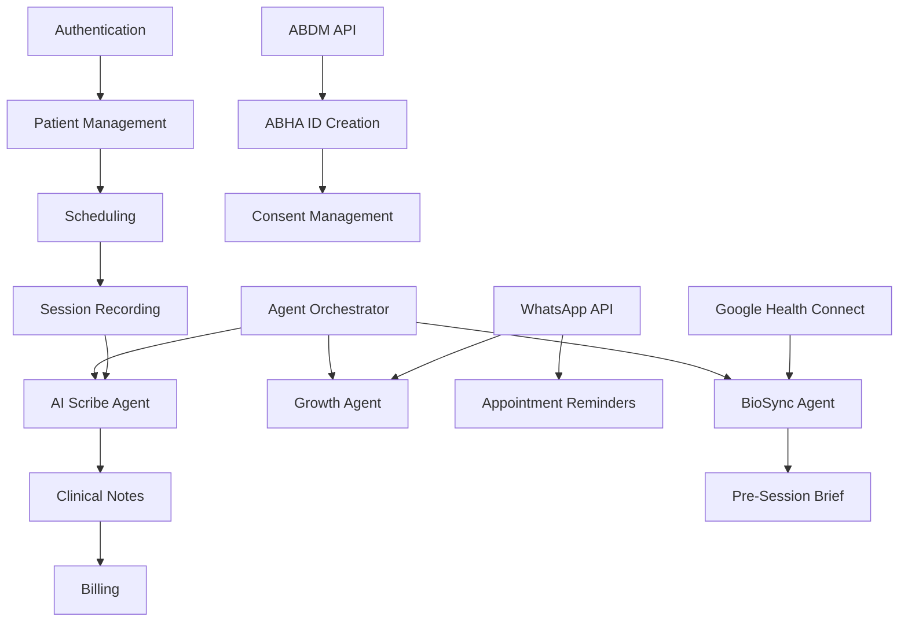

# TherapyFlow AI + BioSync - User Stories Document

## Overview

This document contains comprehensive user stories for building TherapyFlow AI + BioSync, a mental health practice management system for Indian therapists. The stories are segregated between **Frontend** and **Backend** components, organized by feature areas, and mapped to three implementation phases:

- **Phase 1 (MVP)**: Ambient Scribe + Basic Scheduling
- **Phase 2**: BioSync Integration + WhatsApp Bots  
- **Phase 3**: ABDM Certification + EAP Partnerships

---

## Key Observations

The PRD describes a sophisticated multi-agent AI system specifically designed for the Indian healthcare market. Key technical considerations include:

- **Multi-tenancy architecture** with Row-Level Security (RLS) in Supabase for data isolation between therapists/practices
- **AI agent orchestration** requiring Supabase Edge Functions to coordinate Scribe, BioSync, Compliance, and Growth agents
- **India-specific integrations**: UPI payments (Razorpay/Cashfree), WhatsApp Business API, ABDM/ABHA compliance, Hinglish NLP support
- **Real-time features** for session management and wearable data streaming via Supabase Realtime
- **HIPAA-equivalent compliance** through OpenAI BAA, Supabase RLS policies, and encrypted storage
- **Mobile-first design** mimicking WhatsApp UX to reduce adoption friction for non-tech-savvy clinicians

---

## Approach

The user stories follow a **vertical slice architecture**, where each story delivers end-to-end value across the stack. Stories are prioritized by:

1. **Phase alignment** (MVP → BioSync → ABDM)
2. **User persona impact** (Dr. Priya solo practitioner, Amit group owner, Deepa EAP manager)
3. **Technical dependencies** (authentication before scheduling, scheduling before sessions, etc.)

Backend stories focus on **Supabase database schema, RLS policies, Edge Functions, and third-party integrations**. Frontend stories emphasize **React/Next.js components, Supabase client interactions, and mobile-responsive UI** deployed on Netlify.

---

## BACKEND USER STORIES

### 1. Authentication & Authorization (Phase 1 - MVP)

#### US-BE-001: Therapist Registration
**As a** therapist  
**I want to** register with email/phone and create a secure account  
**So that** I can access the platform and manage my practice

**Acceptance Criteria:**
- Supabase Auth configured with email/phone providers
- `therapists` table created with fields: `id`, `email`, `phone`, `name`, `license_number`, `specialization`, `created_at`
- Email verification flow implemented
- Password strength validation (min 8 chars, special chars)
- RLS policy: therapists can only read/update their own record

**Phase:** 1 (MVP)  
**Priority:** High

---

#### US-BE-002: Role-Based Access Control (RBAC)
**As a** system administrator  
**I want to** define roles (therapist, admin, group_owner, eap_manager)  
**So that** users have appropriate permissions based on their role

**Acceptance Criteria:**
- `roles` table created with predefined roles
- `user_roles` junction table linking users to roles
- RLS policies enforce role-based data access
- Group owners can view therapists in their practice
- EAP managers can view aggregated data (no PHI)

**Phase:** 1 (MVP)  
**Priority:** High

---

#### US-BE-003: Multi-Factor Authentication (MFA)
**As a** therapist  
**I want to** enable MFA via SMS/authenticator app  
**So that** my account and patient data remain secure

**Acceptance Criteria:**
- Supabase Auth MFA enabled
- SMS OTP integration via Twilio/MSG91
- TOTP support for authenticator apps
- MFA enrollment flow in user settings
- Audit log for MFA events

**Phase:** 1 (MVP)  
**Priority:** Medium

---

### 2. Practice & Patient Management (Phase 1 - MVP)

#### US-BE-004: Patient Profile Creation
**As a** therapist  
**I want to** create and store patient profiles securely  
**So that** I can maintain longitudinal patient records

**Acceptance Criteria:**
- `patients` table with fields: `id`, `therapist_id`, `name`, `age`, `gender`, `contact`, `medical_history`, `created_at`
- RLS policy: therapists can only access their own patients
- Encrypted storage for sensitive fields (medical_history)
- Unique constraint on `therapist_id + contact` to prevent duplicates
- Soft delete support (retain data for compliance)

**Phase:** 1 (MVP)  
**Priority:** High

---

#### US-BE-005: Appointment Scheduling
**As a** therapist  
**I want to** create, update, and cancel appointments  
**So that** I can manage my calendar efficiently

**Acceptance Criteria:**
- `appointments` table with fields: `id`, `therapist_id`, `patient_id`, `scheduled_at`, `duration`, `status`, `notes`
- Status enum: `scheduled`, `completed`, `cancelled`, `no_show`
- RLS policy: therapists can manage their own appointments
- Conflict detection (no overlapping appointments)
- Timezone support (IST default)

**Phase:** 1 (MVP)  
**Priority:** High

---

#### US-BE-006: Group Practice Management
**As a** group practice owner  
**I want to** add therapists to my practice and view their schedules  
**So that** I can coordinate resources and ensure compliance

**Acceptance Criteria:**
- `practices` table with fields: `id`, `name`, `owner_id`, `created_at`
- `practice_therapists` junction table
- RLS policy: owners can view therapists in their practice
- Owners can view aggregated appointment stats (not session notes)
- Invitation flow for adding therapists

**Phase:** 1 (MVP)  
**Priority:** Medium

---

### 3. Session Recording & Transcription (Phase 1 - MVP)

#### US-BE-007: Audio Upload to Supabase Storage
**As a** therapist  
**I want to** upload session audio recordings securely  
**So that** they can be transcribed by the AI Scribe Agent

**Acceptance Criteria:**
- Supabase Storage bucket `session-recordings` created
- RLS policy: therapists can upload/access only their recordings
- File size limit: 500MB per recording
- Supported formats: `.mp3`, `.wav`, `.m4a`
- Metadata stored in `session_recordings` table: `id`, `session_id`, `file_path`, `duration`, `uploaded_at`

**Phase:** 1 (MVP)  
**Priority:** High

---

#### US-BE-008: Scribe Agent - Audio Transcription
**As a** therapist  
**I want** session audio transcribed to text using OpenAI Whisper  
**So that** I can review and edit the transcript

**Acceptance Criteria:**
- Supabase Edge Function `transcribe-audio` created
- Integrates OpenAI Whisper API with Hinglish language support
- Stores transcript in `session_transcripts` table: `id`, `session_id`, `transcript_text`, `language`, `created_at`
- Handles speaker diarization (therapist vs. patient)
- Error handling for API failures (retry logic)

**Phase:** 1 (MVP)  
**Priority:** High

---

#### US-BE-009: Scribe Agent - SOAP Note Generation
**As a** therapist  
**I want** AI to generate structured SOAP notes from transcripts  
**So that** I can save time on documentation

**Acceptance Criteria:**
- Supabase Edge Function `generate-soap-note` created
- Uses GPT-4o with custom system prompt (from PRD)
- Generates SOAP format: Subjective, Objective, Assessment, Plan
- Includes ICD-10 code suggestions
- Flags self-harm mentions with RED ALERT
- Stores draft in `clinical_notes` table: `id`, `session_id`, `note_type`, `content`, `status`, `created_at`
- Status enum: `draft`, `approved`, `archived`

**Phase:** 1 (MVP)  
**Priority:** High

---

#### US-BE-010: Human-in-the-Loop (HITL) Approval
**As a** therapist  
**I want to** review, edit, and approve AI-generated notes  
**So that** I maintain clinical responsibility and accuracy

**Acceptance Criteria:**
- `clinical_notes` table has `approved_by`, `approved_at` fields
- RLS policy: only note owner can approve
- Audit trail: stores original AI draft + therapist edits
- Links to source transcript for verification
- Cannot delete approved notes (compliance)

**Phase:** 1 (MVP)  
**Priority:** High

---

### 4. Billing & Payments (Phase 1 - MVP)

#### US-BE-011: UPI Payment Link Generation
**As a** therapist  
**I want to** generate UPI payment links after sessions  
**So that** patients can pay conveniently

**Acceptance Criteria:**
- Integration with Razorpay/Cashfree Payment Gateway
- Supabase Edge Function `create-payment-link` created
- `payments` table: `id`, `session_id`, `amount`, `currency`, `status`, `payment_link`, `created_at`
- Status enum: `pending`, `completed`, `failed`, `refunded`
- Webhook handler for payment confirmation
- RLS policy: therapists can view their own payments

**Phase:** 1 (MVP)  
**Priority:** High

---

#### US-BE-012: Subscription Management
**As a** therapist  
**I want to** subscribe to Free/Pro/BioSync tiers  
**So that** I can access features based on my plan

**Acceptance Criteria:**
- `subscriptions` table: `id`, `therapist_id`, `plan`, `status`, `start_date`, `end_date`
- Plan enum: `free`, `pro`, `biosync`
- Pricing: Free (₹0), Pro (₹999/mo), BioSync (₹1999/mo)
- Razorpay subscription API integration
- Webhook handler for subscription events (created, renewed, cancelled)
- Feature gating based on plan (e.g., AI Scribe limited to 10 sessions/month on Free)

**Phase:** 1 (MVP)  
**Priority:** Medium

---

### 5. WhatsApp Integration (Phase 2 - BioSync)

#### US-BE-013: WhatsApp Business API Setup
**As a** system administrator  
**I want to** integrate WhatsApp Business API  
**So that** therapists can communicate with patients via WhatsApp

**Acceptance Criteria:**
- WhatsApp Business API account created (via 360Dialog/Twilio)
- Webhook endpoint in Supabase Edge Function for incoming messages
- `whatsapp_messages` table: `id`, `therapist_id`, `patient_id`, `message_text`, `direction`, `timestamp`
- Direction enum: `inbound`, `outbound`
- Template messages approved by WhatsApp (appointment reminders, payment links)

**Phase:** 2 (BioSync)  
**Priority:** High

---

#### US-BE-014: Growth Agent - WhatsApp Triage Bot
**As a** potential patient  
**I want to** inquire about therapy services via WhatsApp  
**So that** I can get quick responses and book appointments

**Acceptance Criteria:**
- Supabase Edge Function `whatsapp-triage-bot` created
- Uses GPT-4o-mini for cost-effective responses
- Handles FAQs: pricing, availability, specializations
- Captures lead information: name, concern, preferred time
- Creates entry in `leads` table: `id`, `therapist_id`, `name`, `contact`, `source`, `status`, `created_at`
- Escalates complex queries to therapist

**Phase:** 2 (BioSync)  
**Priority:** Medium

---

#### US-BE-015: Automated Appointment Reminders
**As a** therapist  
**I want** patients to receive WhatsApp reminders 24 hours before appointments  
**So that** no-show rates decrease

**Acceptance Criteria:**
- Supabase cron job (via pg_cron extension) runs daily
- Identifies appointments in next 24 hours
- Sends WhatsApp template message via API
- Logs reminder in `whatsapp_messages` table
- Handles opt-out requests (stores in `patient_preferences`)

**Phase:** 2 (BioSync)  
**Priority:** Medium

---

### 6. BioSync - Wearable Integration (Phase 2)

#### US-BE-016: Google Health Connect Integration
**As a** patient  
**I want to** connect my wearable device (Noise/Boat) to share health data  
**So that** my therapist can monitor my well-being between sessions

**Acceptance Criteria:**
- Supabase Edge Function `sync-health-data` created
- Integrates Google Health Connect API
- Fetches data types: HRV, sleep duration, activity minutes, heart rate
- Stores in `wearable_data` table: `id`, `patient_id`, `data_type`, `value`, `recorded_at`, `synced_at`
- OAuth 2.0 flow for patient consent
- Data retention: 90 days (configurable)

**Phase:** 2 (BioSync)  
**Priority:** High

---

#### US-BE-017: BioSync Agent - Pre-Session Intelligence Brief
**As a** therapist  
**I want** AI to analyze patient wearable data before sessions  
**So that** I can identify concerning trends (e.g., sleep deprivation, HRV drops)

**Acceptance Criteria:**
- Supabase Edge Function `generate-biosync-brief` created
- Runs 5 minutes before scheduled appointment
- Analyzes last 7 days of wearable data
- Uses GPT-4o to correlate data with patient history
- Generates brief: "Alert: Sleep dropped 40% this week. HRV down 15% on Tuesday."
- Stores in `biosync_briefs` table: `id`, `session_id`, `insights`, `created_at`
- Flags critical alerts (e.g., sustained high heart rate)

**Phase:** 2 (BioSync)  
**Priority:** High

---

#### US-BE-018: Predictive Analytics - Dropout Risk
**As a** therapist  
**I want** AI to predict patient dropout risk based on engagement patterns  
**So that** I can proactively reach out to at-risk patients

**Acceptance Criteria:**
- Supabase Edge Function `predict-dropout-risk` created
- Analyzes: missed appointments, wearable data gaps, message response times
- Uses GPT-4o for pattern recognition
- Generates risk score: low, medium, high
- Stores in `patient_risk_scores` table: `id`, `patient_id`, `risk_level`, `factors`, `calculated_at`
- Triggers alert to therapist if risk = high

**Phase:** 2 (BioSync)  
**Priority:** Medium

---

### 7. ABDM Compliance (Phase 3)

#### US-BE-019: ABHA ID Creation
**As a** patient  
**I want to** create an ABHA (Ayushman Bharat Health Account) ID  
**So that** my health records are linked to India's national health system

**Acceptance Criteria:**
- Supabase Edge Function `create-abha-id` created
- Integrates ABDM Sandbox/Production API
- Captures: Aadhaar number, mobile number, name
- Generates 14-digit ABHA ID
- Stores in `abha_records` table: `id`, `patient_id`, `abha_id`, `created_at`
- Handles OTP verification via ABDM

**Phase:** 3 (ABDM)  
**Priority:** High

---

#### US-BE-020: Compliance Agent - Consent Management (HIECM)
**As a** patient  
**I want to** grant/revoke consent for sharing my health records  
**So that** I control who accesses my data

**Acceptance Criteria:**
- Supabase Edge Function `manage-consent` created
- Integrates Health Information Exchange Consent Manager (HIECM)
- Creates consent artifacts per ABDM spec
- Stores in `consent_records` table: `id`, `patient_id`, `purpose`, `granted_at`, `expires_at`, `revoked_at`
- Purpose enum: `care_management`, `research`, `insurance`
- Audit trail for all consent changes

**Phase:** 3 (ABDM)  
**Priority:** High

---

#### US-BE-021: Mental Health Data Compliance
**As a** system administrator  
**I want** mental health data flagged as sensitive per ABDM guidelines  
**So that** it requires explicit consent for sharing

**Acceptance Criteria:**
- `clinical_notes` table has `sensitivity_level` field
- Enum: `normal`, `sensitive`, `highly_sensitive`
- Mental health notes auto-tagged as `highly_sensitive`
- HIECM consent checks before sharing
- Audit log for all access attempts

**Phase:** 3 (ABDM)  
**Priority:** High

---

### 8. Analytics & Reporting (Phase 3)

#### US-BE-022: Therapist Dashboard Metrics
**As a** therapist  
**I want to** view key metrics (sessions completed, revenue, patient adherence)  
**So that** I can track my practice performance

**Acceptance Criteria:**
- Supabase Edge Function `get-dashboard-metrics` created
- Aggregates data from `appointments`, `payments`, `clinical_notes`
- Returns JSON: `{ sessions_completed, revenue, avg_session_duration, no_show_rate }`
- RLS policy: therapists see only their own metrics
- Caching layer (Redis/Supabase cache) for performance

**Phase:** 1 (MVP)  
**Priority:** Medium

---

#### US-BE-023: EAP Manager - ROI Reporting
**As an** EAP manager  
**I want to** view aggregated outcome data (without PHI)  
**So that** I can demonstrate ROI to corporate clients

**Acceptance Criteria:**
- Supabase Edge Function `get-eap-report` created
- Aggregates: total sessions, avg improvement scores, adherence rates
- No PHI exposed (only anonymized stats)
- Filters by date range, therapist, corporate client
- Exports to PDF/CSV

**Phase:** 3 (ABDM)  
**Priority:** Medium

---

### 9. Data Security & Privacy (All Phases)

#### US-BE-024: Row-Level Security (RLS) Policies
**As a** system administrator  
**I want** RLS policies enforced on all tables  
**So that** users can only access their own data

**Acceptance Criteria:**
- RLS enabled on all tables: `therapists`, `patients`, `appointments`, `clinical_notes`, `payments`, `wearable_data`
- Policies use `auth.uid()` to filter rows
- Group owners can view therapists in their practice (via `practice_therapists` join)
- EAP managers can view aggregated data (via materialized views)
- Audit: RLS policy violations logged

**Phase:** 1 (MVP)  
**Priority:** High

---

#### US-BE-025: Data Encryption at Rest
**As a** system administrator  
**I want** sensitive data encrypted at rest  
**So that** it's protected from unauthorized access

**Acceptance Criteria:**
- Supabase Storage uses AES-256 encryption
- Sensitive fields in `patients` table encrypted using `pgcrypto` extension
- Encryption keys managed via Supabase Vault
- Decryption only via authorized Edge Functions

**Phase:** 1 (MVP)  
**Priority:** High

---

#### US-BE-026: Audit Logging
**As a** compliance officer  
**I want** all data access logged  
**So that** I can audit for security breaches

**Acceptance Criteria:**
- `audit_logs` table: `id`, `user_id`, `action`, `table_name`, `record_id`, `timestamp`
- Triggers on all tables log: `INSERT`, `UPDATE`, `DELETE`
- Logs stored for 7 years (ABDM requirement)
- Immutable (no updates/deletes allowed)

**Phase:** 1 (MVP)  
**Priority:** Medium

---

### 10. AI Agent Orchestration (Phase 2)

#### US-BE-027: Agent Orchestrator
**As a** system  
**I want** a central orchestrator to coordinate Scribe, BioSync, Compliance, and Growth agents  
**So that** workflows execute in the correct sequence

**Acceptance Criteria:**
- Supabase Edge Function `orchestrate-agents` created
- Uses state machine pattern (e.g., XState)
- Workflow example: Session ends → Transcribe audio → Generate SOAP note → Send payment link → Log to ABDM
- Handles agent failures gracefully (retry logic, fallback)
- Logs workflow execution in `agent_workflows` table

**Phase:** 2 (BioSync)  
**Priority:** High

---

#### US-BE-028: RAG (Retrieval-Augmented Generation) for Clinical Context
**As a** Scribe Agent  
**I want** access to patient history and ICD-10 codes  
**So that** I generate contextually accurate notes

**Acceptance Criteria:**
- Vector database (Supabase pgvector extension) stores:
  - Patient historical notes (embeddings)
  - ICD-10 coding manual (embeddings)
  - Mental Healthcare Act 2017 guidelines (embeddings)
- Supabase Edge Function `rag-query` retrieves relevant context
- GPT-4o uses context in system prompt
- Embeddings generated via OpenAI `text-embedding-3-small`

**Phase:** 1 (MVP)  
**Priority:** Medium

---

### 11. Cost Optimization (All Phases)

#### US-BE-029: Prompt Caching for AI Calls
**As a** system administrator  
**I want** to cache repeated AI prompts  
**So that** I reduce OpenAI API costs

**Acceptance Criteria:**
- Supabase Edge Functions use Redis/Supabase cache
- Cache key: hash of system prompt + user input
- TTL: 24 hours
- Cache hit rate tracked in analytics
- Estimated savings: 40% on GPT-4o calls

**Phase:** 1 (MVP)  
**Priority:** Medium

---

#### US-BE-030: Model Selection Based on Task
**As a** system  
**I want** to use GPT-4o-mini for routine tasks and GPT-4o for complex reasoning  
**So that** I optimize cost vs. quality

**Acceptance Criteria:**
- Routing logic in Edge Functions:
  - GPT-4o-mini: WhatsApp triage, appointment reminders, FAQs
  - GPT-4o: SOAP note generation, BioSync analysis, dropout prediction
- Cost tracking per model in `ai_usage` table
- Monthly budget alerts

**Phase:** 1 (MVP)  
**Priority:** Medium

---

## FRONTEND USER STORIES

### 1. Authentication & Onboarding (Phase 1 - MVP)

#### US-FE-001: Therapist Registration Flow
**As a** therapist  
**I want** a simple registration form  
**So that** I can quickly create an account

**Acceptance Criteria:**
- React form with fields: email, phone, password, name, license number
- Client-side validation (email format, phone format, password strength)
- Supabase Auth integration (`supabase.auth.signUp()`)
- Email verification link sent
- Redirects to onboarding wizard after signup
- Mobile-responsive design

**Phase:** 1 (MVP)  
**Priority:** High

---

#### US-FE-002: Login with MFA
**As a** therapist  
**I want to** log in with email/phone and MFA  
**So that** my account is secure

**Acceptance Criteria:**
- Login form with email/phone + password
- MFA prompt if enabled (SMS OTP or TOTP)
- Supabase Auth integration (`supabase.auth.signInWithPassword()`)
- "Remember me" option (session persistence)
- Error handling: invalid credentials, MFA failure

**Phase:** 1 (MVP)  
**Priority:** High

---

#### US-FE-003: Onboarding Wizard
**As a** new therapist  
**I want** a guided onboarding flow  
**So that** I can set up my profile and preferences

**Acceptance Criteria:**
- Multi-step wizard: Profile → Specialization → Availability → Payment Setup
- Progress indicator (e.g., "Step 2 of 4")
- Saves progress to Supabase (`therapist_profiles` table)
- Skip option (can complete later)
- Mobile-first design (mimics WhatsApp UX per PRD)

**Phase:** 1 (MVP)  
**Priority:** Medium

---

### 2. Dashboard & Navigation (Phase 1 - MVP)

#### US-FE-004: Therapist Dashboard
**As a** therapist  
**I want** a dashboard showing today's appointments, pending notes, and revenue  
**So that** I can quickly see my day at a glance

**Acceptance Criteria:**
- Dashboard widgets:
  - Today's appointments (list with patient names, times)
  - Pending SOAP notes (count + link to review)
  - This month's revenue (₹ amount)
  - Quick actions: "Start Session", "Add Patient", "View Calendar"
- Real-time updates via Supabase Realtime subscriptions
- Mobile-responsive (card-based layout)

**Phase:** 1 (MVP)  
**Priority:** High

---

#### US-FE-005: Mobile-First Navigation
**As a** therapist  
**I want** a bottom navigation bar (like WhatsApp)  
**So that** I can easily switch between sections on mobile

**Acceptance Criteria:**
- Bottom nav with icons: Home, Patients, Calendar, Notes, Settings
- Active tab highlighted
- Smooth transitions between views
- Works on iOS and Android browsers
- Accessible (ARIA labels)

**Phase:** 1 (MVP)  
**Priority:** High

---

### 3. Patient Management (Phase 1 - MVP)

#### US-FE-006: Add New Patient
**As a** therapist  
**I want to** add a new patient with basic details  
**So that** I can start scheduling sessions

**Acceptance Criteria:**
- Form fields: name, age, gender, contact (phone/email), medical history
- Client-side validation (required fields, phone format)
- Supabase insert into `patients` table
- Success toast notification
- Redirects to patient detail page

**Phase:** 1 (MVP)  
**Priority:** High

---

#### US-FE-007: Patient List View
**As a** therapist  
**I want to** view all my patients in a searchable list  
**So that** I can quickly find patient records

**Acceptance Criteria:**
- Table/list view with columns: name, age, last session date, status
- Search bar (filters by name)
- Pagination (20 patients per page)
- Click row to view patient details
- Fetches data from Supabase (`patients` table with RLS)

**Phase:** 1 (MVP)  
**Priority:** High

---

#### US-FE-008: Patient Detail Page
**As a** therapist  
**I want to** view a patient's full profile and session history  
**So that** I can review their treatment progress

**Acceptance Criteria:**
- Sections: Profile, Session History, Clinical Notes, Wearable Data (Phase 2)
- Session history: list of past sessions with dates, notes, payment status
- Edit profile button
- "Schedule Session" button
- Fetches data from Supabase (joins `patients`, `appointments`, `clinical_notes`)

**Phase:** 1 (MVP)  
**Priority:** High

---

### 4. Scheduling (Phase 1 - MVP)

#### US-FE-009: Calendar View
**As a** therapist  
**I want** a calendar showing my appointments  
**So that** I can manage my schedule visually

**Acceptance Criteria:**
- Calendar component (e.g., FullCalendar.js or React Big Calendar)
- Views: day, week, month
- Color-coded appointments: scheduled (blue), completed (green), cancelled (red)
- Click appointment to view details
- Drag-and-drop to reschedule (updates Supabase)
- Syncs with Supabase Realtime for live updates

**Phase:** 1 (MVP)  
**Priority:** High

---

#### US-FE-010: Book Appointment
**As a** therapist  
**I want to** book an appointment for a patient  
**So that** I can schedule sessions

**Acceptance Criteria:**
- Modal/form with fields: patient (dropdown), date, time, duration
- Conflict detection (shows error if slot already booked)
- Supabase insert into `appointments` table
- Sends WhatsApp reminder to patient (Phase 2)
- Success notification

**Phase:** 1 (MVP)  
**Priority:** High

---

### 5. Session Recording & Notes (Phase 1 - MVP)

#### US-FE-011: Start Session Recording
**As a** therapist  
**I want to** record session audio from my mobile device  
**So that** it can be transcribed by AI

**Acceptance Criteria:**
- "Record" button on session detail page
- Uses browser MediaRecorder API
- Shows recording timer (e.g., "00:15:32")
- "Stop" button to end recording
- Uploads audio to Supabase Storage (`session-recordings` bucket)
- Progress bar during upload
- Error handling: mic permission denied, upload failure

**Phase:** 1 (MVP)  
**Priority:** High

---

#### US-FE-012: Review AI-Generated SOAP Note
**As a** therapist  
**I want to** review and edit the AI-generated SOAP note  
**So that** I can ensure accuracy before approval

**Acceptance Criteria:**
- Split view: transcript (left) + SOAP note (right)
- Editable SOAP note (rich text editor)
- Highlights: RED ALERT for self-harm mentions
- "Approve" button (updates `clinical_notes.status` to `approved`)
- "Regenerate" button (calls Scribe Agent again)
- Links to source transcript for verification

**Phase:** 1 (MVP)  
**Priority:** High

---

#### US-FE-013: Clinical Notes Library
**As a** therapist  
**I want to** view all my clinical notes in one place  
**So that** I can search and reference past sessions

**Acceptance Criteria:**
- List view with filters: patient, date range, note type (SOAP/DAP)
- Search bar (full-text search on note content)
- Export to PDF button
- Click note to view full details
- Fetches from Supabase (`clinical_notes` table)

**Phase:** 1 (MVP)  
**Priority:** Medium

---

### 6. Billing & Payments (Phase 1 - MVP)

#### US-FE-014: Generate Payment Link
**As a** therapist  
**I want to** generate a UPI payment link after a session  
**So that** the patient can pay conveniently

**Acceptance Criteria:**
- "Generate Payment Link" button on session detail page
- Modal with fields: amount (pre-filled with session fee), notes
- Calls Supabase Edge Function `create-payment-link`
- Displays UPI link + QR code
- "Send via WhatsApp" button (Phase 2)
- Copies link to clipboard

**Phase:** 1 (MVP)  
**Priority:** High

---

#### US-FE-015: Payment History
**As a** therapist  
**I want to** view all payments received  
**So that** I can track my revenue

**Acceptance Criteria:**
- Table view with columns: date, patient, amount, status, payment method
- Filters: date range, status (pending/completed/failed)
- Total revenue displayed at top
- Export to CSV button
- Fetches from Supabase (`payments` table)

**Phase:** 1 (MVP)  
**Priority:** Medium

---

#### US-FE-016: Subscription Management
**As a** therapist  
**I want to** upgrade/downgrade my subscription plan  
**So that** I can access more features

**Acceptance Criteria:**
- Pricing page with plans: Free, Pro (₹999/mo), BioSync (₹1999/mo)
- Feature comparison table
- "Upgrade" button (redirects to Razorpay checkout)
- Current plan badge on dashboard
- Billing history page

**Phase:** 1 (MVP)  
**Priority:** Medium

---

### 7. WhatsApp Integration (Phase 2 - BioSync)

#### US-FE-017: WhatsApp Inbox
**As a** therapist  
**I want** a WhatsApp-style inbox to chat with patients  
**So that** I can communicate conveniently

**Acceptance Criteria:**
- Chat list view (left sidebar): patient names, last message, timestamp
- Chat window (right): message history, input box, send button
- Real-time updates via Supabase Realtime
- Supports text, images, documents
- Fetches from Supabase (`whatsapp_messages` table)

**Phase:** 2 (BioSync)  
**Priority:** High

---

#### US-FE-018: Send Appointment Reminder
**As a** therapist  
**I want to** manually send a WhatsApp reminder to a patient  
**So that** they don't miss their appointment

**Acceptance Criteria:**
- "Send Reminder" button on appointment detail page
- Pre-filled template message (editable)
- Calls Supabase Edge Function `send-whatsapp-message`
- Success notification
- Message logged in `whatsapp_messages` table

**Phase:** 2 (BioSync)  
**Priority:** Medium

---

### 8. BioSync - Wearable Data (Phase 2)

#### US-FE-019: Patient Wearable Connection
**As a** patient  
**I want to** connect my wearable device via Google Health Connect  
**So that** my therapist can monitor my health data

**Acceptance Criteria:**
- "Connect Wearable" button on patient profile page
- OAuth 2.0 flow (redirects to Google Health Connect)
- Consent screen: explains data usage, retention policy
- Success notification after connection
- Displays connected device name (e.g., "Noise ColorFit Pro 4")

**Phase:** 2 (BioSync)  
**Priority:** High

---

#### US-FE-020: Wearable Data Dashboard
**As a** therapist  
**I want to** view a patient's wearable data trends  
**So that** I can identify health patterns

**Acceptance Criteria:**
- Charts: HRV (line chart), sleep duration (bar chart), activity minutes (area chart)
- Date range selector (last 7 days, 30 days, 90 days)
- Anomaly highlights (e.g., "Sleep dropped 40% this week")
- Fetches from Supabase (`wearable_data` table)
- Uses Chart.js or Recharts for visualization

**Phase:** 2 (BioSync)  
**Priority:** High

---

#### US-FE-021: Pre-Session Intelligence Brief
**As a** therapist  
**I want to** view the BioSync brief before a session  
**So that** I can prepare for the conversation

**Acceptance Criteria:**
- Alert banner on dashboard 5 minutes before session
- Modal with brief: "Alert: Rahul's HRV dropped 15% on Tuesday. Correlates with reported work stress."
- "View Full Report" button (opens detailed wearable dashboard)
- Fetches from Supabase (`biosync_briefs` table)

**Phase:** 2 (BioSync)  
**Priority:** High

---

### 9. ABDM Compliance (Phase 3)

#### US-FE-022: ABHA ID Creation Flow
**As a** patient  
**I want to** create an ABHA ID from the app  
**So that** my health records are linked to India's national system

**Acceptance Criteria:**
- "Create ABHA ID" button on patient profile page
- Form fields: Aadhaar number, mobile number, name
- OTP verification step
- Calls Supabase Edge Function `create-abha-id`
- Displays generated 14-digit ABHA ID
- Success notification

**Phase:** 3 (ABDM)  
**Priority:** High

---

#### US-FE-023: Consent Management UI
**As a** patient  
**I want to** grant/revoke consent for sharing my health records  
**So that** I control who accesses my data

**Acceptance Criteria:**
- "Manage Consent" page with list of consent requests
- Each request shows: requester name, purpose, expiry date
- "Grant" / "Revoke" buttons
- Calls Supabase Edge Function `manage-consent`
- Audit trail displayed (who accessed data, when)

**Phase:** 3 (ABDM)  
**Priority:** High

---

### 10. Analytics & Reporting (Phase 3)

#### US-FE-024: Therapist Analytics Dashboard
**As a** therapist  
**I want to** view key performance metrics  
**So that** I can track my practice growth

**Acceptance Criteria:**
- Widgets: sessions completed (this month), revenue (this month), avg session duration, no-show rate
- Charts: revenue trend (line chart), sessions by day (bar chart)
- Date range selector
- Fetches from Supabase Edge Function `get-dashboard-metrics`

**Phase:** 1 (MVP)  
**Priority:** Medium

---

#### US-FE-025: EAP Manager ROI Report
**As an** EAP manager  
**I want to** view aggregated outcome data  
**So that** I can demonstrate ROI to corporate clients

**Acceptance Criteria:**
- Report page with filters: date range, therapist, corporate client
- Metrics: total sessions, avg improvement scores, adherence rates
- Export to PDF/CSV button
- No PHI displayed (only anonymized stats)
- Fetches from Supabase Edge Function `get-eap-report`

**Phase:** 3 (ABDM)  
**Priority:** Medium

---

### 11. Settings & Preferences (All Phases)

#### US-FE-026: Profile Settings
**As a** therapist  
**I want to** update my profile information  
**So that** patients see accurate details

**Acceptance Criteria:**
- Form fields: name, email, phone, specialization, bio, profile photo
- Upload profile photo to Supabase Storage
- Updates Supabase (`therapists` table)
- Success notification

**Phase:** 1 (MVP)  
**Priority:** Medium

---

#### US-FE-027: Notification Preferences
**As a** therapist  
**I want to** configure notification preferences  
**So that** I control how I'm alerted

**Acceptance Criteria:**
- Toggles: email notifications, WhatsApp notifications, push notifications
- Notification types: appointment reminders, payment received, new patient inquiry
- Saves to Supabase (`therapist_preferences` table)

**Phase:** 1 (MVP)  
**Priority:** Low

---

#### US-FE-028: Language Preference (Hinglish Support)
**As a** therapist  
**I want to** set my preferred language (English/Hindi/Hinglish)  
**So that** the UI and AI responses match my preference

**Acceptance Criteria:**
- Language selector in settings
- Options: English, Hindi, Hinglish (code-switching)
- Updates UI text (i18n library)
- Passes language preference to AI agents (system prompt)

**Phase:** 1 (MVP)  
**Priority:** Low

---

### 12. Mobile App (Optional - Future Phase)

#### US-FE-029: React Native Mobile App
**As a** therapist  
**I want** a native mobile app (iOS/Android)  
**So that** I can access TherapyFlow on the go

**Acceptance Criteria:**
- React Native app with same features as web app
- Push notifications for appointments, payments
- Offline mode (syncs when online)
- Biometric authentication (Face ID, fingerprint)
- Published on App Store and Google Play

**Phase:** Future  
**Priority:** Low

---

## CROSS-CUTTING USER STORIES

### 13. Performance & Scalability (All Phases)

#### US-XC-001: Page Load Performance
**As a** user  
**I want** pages to load in under 2 seconds  
**So that** the app feels fast and responsive

**Acceptance Criteria:**
- Lighthouse score: Performance > 90
- First Contentful Paint (FCP) < 1.5s
- Time to Interactive (TTI) < 3s
- Code splitting (lazy load routes)
- Image optimization (WebP format, lazy loading)

**Phase:** 1 (MVP)  
**Priority:** Medium

---

#### US-XC-002: Supabase Connection Pooling
**As a** system administrator  
**I want** connection pooling enabled  
**So that** the app handles high concurrent users

**Acceptance Criteria:**
- Supabase connection pooler configured (PgBouncer)
- Max connections: 100 (adjustable)
- Connection timeout: 30s
- Monitors connection usage in Supabase dashboard

**Phase:** 1 (MVP)  
**Priority:** Medium

---

### 14. Error Handling & Monitoring (All Phases)

#### US-XC-003: Error Boundary Component
**As a** user  
**I want** graceful error handling  
**So that** the app doesn't crash unexpectedly

**Acceptance Criteria:**
- React Error Boundary wraps all routes
- Displays user-friendly error message
- Logs error to Sentry/LogRocket
- "Retry" button to reload component

**Phase:** 1 (MVP)  
**Priority:** High

---

#### US-XC-004: Real-Time Monitoring
**As a** system administrator  
**I want** real-time monitoring of app health  
**So that** I can detect and fix issues quickly

**Acceptance Criteria:**
- Sentry integration for error tracking
- Supabase dashboard for database metrics
- Netlify analytics for frontend performance
- Alerts: email/Slack for critical errors

**Phase:** 1 (MVP)  
**Priority:** Medium

---

### 15. Accessibility (All Phases)

#### US-XC-005: WCAG 2.1 AA Compliance
**As a** user with disabilities  
**I want** the app to be accessible  
**So that** I can use it with assistive technologies

**Acceptance Criteria:**
- Keyboard navigation (tab order, focus indicators)
- ARIA labels on all interactive elements
- Color contrast ratio > 4.5:1
- Screen reader tested (NVDA, JAWS)
- Lighthouse Accessibility score > 90

**Phase:** 1 (MVP)  
**Priority:** Medium

---

## IMPLEMENTATION SEQUENCE

### Phase 1 (MVP) - Weeks 1-12
**Goal:** Ambient Scribe + Basic Scheduling

**Backend:**
1. US-BE-001, US-BE-002, US-BE-003 (Authentication)
2. US-BE-004, US-BE-005, US-BE-006 (Practice Management)
3. US-BE-007, US-BE-008, US-BE-009, US-BE-010 (Session Recording & Scribe Agent)
4. US-BE-011, US-BE-012 (Billing & Payments)
5. US-BE-024, US-BE-025, US-BE-026 (Security)
6. US-BE-028 (RAG for Clinical Context)

**Frontend:**
1. US-FE-001, US-FE-002, US-FE-003 (Authentication & Onboarding)
2. US-FE-004, US-FE-005 (Dashboard & Navigation)
3. US-FE-006, US-FE-007, US-FE-008 (Patient Management)
4. US-FE-009, US-FE-010 (Scheduling)
5. US-FE-011, US-FE-012, US-FE-013 (Session Recording & Notes)
6. US-FE-014, US-FE-015, US-FE-016 (Billing & Payments)

---

### Phase 2 (BioSync) - Weeks 13-24
**Goal:** BioSync Integration + WhatsApp Bots

**Backend:**
1. US-BE-013, US-BE-014, US-BE-015 (WhatsApp Integration)
2. US-BE-016, US-BE-017, US-BE-018 (BioSync - Wearable Integration)
3. US-BE-027 (Agent Orchestrator)

**Frontend:**
1. US-FE-017, US-FE-018 (WhatsApp Inbox)
2. US-FE-019, US-FE-020, US-FE-021 (Wearable Data Dashboard)

---

### Phase 3 (ABDM) - Weeks 25-36
**Goal:** ABDM Certification + EAP Partnerships

**Backend:**
1. US-BE-019, US-BE-020, US-BE-021 (ABDM Compliance)
2. US-BE-022, US-BE-023 (Analytics & Reporting)

**Frontend:**
1. US-FE-022, US-FE-023 (ABHA ID & Consent Management)
2. US-FE-024, US-FE-025 (Analytics Dashboards)

---

## TECHNICAL DEPENDENCIES

---

## ACCEPTANCE CRITERIA SUMMARY

Each user story includes:
- **Persona**: Who benefits from this feature
- **Action**: What the user wants to do
- **Benefit**: Why this feature matters
- **Acceptance Criteria**: Specific, testable requirements
- **Phase**: MVP, BioSync, or ABDM
- **Priority**: High, Medium, or Low

---

## NOTES FOR DEVELOPMENT TEAM

1. **Supabase Setup**: Create project in Mumbai region for data residency compliance
2. **OpenAI BAA**: Apply for Business Associate Agreement for HIPAA compliance
3. **WhatsApp API**: Use 360Dialog or Twilio as Business Solution Provider
4. **Payment Gateway**: Razorpay recommended for UPI + subscription support
5. **Deployment**: Netlify for frontend (auto-deploy from Git), Supabase for backend
6. **Testing**: Write integration tests for all Edge Functions, E2E tests for critical user flows
7. **Documentation**: Maintain API docs (Swagger), user guides (Notion), and developer onboarding (README)

---

## GLOSSARY

- **ABHA**: Ayushman Bharat Health Account (India's national health ID)
- **ABDM**: Ayushman Bharat Digital Mission (India's digital health ecosystem)
- **BAA**: Business Associate Agreement (required for HIPAA compliance)
- **EAP**: Employee Assistance Program (corporate wellness benefit)
- **HIECM**: Health Information Exchange Consent Manager
- **HITL**: Human-in-the-Loop (AI requires human approval)
- **HRV**: Heart Rate Variability (wearable metric)
- **PHI**: Protected Health Information
- **RAG**: Retrieval-Augmented Generation (AI technique)
- **RLS**: Row-Level Security (Supabase feature)
- **SOAP**: Subjective, Objective, Assessment, Plan (clinical note format)
- **UPI**: Unified Payments Interface (India's instant payment system)

---

**Document Version:** 1.0  
**Last Updated:** January 2026  
**Total User Stories:** 60 (30 Backend + 30 Frontend)
