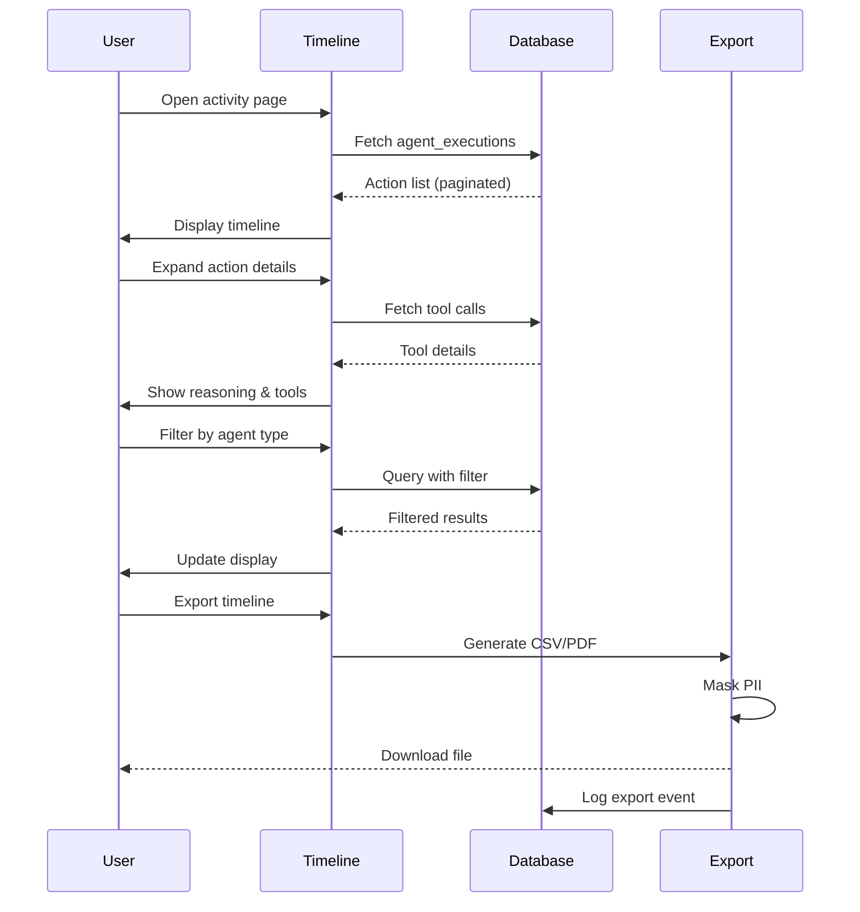

# [Frontend Web] Implement Agent Activity Timeline & Audit Log Viewer

# Implement Agent Activity Timeline & Audit Log Viewer

## Overview
Implement an activity timeline that displays all agent actions, tool executions, and decisions in a chronological, auditable format.

## Context
Transparency and auditability are critical for healthcare AI. The activity timeline gives users visibility into all agent actions.
  
## Architecture Diagram
  


## Acceptance Criteria

### 1. Timeline Component
- [ ] Display all agent actions (chronological)
- [ ] Group by date (Today, Yesterday, Last 7 days)
- [ ] Show agent type, action, timestamp
- [ ] Expandable details (tool calls, reasoning)
- [ ] Infinite scroll (load more)

### 2. Filtering & Search
- [ ] Filter by agent type
- [ ] Filter by date range
- [ ] Search by keyword
- [ ] Filter by action type (booking, insight, followup)
- [ ] Save filter preferences

### 3. Action Details
- [ ] Display tool calls (inputs, outputs)
- [ ] Display reasoning chain
- [ ] Display confidence scores
- [ ] Display approval status (approved, rejected, pending)
- [ ] Link to related resources (session, patient)

### 4. Export Functionality
- [ ] Export timeline (CSV, PDF)
- [ ] Include all details (for compliance)
- [ ] Support date range selection
- [ ] Mask PII in exports (configurable)
- [ ] Track export events (audit log)

### 5. Privacy Controls
- [ ] Hide sensitive actions (user preference)
- [ ] Redact PII (automatic)
- [ ] Support right to erasure (delete actions)
- [ ] Audit trail for deletions

## Technical Details

**Files to Create:**
- `file:web/app/(main)/activity/page.tsx`
- `file:web/components/activity/timeline.tsx`
- `file:web/components/activity/action-card.tsx`
- `file:web/hooks/use-activity-timeline.ts`

**Implementation:**
```typescript
export function ActivityTimeline() {
  const { actions, loadMore, hasMore } = useActivityTimeline();

  return (
    <div className="activity-page">
      <h1>Agent Activity</h1>

      <div className="timeline">
        {actions.map((action) => (
          <ActionCard key={action.id} action={action} />
        ))}
      </div>

      {hasMore && (
        <button onClick={loadMore}>Load More</button>
      )}
    </div>
  );
}
```

## Testing
- [ ] Test timeline display (all actions)
- [ ] Test filtering (verify results)
- [ ] Test search (keyword matching)
- [ ] Test export (verify data)
- [ ] Test privacy controls (PII redaction)

## Success Metrics
- Timeline load time < 2s
- Search latency < 500ms
- Export success rate 100%
- User engagement > 30% (weekly views)

## Dependencies
- Database schema (agent_executions)
- PII masking implementation
  
## Related Specifications
  
- spec:d969320e-d519-47a7-a258-e04789b8ce0e/b4c0579d-02d4-44b4-991b-076b73106254 - Frontend Web Implementation
- spec:d969320e-d519-47a7-a258-e04789b8ce0e/719895d0-e8a7-46cc-b5f9-829428065e26 - UX Patterns & Conversational Interface Design
- spec:d969320e-d519-47a7-a258-e04789b8ce0e/51f8a991-4bf2-4282-98c1-e8d8b4e3d7ee - HIPAA Compliance & Healthcare AI Governance

---

## 📋 DETAILED IMPLEMENTATION [WAVE 4]

**Source:** Wave 4 ticket - Activity timeline component

**Files:** `web/app/(main)/activity/page.tsx`, `web/components/activity/timeline.tsx`

**Features:** Chronological display, filtering, search, export (CSV/PDF), PII redaction

**Deploy:** Included in web deployment

**Success:** Load < 2s, engagement > 30%

**Wave Progress:** 16/49 updated

