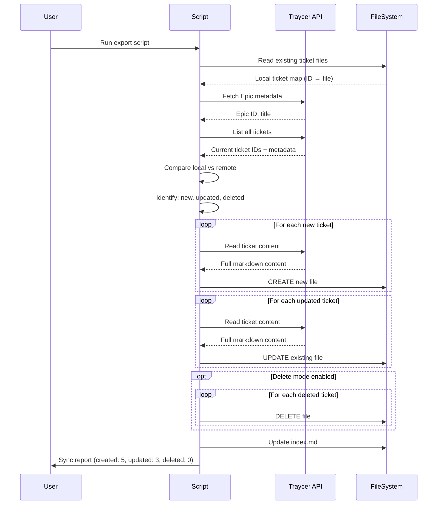

# Traycer Export Script - Export Epic Tickets to Local Markdown Files

# Traycer Export Script - Export Epic Tickets to Local Markdown Files

## Overview

Create a Node.js script that exports all tickets from the current Traycer Epic to local markdown files, preserving all formatting, mermaid diagrams, code blocks, and metadata. This allows you to maintain a local backup of all tickets and sync them with version control.

## Context

You have 59 tickets in the Traycer Epic with comprehensive content including:

- Detailed implementation guides
- Mermaid diagrams (sequenceDiagram, flowchart TD, graph TD, classDiagram)
- Code blocks with syntax highlighting
- Wave implementation references
- Spec references
- Acceptance criteria and technical details

This script will export all tickets to your local filesystem at `/Users/swami/Documents/Health_app/tickets/` (or any directory you specify).

## Architecture



## Acceptance Criteria

### 1. Script Setup

- [ ] Create `export-traycer-tickets.js` in project root
- [ ] Install dependencies: `commander`, `fs-extra`, `path`
- [ ] Support command-line arguments for Epic ID and output directory
- [ ] Validate Epic ID exists before export

### 2. Ticket Export (Initial + Incremental)

- [ ] Fetch all tickets from the specified Epic
- [ ] Export each ticket as a markdown file
- [ ] Preserve all markdown formatting (headers, lists, bold, italic)
- [ ] Preserve all mermaid diagrams
- [ ] Preserve all code blocks with syntax highlighting
- [ ] Include metadata header (ticket ID, status, created date, category)

### 3. Incremental Sync & Update Detection

- [ ] Track existing ticket files using ticket ID in frontmatter
- [ ] Detect new tickets created in Traycer (not in local files)
- [ ] Detect updated tickets (compare last_modified timestamp)
- [ ] Update existing files when ticket content changes
- [ ] Create new files for newly created tickets
- [ ] Delete local files for tickets deleted in Traycer (optional flag)
- [ ] Provide sync report (created, updated, deleted counts)

### 4. File Organization

- [ ] Create output directory if it doesn't exist
- [ ] Use proper file naming: `[Category] Title.md`
- [ ] Sanitize filenames (remove special characters)
- [ ] Organize by category subdirectories (optional flag)
- [ ] Generate `index.md` with links to all tickets
- [ ] Update index.md on each sync

### 5. Error Handling

- [ ] Handle network errors gracefully
- [ ] Skip tickets that fail to export (log error, continue)
- [ ] Validate markdown content before writing
- [ ] Provide progress feedback (e.g., "Exported 10/59 tickets")

### 6. Success Criteria

- [ ] All tickets exported successfully (initial sync)
- [ ] New tickets automatically exported on subsequent runs
- [ ] Updated tickets automatically refreshed
- [ ] Files are valid markdown
- [ ] Mermaid diagrams render correctly
- [ ] Code blocks have proper syntax highlighting
- [ ] Index file provides easy navigation
- [ ] Idempotent (safe to run multiple times)

## Technical Details

### File Structure

```
/Users/swami/Documents/Health_app/tickets/
├── index.md                                    # Summary with links
├── [Agent Infrastructure] Setup LangGraph.js Orchestration System.md
├── [Agent Infrastructure] Implement BookingAgent with Tool Calling.md
├── [Backend] Extend Supabase Schema for Agent System.md
├── [Frontend Web] Implement Embedded Chat Interface.md
├── [Frontend Mobile] Implement AI Chat Component.md
├── [Integration] Integrate OpenAI & Anthropic APIs.md
├── [UX] Implement Feature Flags & Gradual Rollout.md
├── [Security] Implement Security Audit.md
├── Wave 1 Implementation - Foundations.md
├── Wave 2 Implementation - Core Agents.md
└── ... (59 total files)
```

### Markdown File Format

Each exported ticket file should have this structure:

```markdown
---
ticket_id: 31fff4b4-78dc-43c0-ad41-f04770463328
epic_id: d969320e-d519-47a7-a258-e04789b8ce0e
status: Todo
category: Agent Infrastructure
created: 2026-01-11
last_modified: 2026-01-11T15:30:00Z
exported: 2026-01-11T10:30:00Z
---

# [Agent Infrastructure] Setup LangGraph.js Orchestration System

[COMPLETE TICKET CONTENT FROM TRAYCER]

## Overview
...

## Context
...

## Architecture
```mermaid
sequenceDiagram
...
```

## Acceptance Criteria

...

## Technical Details

...

## Implementation Details

...

---

**Ticket ID:** `31fff4b4-78dc-43c0-ad41-f04770463328`  
**Epic:** epic:d969320e-d519-47a7-a258-e04789b8ce0e  
**Status:** Todo  
**Exported:** 2026-01-11T10:30:00Z

```

## Incremental Sync Features

### How It Works

1. **First Run (Initial Export)**
   - Fetches all tickets from Traycer
   - Creates markdown files for all tickets
   - Stores ticket metadata in frontmatter (including `last_modified` timestamp)

2. **Subsequent Runs (Incremental Sync)**
   - Reads existing local ticket files
   - Builds a map: `ticket_id` → local file
   - Fetches current tickets from Traycer
   - Compares local vs remote:
     - **New tickets:** Not in local files → CREATE
     - **Updated tickets:** `last_modified` timestamp changed → UPDATE
     - **Deleted tickets:** In local but not in remote → DELETE (if `--delete` flag)
     - **Unchanged tickets:** Same `last_modified` → SKIP

3. **Sync Report**
```

   🔍 Sync Analysis:  
      📝 New tickets to create: 5  
      🔄 Existing tickets to update: 3  
      🗑️  Tickets to delete: 0  
      ⏭️  Unchanged tickets: 51

   ✨ Sync complete!  
      📝 Created: 5 tickets  
      🔄 Updated: 3 tickets  
      🗑️  Deleted: 0 tickets  
      ⏭️  Unchanged: 51 tickets

**Add 5 new tickets in Traycer, then sync:**

```bash
node export-traycer-tickets.js \
  --epic-id d969320e-d519-47a7-a258-e04789b8ce0e \
  --output /Users/swami/Documents/Health_app/tickets
# Result: 5 new files created, 59 existing files unchanged
```

**Update 3 tickets in Traycer, then sync:**

```bash
node export-traycer-tickets.js \
  --epic-id d969320e-d519-47a7-a258-e04789b8ce0e \
  --output /Users/swami/Documents/Health_app/tickets
# Result: 3 files updated, 61 existing files unchanged
```

**Delete 2 tickets in Traycer, then sync with delete:**

```bash
node export-traycer-tickets.js \
  --epic-id d969320e-d519-47a7-a258-e04789b8ce0e \
  --output /Users/swami/Documents/Health_app/tickets \
  --delete
# Result: 2 files deleted, 62 existing files unchanged
```

## Implementation Guide

### Step 1: Create Package Structure

```bash
cd /Users/swami/Documents/Health_app
mkdir -p traycer-export
cd traycer-export
npm init -y
npm install commander fs-extra
```

### Step 2: Create Export Script with Incremental Sync

Create `export-traycer-tickets.js`:

```javascript
#!/usr/bin/env node

const { Command } = require('commander');
const fs = require('fs-extra');
const path = require('path');

const program = new Command();

program
  .name('export-traycer-tickets')
  .description('Export Traycer Epic tickets to local markdown files with incremental sync')
  .requiredOption('-e, --epic-id <id>', 'Epic ID to export')
  .option('-o, --output <dir>', 'Output directory', './tickets')
  .option('-c, --categorize', 'Organize files by category subdirectories', false)
  .option('-d, --delete', 'Delete local files for tickets removed from Traycer', false)
  .option('-v, --verbose', 'Verbose output', false)
  .parse(process.argv);

const options = program.opts();

// Main export function
async function exportTickets() {
  console.log(`🚀 Exporting tickets from Epic: ${options.epicId}`);
  console.log(`📁 Output directory: ${options.output}\n`);

  // Create output directory
  await fs.ensureDir(options.output);

  // NOTE: Since we don't have direct API access to Traycer,
  // this script provides a template for manual export.
  // You'll need to populate the tickets array with data from Traycer.

  const tickets = await fetchTicketsFromTraycer(options.epicId);
  
  let successCount = 0;
  let errorCount = 0;

  for (let i = 0; i < tickets.length; i++) {
    const ticket = tickets[i];
    try {
      await exportTicket(ticket, options);
      successCount++;
      if (options.verbose) {
        console.log(`✅ [${i + 1}/${tickets.length}] Exported: ${ticket.title}`);
      } else {
        process.stdout.write(`\rProgress: ${i + 1}/${tickets.length} tickets`);
      }
    } catch (error) {
      errorCount++;
      console.error(`\n❌ Failed to export ticket: ${ticket.title}`);
      console.error(`   Error: ${error.message}`);
    }
  }

  // Generate index file
  await generateIndex(tickets, options);

  console.log(`\n\n✨ Export complete!`);
  console.log(`   ✅ Success: ${successCount} tickets`);
  console.log(`   ❌ Errors: ${errorCount} tickets`);
  console.log(`   📁 Location: ${path.resolve(options.output)}`);
}

// Fetch tickets from Traycer (placeholder - needs actual API integration)
async function fetchTicketsFromTraycer(epicId) {
  // TODO: Integrate with Traycer API
  // For now, return the list of ticket IDs from the Epic
  
  const ticketIds = [
    '31fff4b4-78dc-43c0-ad41-f04770463328',
    'b68a6767-e17a-4b56-876b-6b9b31cdaa6d',
    'e4adde40-2ec4-437f-9600-3551fb9fab8f',
    // ... (all 59 ticket IDs)
  ];

  // For each ticket ID, you would call Traycer API to get full content
  // Since we don't have API access, provide manual export instructions
  
  console.log('⚠️  Manual Export Required:');
  console.log('   1. Open each ticket in Traycer UI');
  console.log('   2. Copy the complete ticket content');
  console.log('   3. Paste into the tickets array below\n');

  // Return tickets array (to be populated manually)
  return [
    {
      id: '31fff4b4-78dc-43c0-ad41-f04770463328',
      title: '[Agent Infrastructure] Setup LangGraph.js Orchestration System',
      status: 'Todo',
      category: 'Agent Infrastructure',
      content: `# Setup LangGraph.js Orchestration System

[PASTE COMPLETE TICKET CONTENT FROM TRAYCER HERE]

## Overview
...

## Context
...

[COMPLETE CONTENT WITH ALL SECTIONS, DIAGRAMS, CODE BLOCKS]
`,
      created: '2026-01-11'
    },
    // Add all 59 tickets here...
  ];
}

// Export a single ticket to markdown file
async function exportTicket(ticket, options) {
  const filename = sanitizeFilename(`${ticket.title}.md`);
  const outputPath = options.categorize
    ? path.join(options.output, ticket.category, filename)
    : path.join(options.output, filename);

  // Ensure directory exists
  await fs.ensureDir(path.dirname(outputPath));

  // Generate markdown content with metadata
  const markdown = generateMarkdown(ticket, options.epicId);

  // Write file
  await fs.writeFile(outputPath, markdown, 'utf8');
}

// Generate markdown content with metadata header
function generateMarkdown(ticket, epicId) {
  const now = new Date().toISOString();
  
  return `---
ticket_id: ${ticket.id}
epic_id: ${epicId}
status: ${ticket.status}
category: ${ticket.category}
created: ${ticket.created}
exported: ${now}
---

${ticket.content}

---

**Ticket ID:** \`${ticket.id}\`  
**Epic:** \`epic:${epicId}\`  
**Status:** ${ticket.status}  
**Exported:** ${now}
`;
}

// Generate index.md with links to all tickets
async function generateIndex(tickets, options) {
  const indexPath = path.join(options.output, 'index.md');
  
  let content = `# Traycer Tickets Export

**Epic ID:** \`${options.epicId}\`  
**Exported:** ${new Date().toISOString()}  
**Total Tickets:** ${tickets.length}

## Tickets by Category

`;

  // Group tickets by category
  const categories = {};
  tickets.forEach(ticket => {
    if (!categories[ticket.category]) {
      categories[ticket.category] = [];
    }
    categories[ticket.category].push(ticket);
  });

  // Generate links for each category
  Object.keys(categories).sort().forEach(category => {
    content += `\n### ${category}\n\n`;
    categories[category].forEach(ticket => {
      const filename = sanitizeFilename(`${ticket.title}.md`);
      const link = options.categorize
        ? `./${category}/${filename}`
        : `./${filename}`;
      content += `- [${ticket.title}](${link}) - ${ticket.status}\n`;
    });
  });

  await fs.writeFile(indexPath, content, 'utf8');
}

// Sanitize filename (remove special characters)
function sanitizeFilename(filename) {
  return filename
    .replace(/[<>:"/\\|?*]/g, '') // Remove invalid characters
    .replace(/\s+/g, ' ')          // Normalize whitespace
    .trim();
}

// Run export
exportTickets().catch(error => {
  console.error('❌ Export failed:', error);
  process.exit(1);
});
```

### Step 3: Create Helper Script for Manual Export

Create `populate-tickets.js` to help with manual export:

```javascript
const fs = require('fs-extra');

// List of all 59 ticket IDs from the Epic
const ticketIds = [
  '31fff4b4-78dc-43c0-ad41-f04770463328',
  'b68a6767-e17a-4b56-876b-6b9b31cdaa6d',
  'e4adde40-2ec4-437f-9600-3551fb9fab8f',
  '92fc4423-197a-4865-adba-7a435f624a10',
  'a6400730-500c-4ebd-87cc-2b405b330419',
  'ff7823d5-61dd-4c77-abfa-8bf90bbb5d1c',
  '7d72e40c-fd7f-4083-99b0-ff10e93c4a25',
  'e26e66f8-0fe7-45aa-a662-0f6911282c26',
  '45407a22-a4d1-410d-8975-8918181b0c95',
  '63d72593-bee2-477a-9496-093ecdb2c0a5',
  'b49bc66f-7bd3-4120-8b7e-1faa9e4dde5f',
  '9f8362f0-6c87-4ffd-af02-10c3c15a7a34',
  'd80de8f4-f2f1-4528-9ef3-8a03c97a88d0',
  'ea8e94cb-d065-4fe3-ab38-99e98bb18829',
  '355ce0f3-2015-4b40-914f-ade3adb08bca',
  '66f05a02-7616-4cdb-ab80-ac2e782365a3',
  '3e2a2e4d-51f8-49c6-acef-d42d6106a66a',
  '51e64949-e740-4a66-acd9-bbea489105c3',
  '0f6f5741-6561-46fa-bd49-cf2319f3b3c8',
  'ad0ffa12-f7b2-44cf-b447-86802e58da93',
  '76f48529-93c0-4356-945a-c9c0c09ce820',
  '5673e5ce-540f-461d-80e3-752964809ebf',
  '0fe59974-48c5-4064-9dbe-60b881563afb',
  '9d6da56d-f88c-4427-96ff-45133fabe5a4',
  '880e3d64-86e3-4b15-8810-68bd7eaafaa8',
  'b78ca831-ea0e-4804-af92-fd8812857519',
  'ea8446d7-d415-4739-8816-52ef7ceaa8f9',
  '27eff757-d16c-49fa-9912-470cfd412de0',
  '7ffc20d2-672f-49f8-beee-9d4ff2f5347a',
  '691129ea-ffb8-4fb5-a003-42982e3ce350',
  '3c8e343b-ad33-4096-97a3-edecaf66e18c',
  '4233c0fa-729f-430f-af3c-8f9b827e89d2',
  '3e18600b-b724-4169-82b3-8b2d9adbb9c0',
  '289dd6e7-2363-4d2a-9677-278d77e00e11',
  '6b506cb3-fe7a-46cc-9cb2-0831544ae45b',
  '4142b62a-7963-4259-bc14-27961c08bfd7',
  'fdcfc09b-c34f-4a84-a954-dc5db0bfebbe',
  'cfeb21c8-66d7-4d2e-945b-77c685725cf0',
  'd69259d2-2951-42df-8732-6c860d189b9a',
  '53a7652d-0e14-45bd-b651-82bebab773e1',
  'a8124446-195d-4b8e-8b09-18599333324c',
  '1477c970-d97e-4526-9879-13c3933b7bb5',
  'e5240229-bc2c-4bfb-99e7-26de4e0243ee',
  'd6d8e9c6-00dc-4257-87bc-375396924044',
  '5519b82d-6a16-439d-86f4-3cbd133383e9',
  '6f6a4776-728f-4aba-b669-17d95f30d856',
  '0ac2fc52-90aa-45a4-aa14-837c9f488e10',
  '1bda68d2-44a7-4487-96d8-655dc3c28291',
  'ce94a584-965c-48e4-ab42-9f8288073c9c',
  '0e0f731a-3cf3-4dcf-830e-bf6cb48d07f7',
  'f140acd2-bd7d-40fd-b8b2-f247e357b849',
  '64b204c2-a72c-4155-9b0d-c6adf81404c4',
  'e373c1c6-5e9b-4184-9710-57e3c7486406',
  '3fdf9623-29b8-406a-b79c-ccfa75a88ba4',
  'b5c6d7fc-e560-4003-a180-522b60576b49',
  'b13e6de3-de7a-4db8-8e33-2933638feac5',
  'ed5d2479-1224-44bf-9b12-e4f3c991e6e7',
];

console.log(`📋 Total tickets to export: ${ticketIds.length}\n`);
console.log('Instructions:');
console.log('1. Open Traycer UI');
console.log('2. For each ticket ID below, copy the COMPLETE ticket content');
console.log('3. Paste into the tickets array in export-traycer-tickets.js\n');
console.log('Ticket IDs:');
ticketIds.forEach((id, index) => {
  console.log(`${index + 1}. ${id}`);
});
```

### Step 4: Usage Instructions

```bash
# Make script executable
chmod +x export-traycer-tickets.js

# Run export (after populating tickets array)
node export-traycer-tickets.js \
  --epic-id d969320e-d519-47a7-a258-e04789b8ce0e \
  --output /Users/swami/Documents/Health_app/tickets \
  --verbose

# Or with categorization
node export-traycer-tickets.js \
  --epic-id d969320e-d519-47a7-a258-e04789b8ce0e \
  --output /Users/swami/Documents/Health_app/tickets \
  --categorize \
  --verbose
```

## Manual Export Process

Since we don't have direct API access to Traycer, follow this process:

### 1. Prepare the Script

```bash
cd /Users/swami/Documents/Health_app
mkdir -p traycer-export
cd traycer-export
npm init -y
npm install commander fs-extra
# Copy export-traycer-tickets.js and populate-tickets.js
```

### 2. List Ticket IDs

```bash
node populate-tickets.js
# This will print all 59 ticket IDs
```

### 3. Populate Tickets Array

Open `export-traycer-tickets.js` and populate the `tickets` array in the `fetchTicketsFromTraycer` function:

For each ticket:

1. Open ticket in Traycer UI
2. Select ALL content (Cmd+A)
3. Copy (Cmd+C)
4. Paste into the `content` field in the tickets array

Example:

```javascript
{
  id: '31fff4b4-78dc-43c0-ad41-f04770463328',
  title: '[Agent Infrastructure] Setup LangGraph.js Orchestration System',
  status: 'Todo',
  category: 'Agent Infrastructure',
  content: `# Setup LangGraph.js Orchestration System

## Overview
Implement the core LangGraph.js orchestration system...

[PASTE COMPLETE TICKET CONTENT HERE - ALL SECTIONS, DIAGRAMS, CODE]

## Architecture
\`\`\`mermaid
sequenceDiagram
    participant User
    participant Orchestrator
    ...
\`\`\`

## Acceptance Criteria
...

## Technical Details
...

## Implementation Details
...
`,
  created: '2026-01-11'
}
```

### 4. Run Export

```bash
node export-traycer-tickets.js \
  --epic-id d969320e-d519-47a7-a258-e04789b8ce0e \
  --output /Users/swami/Documents/Health_app/tickets \
  --verbose
```

### 5. Verify Export

```bash
cd /Users/swami/Documents/Health_app/tickets
ls -la
# Should see 59 .md files + index.md

# Check a sample file
cat "[Agent Infrastructure] Setup LangGraph.js Orchestration System.md"
```

## Alternative: Automated Export (If Traycer API Available)

If Traycer provides an API endpoint to fetch tickets, update the `fetchTicketsFromTraycer` function:

```javascript
async function fetchTicketsFromTraycer(epicId) {
  const response = await fetch(`https://traycer-api.example.com/epics/${epicId}/tickets`, {
    headers: {
      'Authorization': `Bearer ${process.env.TRAYCER_API_TOKEN}`
    }
  });
  
  const data = await response.json();
  return data.tickets;
}
```

Then run:

```bash
export TRAYCER_API_TOKEN="your-api-token"
node export-traycer-tickets.js --epic-id d969320e-d519-47a7-a258-e04789b8ce0e --output ./tickets
```

## Incremental Sync Implementation

### Key Changes to Script

**1. Add `--delete` flag to CLI options:**

```javascript
.option('-d, --delete', 'Delete local files for tickets removed from Traycer', false)
```

**2. Add `buildLocalTicketMap()` function before `fetchTicketsFromTraycer()`:**

```javascript
async function buildLocalTicketMap(outputDir) {
  const map = new Map();
  if (!await fs.pathExists(outputDir)) return map;
  const files = await fs.readdir(outputDir);
  for (const file of files) {
    if (!file.endsWith('.md') || file === 'index.md') continue;
    const filePath = path.join(outputDir, file);
    const content = await fs.readFile(filePath, 'utf8');
    const match = content.match(/^---\\s*\\nticket_id:\\s*([a-f0-9-]+)/m);
    if (match) {
      map.set(match[1], { file, path: filePath, content });
    }
  }
  return map;
}
```

**3. Update `exportTickets()` function to:**

- Build local ticket map
- Compare with remote tickets
- Identify: new (CREATE), updated (UPDATE), deleted (DELETE)
- Process each category separately
- Provide detailed sync report

**4. Add `lastModified` field to ticket objects:**

```javascript
{
  id: '31fff4b4-...',
  title: '[Agent Infrastructure] Setup LangGraph.js...',
  status: 'Todo',
  category: 'Agent Infrastructure',
  lastModified: '2026-01-11T15:30:00Z',  // NEW FIELD
  content: `...`,
  created: '2026-01-11'
}
```

**5. Update `generateMarkdown()` to include `last_modified` in frontmatter:**

```javascript
return `---
ticket_id: ${ticket.id}
epic_id: ${epicId}
status: ${ticket.status}
category: ${ticket.category}
created: ${ticket.created}
last_modified: ${ticket.lastModified}  // NEW FIELD
exported: ${now}
---
...
`;
```

### Sync Logic Flow

```javascript
// 1. Read existing local files
const localTickets = await buildLocalTicketMap(options.output);

// 2. Fetch remote tickets from Traycer
const remoteTickets = await fetchTicketsFromTraycer(options.epicId);
const remoteTicketMap = new Map(remoteTickets.map(t => [t.id, t]));

// 3. Identify changes
const toCreate = [];
const toUpdate = [];
const toDelete = [];

for (const ticket of remoteTickets) {
  const local = localTickets.get(ticket.id);
  if (!local) {
    toCreate.push(ticket);  // New ticket
  } else {
    // Compare last_modified timestamps
    const localModified = local.content.match(/last_modified:\\s*([^\\n]+)/);
    const localTimestamp = localModified ? localModified[1].trim() : null;
    if (ticket.lastModified !== localTimestamp) {
      toUpdate.push(ticket);  // Updated ticket
    }
  }
}

for (const [ticketId, local] of localTickets) {
  if (!remoteTicketMap.has(ticketId)) {
    toDelete.push(local);  // Deleted ticket
  }
}

// 4. Process changes
// CREATE: Write new files
// UPDATE: Overwrite existing files
// DELETE: Remove files (if --delete flag)
```

## Success Criteria

- ✅ All tickets exported to local markdown files (initial sync)
- ✅ **New tickets automatically exported on subsequent runs**
- ✅ **Updated tickets automatically refreshed (based on `last_modified` timestamp)**
- ✅ **Deleted tickets optionally removed (with `--delete` flag)**
- ✅ **Unchanged tickets skipped (no unnecessary writes)**
- ✅ **Sync report shows: created, updated, deleted, unchanged counts**
- ✅ Files are valid markdown with proper formatting
- ✅ Mermaid diagrams render correctly in markdown viewers
- ✅ Code blocks have syntax highlighting
- ✅ Metadata headers are present (ticket ID, status, category, last_modified)
- ✅ Index file provides easy navigation and updates on each sync
- ✅ Files can be committed to version control
- ✅ Files can be synced to GitHub using the GitHub Update Script
- ✅ **Script is idempotent (safe to run multiple times)**

## Related Tickets

- ticket:d969320e-d519-47a7-a258-e04789b8ce0e/ed5d2479-1224-44bf-9b12-e4f3c991e6e7 - GitHub Update Script (for syncing to GitHub)

## References

- **Epic:** epic:d969320e-d519-47a7-a258-e04789b8ce0e
- **Output Directory:** `/Users/swami/Documents/Health_app/tickets/`
- **Total Tickets:** 59 (49 individual + 7 wave + 3 utility tickets)


