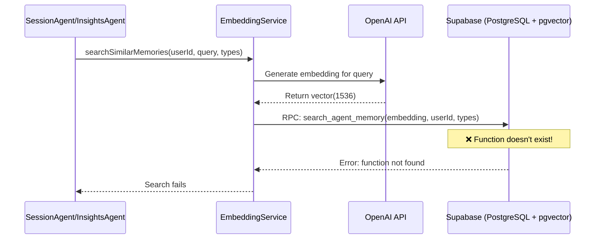

# [Backend] Create search_agent_memory Database Function for RAG System

# Create search_agent_memory Database Function for RAG System

## Overview

The RAG system's `EmbeddingService` calls a database function `search_agent_memory()` that doesn't exist in the current migrations. This function is critical for semantic search functionality in the RAG system used by SessionAgent, InsightsAgent, and other agents.

**Related Tickets:**

- ticket:d969320e-d519-47a7-a258-e04789b8ce0e/a6400730-500c-4ebd-87cc-2b405b330419 - [Agent Infrastructure] Implement RAG System with pgvector
- ticket:d969320e-d519-47a7-a258-e04789b8ce0e/f140acd2-bd7d-40fd-b8b2-f247e357b849 - Wave 2 Implementation: Core Agents

**Related Specs:**

- spec:d969320e-d519-47a7-a258-e04789b8ce0e/68139c2e-3473-476b-9d20-8a0f7891ae48 - Backend & Integration Architecture
- spec:d969320e-d519-47a7-a258-e04789b8ce0e/7dd2bb11-e4c8-4b8d-9f0b-26a8472f3353 - Agentic AI Architecture

---

## Context

The mobile/supabase/functions/_shared/embedding-service.ts file contains a `searchSimilarMemories()` method that calls:

```typescript
const { data, error } = await supabase.rpc('search_agent_memory', {
  query_embedding: embedding,
  query_user_id: userId,
  query_memory_types: memoryTypes,
  match_threshold: threshold,
  match_count: limit,
});
```

However, this RPC function doesn't exist in the database migrations (026-033). Without it, all RAG-based searches will fail, breaking:

- SessionAgent's patient history retrieval
- InsightsAgent's pattern detection
- Any agent using semantic memory search

---

## Architecture Diagram



---

## Acceptance Criteria

### 1. Database Migration Created

- [ ] Create migration file: mobile/supabase/migrations/034_search_agent_memory.sql
- [ ] Function accepts 5 parameters:
  - `query_embedding` (VECTOR(1536))
  - `query_user_id` (UUID)
  - `query_memory_types` (TEXT[])
  - `match_threshold` (FLOAT, default 0.7)
  - `match_count` (INT, default 5)
- [ ] Function returns table with columns: id, user_id, memory_type, content, metadata, similarity, created_at
- [ ] Uses pgvector cosine distance operator (`<=>`)
- [ ] Filters by user_id for RLS compliance
- [ ] Filters by memory_types array
- [ ] Orders by similarity (descending)
- [ ] Limits results to match_count

### 2. Function Performance

- [ ] Uses HNSW index on embedding column (already exists from migration 028)
- [ ] Query execution time < 100ms for typical searches
- [ ] Properly filters by threshold (only returns matches above threshold)
- [ ] Returns similarity score as float (0-1 range)

### 3. Integration Testing

- [ ] Deploy migration: `supabase db push`
- [ ] Test function directly via SQL:
  ```sql
  SELECT * FROM search_agent_memory(
    '[0.1, 0.2, ...]'::vector(1536),
    'user-uuid'::uuid,
    ARRAY['session_note', 'patient_goal'],
    0.7,
    5
  );
  ```
- [ ] Test via EmbeddingService.searchSimilarMemories()
- [ ] Verify SessionAgent can retrieve patient history
- [ ] Verify InsightsAgent can identify patterns

### 4. Documentation

- [ ] Add inline SQL comments explaining function logic
- [ ] Document in Backend & Integration Architecture spec
- [ ] Update Wave 2 ticket with completion status

---

## Technical Details

### Migration File Structure

**File:** mobile/supabase/migrations/034_search_agent_memory.sql

```sql
-- Function for RAG semantic search with user filtering and memory type filtering
-- Uses pgvector cosine distance for similarity matching
-- Returns memories sorted by similarity score (highest first)

CREATE OR REPLACE FUNCTION search_agent_memory(
  query_embedding VECTOR(1536),
  query_user_id UUID,
  query_memory_types TEXT[],
  match_threshold FLOAT DEFAULT 0.7,
  match_count INT DEFAULT 5
)
RETURNS TABLE (
  id UUID,
  user_id UUID,
  memory_type TEXT,
  content TEXT,
  metadata JSONB,
  similarity FLOAT,
  created_at TIMESTAMPTZ
)
LANGUAGE plpgsql
AS $$
BEGIN
  RETURN QUERY
  SELECT
    am.id,
    am.user_id,
    am.memory_type,
    am.content,
    am.metadata,
    1 - (am.embedding <=> query_embedding) AS similarity,
    am.created_at
  FROM agent_memory am
  WHERE am.user_id = query_user_id
    AND am.memory_type = ANY(query_memory_types)
    AND 1 - (am.embedding <=> query_embedding) > match_threshold
  ORDER BY am.embedding <=> query_embedding
  LIMIT match_count;
END;
$$;

-- Add comment for documentation
COMMENT ON FUNCTION search_agent_memory IS 
'Performs semantic search on agent_memory table using pgvector cosine similarity. 
Filters by user_id and memory_types, returns top N matches above threshold.
Used by RAG system for context retrieval in SessionAgent, InsightsAgent, etc.';
```

### Key Implementation Notes

1. **Cosine Distance Operator (`<=>`):**
  - pgvector's cosine distance operator
  - Returns value between 0 (identical) and 2 (opposite)
  - We convert to similarity: `1 - distance` = similarity score (0-1 range)
2. **User Filtering:**
  - `WHERE am.user_id = query_user_id` ensures RLS compliance
  - Each user only sees their own memories
3. **Memory Type Filtering:**
  - `AND am.memory_type = ANY(query_memory_types)` allows filtering by type
  - Example types: 'session_note', 'patient_goal', 'therapist_note', 'assessment'
4. **Threshold Filtering:**
  - `AND 1 - (am.embedding <=> query_embedding) > match_threshold`
  - Only returns memories with similarity > threshold (default 0.7)
  - Prevents irrelevant results
5. **Performance:**
  - Uses existing HNSW index from migration 028
  - Index: `CREATE INDEX agent_memory_embedding_idx ON agent_memory USING hnsw (embedding vector_cosine_ops);`
  - HNSW provides O(log n) search time

---

## Testing Procedure

### 1. Deploy Migration

```bash
cd mobile/supabase
supabase db push
```

**Expected Output:**

```
Applying migration 034_search_agent_memory.sql...
✓ Migration applied successfully
```

### 2. Test Function Directly

```sql
-- Generate a test embedding (normally from OpenAI)
-- For testing, use a random vector
SELECT * FROM search_agent_memory(
  (SELECT embedding FROM agent_memory LIMIT 1), -- Use existing embedding for test
  (SELECT user_id FROM agent_memory LIMIT 1),   -- Use existing user_id
  ARRAY['session_note', 'patient_goal'],
  0.5,  -- Lower threshold for testing
  10
);
```

**Expected Output:**

```
id | user_id | memory_type | content | metadata | similarity | created_at
---+---------+-------------+---------+----------+------------+-----------
... | ... | session_note | ... | {...} | 0.95 | 2026-01-12 ...
... | ... | patient_goal | ... | {...} | 0.87 | 2026-01-11 ...
```

### 3. Test via EmbeddingService

```typescript
// In a test file or Edge Function
import { EmbeddingService } from './_shared/embedding-service.ts';

const embeddingService = new EmbeddingService();

const memories = await embeddingService.searchSimilarMemories(
  'test-user-id',
  'anxiety symptoms and coping strategies',
  ['session_note', 'patient_goal'],
  5,
  0.7
);

console.log('Found memories:', memories);
```

**Expected Output:**

```json
[
  {
    "id": "uuid",
    "content": "Patient reported anxiety symptoms...",
    "similarity": 0.89,
    "metadata": {...}
  },
  ...
]
```

### 4. Test SessionAgent Integration

```bash
# Call agent-orchestrator with session intent
curl -X POST https://your-project.supabase.co/functions/v1/agent-orchestrator \
  -H "Authorization: Bearer $SUPABASE_ANON_KEY" \
  -d '{
    "message": "Patient expressing anxiety about work",
    "context": {
      "userId": "therapist-id",
      "sessionId": "session-id",
      "patientId": "patient-id"
    },
    "intent": "session"
  }'
```

**Expected:** SessionAgent retrieves patient history via RAG and provides context-aware suggestions.

### 5. Verify in Rollbar

Check Rollbar for any errors related to `search_agent_memory`. Should see no errors after deployment.

---

## Success Metrics


| Metric                 | Target   | Verification Method                                           |
| ---------------------- | -------- | ------------------------------------------------------------- |
| Migration deployed     | ✅        | `supabase db push` succeeds                                   |
| Function exists        | ✅        | `SELECT * FROM pg_proc WHERE proname = 'search_agent_memory'` |
| Function callable      | ✅        | Direct SQL test returns results                               |
| EmbeddingService works | ✅        | searchSimilarMemories() returns memories                      |
| SessionAgent works     | ✅        | Agent retrieves patient history                               |
| InsightsAgent works    | ✅        | Agent identifies patterns                                     |
| Query performance      | < 100ms  | `EXPLAIN ANALYZE` on function call                            |
| No Rollbar errors      | 0 errors | Check Rollbar dashboard                                       |


---

## Dependencies

**Depends On:**

- ✅ Migration 028 (agent_memory table with embedding column)
- ✅ Migration 028 (HNSW index on embedding column)
- ✅ pgvector extension enabled (migration 026)

**Blocks:**

- ⏳ SessionAgent patient history retrieval
- ⏳ InsightsAgent pattern detection
- ⏳ Wave 2 completion (95% → 100%)

---

## Deployment Commands

```bash
# 1. Create migration file
cd mobile/supabase/migrations
touch 034_search_agent_memory.sql
# Copy SQL from Technical Details section above

# 2. Apply migration
cd ..
supabase db push

# 3. Verify function exists
supabase db execute "SELECT proname, proargnames FROM pg_proc WHERE proname = 'search_agent_memory';"

# 4. Test function
supabase db execute "
SELECT * FROM search_agent_memory(
  (SELECT embedding FROM agent_memory LIMIT 1),
  (SELECT user_id FROM agent_memory LIMIT 1),
  ARRAY['session_note'],
  0.5,
  5
);
"

# 5. Deploy RAG function (if not already deployed)
supabase functions deploy rag-retrieve

# 6. Test end-to-end
curl -X POST https://your-project.supabase.co/functions/v1/rag-retrieve \
  -H "Authorization: Bearer $SUPABASE_ANON_KEY" \
  -d '{"query": "anxiety symptoms", "userId": "test-id", "memoryTypes": ["session_note"]}'
```

---

## Rollback Plan

If the function causes issues:

```sql
-- Drop the function
DROP FUNCTION IF EXISTS search_agent_memory(VECTOR(1536), UUID, TEXT[], FLOAT, INT);

-- Revert migration
-- Delete 034_search_agent_memory.sql and run:
supabase db reset
```

---

## Related Files

**Files to Create:**

- mobile/supabase/migrations/034_search_agent_memory.sql - New migration

**Files Using This Function:**

- mobile/supabase/functions/_shared/embedding-service.ts - Calls search_agent_memory RPC
- mobile/supabase/functions/_shared/agents/session-agent.ts - Uses RAG for patient history
- mobile/supabase/functions/_shared/agents/insights-agent.ts - Uses RAG for pattern detection

**Related Migrations:**

- mobile/supabase/migrations/026_enable_pgvector.sql - Enables pgvector extension
- mobile/supabase/migrations/028_agent_memory.sql - Creates agent_memory table with HNSW index

---

## Estimated Effort

- **Development:** 15 minutes (SQL function is straightforward)
- **Testing:** 30 minutes (test function, EmbeddingService, agents)
- **Deployment:** 5 minutes (apply migration)
- **Total:** ~1 hour

---

## Priority

**🔴 HIGH PRIORITY** - Blocks Wave 2 completion (currently at 95%)

Without this function:

- RAG system is non-functional
- SessionAgent cannot retrieve patient history
- InsightsAgent cannot identify patterns
- All semantic search features are broken

This is the **only missing piece** to complete Wave 2 at 100%.
