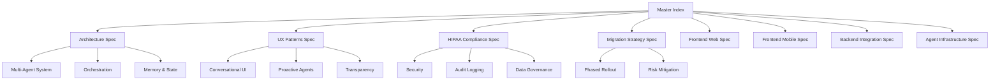

# [Documentation] Specification Documents - Master Index & Single Source of Truth

# Specification Documents - Master Index & Single Source of Truth

## Overview

This ticket serves as the **single source of truth** for all specification documents in the AI SaaS transformation project. It provides a comprehensive index of all specs, their relationships, and maps each specification to its relevant implementation tickets.

## Purpose

- Central reference for all architectural and design decisions
- Quick navigation to relevant specs for each team
- Traceability from requirements to implementation
- Ensure consistency across all work streams

## Specification Architecture

## All Specifications

### 1. Agentic AI Architecture & Multi-Agent System Design
**Purpose:** Core architecture for the multi-agent system

**Key Components:**
- Agent Orchestrator (LangGraph.js)
- Specialized Agents (Booking, Session, Insights, Followup)
- Tool Registry
- Memory System (Short-term + RAG)
- Governance Framework

**Related Tickets:** 6 agent infrastructure tickets

### 2. Backend & Integration Architecture
**Purpose:** Backend systems and third-party integrations

**Key Components:**
- Database schema (8 core tables)
- Edge Functions (Deno)
- Integrations (OpenAI, WhatsApp, Daily.co, Razorpay)
- Monitoring (Rollbar, PostHog)

**Related Tickets:** 7 backend tickets

### 3. Frontend Web Implementation
**Purpose:** Next.js web app with Vercel AI SDK

**Key Components:**
- Embedded Chat Interface
- Copilot Sidebar
- Transparency HUD
- Proactive Notifications
- Settings & Privacy Controls

**Related Tickets:** 8 frontend web tickets

### 4. Frontend Mobile Implementation
**Purpose:** React Native mobile app with Expo

**Key Components:**
- AI Chat (GiftedChat)
- Push Notifications
- Offline Support
- Copilot Overlay
- Voice Input & Biometrics

**Related Tickets:** 8 frontend mobile tickets

### 5. UX Patterns & Conversational Interface Design
**Purpose:** User experience patterns and design principles

**Key Components:**
- Embedded Conversational UI
- Proactive Notifications
- Transparency Mechanisms
- Human Handoff
- Onboarding Flow

**Related Tickets:** 7 UX tickets

### 6. HIPAA Compliance & Healthcare AI Governance
**Purpose:** Compliance framework and security

**Key Components:**
- Encryption (at-rest, in-transit)
- Access Controls (RLS, RBAC)
- Audit Logging (7-year retention)
- Consent Management
- AI Governance

**Related Tickets:** 3 security/compliance tickets

### 7. Migration Strategy & Phased Rollout Plan
**Purpose:** Deployment strategy and rollout plan

**Key Components:**
- Phased Rollout (10% → 50% → 100%)
- Feature Flags
- Success Metrics
- Risk Mitigation
- Rollback Procedures

**Related Tickets:** 6 testing/deployment tickets

## Ticket Coverage by Specification

| Specification | Ticket Count | Coverage |
|---------------|--------------|----------|
| Architecture | 6 tickets | Agent system, orchestration |
| Backend | 10 tickets | Database, APIs, integrations |
| Frontend Web | 8 tickets | Web UI components |
| Frontend Mobile | 8 tickets | Mobile UI components |
| UX Patterns | 7 tickets | User experience flows |
| HIPAA Compliance | 3 tickets | Security, audit, privacy |
| Migration Strategy | 7 tickets | Testing, rollout, monitoring |

**Total:** 49 unique implementation tickets

## How to Use This Index

### For Product Managers
1. Review all specs to understand full scope
2. Use Migration Strategy for timeline
3. Track progress using ticket mappings

### For Architects
1. Start with Architecture spec for system design
2. Review Agent Infrastructure for technical details
3. Ensure HIPAA Compliance requirements are met

### For Frontend Developers
1. Read UX Patterns for design principles
2. Follow Frontend Implementation specs
3. Implement tickets tagged to your platform

### For Backend Developers
1. Study Backend & Integration spec
2. Review Agent Infrastructure for orchestration
3. Implement HIPAA Compliance requirements

### For DevOps Engineers
1. Review Migration Strategy for rollout plan
2. Implement monitoring from Backend spec
3. Setup CI/CD and feature flags

### For Security/Compliance
1. HIPAA Compliance spec is primary reference
2. Validate all tickets meet security requirements
3. Conduct security audit before launch

## Acceptance Criteria

This master index is complete when:

✅ All 7 specifications are listed with summaries  
✅ Each specification has complete list of relevant tickets  
✅ Ticket counts and coverage are accurate  
✅ Cross-specification relationships are documented  
✅ Usage guidelines are provided for each role  
✅ Quick reference links are working  

## Maintenance

**Owner:** Product Manager + Tech Lead  
**Review Frequency:** Weekly during active development  
**Last Updated:** Auto-generated timestamp  
**Next Review:** Auto-generated based on wave completion
  
## Related Specifications
  
- spec:d969320e-d519-47a7-a258-e04789b8ce0e/7dd2bb11-e4c8-4b8d-9f0b-26a8472f3353 - Agentic AI Architecture & Multi-Agent System Design
- spec:d969320e-d519-47a7-a258-e04789b8ce0e/68139c2e-3473-476b-9d20-8a0f7891ae48 - Backend & Integration Architecture
- spec:d969320e-d519-47a7-a258-e04789b8ce0e/b4c0579d-02d4-44b4-991b-076b73106254 - Frontend Web Implementation
- spec:d969320e-d519-47a7-a258-e04789b8ce0e/339a9b00-068b-4a6c-969d-e84e8bba1ff0 - Frontend Mobile Implementation
- spec:d969320e-d519-47a7-a258-e04789b8ce0e/719895d0-e8a7-46cc-b5f9-829428065e26 - UX Patterns & Conversational Interface Design
- spec:d969320e-d519-47a7-a258-e04789b8ce0e/51f8a991-4bf2-4282-98c1-e8d8b4e3d7ee - HIPAA Compliance & Healthcare AI Governance
- spec:d969320e-d519-47a7-a258-e04789b8ce0e/96421d80-e1ba-4066-8cbb-4a15a7773f5a - Migration Strategy & Phased Rollout Plan

