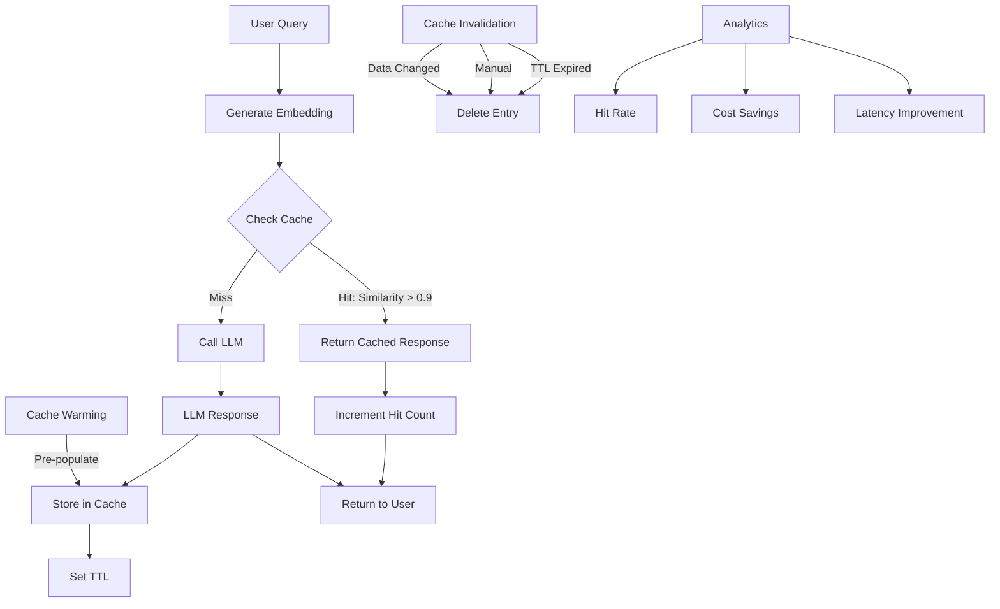

# [Performance] Implement Caching Layer for Agent Responses

# Implement Caching Layer for Agent Responses

## Overview
Implement a caching layer for agent responses to reduce LLM costs, improve response times, and handle common queries efficiently.

## Context
Many user queries are repetitive (e.g., "What is therapy?", "How do I book?"). Caching these responses reduces costs by 30-50% and improves latency.
  
## Architecture Diagram
  


## Acceptance Criteria

### 1. Cache Strategy
- [ ] Cache common queries (FAQ-style)
- [ ] Cache by query similarity (semantic matching)
- [ ] TTL: 24 hours for dynamic content, 7 days for static
- [ ] Invalidate on content updates
- [ ] Support cache warming (pre-populate)

### 2. Cache Storage
- [ ] Use Supabase as cache backend (or Redis)
- [ ] Store query hash as key
- [ ] Store response as value
- [ ] Include metadata (timestamp, hit count)
- [ ] Implement LRU eviction policy

### 3. Semantic Matching
- [ ] Generate embeddings for queries
- [ ] Find similar cached queries (cosine similarity > 0.9)
- [ ] Return cached response if match found
- [ ] Track cache hit rate
- [ ] Log cache misses for analysis

### 4. Cache Invalidation
- [ ] Manual invalidation (admin API)
- [ ] Automatic invalidation (TTL)
- [ ] Invalidate on data changes (e.g., therapist availability)
- [ ] Invalidate on user feedback (thumbs down)
- [ ] Track invalidation events

### 5. Monitoring
- [ ] Track cache hit rate (target > 40%)
- [ ] Track cache miss rate
- [ ] Track cost savings (cached vs. LLM)
- [ ] Track latency improvement
- [ ] Alert on low hit rate

## Technical Details

**Files to Create:**
- `file:mobile/supabase/functions/_shared/cache-manager.ts`
- `file:mobile/supabase/functions/_shared/semantic-cache.ts`
- `file:mobile/supabase/migrations/028_agent_cache.sql`

**Implementation:**
```typescript
interface CacheEntry {
  query_hash: string;
  query_embedding: number[];
  response: string;
  metadata: {
    agent_type: string;
    hit_count: number;
    created_at: string;
    expires_at: string;
  };
}

export async function getCachedResponse(
  query: string,
  agentType: string
): Promise<string | null> {
  // Generate embedding
  const embedding = await generateEmbedding(query);
  
  // Find similar cached queries
  const { data } = await supabase.rpc('match_cached_queries', {
    query_embedding: embedding,
    match_threshold: 0.9,
    agent_type: agentType,
  });
  
  if (data && data.length > 0) {
    // Cache hit
    await incrementHitCount(data[0].query_hash);
    return data[0].response;
  }
  
  // Cache miss
  return null;
}

export async function setCachedResponse(
  query: string,
  response: string,
  agentType: string,
  ttl: number = 86400 // 24 hours
) {
  const embedding = await generateEmbedding(query);
  const queryHash = hashQuery(query);
  
  await supabase.from('agent_cache').upsert({
    query_hash: queryHash,
    query_embedding: embedding,
    response,
    metadata: {
      agent_type: agentType,
      hit_count: 0,
      created_at: new Date().toISOString(),
      expires_at: new Date(Date.now() + ttl * 1000).toISOString(),
    },
  });
}
```

## Testing
- [ ] Test cache hit (common query)
- [ ] Test cache miss (unique query)
- [ ] Test semantic matching (similar queries)
- [ ] Test TTL expiration
- [ ] Test cache invalidation

## Success Metrics
- Cache hit rate > 40%
- Cost reduction > 30%
- Latency improvement > 50% (cached responses)
- Zero stale responses

## Dependencies
- Database schema (agent_cache table)
- Embedding generation (OpenAI)
- pgvector extension
  
## Related Specifications
  
- spec:d969320e-d519-47a7-a258-e04789b8ce0e/68139c2e-3473-476b-9d20-8a0f7891ae48 - Backend & Integration Architecture
- spec:d969320e-d519-47a7-a258-e04789b8ce0e/7dd2bb11-e4c8-4b8d-9f0b-26a8472f3353 - Agentic AI Architecture

---

## 📋 DETAILED IMPLEMENTATION [WAVE 6]

**Source:** Wave 6 ticket - Caching with Upstash Redis

**Files:** cache-service.ts, cached-llm-client.ts

**Features:** LLM caching, embedding caching, hit rate tracking

**Setup:** Upstash Redis secrets

**Success:** Hit > 30%, cost reduction > 25%

**Wave Progress:** 31/49 updated

