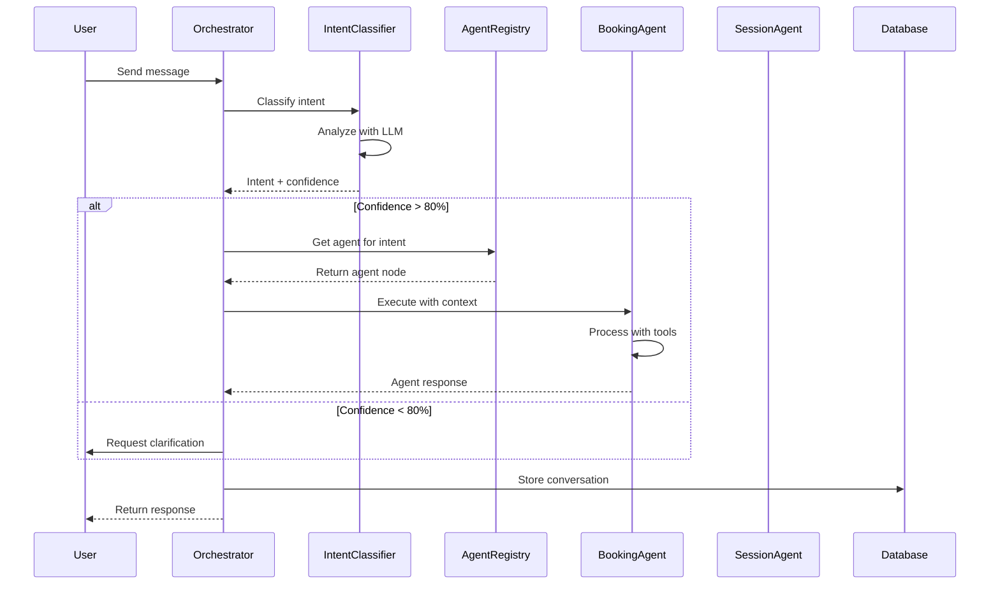

# [Agent Infrastructure] Setup LangGraph.js Orchestration System

# Setup LangGraph.js Orchestration System

## Overview
Implement the core LangGraph.js orchestration system that routes user requests to specialized agents, manages conversation state, and coordinates multi-agent workflows.

## Context
The orchestrator is the central nervous system of the agentic AI platform. It determines which agent to invoke, maintains conversation context, and handles agent-to-agent communication.
  
## Architecture Diagram
  


## Acceptance Criteria

### 1. LangGraph.js Setup
- [ ] Install LangGraph.js in Supabase Edge Functions
- [ ] Configure state management with checkpointing
- [ ] Create base StateGraph with nodes and edges
- [ ] Implement conditional routing logic
- [ ] Setup state persistence to Supabase

### 2. Intent Classification
- [ ] Implement intent classifier (booking, session, insights, followup, general)
- [ ] Use few-shot prompting for accuracy
- [ ] Confidence threshold: > 80% for autonomous routing
- [ ] Fallback to clarification if confidence < 80%
- [ ] Track classification accuracy

### 3. Agent Registry
- [ ] Create agent registry with metadata
- [ ] Register all specialized agents
- [ ] Implement agent lifecycle management
- [ ] Support dynamic agent loading
- [ ] Version control for agents

### 4. Context Management
- [ ] Preserve context across agent handoffs
- [ ] Implement context summarization for long conversations
- [ ] Store context in `agent_conversations` table
- [ ] Support context injection for tools
- [ ] Handle context size limits

### 5. Error Handling
- [ ] Implement retry logic (3 attempts)
- [ ] Fallback to human handoff on failure
- [ ] Log all errors to Rollbar
- [ ] Graceful degradation (disable failing agents)
- [ ] User-friendly error messages

## Technical Details

### Implementation Steps

#### Step 1: Create Agent Registry

**File:** `file:mobile/supabase/functions/_shared/agent-registry.ts`

```typescript
import { bookingAgentNode } from './agents/booking-agent.ts';
import { sessionAgentNode } from './agents/session-agent.ts';
import { insightsAgentNode } from './agents/insights-agent.ts';
import { followupAgentNode } from './agents/followup-agent.ts';

export const agentRegistry = {
  booking: {
    name: 'BookingAgent',
    description: 'Handles appointment booking and scheduling',
    node: bookingAgentNode,
    intents: ['book_appointment', 'check_availability', 'reschedule', 'cancel_appointment'],
  },
  session: {
    name: 'SessionAgent',
    description: 'Real-time copilot during therapy sessions',
    node: sessionAgentNode,
    intents: ['session_assistance', 'risk_assessment', 'intervention_suggestion', 'documentation'],
  },
  insights: {
    name: 'InsightsAgent',
    description: 'Analyzes patient data and provides clinical insights',
    node: insightsAgentNode,
    intents: ['analyze_progress', 'identify_patterns', 'treatment_recommendations', 'outcome_metrics'],
  },
  followup: {
    name: 'FollowupAgent',
    description: 'Handles post-session engagement and check-ins',
    node: followupAgentNode,
    intents: ['send_followup', 'check_homework', 'wellness_check', 'mood_tracking'],
  },
};

export function getAgentByIntent(intent: string): string | null {
  for (const [agentKey, agent] of Object.entries(agentRegistry)) {
    if (agent.intents.includes(intent)) {
      return agentKey;
    }
  }
  return null;
}
```

#### Step 2: Create Intent Classifier

**File:** `file:mobile/supabase/functions/_shared/intent-classifier.ts`

```typescript
import { LLMClient } from './llm-client.ts';

export interface IntentClassification {
  intent: string;
  confidence: number;
  reasoning: string;
}

export async function classifyIntent(
  message: string,
  llmClient: LLMClient
): Promise<IntentClassification> {
  const systemPrompt = `You are an intent classifier for a therapy platform.
  
Analyze the user's message and classify it into ONE of these intents:
- book_appointment: User wants to schedule/reschedule/cancel an appointment
- session_assistance: Therapist needs help during a live session
- analyze_progress: User wants insights about patient progress
- send_followup: Send check-ins or wellness messages
- check_homework: Check homework completion
- wellness_check: Monitor patient wellbeing
- general_chat: General questions or conversation

Respond with JSON: {"intent": "...", "confidence": 0.0-1.0, "reasoning": "..."}`;

  const response = await llmClient.chat({
    model: 'claude-sonnet-4-5-20250929',
    messages: [
      { role: 'system', content: systemPrompt },
      { role: 'user', content: message },
    ],
    temperature: 0.1,
  });

  try {
    const result = JSON.parse(response.content);
    return {
      intent: result.intent,
      confidence: result.confidence,
      reasoning: result.reasoning,
    };
  } catch (error) {
    // Fallback to general_chat
    return {
      intent: 'general_chat',
      confidence: 0.5,
      reasoning: 'Failed to parse classification',
    };
  }
}
```

#### Step 3: Create Agent Orchestrator

**File:** `file:mobile/supabase/functions/agent-orchestrator/index.ts`

```typescript
import { serve } from 'https://deno.land/std@0.168.0/http/server.ts';
import { createClient } from 'https://esm.sh/@supabase/supabase-js@2';
import { corsHeaders } from '../_shared/cors.ts';
import { LLMClient } from '../_shared/llm-client.ts';
import { classifyIntent } from '../_shared/intent-classifier.ts';
import { agentRegistry, getAgentByIntent } from '../_shared/agent-registry.ts';
import { reportError, reportInfo } from '../_shared/rollbar.ts';

serve(async (req) => {
  if (req.method === 'OPTIONS') {
    return new Response('ok', { headers: corsHeaders });
  }

  const startTime = Date.now();

  try {
    const { message, messages, userId, intent: providedIntent, sessionId, patientId } = await req.json();

    const supabase = createClient(
      Deno.env.get('SUPABASE_URL')!,
      Deno.env.get('SUPABASE_SERVICE_ROLE_KEY')!
    );

    const llmClient = new LLMClient();

    // Classify intent if not provided
    let intent = providedIntent;
    let confidence = 1.0;

    if (!intent) {
      const classification = await classifyIntent(message || messages[messages.length - 1].content, llmClient);
      intent = classification.intent;
      confidence = classification.confidence;

      reportInfo('Intent classified', {
        intent,
        confidence,
        reasoning: classification.reasoning,
      });
    }

    // Get appropriate agent
    const agentKey = getAgentByIntent(intent);
    if (!agentKey) {
      throw new Error(`No agent found for intent: ${intent}`);
    }

    const agent = agentRegistry[agentKey];

    // Execute agent
    const agentState = {
      messages: messages || [{ role: 'user', content: message }],
      userId,
      intent,
      sessionId,
      patientId,
      toolCalls: [],
      result: null,
    };

    const result = await agent.node(agentState, supabase, llmClient);

    // Store conversation
    await supabase.from('agent_conversations').insert({
      user_id: userId,
      agent_type: agentKey,
      messages: result.messages,
      intent,
      confidence,
      metadata: {
        toolCalls: result.toolCalls,
        sessionId,
        patientId,
      },
    });

    const duration = Date.now() - startTime;

    reportInfo('Agent orchestration completed', {
      agentType: agentKey,
      intent,
      duration,
      toolCallsCount: result.toolCalls?.length || 0,
    });

    return new Response(
      JSON.stringify({
        success: true,
        agentType: agentKey,
        response: result.result,
        toolCalls: result.toolCalls,
        confidence,
      }),
      { headers: { ...corsHeaders, 'Content-Type': 'application/json' } }
    );
  } catch (error) {
    reportError(error, { context: 'agent-orchestrator' });
    return new Response(
      JSON.stringify({ success: false, error: error.message }),
      { status: 500, headers: { ...corsHeaders, 'Content-Type': 'application/json' } }
    );
  }
});
```

**LangGraph State:**
```typescript
interface AgentState {
  messages: Message[];
  intent: string;
  confidence: number;
  currentAgent: string;
  context: Record<string, any>;
  userId: string;
}
```

## Testing
- [ ] Test intent classification (10 sample inputs per intent)
- [ ] Test agent routing (verify correct agent invoked)
- [ ] Test context preservation (multi-turn conversations)
- [ ] Test error handling (simulate failures)
- [ ] Load test (100 concurrent conversations)

## Success Metrics
- Intent classification accuracy > 90%
- Routing latency < 200ms
- Context preservation rate 100%
- Error recovery rate > 95%

## Dependencies
- Supabase Edge Functions setup
- OpenAI API access
- Database schema (agent_conversations table)
  
## Related Specifications
  
- spec:d969320e-d519-47a7-a258-e04789b8ce0e/7dd2bb11-e4c8-4b8d-9f0b-26a8472f3353 - Agentic AI Architecture & Multi-Agent System Design
- spec:d969320e-d519-47a7-a258-e04789b8ce0e/68139c2e-3473-476b-9d20-8a0f7891ae48 - Backend & Integration Architecture

## Related Tickets
- All agent implementation tickets depend on this

---

## 📋 DETAILED IMPLEMENTATION [WAVE 1]

**Source:** Wave 1 ticket (ticket:d969320e-d519-47a7-a258-e04789b8ce0e/0e0f731a-3cf3-4dcf-830e-bf6cb48d07f7)

### Complete LLM Client with Fallback

**File:** `file:mobile/supabase/functions/_shared/llm-client.ts`

See Wave 1 ticket lines 418-597 for complete LLM client implementation with:
- OpenAI GPT-4 Turbo + Anthropic Claude Sonnet 4.5 fallback
- Automatic cost tracking
- Circuit breaker pattern
- Tool calling support

### Complete Orchestrator Implementation

**File:** `file:mobile/supabase/functions/agent-orchestrator/index.ts`

See Wave 1 ticket lines 600-926 for complete orchestrator with:
- Intent classification
- Agent routing
- Context management
- Error handling with Rollbar

### Deployment

```bash
cd mobile/supabase/functions
supabase functions deploy agent-orchestrator
supabase secrets set ANTHROPIC_API_KEY=your_key
supabase secrets set OPENAI_API_KEY=your_key
```

### Testing

```bash
curl -X POST https://YOUR_PROJECT.supabase.co/functions/v1/agent-orchestrator \
  -H "Authorization: Bearer YOUR_ANON_KEY" \
  -d '{"message": "Book appointment", "userId": "test-id"}'
```

**Wave Progress:** 2/49 updated

