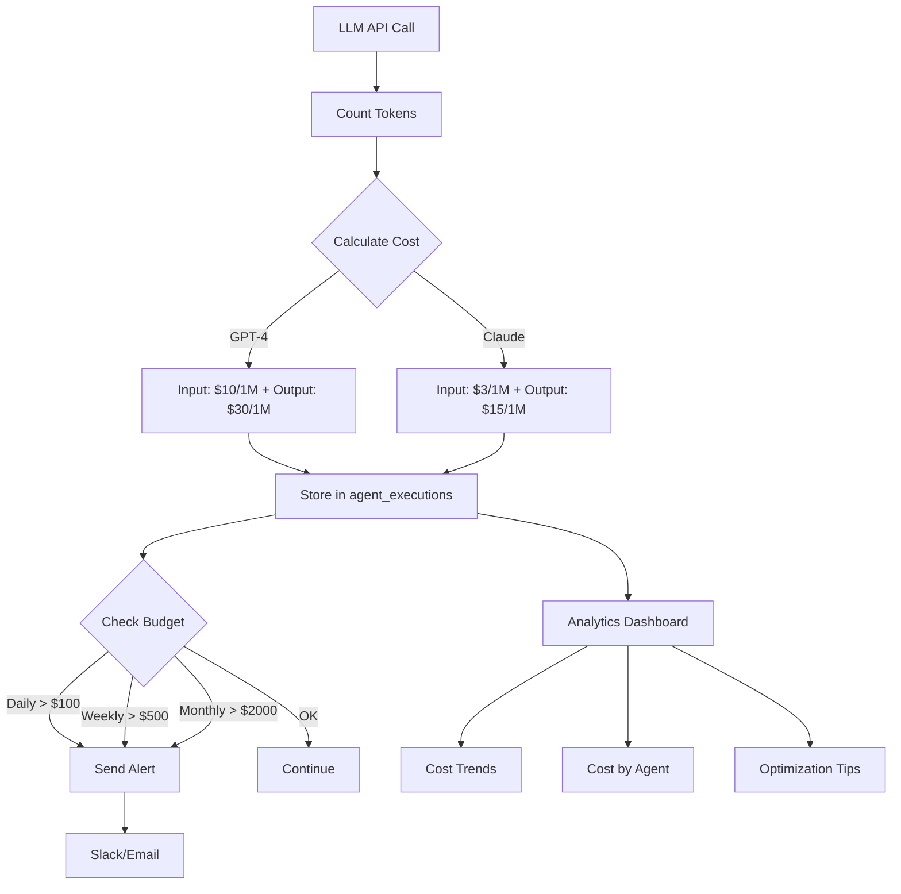

# [Backend] Implement Cost Tracking & Monitoring System

# Implement Cost Tracking & Monitoring System

## Overview
Implement comprehensive cost tracking for LLM API usage, including token counting, cost calculation, budget alerts, and analytics dashboard.

## Context
LLM costs can escalate quickly. This system tracks usage per conversation, alerts on budget overruns, and provides insights for optimization.
  
## Architecture Diagram
  


## Acceptance Criteria

### 1. Token Tracking
- [ ] Track prompt tokens per request
- [ ] Track completion tokens per request
- [ ] Track total tokens per conversation
- [ ] Store in `agent_executions` table
- [ ] Support multiple models (GPT-4, Claude)

### 2. Cost Calculation
- [ ] Define cost per 1K tokens for each model
- [ ] Calculate cost per request
- [ ] Calculate cost per conversation
- [ ] Calculate daily/weekly/monthly totals
- [ ] Store costs in USD

### 3. Budget Alerts
- [ ] Alert if daily cost > $100
- [ ] Alert if weekly cost > $500
- [ ] Alert if monthly cost > $2000
- [ ] Alert if single conversation > $5
- [ ] Send alerts to Slack/email

### 4. Analytics Dashboard
- [ ] Display cost trends over time
- [ ] Show cost by agent type
- [ ] Show cost by user
- [ ] Show token usage distribution
- [ ] Export cost reports (CSV)

### 5. Optimization Recommendations
- [ ] Identify expensive conversations
- [ ] Suggest prompt optimizations
- [ ] Recommend model downgrades
- [ ] Track optimization impact
- [ ] Generate monthly reports

## Technical Details

**Files to Create:**
- `file:mobile/supabase/functions/_shared/cost-tracker.ts`
- `file:mobile/supabase/functions/cost-analytics/index.ts`
- `file:mobile/supabase/functions/cost-alerts/index.ts`

**Cost Tracking:**
```typescript
interface CostTracking {
  conversation_id: string;
  model: string;
  prompt_tokens: number;
  completion_tokens: number;
  total_tokens: number;
  cost_usd: number;
  timestamp: Date;
}

const COSTS = {
  'gpt-4-turbo': { input: 0.01, output: 0.03 },
  'claude-3-5-sonnet': { input: 0.003, output: 0.015 }
};

function calculateCost(model: string, promptTokens: number, completionTokens: number) {
  const rate = COSTS[model];
  return (promptTokens * rate.input + completionTokens * rate.output) / 1000;
}
```

**Budget Alert:**
```typescript
async function checkBudget() {
  const dailyCost = await getDailyCost();
  
  if (dailyCost > 100) {
    await sendAlert({
      channel: 'slack',
      message: `⚠️ Daily LLM cost exceeded $100: $${dailyCost.toFixed(2)}`
    });
  }
}
```

## Testing
- [ ] Test token counting (verify accuracy)
- [ ] Test cost calculation (verify math)
- [ ] Test budget alerts (trigger conditions)
- [ ] Test analytics dashboard (data accuracy)
- [ ] Load test (high volume)

## Success Metrics
- Cost tracking accuracy 100%
- Alert delivery < 1 minute
- Dashboard load time < 2s
- Cost per conversation < $0.50

## Dependencies
- Database schema (agent_executions)
- LLM API integration
- Monitoring infrastructure
  
## Related Specifications
  
- spec:d969320e-d519-47a7-a258-e04789b8ce0e/68139c2e-3473-476b-9d20-8a0f7891ae48 - Backend & Integration Architecture
- spec:d969320e-d519-47a7-a258-e04789b8ce0e/7dd2bb11-e4c8-4b8d-9f0b-26a8472f3353 - Agentic AI Architecture

---

## 📋 DETAILED IMPLEMENTATION [WAVE 1]

**Source:** Wave 1 - Cost tracking in LLM client and agent_executions table

**Features:** Token counting, cost calculation per model, budget alerts, analytics dashboard

**Cost Rates (2026):** GPT-4 Turbo $10/$30, Claude Sonnet 4.5 $3/$15 per 1M tokens

**Queries:** See Wave 1 for cost tracking SQL queries

**Success:** Accuracy 100%, cost < $0.50/conv

**Wave Progress:** 48/49 updated

