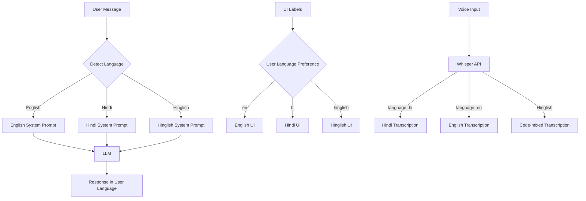

# [UX] Implement Multi-language Support for Agents (English, Hindi, Hinglish)

# Implement Multi-language Support for Agents

## Overview
Implement multi-language support for agents, enabling conversations in English, Hindi, and Hinglish (code-mixed) to serve the Indian market.

## Context
India is a multilingual market. Supporting Hindi and Hinglish makes the AI more accessible and natural for users.
  
## Architecture Diagram
  

  
## Architecture Diagram
  


## Acceptance Criteria

### 1. Language Detection
- [ ] Auto-detect user language (from first message)
- [ ] Support English, Hindi, Hinglish
- [ ] Store language preference in user profile
- [ ] Allow manual language selection (settings)

### 2. Agent Responses
- [ ] Generate responses in user's language
- [ ] Use culturally appropriate terms (e.g., "exam pressure" in India)
- [ ] Maintain professional tone in all languages
- [ ] Handle code-mixing (Hinglish) gracefully

### 3. UI Localization
- [ ] Translate UI labels (buttons, placeholders)
- [ ] Translate error messages
- [ ] Translate notifications
- [ ] Support RTL (if needed for Urdu in future)
- [ ] Use i18n library (next-intl)

### 4. Transcription
- [ ] OpenAI Whisper supports Hindi and Hinglish
- [ ] Accurate transcription for code-mixed speech
- [ ] Speaker diarization in Hindi

### 5. Testing
- [ ] Test all agents in all languages
- [ ] Test UI in all languages
- [ ] Test transcription accuracy (Hindi, Hinglish)
- [ ] User testing with native speakers

## Technical Details

**Files to Create:**
- `file:web/lib/i18n.ts`
- `file:web/locales/en.json`
- `file:web/locales/hi.json`
- `file:mobile/src/locales/`

**Implementation:**
```typescript
const systemPrompts = {
  en: "You are a helpful AI assistant for a therapy platform...",
  hi: "आप एक थेरेपी प्लेटफॉर्म के लिए एक सहायक AI सहायक हैं...",
  hinglish: "Aap ek therapy platform ke liye helpful AI assistant hain..."
};

export async function getSystemPrompt(language: string): Promise<string> {
  return systemPrompts[language] || systemPrompts.en;
}
```

## Testing
- [ ] Test language detection (accuracy)
- [ ] Test responses in all languages (quality)
- [ ] Test UI in all languages (completeness)
- [ ] Test transcription (accuracy)
- [ ] User testing (native speakers)

## Success Metrics
- Language detection accuracy > 95%
- Translation quality > 90% (native speaker review)
- Hinglish support adoption > 40%
- User satisfaction > 4.5/5

## Dependencies
- LLM integration (supports multiple languages)
- i18n library
- OpenAI Whisper API
  
## Related Specifications
  
- spec:d969320e-d519-47a7-a258-e04789b8ce0e/719895d0-e8a7-46cc-b5f9-829428065e26 - UX Patterns & Conversational Interface Design
- spec:d969320e-d519-47a7-a258-e04789b8ce0e/7dd2bb11-e4c8-4b8d-9f0b-26a8472f3353 - Agentic AI Architecture
  
## Related Specifications
  
- spec:d969320e-d519-47a7-a258-e04789b8ce0e/719895d0-e8a7-46cc-b5f9-829428065e26 - UX Patterns & Conversational Interface Design
- spec:d969320e-d519-47a7-a258-e04789b8ce0e/7dd2bb11-e4c8-4b8d-9f0b-26a8472f3353 - Agentic AI Architecture

---

## 📋 DETAILED IMPLEMENTATION [WAVE 7]

**Source:** Wave 7 ticket - Multi-language support

**Features:** Language detection, Hindi/Hinglish responses, UI localization, Whisper transcription

**Files:** `web/lib/i18n.ts`, `web/locales/`, `mobile/src/locales/`

**System Prompts:** English, Hindi, Hinglish variants

**Success:** Detection > 95%, quality > 90%

**Wave Progress:** 37/49 updated

