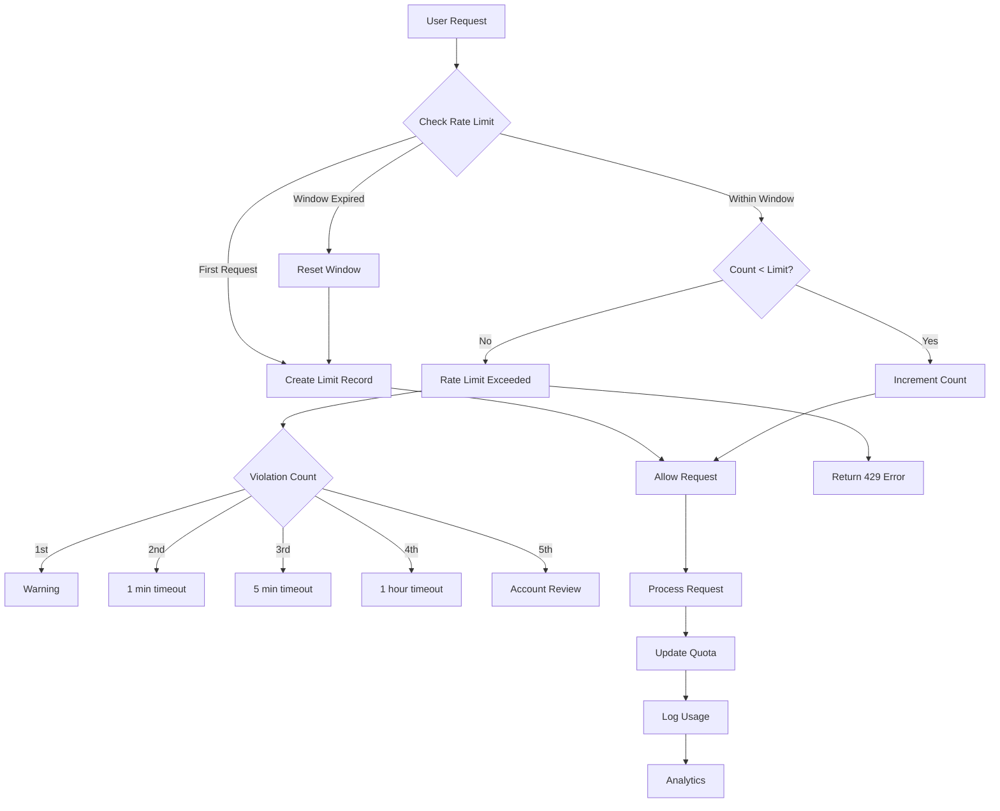

# [Backend] Implement Agent Rate Limiting & Abuse Prevention

# Implement Agent Rate Limiting & Abuse Prevention

## Overview
Implement rate limiting and abuse prevention mechanisms to protect the agent system from spam, abuse, and cost attacks.

## Context
Without rate limiting, malicious users could drain the LLM budget or overwhelm the system. This protection is essential for production.
  
## Architecture Diagram
  


## Acceptance Criteria

### 1. Rate Limiting
- [ ] Limit: 10 messages/minute per user
- [ ] Limit: 100 tool calls/hour per user
- [ ] Limit: 1000 API calls/day per user
- [ ] Return 429 error on limit exceeded
- [ ] Display user-friendly error message

### 2. Abuse Detection
- [ ] Detect spam patterns (repeated messages)
- [ ] Detect gibberish (random characters)
- [ ] Detect prompt injection attempts
- [ ] Detect cost attacks (expensive queries)
- [ ] Flag suspicious users

### 3. Exponential Backoff
- [ ] First violation: Warning message
- [ ] Second violation: 1-minute timeout
- [ ] Third violation: 5-minute timeout
- [ ] Fourth violation: 1-hour timeout
- [ ] Fifth violation: Account review

### 4. Admin Override
- [ ] Allow admin to bypass rate limits (testing)
- [ ] Allow admin to reset user limits
- [ ] Allow admin to ban users
- [ ] Track all override events
- [ ] Audit admin actions

### 5. Monitoring
- [ ] Track rate limit violations
- [ ] Track abuse patterns
- [ ] Alert on unusual activity
- [ ] Generate abuse reports
- [ ] Dashboard for rate limit metrics

## Technical Details

**Files to Create:**
- `file:mobile/supabase/functions/_shared/rate-limiter.ts`
- `file:mobile/supabase/functions/_shared/abuse-detector.ts`
- `file:mobile/supabase/migrations/031_rate_limits.sql`

**Implementation:**
```typescript
export async function checkRateLimit(
  userId: string,
  action: string
): Promise<boolean> {
  const key = `ratelimit:${userId}:${action}`;
  
  const { data } = await supabase
    .from('rate_limits')
    .select('count, window_start')
    .eq('user_id', userId)
    .eq('action', action)
    .single();

  if (!data) {
    // First request
    await supabase.from('rate_limits').insert({
      user_id: userId,
      action,
      count: 1,
      window_start: new Date(),
    });
    return true;
  }

  const windowDuration = 60 * 1000; // 1 minute
  const now = Date.now();
  const windowStart = new Date(data.window_start).getTime();

  if (now - windowStart > windowDuration) {
    // Reset window
    await supabase.from('rate_limits').update({
      count: 1,
      window_start: new Date(),
    }).eq('user_id', userId).eq('action', action);
    return true;
  }

  if (data.count >= 10) {
    // Rate limit exceeded
    return false;
  }

  // Increment count
  await supabase.from('rate_limits').update({
    count: data.count + 1,
  }).eq('user_id', userId).eq('action', action);

  return true;
}
```

## Testing
- [ ] Test rate limiting (exceed limits)
- [ ] Test abuse detection (spam patterns)
- [ ] Test exponential backoff (multiple violations)
- [ ] Test admin override (bypass limits)
- [ ] Load test (concurrent requests)

## Success Metrics
- Rate limit enforcement 100%
- Abuse detection accuracy > 90%
- False positive rate < 5%
- Zero cost attacks

## Dependencies
- Database schema (rate_limits table)
- Monitoring infrastructure
  
## Related Specifications
  
- spec:d969320e-d519-47a7-a258-e04789b8ce0e/68139c2e-3473-476b-9d20-8a0f7891ae48 - Backend & Integration Architecture
- spec:d969320e-d519-47a7-a258-e04789b8ce0e/51f8a991-4bf2-4282-98c1-e8d8b4e3d7ee - HIPAA Compliance & Healthcare AI Governance

---

## 📋 DETAILED IMPLEMENTATION [WAVE 7]

**Source:** Wave 7 ticket - Rate limiting and abuse prevention

**Features:** 10 msg/min limit, abuse detection (spam, gibberish, prompt injection), exponential backoff, admin override

**Files:** `mobile/supabase/functions/_shared/rate-limiter.ts`, `mobile/supabase/functions/_shared/abuse-detector.ts`

**Success:** Enforcement 100%, detection > 90%

**Wave Progress:** 42/49 updated

