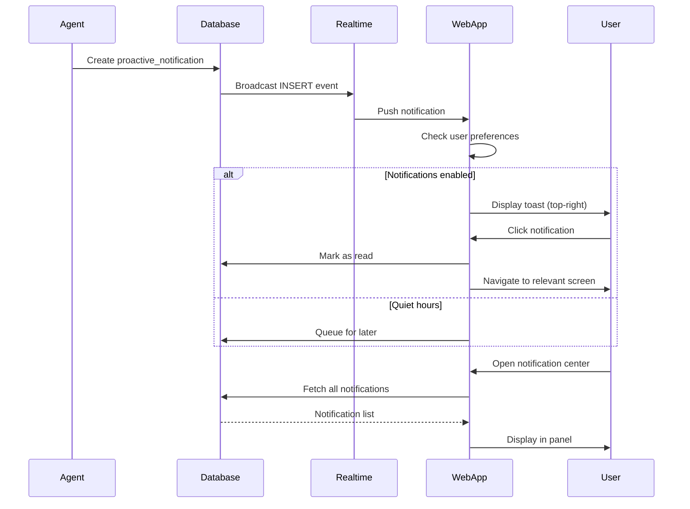

# [Frontend Web] Implement Proactive Notification System

# Implement Proactive Notification System

## Overview
Implement the proactive notification system that displays ambient, non-intrusive notifications for session prep, insights, follow-ups, and alerts.

## Context
Proactive notifications are a key differentiator of agentic AI. The system anticipates user needs and surfaces relevant information at the right time.
  
## Architecture Diagram
  


## Acceptance Criteria

### 1. Notification Component
- [ ] Create `ProactiveNotification` component
- [ ] Display in top-right corner (non-intrusive)
- [ ] Support multiple notification types (session_prep, insight, alert, followup)
- [ ] Auto-dismiss after 10 seconds (configurable)
- [ ] Manual dismiss button
- [ ] Slide-in animation

### 2. Notification Center
- [ ] Create notification center (bell icon in header)
- [ ] Display all notifications (read and unread)
- [ ] Mark as read on click
- [ ] Filter by type
- [ ] Clear all button
- [ ] Pagination (load more)

### 3. Real-time Delivery
- [ ] Subscribe to `proactive_notifications` table (Supabase Realtime)
- [ ] Display new notifications immediately
- [ ] Play subtle sound (optional, user preference)
- [ ] Show badge count on bell icon
- [ ] Update badge in real-time

### 4. Actionable CTAs
- [ ] Support primary action button (e.g., "View Insights")
- [ ] Support secondary action (e.g., "Dismiss")
- [ ] Navigate to relevant screen on click
- [ ] Track CTA click rate
- [ ] A/B test CTA copy

### 5. User Preferences
- [ ] Settings page for notification preferences
- [ ] Toggle proactive notifications on/off
- [ ] Set frequency (normal, reduced, minimal)
- [ ] Set quiet hours (no notifications)
- [ ] Choose notification types to receive

## Technical Details

**Files to Create:**
- `file:web/components/ai/proactive-notification.tsx`
- `file:web/components/ai/notification-center.tsx`
- `file:web/hooks/use-proactive-notifications.ts`
- `file:web/app/(main)/settings/notifications/page.tsx`

**Implementation:**
```typescript
export function useProactiveNotifications() {
  const [notifications, setNotifications] = useState([]);
  const supabase = createBrowserClient();

  useEffect(() => {
    const channel = supabase
      .channel('proactive_notifications')
      .on('postgres_changes', {
        event: 'INSERT',
        schema: 'public',
        table: 'proactive_notifications',
        filter: `user_id=eq.${userId}`,
      }, (payload) => {
        setNotifications((prev) => [payload.new, ...prev]);
        
        toast(payload.new.title, {
          description: payload.new.message,
          action: payload.new.action,
        });
      })
      .subscribe();

    return () => supabase.removeChannel(channel);
  }, [userId]);

  return { notifications };
}
```

## Testing
- [ ] Test notification display (all types)
- [ ] Test real-time delivery (trigger from backend)
- [ ] Test auto-dismiss (timing)
- [ ] Test notification center (pagination)
- [ ] Test user preferences (respect settings)

## Success Metrics
- Notification delivery latency < 1s
- Click-through rate > 40%
- Opt-out rate < 10%
- User satisfaction > 4.0/5

## Dependencies
- Supabase Realtime
- Database schema (proactive_notifications)
- Agent implementations (generate notifications)
  
## Related Specifications
  
- spec:d969320e-d519-47a7-a258-e04789b8ce0e/b4c0579d-02d4-44b4-991b-076b73106254 - Frontend Web Implementation
- spec:d969320e-d519-47a7-a258-e04789b8ce0e/719895d0-e8a7-46cc-b5f9-829428065e26 - UX Patterns & Conversational Interface Design

---

## 📋 DETAILED IMPLEMENTATION [WAVE 4]

**Source:** Wave 4 ticket - See STEP 4 for complete ProactiveNotifications component

**File:** `web/components/notifications/proactive-notification.tsx` - Real-time notifications with:
- Supabase Realtime subscription
- Toast notifications for high priority
- Mark as read functionality
- Unread count badge
- Notification history panel

**File:** `web/app/(dashboard)/layout.tsx` - Add to header

**Features:**
- Real-time via Supabase Realtime
- Priority-based display (high = toast)
- Icon mapping by type
- Color coding by priority

**Deploy:** Included in web deployment

**Success:** Delivery < 1s, CTR > 40%, opt-out < 10%

**Wave Progress:** 14/49 updated

