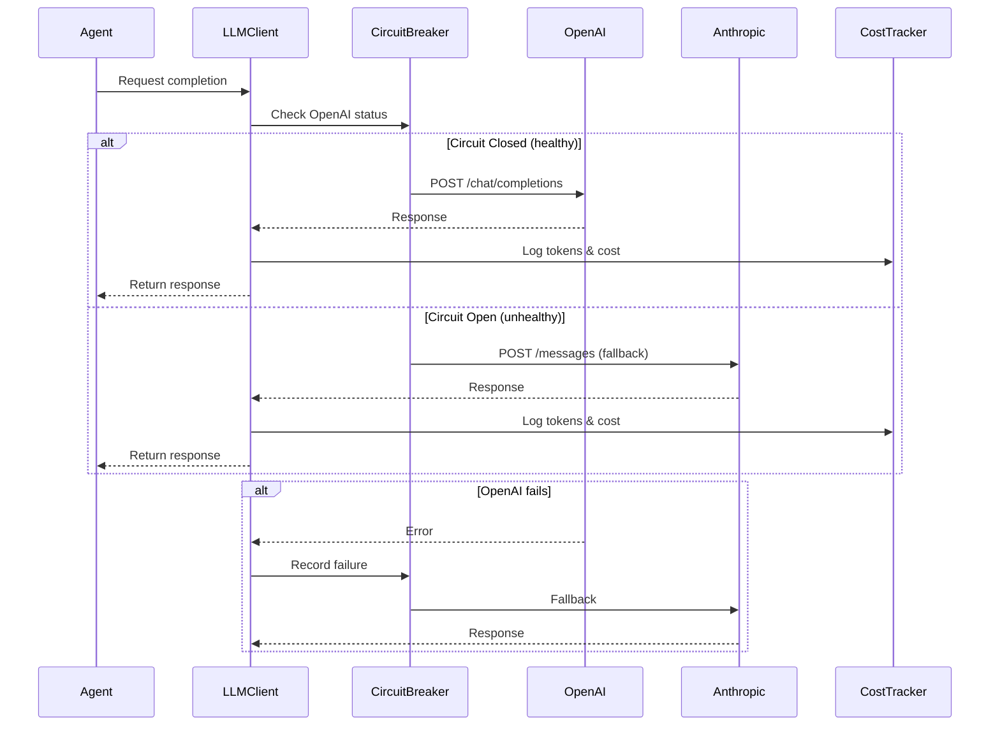

# [Integration] Integrate OpenAI & Anthropic APIs with Fallback

# Integrate OpenAI & Anthropic APIs with Fallback

## Overview
Integrate OpenAI GPT-4 as the primary LLM and Anthropic Claude 3.5 Sonnet as fallback, with retry logic, circuit breaker pattern, and cost optimization.

## Context
Reliable LLM access is critical for the agent system. This integration provides redundancy through fallback and optimizes costs through intelligent routing.
  
## Architecture Diagram
  


## Acceptance Criteria

### 1. OpenAI Integration
- [ ] Install OpenAI SDK
- [ ] Configure API key (environment variable)
- [ ] Implement GPT-4 Turbo client
- [ ] Support function calling
- [ ] Support streaming responses
- [ ] Track token usage

### 2. Anthropic Integration
- [ ] Install Anthropic SDK
- [ ] Configure API key (environment variable)
- [ ] Implement Claude 3.5 Sonnet client
- [ ] Support tool use
- [ ] Support streaming responses
- [ ] Track token usage

### 3. Fallback Logic
- [ ] Primary: OpenAI GPT-4 Turbo
- [ ] Fallback: Anthropic Claude 3.5 Sonnet
- [ ] Retry 3 times with exponential backoff
- [ ] Switch to fallback on primary failure
- [ ] Log all fallback events

### 4. Circuit Breaker
- [ ] Track failure rate per provider
- [ ] Open circuit after 5 consecutive failures
- [ ] Half-open after 5 minutes
- [ ] Close circuit on successful request
- [ ] Alert on circuit open

### 5. Cost Optimization
- [ ] Use GPT-3.5 for simple queries
- [ ] Cache common responses (Redis)
- [ ] Batch requests where possible
- [ ] Monitor cost per conversation
- [ ] Alert on budget overrun

## Technical Details

**Files to Create:**
- `file:mobile/supabase/functions/_shared/llm-client.ts`
- `file:mobile/supabase/functions/_shared/circuit-breaker.ts`
- `file:mobile/supabase/functions/_shared/llm-cache.ts`

**Implementation:**
```typescript
import OpenAI from 'openai';
import Anthropic from '@anthropic-ai/sdk';

const openai = new OpenAI({ apiKey: Deno.env.get('OPENAI_API_KEY') });
const anthropic = new Anthropic({ apiKey: Deno.env.get('ANTHROPIC_API_KEY') });

export async function callLLM(
  messages: Message[],
  options: LLMOptions
): Promise<LLMResponse> {
  try {
    // Try OpenAI first
    return await callOpenAI(messages, options);
  } catch (error) {
    console.error('OpenAI failed, falling back to Anthropic', error);
    
    // Fallback to Anthropic
    return await callAnthropic(messages, options);
  }
}

async function callOpenAI(messages: Message[], options: LLMOptions) {
  const response = await openai.chat.completions.create({
    model: 'gpt-4-turbo-preview',
    messages,
    tools: options.tools,
    stream: options.stream,
  });
  
  return response;
}

async function callAnthropic(messages: Message[], options: LLMOptions) {
  const response = await anthropic.messages.create({
    model: 'claude-3-5-sonnet-20241022',
    messages,
    tools: options.tools,
    stream: options.stream,
  });
  
  return response;
}
```

## Testing
- [ ] Test OpenAI integration (successful calls)
- [ ] Test Anthropic integration (successful calls)
- [ ] Test fallback (simulate OpenAI failure)
- [ ] Test circuit breaker (5 failures)
- [ ] Test cost tracking (verify calculations)

## Success Metrics
- API availability > 99.9%
- Fallback success rate > 95%
- Average response time < 2s
- Cost per conversation < $0.50

## Dependencies
- OpenAI API key
- Anthropic API key
- Cost tracking system
  
## Related Specifications
  
- spec:d969320e-d519-47a7-a258-e04789b8ce0e/68139c2e-3473-476b-9d20-8a0f7891ae48 - Backend & Integration Architecture
- spec:d969320e-d519-47a7-a258-e04789b8ce0e/7dd2bb11-e4c8-4b8d-9f0b-26a8472f3353 - Agentic AI Architecture

---

## 📋 DETAILED IMPLEMENTATION [WAVE 6]

**Source:** Wave 6 ticket (ticket:d969320e-d519-47a7-a258-e04789b8ce0e/b5c6d7fc-e560-4003-a180-522b60576b49)

### Enhanced LLM Client with Circuit Breaker

**File:** `mobile/supabase/functions/_shared/llm-client.ts` - See Wave 6 STEP 1 for complete implementation with:
- Circuit breaker pattern (5 failures = open)
- Automatic fallback (OpenAI → Anthropic)
- Timeout handling (30s)
- Reset after 60s
- Provider health tracking

**Key Features:**
- Prevents cascading failures
- Automatic provider switching
- Health monitoring
- Cost tracking per provider

**Deploy:** Included in orchestrator deployment

**Success:** Availability > 99.9%, fallback > 95%

**Wave Progress:** 27/49 updated

