# [DevOps] Setup CI/CD Pipeline for Agent Deployments

# Setup CI/CD Pipeline for Agent Deployments

## Overview
Setup comprehensive CI/CD pipeline for automated testing, building, and deploying Edge Functions, web app, and mobile app with feature flag integration.

## Context
Continuous deployment ensures rapid iteration while maintaining quality. The pipeline automates testing, building, and deployment across all platforms.
  
## Architecture Diagram

```mermaid
flowchart TD
    A[Git Push] --> B{Branch?}
      
    B -->|PR| C[Run Tests]
    C --> D[Lint]
    C --> E[Unit Tests]
    C --> F[Integration Tests]
    D --> G{All Pass?}
    E --> G
    F --> G
    G -->|Yes| H[Approve PR]
    G -->|No| I[Block PR]
      
    B -->|develop| J[Deploy Staging]
    J --> K[Edge Functions → Supabase Staging]
    J --> L[Web App → Vercel Preview]
    J --> M[Mobile → EAS Build]
      
    B -->|main| N[Deploy Production]
    N --> O[Edge Functions → Supabase Prod]
    N --> P[Web App → Vercel Prod]
    N --> Q[Mobile → App Stores]
      
    O --> R[Health Check]
    P --> R
    Q --> R
      
    R -->|Healthy| S[Success Notification]
    R -->|Unhealthy| T[Rollback]
    T --> U[Revert Deployment]
    U --> V[Alert Team]
```
  


## Acceptance Criteria

### 1. GitHub Actions Setup
- [ ] Create workflow files for each platform
- [ ] Configure secrets (API keys, tokens)
- [ ] Setup branch protection rules
- [ ] Configure required status checks
- [ ] Setup deployment environments (staging, production)

### 2. Edge Functions Pipeline
- [ ] Lint TypeScript code (ESLint)
- [ ] Run unit tests (Deno test)
- [ ] Run integration tests
- [ ] Deploy to Supabase staging
- [ ] Deploy to Supabase production (on main merge)

### 3. Web App Pipeline
- [ ] Lint and type check (Next.js)
- [ ] Run unit tests (Jest)
- [ ] Run E2E tests (Playwright)
- [ ] Build production bundle
- [ ] Deploy to Vercel staging
- [ ] Deploy to Vercel production (on main merge)

### 4. Mobile App Pipeline
- [ ] Lint and type check (React Native)
- [ ] Run unit tests (Jest)
- [ ] Run E2E tests (Detox)
- [ ] Build with Expo EAS
- [ ] Deploy to TestFlight (iOS)
- [ ] Deploy to Internal Testing (Android)

### 5. Rollback Strategy
- [ ] Automatic rollback on error rate > 5%
- [ ] Manual rollback via GitHub Actions
- [ ] Feature flag disable on critical errors
- [ ] Deployment tracking in Rollbar
- [ ] Notification on rollback (Slack)

## Technical Details

**Files to Create:**
- `file:.github/workflows/edge-functions.yml`
- `file:.github/workflows/web-app.yml`
- `file:.github/workflows/mobile-app.yml`
- `file:.github/workflows/rollback.yml`

**Edge Functions Workflow:**
```yaml
name: Edge Functions CI/CD

on:
  push:
    branches: [main, develop]
    paths:
      - 'mobile/supabase/functions/**'
  pull_request:
    branches: [main, develop]

jobs:
  test:
    runs-on: ubuntu-latest
    steps:
      - uses: actions/checkout@v3
      - uses: denoland/setup-deno@v1
      - name: Lint
        run: deno lint mobile/supabase/functions
      - name: Test
        run: deno test mobile/supabase/functions

  deploy-staging:
    needs: test
    if: github.ref == 'refs/heads/develop'
    runs-on: ubuntu-latest
    steps:
      - uses: actions/checkout@v3
      - uses: supabase/setup-cli@v1
      - name: Deploy to Staging
        run: supabase functions deploy --project-ref ${{ secrets.SUPABASE_STAGING_REF }}

  deploy-production:
    needs: test
    if: github.ref == 'refs/heads/main'
    runs-on: ubuntu-latest
    steps:
      - uses: actions/checkout@v3
      - uses: supabase/setup-cli@v1
      - name: Deploy to Production
        run: supabase functions deploy --project-ref ${{ secrets.SUPABASE_PROD_REF }}
```

## Testing
- [ ] Test PR workflow (lint, test)
- [ ] Test staging deployment (develop branch)
- [ ] Test production deployment (main branch)
- [ ] Test rollback (simulate failure)
- [ ] Test notifications (Slack alerts)

## Success Metrics
- Deployment success rate > 95%
- Deployment time < 10 minutes
- Rollback time < 5 minutes
- Zero production incidents from bad deploys

## Dependencies
- GitHub repository
- Supabase CLI
- Vercel CLI
- Expo EAS CLI
  
## Related Specifications
  
- spec:d969320e-d519-47a7-a258-e04789b8ce0e/68139c2e-3473-476b-9d20-8a0f7891ae48 - Backend & Integration Architecture
- spec:d969320e-d519-47a7-a258-e04789b8ce0e/96421d80-e1ba-4066-8cbb-4a15a7773f5a - Migration Strategy & Phased Rollout Plan

---

## 📋 DETAILED IMPLEMENTATION [WAVE 6]

**Source:** Wave 6 ticket - See STEP 4 for complete CI/CD pipeline

**Files:**
- `.github/workflows/web-deploy.yml` - Web deployment (Vercel)
- `.github/workflows/mobile-build.yml` - Mobile builds (EAS)
- `.github/workflows/supabase-deploy.yml` - Edge Functions deployment
- `.github/workflows/uptime-check.yml` - Monitoring
- `mobile/eas.json` - EAS build profiles

**Features:**
- Automated testing before deployment
- Staging and production environments
- Mobile builds for iOS/Android
- Supabase function deployment
- Uptime monitoring

**Setup:** Configure GitHub secrets (VERCEL_TOKEN, EXPO_TOKEN, SUPABASE_ACCESS_TOKEN)

**Success:** Success rate > 95%, deploy time < 10min

**Wave Progress:** 32/49 updated

