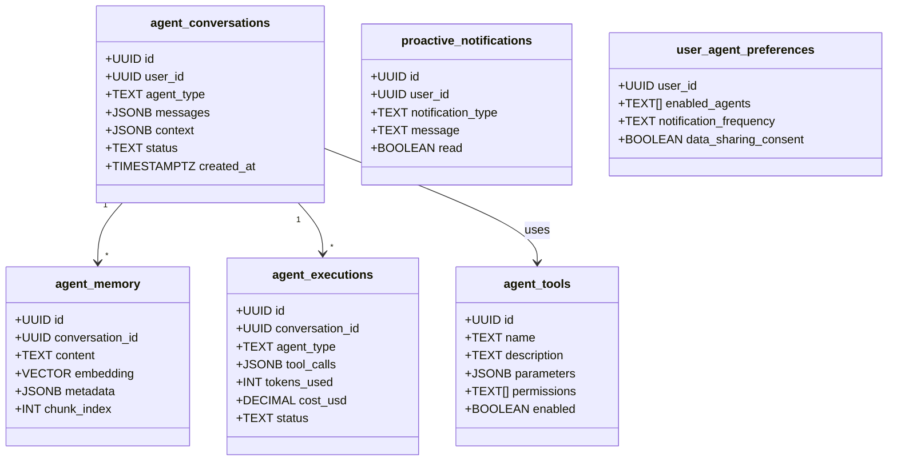

# [Backend] Extend Supabase Schema for Agent System

# Extend Supabase Schema for Agent System

## Overview
Extend the existing Supabase database schema to support the agent system with tables for conversations, memory, tools, executions, feedback, and analytics.

## Context
The agent system requires dedicated tables to store conversation history, RAG embeddings, tool metadata, execution logs, and user feedback. All tables must have RLS policies for HIPAA compliance.
  
## Architecture Diagram
  


## Acceptance Criteria

### 1. Core Agent Tables
- [ ] Create `agent_conversations` table with RLS policies
- [ ] Create `agent_memory` table with pgvector support
- [ ] Create `agent_tools` table for tool registry
- [ ] Create `agent_executions` table for logging
- [ ] Create `agent_feedback` table for user feedback
- [ ] Create `agent_analytics` table for metrics

### 2. Notification System
- [ ] Create `proactive_notifications` table
- [ ] Add indexes for efficient querying
- [ ] Implement RLS policies
- [ ] Setup Realtime subscriptions
- [ ] Add cleanup policies (delete old notifications)

### 3. User Preferences
- [ ] Create `user_agent_preferences` table
- [ ] Set default preferences
- [ ] Implement RLS policies
- [ ] Add validation constraints
- [ ] Create migration for existing users

### 4. Indexes & Performance
- [ ] Add indexes on foreign keys
- [ ] Add indexes on frequently queried columns
- [ ] Create composite indexes for complex queries
- [ ] Setup HNSW index for vector search
- [ ] Analyze query performance

### 5. RLS Policies
- [ ] Implement user-level isolation
- [ ] Prevent cross-user data access
- [ ] Allow service role bypass (for agents)
- [ ] Test all policies thoroughly
- [ ] Document policy logic

## Technical Details

**Files to Create:**
- `file:mobile/supabase/migrations/020_agent_conversations.sql`
- `file:mobile/supabase/migrations/021_agent_memory.sql`
- `file:mobile/supabase/migrations/022_agent_tools.sql`
- `file:mobile/supabase/migrations/023_agent_executions.sql`
- `file:mobile/supabase/migrations/024_agent_feedback.sql`
- `file:mobile/supabase/migrations/025_proactive_notifications.sql`
- `file:mobile/supabase/migrations/026_user_agent_preferences.sql`

**Migration Example:**
```sql
-- Enable pgvector
CREATE EXTENSION IF NOT EXISTS vector;

-- Create agent_conversations table
CREATE TABLE agent_conversations (
  id UUID PRIMARY KEY DEFAULT uuid_generate_v4(),
  user_id UUID REFERENCES auth.users(id) NOT NULL,
  agent_type TEXT NOT NULL,
  messages JSONB NOT NULL DEFAULT '[]',
  context JSONB DEFAULT '{}',
  status TEXT DEFAULT 'active',
  created_at TIMESTAMPTZ DEFAULT NOW(),
  updated_at TIMESTAMPTZ DEFAULT NOW()
);

-- Add RLS
ALTER TABLE agent_conversations ENABLE ROW LEVEL SECURITY;

CREATE POLICY "Users can view own conversations"
  ON agent_conversations FOR SELECT
  USING (auth.uid() = user_id);
```

## Testing
- [ ] Test table creation (run migrations)
- [ ] Test RLS policies (verify isolation)
- [ ] Test indexes (query performance)
- [ ] Test vector search (pgvector)
- [ ] Load test (1000+ concurrent users)

## Success Metrics
- Migration success rate 100%
- RLS policy coverage 100%
- Query performance < 100ms (p95)
- Zero cross-user data leaks

## Dependencies
- Supabase project setup
- pgvector extension
  
## Related Specifications
  
- spec:d969320e-d519-47a7-a258-e04789b8ce0e/68139c2e-3473-476b-9d20-8a0f7891ae48 - Backend & Integration Architecture
- spec:d969320e-d519-47a7-a258-e04789b8ce0e/7dd2bb11-e4c8-4b8d-9f0b-26a8472f3353 - Agentic AI Architecture
- spec:d969320e-d519-47a7-a258-e04789b8ce0e/51f8a991-4bf2-4282-98c1-e8d8b4e3d7ee - HIPAA Compliance & Healthcare AI Governance

---

## 📋 DETAILED IMPLEMENTATION [WAVE 1]

**Source:** Wave 1 Implementation Ticket (ticket:d969320e-d519-47a7-a258-e04789b8ce0e/0e0f731a-3cf3-4dcf-830e-bf6cb48d07f7)

### 🔧 Complete Migration Files

This ticket requires creating 8 migration files (026-033) in `file:mobile/supabase/migrations/`:

#### Migration 026: Enable pgvector
```sql
CREATE EXTENSION IF NOT EXISTS vector;
SELECT * FROM pg_extension WHERE extname = 'vector';
```

#### Migration 027: agent_conversations table
```sql
CREATE TABLE agent_conversations (
  id UUID PRIMARY KEY DEFAULT gen_random_uuid(),
  user_id UUID NOT NULL REFERENCES auth.users(id) ON DELETE CASCADE,
  agent_type TEXT NOT NULL CHECK (agent_type IN ('booking', 'session', 'insights', 'followup', 'general')),
  messages JSONB NOT NULL DEFAULT '[]',
  context JSONB DEFAULT '{}',
  status TEXT DEFAULT 'active' CHECK (status IN ('active', 'completed', 'escalated', 'failed')),
  metadata JSONB DEFAULT '{}',
  created_at TIMESTAMPTZ DEFAULT NOW(),
  updated_at TIMESTAMPTZ DEFAULT NOW()
);

CREATE INDEX idx_agent_conversations_user ON agent_conversations(user_id);
CREATE INDEX idx_agent_conversations_status ON agent_conversations(status);
CREATE INDEX idx_agent_conversations_created ON agent_conversations(created_at DESC);
CREATE INDEX idx_agent_conversations_agent_type ON agent_conversations(agent_type);

ALTER TABLE agent_conversations ENABLE ROW LEVEL SECURITY;

CREATE POLICY "Users can view own conversations"
  ON agent_conversations FOR SELECT USING (auth.uid() = user_id);

CREATE POLICY "Users can create own conversations"
  ON agent_conversations FOR INSERT WITH CHECK (auth.uid() = user_id);

CREATE POLICY "Users can update own conversations"
  ON agent_conversations FOR UPDATE USING (auth.uid() = user_id);

CREATE TRIGGER update_agent_conversations_updated_at
  BEFORE UPDATE ON agent_conversations
  FOR EACH ROW EXECUTE FUNCTION update_updated_at_column();
```

#### Migration 028: agent_memory table (RAG with pgvector)
```sql
CREATE TABLE agent_memory (
  id UUID PRIMARY KEY DEFAULT gen_random_uuid(),
  conversation_id UUID REFERENCES agent_conversations(id) ON DELETE CASCADE,
  content TEXT NOT NULL,
  embedding VECTOR(1536),
  metadata JSONB DEFAULT '{}',
  document_id UUID,
  chunk_index INT,
  created_at TIMESTAMPTZ DEFAULT NOW()
);

CREATE INDEX ON agent_memory USING hnsw (embedding vector_cosine_ops);
CREATE INDEX idx_agent_memory_conversation ON agent_memory(conversation_id);
CREATE INDEX idx_agent_memory_document ON agent_memory(document_id);
CREATE INDEX idx_agent_memory_created ON agent_memory(created_at DESC);

ALTER TABLE agent_memory ENABLE ROW LEVEL SECURITY;

CREATE POLICY "Users can view own memory"
  ON agent_memory FOR SELECT
  USING (EXISTS (
    SELECT 1 FROM agent_conversations
    WHERE id = agent_memory.conversation_id AND user_id = auth.uid()
  ));

CREATE OR REPLACE FUNCTION match_documents(
  query_embedding VECTOR(1536),
  match_count INT DEFAULT 5,
  filter JSONB DEFAULT '{}'
)
RETURNS TABLE (id UUID, content TEXT, metadata JSONB, similarity FLOAT)
LANGUAGE plpgsql AS $$
BEGIN
  RETURN QUERY
  SELECT agent_memory.id, agent_memory.content, agent_memory.metadata,
    1 - (agent_memory.embedding <=> query_embedding) AS similarity
  FROM agent_memory
  WHERE agent_memory.metadata @> filter
  ORDER BY agent_memory.embedding <=> query_embedding
  LIMIT match_count;
END; $$;
```

#### Migration 029: agent_tools registry
```sql
CREATE TABLE agent_tools (
  id UUID PRIMARY KEY DEFAULT gen_random_uuid(),
  name TEXT UNIQUE NOT NULL,
  description TEXT NOT NULL,
  parameters JSONB NOT NULL,
  permissions TEXT[] DEFAULT '{}',
  rate_limit JSONB DEFAULT '{"calls": 100, "window": "1h"}',
  enabled BOOLEAN DEFAULT true,
  version TEXT DEFAULT '1.0.0',
  created_at TIMESTAMPTZ DEFAULT NOW(),
  updated_at TIMESTAMPTZ DEFAULT NOW()
);

CREATE INDEX idx_agent_tools_name ON agent_tools(name);
CREATE INDEX idx_agent_tools_enabled ON agent_tools(enabled);
```

#### Migration 030: agent_executions log
```sql
CREATE TABLE agent_executions (
  id UUID PRIMARY KEY DEFAULT gen_random_uuid(),
  conversation_id UUID REFERENCES agent_conversations(id) ON DELETE CASCADE,
  agent_type TEXT NOT NULL,
  tool_calls JSONB DEFAULT '[]',
  tokens_used INT DEFAULT 0,
  cost_usd DECIMAL(10, 4) DEFAULT 0,
  duration_ms INT,
  status TEXT DEFAULT 'success' CHECK (status IN ('success', 'failed', 'timeout')),
  error TEXT,
  metadata JSONB DEFAULT '{}',
  created_at TIMESTAMPTZ DEFAULT NOW()
);

CREATE INDEX idx_agent_executions_conversation ON agent_executions(conversation_id);
CREATE INDEX idx_agent_executions_created ON agent_executions(created_at DESC);
CREATE INDEX idx_agent_executions_status ON agent_executions(status);
CREATE INDEX idx_agent_executions_agent_type ON agent_executions(agent_type);

ALTER TABLE agent_executions ENABLE ROW LEVEL SECURITY;

CREATE POLICY "Users can view own executions"
  ON agent_executions FOR SELECT
  USING (EXISTS (
    SELECT 1 FROM agent_conversations
    WHERE id = agent_executions.conversation_id AND user_id = auth.uid()
  ));
```

#### Migration 031: proactive_notifications
```sql
CREATE TABLE proactive_notifications (
  id UUID PRIMARY KEY DEFAULT gen_random_uuid(),
  user_id UUID NOT NULL REFERENCES auth.users(id) ON DELETE CASCADE,
  agent_type TEXT NOT NULL,
  notification_type TEXT NOT NULL CHECK (notification_type IN ('session_prep', 'insight', 'alert', 'followup')),
  title TEXT NOT NULL,
  message TEXT NOT NULL,
  action JSONB,
  priority TEXT DEFAULT 'normal' CHECK (priority IN ('low', 'normal', 'high', 'urgent')),
  read BOOLEAN DEFAULT false,
  created_at TIMESTAMPTZ DEFAULT NOW()
);

CREATE INDEX idx_proactive_notifications_user ON proactive_notifications(user_id);
CREATE INDEX idx_proactive_notifications_read ON proactive_notifications(read);
CREATE INDEX idx_proactive_notifications_created ON proactive_notifications(created_at DESC);
CREATE INDEX idx_proactive_notifications_type ON proactive_notifications(notification_type);

ALTER TABLE proactive_notifications ENABLE ROW LEVEL SECURITY;

CREATE POLICY "Users can view own notifications"
  ON proactive_notifications FOR SELECT USING (auth.uid() = user_id);

CREATE POLICY "Users can update own notifications"
  ON proactive_notifications FOR UPDATE USING (auth.uid() = user_id);
```

#### Migration 032: user_agent_preferences
```sql
CREATE TABLE user_agent_preferences (
  user_id UUID PRIMARY KEY REFERENCES auth.users(id) ON DELETE CASCADE,
  enabled_agents TEXT[] DEFAULT ARRAY['booking', 'session', 'insights', 'followup'],
  notification_frequency TEXT DEFAULT 'normal' CHECK (notification_frequency IN ('minimal', 'reduced', 'normal')),
  quiet_hours JSONB DEFAULT '{"start": "22:00", "end": "08:00"}',
  data_sharing_consent BOOLEAN DEFAULT true,
  transparency_level TEXT DEFAULT 'detailed' CHECK (transparency_level IN ('simple', 'detailed', 'technical')),
  classic_mode BOOLEAN DEFAULT false,
  onboarding_completed BOOLEAN DEFAULT false,
  language_preference TEXT DEFAULT 'en' CHECK (language_preference IN ('en', 'hi', 'hinglish')),
  created_at TIMESTAMPTZ DEFAULT NOW(),
  updated_at TIMESTAMPTZ DEFAULT NOW()
);

ALTER TABLE user_agent_preferences ENABLE ROW LEVEL SECURITY;

CREATE POLICY "Users can manage own preferences"
  ON user_agent_preferences FOR ALL USING (auth.uid() = user_id);

CREATE OR REPLACE FUNCTION create_default_agent_preferences()
RETURNS TRIGGER AS $$
BEGIN
  INSERT INTO user_agent_preferences (user_id) VALUES (NEW.id)
  ON CONFLICT (user_id) DO NOTHING;
  RETURN NEW;
END; $$ LANGUAGE plpgsql SECURITY DEFINER;

CREATE TRIGGER on_auth_user_created_agent_prefs
  AFTER INSERT ON auth.users
  FOR EACH ROW EXECUTE FUNCTION create_default_agent_preferences();
```

#### Migration 033: feature_flags
```sql
CREATE TABLE feature_flags (
  id UUID PRIMARY KEY DEFAULT gen_random_uuid(),
  name TEXT UNIQUE NOT NULL,
  description TEXT,
  enabled BOOLEAN DEFAULT false,
  rollout_percentage INT DEFAULT 0 CHECK (rollout_percentage >= 0 AND rollout_percentage <= 100),
  target_users UUID[] DEFAULT '{}',
  metadata JSONB DEFAULT '{}',
  created_at TIMESTAMPTZ DEFAULT NOW(),
  updated_at TIMESTAMPTZ DEFAULT NOW()
);

CREATE INDEX idx_feature_flags_name ON feature_flags(name);
CREATE INDEX idx_feature_flags_enabled ON feature_flags(enabled);

INSERT INTO feature_flags (name, description, enabled, rollout_percentage) VALUES
('ai_alpha_users', 'Alpha rollout (10% users)', false, 10),
('ai_beta_users', 'Beta rollout (50% users)', false, 50),
('ai_ga_enabled', 'General availability (100% users)', false, 100),
('booking_agent_enabled', 'Enable BookingAgent', false, 0),
('session_agent_enabled', 'Enable SessionAgent', false, 0),
('insights_agent_enabled', 'Enable InsightsAgent', false, 0),
('followup_agent_enabled', 'Enable FollowupAgent', false, 0);

CREATE OR REPLACE FUNCTION is_feature_enabled(flag_name TEXT, check_user_id UUID)
RETURNS BOOLEAN AS $$
DECLARE
  flag_record RECORD;
  user_hash INT;
BEGIN
  SELECT * INTO flag_record FROM feature_flags WHERE name = flag_name;
  IF NOT FOUND OR NOT flag_record.enabled THEN RETURN FALSE; END IF;
  IF check_user_id = ANY(flag_record.target_users) THEN RETURN TRUE; END IF;
  IF flag_record.rollout_percentage >= 100 THEN RETURN TRUE; END IF;
  IF flag_record.rollout_percentage <= 0 THEN RETURN FALSE; END IF;
  user_hash := ('x' || substr(md5(check_user_id::text), 1, 8))::bit(32)::int;
  RETURN (abs(user_hash) % 100) < flag_record.rollout_percentage;
END; $$ LANGUAGE plpgsql SECURITY DEFINER;
```

### 🚀 Deployment Steps

1. **Create migration files:**
```bash
cd mobile/supabase
supabase migration new 026_enable_pgvector
supabase migration new 027_agent_conversations
supabase migration new 028_agent_memory
supabase migration new 029_agent_tools
supabase migration new 030_agent_executions
supabase migration new 031_proactive_notifications
supabase migration new 032_user_agent_preferences
supabase migration new 033_feature_flags
```

2. **Copy SQL into each file**

3. **Apply migrations:**
```bash
supabase db push
```

4. **Verify:**
```bash
supabase db diff
```

### ✅ Testing Commands

```bash
# Verify tables created
psql -h localhost -p 54322 -U postgres -d postgres -c "\dt agent_*"

# Test RLS policies
psql -c "SELECT * FROM agent_conversations WHERE user_id = 'test-uuid';"

# Test feature flag function
psql -c "SELECT is_feature_enabled('ai_alpha_users', 'test-uuid');"

# Test vector search
psql -c "SELECT * FROM match_documents('[0.1, 0.2, ...]'::vector(1536), 5);"
```

### 📊 Success Criteria Verification

- ✅ All 8 tables created successfully
- ✅ RLS policies active on all tables
- ✅ HNSW index created for vector search
- ✅ Feature flag function working
- ✅ Default preferences trigger working
- ✅ Zero cross-user data leaks (test with different user IDs)

**Related Tickets:**
- ticket:d969320e-d519-47a7-a258-e04789b8ce0e/31fff4b4-78dc-43c0-ad41-f04770463328 (LangGraph - depends on this)
- ticket:d969320e-d519-47a7-a258-e04789b8ce0e/a6400730-500c-4ebd-87cc-2b405b330419 (RAG - depends on agent_memory)

**Wave Progress:** 1/49 tickets updated (2%)

