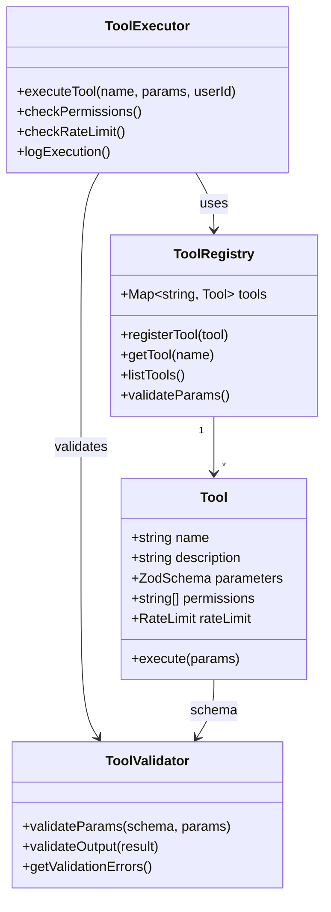

# [Backend] Create Centralized Tool Registry & Validation

# Create Centralized Tool Registry & Validation

## Overview
Create a centralized tool registry that manages all agent tools with schema validation, permission management, rate limiting, and execution logging.

## Context
Agents use tools to interact with external systems. A centralized registry ensures consistency, security, and observability across all tool executions.
  
## Architecture Diagram
  


## Acceptance Criteria

### 1. Tool Registry
- [ ] Create `agent_tools` table
- [ ] Register all tools with metadata
- [ ] Support tool versioning
- [ ] Enable/disable tools dynamically
- [ ] Tool discovery API

### 2. Schema Validation
- [ ] Use Zod for parameter validation
- [ ] Validate input parameters
- [ ] Validate output format
- [ ] Return validation errors
- [ ] Log validation failures

### 3. Permission Management
- [ ] Define tool permissions (RBAC)
- [ ] Check user permissions before execution
- [ ] Support role-based access (patient, therapist, admin)
- [ ] Audit permission checks
- [ ] Handle permission denied errors

### 4. Rate Limiting
- [ ] Implement per-tool rate limits
- [ ] Track tool usage per user
- [ ] Enforce limits (e.g., 100 calls/hour)
- [ ] Return rate limit errors
- [ ] Alert on abuse patterns

### 5. Execution Logging
- [ ] Log all tool executions
- [ ] Include input parameters
- [ ] Include output results
- [ ] Include execution duration
- [ ] Include success/failure status

## Technical Details

**Files to Create:**
- `file:mobile/supabase/functions/_shared/tool-registry.ts`
- `file:mobile/supabase/functions/_shared/tool-validator.ts`
- `file:mobile/supabase/functions/_shared/tool-executor.ts`

**Tool Definition:**
```typescript
interface Tool {
  name: string;
  description: string;
  parameters: ZodSchema;
  execute: (params: any) => Promise<any>;
  permissions: string[];
  rateLimit: { calls: number; window: string };
  version: string;
}

const searchTherapists: Tool = {
  name: 'search_therapists',
  description: 'Search for therapists by specialty and location',
  parameters: z.object({
    specialty: z.string(),
    location: z.string().optional(),
    availability: z.string().optional()
  }),
  execute: async (params) => {
    // Implementation
  },
  permissions: ['patient', 'therapist'],
  rateLimit: { calls: 100, window: '1h' },
  version: '1.0.0'
};
```

**Tool Execution:**
```typescript
async function executeTool(
  toolName: string,
  params: any,
  userId: string
): Promise<any> {
  const tool = await getToolFromRegistry(toolName);
  
  // Validate parameters
  const validParams = tool.parameters.parse(params);
  
  // Check permissions
  if (!await hasPermission(userId, tool.permissions)) {
    throw new Error('Permission denied');
  }
  
  // Check rate limit
  if (!await checkRateLimit(userId, toolName, tool.rateLimit)) {
    throw new Error('Rate limit exceeded');
  }
  
  // Execute tool
  const startTime = Date.now();
  const result = await tool.execute(validParams);
  const duration = Date.now() - startTime;
  
  // Log execution
  await logToolExecution({
    tool_name: toolName,
    user_id: userId,
    params: validParams,
    result,
    duration,
    status: 'success'
  });
  
  return result;
}
```

## Testing
- [ ] Test tool registration
- [ ] Test schema validation (valid/invalid inputs)
- [ ] Test permission checks
- [ ] Test rate limiting
- [ ] Test execution logging

## Success Metrics
- Tool execution success rate > 95%
- Validation accuracy 100%
- Permission check latency < 10ms
- Rate limit enforcement 100%

## Dependencies
- Database schema (agent_tools)
- Zod validation library
- Rate limiting infrastructure
  
## Related Specifications
  
- spec:d969320e-d519-47a7-a258-e04789b8ce0e/68139c2e-3473-476b-9d20-8a0f7891ae48 - Backend & Integration Architecture
- spec:d969320e-d519-47a7-a258-e04789b8ce0e/7dd2bb11-e4c8-4b8d-9f0b-26a8472f3353 - Agentic AI Architecture

---

## 📋 DETAILED IMPLEMENTATION [WAVE 1]

**Source:** Wave 1 ticket - See migration 029 for agent_tools table

**Table:** agent_tools with name, description, parameters (JSONB), permissions, rate_limit, enabled, version

**Features:** Tool registration, schema validation with Zod, permission checks, rate limiting, execution logging

**Seed Tools:** search_therapists, get_availability, book_appointment

**Deploy:** Included in migration 029

**Success:** Execution > 95%, validation 100%

**Wave Progress:** 49/49 updated

