# [Backend] Implement Monitoring & Observability with Rollbar

# Implement Monitoring & Observability with Rollbar

## Overview
Integrate Rollbar for comprehensive error tracking, monitoring, and alerting across Edge Functions, web app, and mobile app.

## Context
Production systems require robust monitoring to detect and resolve issues quickly. Rollbar provides error tracking with context, alerting, and analytics.
  
## Architecture Diagram

```mermaid
graph TD
    A[Edge Functions] -->|Errors| B[Rollbar Client]
    C[Web App] -->|Errors| B
    D[Mobile App] -->|Errors| B
      
    B -->|PII Masking| E[Sanitized Errors]
    E -->|Send| F[Rollbar API]
      
    F --> G[Error Grouping]
    G --> H[Error Dashboard]
      
    F --> I{Alert Rules}
    I -->|Critical| J[PagerDuty]
    I -->|High Rate| K[Slack]
    I -->|New Error| L[Email]
      
    H --> M[Analytics]
    M --> N[MTTR Metrics]
    M --> O[Error Trends]
```
  


## Acceptance Criteria

### 1. Rollbar Setup
- [ ] Create Rollbar account and projects
- [ ] Configure for Edge Functions (Deno)
- [ ] Configure for web app (Next.js)
- [ ] Configure for mobile app (React Native)
- [ ] Store access tokens securely

### 2. Error Tracking
- [ ] Capture uncaught exceptions
- [ ] Capture unhandled promise rejections
- [ ] Capture manual error reports
- [ ] Include stack traces
- [ ] Include user context (ID, role)

### 3. Context Enrichment
- [ ] Add request context (URL, method, headers)
- [ ] Add user context (ID, email, role)
- [ ] Add custom metadata (agent type, conversation ID)
- [ ] Add environment info (version, deployment)
- [ ] Add performance metrics (duration, memory)

### 4. Error Grouping
- [ ] Group by error type
- [ ] Group by function name
- [ ] Group by user ID (for debugging)
- [ ] Group by environment
- [ ] Custom grouping rules

### 5. Alerting
- [ ] Critical errors → PagerDuty
- [ ] High error rate → Slack
- [ ] New error types → Email
- [ ] Configure alert thresholds
- [ ] Test alert delivery

## Technical Details

**Files to Create:**
- `file:mobile/supabase/functions/_shared/rollbar-client.ts`
- `file:web/lib/rollbar.ts`
- `file:mobile/src/services/rollbar.ts`

**Edge Functions Integration:**
```typescript
import Rollbar from 'rollbar';

const rollbar = new Rollbar({
  accessToken: Deno.env.get('ROLLBAR_ACCESS_TOKEN'),
  environment: Deno.env.get('ENVIRONMENT'),
  captureUncaught: true,
  captureUnhandledRejections: true
});

Deno.serve(async (req) => {
  try {
    // Handler logic
  } catch (error) {
    rollbar.error(error, {
      request: {
        url: req.url,
        method: req.method
      },
      custom: {
        userId: getUserId(req),
        conversationId: getConversationId(req)
      }
    });
    throw error;
  }
});
```

**Web App Integration:**
```typescript
import Rollbar from 'rollbar';

export const rollbar = new Rollbar({
  accessToken: process.env.NEXT_PUBLIC_ROLLBAR_ACCESS_TOKEN,
  environment: process.env.NODE_ENV,
  captureUncaught: true,
  captureUnhandledRejections: true,
  payload: {
    client: {
      javascript: {
        code_version: process.env.NEXT_PUBLIC_VERSION,
        source_map_enabled: true
      }
    }
  }
});
```

## Testing
- [ ] Test error capture (throw test errors)
- [ ] Test context enrichment (verify data)
- [ ] Test error grouping (verify rules)
- [ ] Test alerting (trigger alerts)
- [ ] Test source maps (verify stack traces)

## Success Metrics
- Error capture rate 100%
- Alert delivery < 1 minute
- False positive rate < 5%
- Mean time to resolution < 2 hours

## Dependencies
- Rollbar account
- Environment variables
- PII masking (for compliance)
  
## Related Specifications
  
- spec:d969320e-d519-47a7-a258-e04789b8ce0e/68139c2e-3473-476b-9d20-8a0f7891ae48 - Backend & Integration Architecture
- spec:d969320e-d519-47a7-a258-e04789b8ce0e/51f8a991-4bf2-4282-98c1-e8d8b4e3d7ee - HIPAA Compliance & Healthcare AI Governance

---

## 📋 DETAILED IMPLEMENTATION [WAVE 1]

**Source:** Wave 1 ticket - Rollbar integration already implemented

**Files:** `mobile/supabase/functions/_shared/rollbar.ts`, `web/lib/rollbar.ts`, `mobile/src/services/rollbar.ts`

**Features:** Error tracking, context enrichment, alerting, PII masking integration

**Setup:** Configure ROLLBAR_ACCESS_TOKEN in environment

**Success:** Capture 100%, alert < 1min

**Wave Progress:** 47/49 updated

