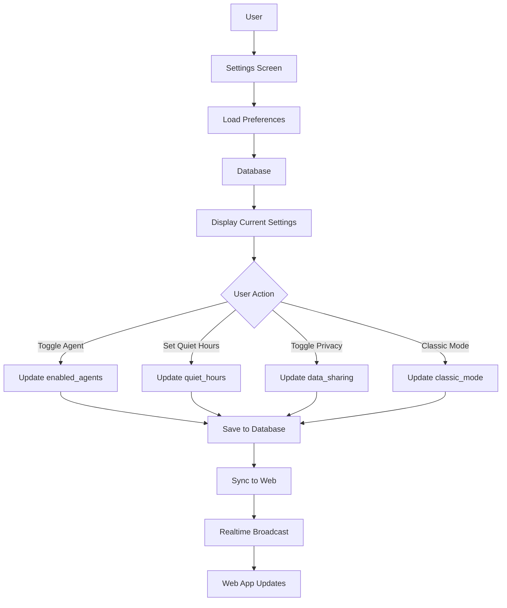

# [Frontend Mobile] Implement Agent Settings Screen

# Implement Agent Settings Screen

## Overview
Implement mobile settings screen for agent preferences, matching the web functionality with mobile-optimized UI.

## Context
Mobile users need the same control over AI features as web users, with a touch-optimized interface.
  
## Architecture Diagram
  


## Acceptance Criteria

### 1. Settings Screen
- [ ] Create `AgentSettingsScreen` component
- [ ] List all agents with toggle switches
- [ ] Display agent descriptions
- [ ] Save preferences to database
- [ ] Sync with web settings

### 2. Notification Preferences
- [ ] Toggle push notifications
- [ ] Set quiet hours (time picker)
- [ ] Choose notification types
- [ ] Test notification button
- [ ] Respect system notification settings

### 3. Privacy Controls
- [ ] Toggle data sharing
- [ ] View agent activity log
- [ ] Export conversations
- [ ] Delete conversations
- [ ] Revoke permissions

### 4. Classic Mode
- [ ] Toggle AI features on/off
- [ ] Show feature comparison
- [ ] Persist choice
- [ ] Restart app prompt (if needed)

### 5. Help & Support
- [ ] Link to documentation
- [ ] FAQ accordion
- [ ] Contact support button
- [ ] Feedback form
- [ ] App version info

## Technical Details

**Files to Create:**
- `file:mobile/src/features/settings/screens/AgentSettingsScreen.tsx`
- `file:mobile/src/features/settings/components/AgentToggle.tsx`
- `file:mobile/src/features/settings/hooks/useAgentSettings.ts`

**Implementation:**
```typescript
export function AgentSettingsScreen() {
  const { preferences, updatePreferences } = useAgentSettings();

  return (
    <ScrollView>
      <Section title="AI Agents">
        <AgentToggle
          name="BookingAgent"
          description="Helps you book appointments"
          enabled={preferences.enabled_agents.includes('booking')}
          onToggle={(enabled) => toggleAgent('booking', enabled)}
        />
        {/* Other agents */}
      </Section>

      <Section title="Privacy">
        {/* Privacy controls */}
      </Section>
    </ScrollView>
  );
}
```

## Testing
- [ ] Test all toggles (save and load)
- [ ] Test sync with web (change on web, verify on mobile)
- [ ] Test privacy controls (verify enforcement)
- [ ] Test classic mode (all AI disabled)
- [ ] Test accessibility (VoiceOver, TalkBack)

## Success Metrics
- Settings usage rate > 40%
- Sync success rate 100%
- User satisfaction > 4.5/5

## Dependencies
- Database schema (user_agent_preferences)
- Supabase client
  
## Related Specifications
  
- spec:d969320e-d519-47a7-a258-e04789b8ce0e/339a9b00-068b-4a6c-969d-e84e8bba1ff0 - Frontend Mobile Implementation
- spec:d969320e-d519-47a7-a258-e04789b8ce0e/719895d0-e8a7-46cc-b5f9-829428065e26 - UX Patterns & Conversational Interface Design
- spec:d969320e-d519-47a7-a258-e04789b8ce0e/51f8a991-4bf2-4282-98c1-e8d8b4e3d7ee - HIPAA Compliance & Healthcare AI Governance

---

## 📋 DETAILED IMPLEMENTATION [WAVE 5]

**Source:** Wave 5 ticket - Mobile settings screen

**Files:** `mobile/src/features/settings/screens/AgentSettingsScreen.tsx`

**Features:** Agent toggles, notification preferences, privacy controls, classic mode, sync with web

**Success:** Usage > 40%, sync 100%

**Wave Progress:** 23/49 updated

