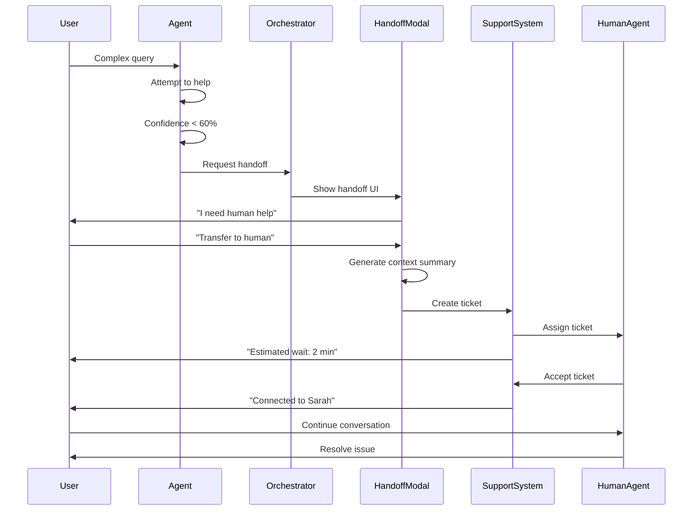

# [UX] Implement Human Handoff Interface & Escalation Flow

# Implement Human Handoff Interface & Escalation Flow

## Overview
Implement the human handoff interface that allows seamless escalation from AI agents to human support with full context transfer.

## Context
When agents reach their limits, users need a smooth path to human support. The handoff interface ensures no context is lost and users feel supported.
  
## Architecture Diagram
  


## Acceptance Criteria

### 1. Escalation Triggers
- [ ] Agent detects inability to help (low confidence < 60%)
- [ ] User explicitly requests human ("Talk to a person")
- [ ] High-risk situation (crisis detected)
- [ ] Complex issue (multiple failed attempts)
- [ ] Timeout (conversation > 10 minutes)

### 2. Handoff Modal (Web)
- [ ] Display handoff modal with context summary
- [ ] Show conversation history (last 5 messages)
- [ ] Show attempted actions (tools used)
- [ ] Show user information (ID, role)
- [ ] Primary CTA: "Transfer to Human"
- [ ] Secondary CTA: "Continue with AI"

### 3. Handoff Screen (Mobile)
- [ ] Full-screen handoff view
- [ ] Context summary (scrollable)
- [ ] Transfer button (prominent)
- [ ] Continue button (secondary)
- [ ] Back button (return to chat)

### 4. Context Transfer
- [ ] Generate context summary (LLM-powered)
- [ ] Include conversation history
- [ ] Include user profile
- [ ] Include attempted actions
- [ ] Include relevant data (session ID, patient ID)
- [ ] Send to support system (Intercom/Zendesk)

### 5. Support Integration
- [ ] Integrate with Intercom (or similar)
- [ ] Create support ticket with context
- [ ] Assign to available agent
- [ ] Notify user of estimated wait time
- [ ] Track handoff success rate

## Technical Details

**Files to Create:**
- `file:web/components/ai/handoff-modal.tsx`
- `file:mobile/src/features/ai/screens/HandoffScreen.tsx`
- `file:mobile/supabase/functions/agent-orchestrator/handoff-handler.ts`

**Implementation:**
```typescript
export function HandoffModal({ conversation }: { conversation: Conversation }) {
  const [isTransferring, setIsTransferring] = useState(false);

  const handleTransfer = async () => {
    setIsTransferring(true);

    // Generate context summary
    const summary = await generateContextSummary(conversation);

    // Create support ticket
    await createSupportTicket({
      user_id: conversation.user_id,
      subject: 'AI Agent Handoff',
      description: summary,
      priority: 'high',
      metadata: {
        conversation_id: conversation.id,
        agent_type: conversation.agent_type,
      },
    });

    toast.success('Transferred to human support. Estimated wait: 2 minutes');
  };

  return (
    <Modal>
      <h2>Transfer to Human Support</h2>
      <p>I've reached the limit of what I can help with...</p>
      <ContextSummary conversation={conversation} />
      <Button onClick={handleTransfer}>Transfer to Human</Button>
    </Modal>
  );
}
```

## Testing
- [ ] Test escalation triggers (all scenarios)
- [ ] Test context summary (accuracy)
- [ ] Test support ticket creation (verify data)
- [ ] Test user notification (delivery)
- [ ] E2E test (full handoff flow)

## Success Metrics
- Handoff success rate > 95%
- Context accuracy > 90% (support agent feedback)
- User satisfaction after handoff > 4.0/5
- Average wait time < 5 minutes

## Dependencies
- Orchestrator setup
- Support system integration (Intercom)
  
## Related Specifications
  
- spec:d969320e-d519-47a7-a258-e04789b8ce0e/719895d0-e8a7-46cc-b5f9-829428065e26 - UX Patterns & Conversational Interface Design
- spec:d969320e-d519-47a7-a258-e04789b8ce0e/7dd2bb11-e4c8-4b8d-9f0b-26a8472f3353 - Agentic AI Architecture

---

## 📋 DETAILED IMPLEMENTATION [WAVE 7]

**Source:** Wave 7 ticket - Human handoff interface

**Features:** Escalation triggers, handoff modal, context transfer, support integration

**Files:** `web/components/ai/handoff-modal.tsx`, `mobile/src/features/ai/screens/HandoffScreen.tsx`

**Success:** Handoff > 95%, context accuracy > 90%

**Wave Progress:** 35/49 updated

