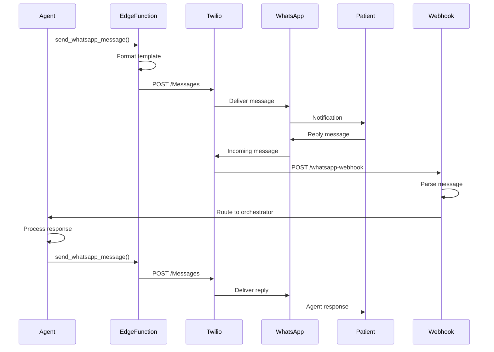

# [Backend] Implement WhatsApp Business API Integration

# Implement WhatsApp Business API Integration

## Overview
Integrate WhatsApp Business API (via Twilio) for sending appointment confirmations, reminders, follow-ups, and receiving patient replies.

## Context
WhatsApp is the primary communication channel in India. This integration enables proactive engagement and improves patient communication.
  
## Architecture Diagram
  


## Acceptance Criteria

### 1. Twilio Setup
- [ ] Create Twilio account and WhatsApp sandbox
- [ ] Configure WhatsApp Business profile
- [ ] Setup webhook endpoint for incoming messages
- [ ] Store credentials in environment variables
- [ ] Test message sending

### 2. Message Templates
- [ ] Create appointment confirmation template
- [ ] Create session reminder template
- [ ] Create follow-up message template
- [ ] Create mood check-in template
- [ ] Get templates approved by WhatsApp

### 3. Sending Messages
- [ ] Implement `sendWhatsAppMessage` function
- [ ] Support template variables
- [ ] Handle rate limits (1 msg/user/hour)
- [ ] Queue messages for retry
- [ ] Log all sent messages

### 4. Receiving Messages
- [ ] Create webhook endpoint for incoming messages
- [ ] Parse WhatsApp message format
- [ ] Route to appropriate agent
- [ ] Handle media messages (images, audio)
- [ ] Store conversation history

### 5. Error Handling
- [ ] Handle invalid phone numbers
- [ ] Handle rate limit errors
- [ ] Handle template rejection
- [ ] Retry failed messages (3 attempts)
- [ ] Alert on persistent failures

## Technical Details

**Files to Create:**
- `file:mobile/supabase/functions/whatsapp-integration/send.ts`
- `file:mobile/supabase/functions/whatsapp-integration/webhook.ts`
- `file:mobile/supabase/functions/whatsapp-integration/templates.ts`

**Send Message Function:**
```typescript
async function sendWhatsAppMessage(
  to: string,
  template: string,
  variables: Record<string, string>
) {
  const client = twilio(accountSid, authToken);
  
  const message = await client.messages.create({
    from: `whatsapp:${twilioNumber}`,
    to: `whatsapp:${to}`,
    body: formatTemplate(template, variables)
  });
  
  await logMessage(message);
  return message;
}
```

**Webhook Handler:**
```typescript
async function handleIncomingMessage(req: Request) {
  const { From, Body, MediaUrl } = await req.formData();
  
  const phoneNumber = From.replace('whatsapp:', '');
  
  // Route to agent orchestrator
  await routeToAgent({
    userId: await getUserByPhone(phoneNumber),
    message: Body,
    media: MediaUrl
  });
  
  return new Response('OK', { status: 200 });
}
```

## Testing
- [ ] Test message sending (sandbox)
- [ ] Test template variables
- [ ] Test webhook receiving
- [ ] Test rate limiting
- [ ] Test error handling

## Success Metrics
- Message delivery rate > 95%
- Webhook processing < 500ms
- Reply rate > 40%
- Zero rate limit violations

## Dependencies
- Twilio account with WhatsApp
- Agent orchestrator
- Database schema (conversations)
  
## Related Specifications
  
- spec:d969320e-d519-47a7-a258-e04789b8ce0e/68139c2e-3473-476b-9d20-8a0f7891ae48 - Backend & Integration Architecture
- spec:d969320e-d519-47a7-a258-e04789b8ce0e/7dd2bb11-e4c8-4b8d-9f0b-26a8472f3353 - Agentic AI Architecture

