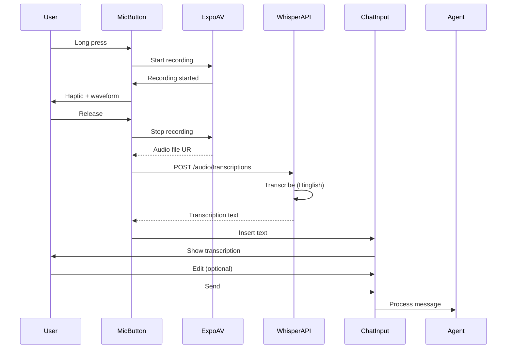

# [Frontend Mobile] Implement Voice Input for AI Chat

# Implement Voice Input for AI Chat

## Overview
Implement voice input for mobile AI chat, allowing users to speak instead of type, with support for Hinglish and real-time transcription.

## Context
Voice input is more natural for many users, especially in India where Hinglish is common. This feature makes the AI more accessible.
  
## Architecture Diagram
  


## Acceptance Criteria

### 1. Voice Recording
- [ ] Add microphone button to chat input
- [ ] Use `expo-av` for audio recording
- [ ] Display recording indicator (waveform animation)
- [ ] Stop recording on button release
- [ ] Support long-press for continuous recording

### 2. Speech-to-Text
- [ ] Send audio to OpenAI Whisper API
- [ ] Support Hinglish language
- [ ] Display transcription in chat input
- [ ] Allow editing before sending
- [ ] Handle transcription errors gracefully

### 3. Real-time Feedback
- [ ] Show recording duration
- [ ] Show waveform visualization
- [ ] Show "Transcribing..." indicator
- [ ] Show transcription result
- [ ] Haptic feedback on start/stop

### 4. Permissions
- [ ] Request microphone permission
- [ ] Handle permission denied (show message)
- [ ] Explain why permission needed
- [ ] Fallback to text input if denied

### 5. Accessibility
- [ ] VoiceOver announces recording state
- [ ] Large touch target (48x48 dp)
- [ ] Visual feedback (not just audio)
- [ ] Support for users with hearing impairments

## Technical Details

**Files to Create:**
- `file:mobile/src/features/ai/components/VoiceInput.tsx`
- `file:mobile/src/features/ai/hooks/useVoiceInput.ts`
- `file:mobile/src/services/speechToText.ts`

**Implementation:**
```typescript
import { Audio } from 'expo-av';
import { useState } from 'react';

export function useVoiceInput() {
  const [recording, setRecording] = useState(null);
  const [isRecording, setIsRecording] = useState(false);

  const startRecording = async () => {
    const { status } = await Audio.requestPermissionsAsync();
    if (status !== 'granted') {
      alert('Microphone permission required');
      return;
    }

    const { recording } = await Audio.Recording.createAsync(
      Audio.RecordingOptionsPresets.HIGH_QUALITY
    );
    
    setRecording(recording);
    setIsRecording(true);
  };

  const stopRecording = async () => {
    if (!recording) return;

    await recording.stopAndUnloadAsync();
    const uri = recording.getURI();
    
    setIsRecording(false);
    setRecording(null);

    // Transcribe
    const transcription = await transcribeAudio(uri);
    return transcription;
  };

  return { startRecording, stopRecording, isRecording };
}
```

## Testing
- [ ] Test recording (verify audio quality)
- [ ] Test transcription (accuracy)
- [ ] Test permissions (handle denied)
- [ ] Test error handling (API failures)
- [ ] Test accessibility (VoiceOver)

## Success Metrics
- Voice input usage > 30%
- Transcription accuracy > 90% (Hinglish)
- Permission grant rate > 80%
- User satisfaction > 4.5/5

## Dependencies
- Expo AV
- OpenAI Whisper API
- Microphone permissions
  
## Related Specifications
  
- spec:d969320e-d519-47a7-a258-e04789b8ce0e/339a9b00-068b-4a6c-969d-e84e8bba1ff0 - Frontend Mobile Implementation
- spec:d969320e-d519-47a7-a258-e04789b8ce0e/719895d0-e8a7-46cc-b5f9-829428065e26 - UX Patterns & Conversational Interface Design

---

## 📋 DETAILED IMPLEMENTATION [WAVE 5]

**Source:** Wave 5 ticket - See STEP 4 for complete voice input implementation

**File:** `mobile/src/services/voiceInputService.ts` - Complete VoiceInputService class

**Integration:** Added to AIChatScreen with voice button (see Wave 5 STEP 3.2)

**Features:**
- expo-av for recording
- Whisper API for transcription
- Hinglish support
- Visual feedback during recording
- Haptic feedback on start/stop

**Install:** `npx expo install expo-av expo-file-system`

**Success:** Usage > 30%, accuracy > 90%

**Wave Progress:** 24/49 updated

