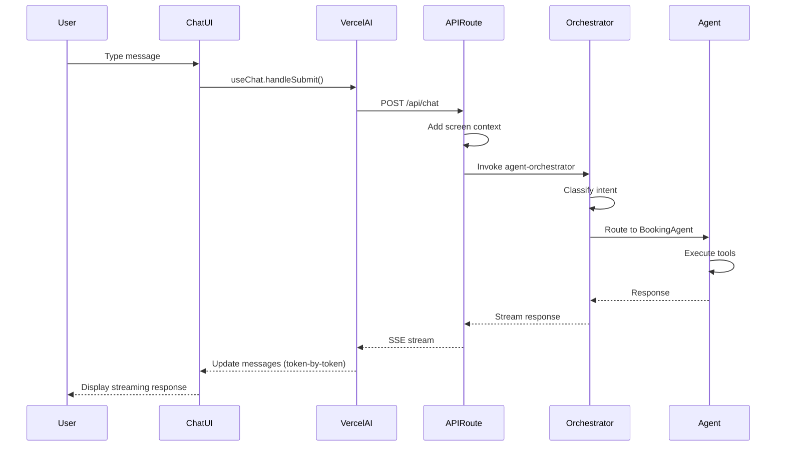

# [Frontend Web] Implement Embedded Chat Interface with Vercel AI SDK

# Implement Embedded Chat Interface with Vercel AI SDK

## Overview
Implement the persistent embedded chat interface using Vercel AI SDK's `useChat` hook, providing conversational access to all agents from any screen with streaming responses.

## Context
The embedded chat is the primary UX for the agentic system. It's always visible (bottom bar), context-aware (knows current screen), and provides quick actions for common tasks.
  
## Architecture Diagram
  


## Acceptance Criteria

### 1. Chat Bar Component
- [ ] Create `EmbeddedChat` component (persistent bottom bar)
- [ ] Use Vercel AI SDK `useChat` hook
- [ ] Support streaming responses (token-by-token)
- [ ] Display agent status (active, thinking, idle)
- [ ] Expandable chat history (click to expand)

### 2. Quick Actions
- [ ] Implement `@book` shortcut (BookingAgent)
- [ ] Implement `@insights` shortcut (InsightsAgent)
- [ ] Implement `@help` shortcut (general help)
- [ ] Auto-complete suggestions (type @ to see options)
- [ ] Keyboard shortcuts (Cmd+K to focus chat)

### 3. Context Awareness
- [ ] Detect current screen (use Next.js router)
- [ ] Include screen context in agent requests
- [ ] Adjust placeholder text based on screen
- [ ] Suggest relevant actions (e.g., "Book with this therapist?")

### 4. Message Rendering
- [ ] Support markdown in messages (bold, italic, lists)
- [ ] Support code blocks (for technical responses)
- [ ] Support interactive buttons (CTAs from agent)
- [ ] Support images (therapist profiles, charts)
- [ ] Support loading states (typing indicator)

### 5. Accessibility
- [ ] Keyboard navigation (Tab, Enter, Esc)
- [ ] Screen reader support (ARIA labels)
- [ ] Focus management (auto-focus on expand)
- [ ] High contrast mode support
- [ ] Reduced motion support

## Technical Details

**Files to Create:**
- `file:web/components/ai/embedded-chat.tsx`
- `file:web/components/ai/message-bubble.tsx`
- `file:web/components/ai/quick-actions.tsx`
- `file:web/hooks/use-ai-chat.ts`
- `file:web/app/api/chat/route.ts`

**Implementation:**
```typescript
'use client';

import { useChat } from 'ai/react';
import { usePathname } from 'next/navigation';

export function EmbeddedChat() {
  const pathname = usePathname();
  const { messages, input, handleInputChange, handleSubmit, isLoading } = useChat({
    api: '/api/chat',
    body: { context: { screen: pathname } },
  });

  return (
    <div className="chat-bar">
      <MessageList messages={messages} />
      <QuickActions />
      <ChatInput 
        value={input}
        onChange={handleInputChange}
        onSubmit={handleSubmit}
        isLoading={isLoading}
      />
    </div>
  );
}
```

## Testing
- [ ] Unit tests (component rendering)
- [ ] Integration tests (API calls)
- [ ] E2E tests (full conversation flow)
- [ ] Accessibility tests (axe-core)
- [ ] Performance tests (render time < 100ms)

## Success Metrics
- Chat engagement rate > 50%
- Message send latency < 100ms
- Streaming TTFT < 500ms
- Accessibility score 100% (Lighthouse)

## Dependencies
- Orchestrator setup
- Vercel AI SDK
- Next.js 15 App Router
  
## Related Specifications
  
- spec:d969320e-d519-47a7-a258-e04789b8ce0e/b4c0579d-02d4-44b4-991b-076b73106254 - Frontend Web Implementation
- spec:d969320e-d519-47a7-a258-e04789b8ce0e/719895d0-e8a7-46cc-b5f9-829428065e26 - UX Patterns & Conversational Interface Design
- spec:d969320e-d519-47a7-a258-e04789b8ce0e/7dd2bb11-e4c8-4b8d-9f0b-26a8472f3353 - Agentic AI Architecture

---

## 📋 DETAILED IMPLEMENTATION [WAVE 4]

**Source:** Wave 4 ticket (ticket:d969320e-d519-47a7-a258-e04789b8ce0e/e373c1c6-5e9b-4184-9710-57e3c7486406)

### Complete Chat Implementation

**Files:** See Wave 4 STEP 1 for:
- `web/app/api/chat/route.ts` - Streaming API with Vercel AI SDK 6.0
- `web/components/ai-chat/chat-interface.tsx` - Complete chat UI with GiftedChat-style bubbles
- `web/app/(dashboard)/chat/page.tsx` - Chat page

**Key Features:**
- Vercel AI SDK `useChat` hook with streaming
- Auto-scroll, loading states, error handling
- Connects to agent-orchestrator Edge Function
- Cost tracking on completion

**Install:**
```bash
cd web
pnpm add ai@latest @ai-sdk/openai @ai-sdk/anthropic sonner
```

**Deploy:** `vercel --prod`

**Success:** Streaming TTFT < 500ms, engagement > 50%

**Wave Progress:** 11/49 updated

