# GitHub Update Script - Sync Traycer Tickets to GitHub Issues

# GitHub Update Script - Sync Traycer Tickets to GitHub Issues

## Overview

Create a production-ready Node.js script that syncs all Traycer tickets from this Epic to GitHub Issues in the `swami086/Arthi_react_native` repository. The script must prevent duplicates, respect GitHub API rate limits, and provide detailed sync reports.

## Acceptance Criteria

- ✅ Script reads tickets from JSON file exported from Traycer
- ✅ Detects duplicates using `traycer-id` labels and title matching
- ✅ Creates new GitHub issues for new tickets
- ✅ Updates existing GitHub issues for modified tickets
- ✅ Respects GitHub API rate limits (5,000 requests/hour)
- ✅ Supports dry-run mode for testing without API calls
- ✅ Provides detailed sync report (created/updated/errors)
- ✅ Handles errors gracefully with retry logic
- ✅ Maps Traycer fields to GitHub issue fields correctly
- ✅ Adds tracking labels (`traycer-sync`, `traycer-id:{uuid}`)

## Architecture

```mermaid
sequenceDiagram
    participant User
    participant Script
    participant Traycer
    participant GitHub API
    
    User->>Script: Run with --tickets tickets.json
    Script->>Traycer: Load tickets.json
    Script->>GitHub API: Fetch existing issues (label: traycer-sync)
    GitHub API-->>Script: Return existing issues
    Script->>Script: Build issue map (traycer-id → issue#)
    
    loop For each ticket
        Script->>Script: Check if duplicate (by traycer-id or title)
        alt Duplicate found
            Script->>GitHub API: Update issue (PATCH)
            GitHub API-->>Script: Updated issue
        else New ticket
            Script->>GitHub API: Create issue (POST)
            GitHub API-->>Script: Created issue
        end
        Script->>Script: Add to results
        Script->>Script: Delay 200ms (rate limit)
    end
    
    Script->>User: Generate sync report
```



## Technical Implementation

### 1. Project Structure

```
github-sync/
├── package.json
├── github-sync.js       # Main CLI script
├── utils.js             # Helper functions
├── README.md            # Usage documentation
└── tickets.json         # Exported Traycer tickets (user provides)
```

### 2. Dependencies (package.json)

```json
{
  "name": "traycer-github-sync",
  "version": "1.0.0",
  "description": "Sync Traycer tickets to GitHub Issues",
  "main": "github-sync.js",
  "scripts": {
    "sync": "node github-sync.js",
    "dry-run": "node github-sync.js --dry-run"
  },
  "dependencies": {
    "@octokit/rest": "^20.0.0",
    "commander": "^12.0.0",
    "fs-extra": "^11.2.0"
  },
  "engines": {
    "node": ">=18.0.0"
  }
}
```

### 3. Main Script (github-sync.js)

```javascript
#!/usr/bin/env node

const { Command } = require('commander');
const { Octokit } = require('@octokit/rest');
const fs = require('fs-extra');
const { 
  loadTickets, 
  normalizeTitle, 
  generateIssueBody, 
  generateLabels, 
  delay 
} = require('./utils');

// ============================================
// CLI ARGUMENT PARSING
// ============================================

const program = new Command();
program
  .name('github-sync')
  .description('Sync Traycer tickets to GitHub Issues')
  .requiredOption('--token <token>', 'GitHub Personal Access Token')
  .requiredOption('--owner <owner>', 'GitHub repo owner (e.g., swami086)')
  .requiredOption('--repo <repo>', 'GitHub repo name (e.g., Arthi_react_native)')
  .requiredOption('--tickets <file>', 'Path to tickets.json file')
  .option('--dry-run', 'Dry run mode - no API calls', false)
  .option('--batch-size <size>', 'Batch size for processing', '10')
  .option('--delay <ms>', 'Delay between requests (ms)', '200')
  .parse();

const opts = program.opts();

// ============================================
// OCTOKIT INITIALIZATION
// ============================================

function initOctokit(token) {
  return new Octokit({ 
    auth: token,
    userAgent: 'traycer-github-sync/1.0.0',
    log: {
      debug: () => {},
      info: () => {},
      warn: console.warn,
      error: console.error
    }
  });
}

// ============================================
// FETCH EXISTING ISSUES
// ============================================

async function fetchExistingIssues(octokit, owner, repo, dryRun) {
  if (dryRun) {
    console.log('🔍 DRY-RUN: Skipping fetch of existing issues');
    return [];
  }
  
  console.log('🔍 Fetching existing Traycer issues from GitHub...');
  const issues = [];
  let page = 1;
  const perPage = 100;
  
  try {
    while (true) {
      const { data } = await octokit.rest.issues.listForRepo({
        owner, 
        repo, 
        state: 'all',
        labels: 'traycer-sync',
        per_page: perPage,
        page
      });
      
      if (data.length === 0) break;
      issues.push(...data);
      console.log(`  Fetched page ${page}: ${data.length} issues`);
      page++;
      
      // Rate limit check
      await handleRateLimit(octokit);
    }
    
    console.log(`✅ Fetched ${issues.length} existing Traycer issues\n`);
    return issues;
  } catch (error) {
    console.error('❌ Error fetching issues:', error.message);
    throw error;
  }
}

// ============================================
// BUILD ISSUE MAP
// ============================================

function buildIssueMap(issues) {
  const map = new Map();
  
  for (const issue of issues) {
    // Extract traycer-id from labels
    const traycerLabel = issue.labels.find(l => 
      typeof l === 'object' ? l.name.startsWith('traycer-id:') : l.startsWith('traycer-id:')
    );
    
    if (traycerLabel) {
      const labelName = typeof traycerLabel === 'object' ? traycerLabel.name : traycerLabel;
      const ticketId = labelName.split(':')[1];
      map.set(ticketId, issue.number);
    }
  }
  
  console.log(`📋 Built issue map: ${map.size} tickets already synced\n`);
  return map;
}

// ============================================
// DETECT DUPLICATE
// ============================================

function detectDuplicateByTitle(ticket, issues) {
  const normalizedTitle = normalizeTitle(ticket.title);
  
  for (const issue of issues) {
    if (normalizeTitle(issue.title) === normalizedTitle) {
      return issue.number;
    }
  }
  
  return null;
}

// ============================================
// RATE LIMIT HANDLING
// ============================================

async function handleRateLimit(octokit) {
  try {
    const { data } = await octokit.rest.rateLimit.get();
    const remaining = data.rate.remaining;
    const reset = new Date(data.rate.reset * 1000);
    
    if (remaining < 100) {
      const waitTime = Math.ceil((reset - new Date()) / 1000);
      console.warn(`⚠️  Low rate limit: ${remaining}/5000. Waiting ${waitTime}s until reset...`);
      await delay(waitTime * 1000);
    }
  } catch (error) {
    console.warn('⚠️  Could not check rate limit:', error.message);
  }
}

// ============================================
// SYNC SINGLE TICKET
// ============================================

async function syncSingleTicket(ticket, issueMap, issues, octokit, owner, repo, dryRun, delayMs) {
  const ticketId = ticket.id;
  
  // 1. Check traycer-id map (primary method)
  let issueNumber = issueMap.get(ticketId);
  
  // 2. Fallback: exact title match
  if (!issueNumber) {
    issueNumber = detectDuplicateByTitle(ticket, issues);
  }
  
  const body = generateIssueBody(ticket);
  const labels = generateLabels(ticket);
  
  if (dryRun) {
    const action = issueNumber ? `UPDATE #${issueNumber}` : 'CREATE NEW';
    console.log(`🔍 DRY-RUN: ${action} - ${ticket.title}`);
    return { 
      ticketId, 
      issueNumber, 
      action: issueNumber ? 'update' : 'create', 
      dryRun: true 
    };
  }
  
  try {
    if (issueNumber) {
      // UPDATE existing issue
      await octokit.rest.issues.update({
        owner, 
        repo, 
        issue_number: issueNumber,
        title: ticket.title,
        body,
        labels
      });
      console.log(`✅ UPDATED #${issueNumber}: ${ticket.title}`);
      return { ticketId, issueNumber, action: 'updated' };
      
    } else {
      // CREATE new issue
      const { data } = await octokit.rest.issues.create({
        owner, 
        repo,
        title: ticket.title,
        body,
        labels
      });
      console.log(`✅ CREATED #${data.number}: ${ticket.title}`);
      return { ticketId, issueNumber: data.number, action: 'created' };
    }
    
  } catch (error) {
    // Handle rate limiting with retry
    if (error.status === 429) {
      const retryAfter = error.response?.headers['retry-after'] || 60;
      console.log(`⏳ Rate limited. Waiting ${retryAfter}s...`);
      await delay(retryAfter * 1000);
      
      // Retry once
      return await syncSingleTicket(ticket, issueMap, issues, octokit, owner, repo, dryRun, delayMs);
    }
    
    // Handle validation errors
    if (error.status === 422) {
      console.log(`⚠️  Validation error - skipping: ${error.message}`);
      return { ticketId, issueNumber, action: 'skipped', reason: 'validation', error: error.message };
    }
    
    console.error(`❌ ERROR ${ticketId}:`, error.message);
    return { ticketId, issueNumber, action: 'error', error: error.message };
  } finally {
    // Delay between requests
    await delay(delayMs);
  }
}

// ============================================
// BATCH SYNC TICKETS
// ============================================

async function syncTickets(tickets, octokit, owner, repo, dryRun, batchSize, delayMs) {
  const existingIssues = await fetchExistingIssues(octokit, owner, repo, dryRun);
  const issueMap = buildIssueMap(existingIssues);
  
  const results = [];
  const totalBatches = Math.ceil(tickets.length / batchSize);
  
  for (let i = 0; i < tickets.length; i += batchSize) {
    const batch = tickets.slice(i, i + batchSize);
    const batchNum = Math.floor(i / batchSize) + 1;
    
    console.log(`\n🔄 Processing batch ${batchNum}/${totalBatches} (${batch.length} tickets)`);
    console.log('─'.repeat(60));
    
    for (const ticket of batch) {
      const result = await syncSingleTicket(
        ticket, 
        issueMap, 
        existingIssues, 
        octokit, 
        owner, 
        repo, 
        dryRun, 
        delayMs
      );
      results.push(result);
      
      // Rate limit check every 10 tickets
      if ((i + batch.indexOf(ticket)) % 10 === 0 && !dryRun) {
        await handleRateLimit(octokit);
      }
    }
    
    // Delay between batches
    if (i + batchSize < tickets.length) {
      const batchDelay = delayMs * 5;
      console.log(`⏳ Waiting ${batchDelay}ms between batches...`);
      await delay(batchDelay);
    }
  }
  
  return results;
}

// ============================================
// GENERATE REPORT
// ============================================

function generateReport(results) {
  const stats = {
    total: results.length,
    created: results.filter(r => r.action === 'created').length,
    updated: results.filter(r => r.action === 'updated').length,
    skipped: results.filter(r => r.action === 'skipped').length,
    errors: results.filter(r => r.action === 'error').length,
    dryRun: results[0]?.dryRun || false
  };

  console.log('\n' + '='.repeat(60));
  console.log('📊 SYNC REPORT');
  console.log('='.repeat(60));
  console.log(`Total tickets:    ${stats.total}`);
  console.log(`✅ Created:       ${stats.created}`);
  console.log(`🔄 Updated:       ${stats.updated}`);
  console.log(`⏭️  Skipped:       ${stats.skipped}`);
  console.log(`❌ Errors:        ${stats.errors}`);
  
  if (stats.dryRun) {
    console.log('\n🔍 DRY-RUN MODE: No actual changes were made');
  }
  
  if (stats.errors > 0) {
    console.log('\n❌ Errors encountered:');
    results.filter(r => r.action === 'error').forEach(r => {
      console.log(`  • ${r.ticketId}: ${r.error}`);
    });
  }
  
  console.log('='.repeat(60));
  console.log('✅ Sync complete!\n');
  
  return stats;
}

// ============================================
// MAIN FUNCTION
// ============================================

async function main() {
  try {
    console.log('\n🚀 Traycer → GitHub Sync Script');
    console.log('='.repeat(60));
    
    // Load tickets
    const tickets = loadTickets(opts.tickets);
    
    if (tickets.length === 0) {
      console.log('⚠️  No tickets to sync.');
      return;
    }
    
    // Initialize Octokit
    const octokit = initOctokit(opts.token);
    
    console.log(`📦 Repository:    ${opts.owner}/${opts.repo}`);
    console.log(`📋 Tickets:       ${tickets.length}`);
    console.log(`🔍 Mode:          ${opts.dryRun ? 'DRY-RUN' : 'LIVE'}`);
    console.log(`⚙️  Batch size:    ${opts.batchSize}`);
    console.log(`⏱️  Delay:         ${opts.delay}ms`);
    console.log('='.repeat(60) + '\n');
    
    // Sync tickets
    const results = await syncTickets(
      tickets, 
      octokit, 
      opts.owner, 
      opts.repo, 
      opts.dryRun, 
      parseInt(opts.batchSize), 
      parseInt(opts.delay)
    );
    
    // Generate report
    generateReport(results);
    
  } catch (error) {
    console.error('\n💥 Fatal error:', error.message);
    console.error(error.stack);
    process.exit(1);
  }
}

// ============================================
// ERROR HANDLERS
// ============================================

process.on('unhandledRejection', (reason, promise) => {
  console.error('Unhandled Rejection at:', promise, 'reason:', reason);
  process.exit(1);
});

process.on('uncaughtException', (error) => {
  console.error('Uncaught Exception:', error);
  process.exit(1);
});

// ============================================
// RUN
// ============================================

main();
```

### 4. Utility Functions (utils.js)

```javascript
const fs = require('fs-extra');

// ============================================
// LOAD TICKETS FROM JSON
// ============================================

function loadTickets(filePath) {
  try {
    console.log(`📂 Loading tickets from: ${filePath}`);
    const data = fs.readJsonSync(filePath);
    
    if (!Array.isArray(data)) {
      throw new Error('tickets.json must be an array of ticket objects');
    }
    
    // Validate ticket structure
    for (const ticket of data) {
      if (!ticket.id || !ticket.title) {
        throw new Error(`Invalid ticket: missing id or title - ${JSON.stringify(ticket)}`);
      }
    }
    
    console.log(`✅ Loaded ${data.length} tickets\n`);
    return data;
    
  } catch (err) {
    console.error('❌ Failed to load tickets:', err.message);
    process.exit(1);
  }
}

// ============================================
// NORMALIZE TITLE FOR COMPARISON
// ============================================

function normalizeTitle(title) {
  return title
    .trim()
    .toLowerCase()
    .replace(/^\[.*?\]\s*/, '') // Remove [Category] prefix
    .replace(/\s+/g, ' ');       // Normalize whitespace
}

// ============================================
// GENERATE GITHUB ISSUE BODY
// ============================================

function generateIssueBody(ticket) {
  // Use the COMPLETE description from Traycer as-is
  // This preserves all markdown, code blocks, mermaid diagrams, sections, etc.
  let body = ticket.description || '';
    
  // Add Traycer metadata footer
  const footer = `\n\n---\n\n## 🔗 Traycer Metadata\n\n- **Ticket ID:** \`${ticket.id}\`\n- **Status:** ${ticket.status || 'Todo'}\n- **Epic:** \`d969320e-d519-47a7-a258-e04789b8ce0e\`\n- **Last Synced:** ${new Date().toISOString()}\n\n*This issue is automatically synced from Traycer. Do not edit directly - changes will be overwritten on next sync.*`;
    
  return body + footer;
    
  /* OLD IMPLEMENTATION - REPLACED
  const sections = [];
  
  // Description
  if (ticket.description) {
    sections.push(`## Description\n\n${ticket.description}`);
  }
  
  // Acceptance Criteria
  if (ticket.acceptance_criteria) {
    sections.push(`## Acceptance Criteria\n\n${ticket.acceptance_criteria}`);
  }
  
  // Technical Details
  if (ticket.technical_details) {
    sections.push(`## Technical Details\n\n${ticket.technical_details}`);
  }
  
  // Implementation Details
  if (ticket.implementation_details) {
    sections.push(`## Implementation Details\n\n${ticket.implementation_details}`);
  }
  
  // Dependencies
  if (ticket.dependencies) {
    sections.push(`## Dependencies\n\n${ticket.dependencies}`);
  }
  
  // Wave Reference
  if (ticket.wave) {
    sections.push(`## Wave Reference\n\nImplemented in **Wave ${ticket.wave}**`);
  }
  
  // Traycer Origin
  sections.push(`## Traycer Origin\n\n- **Ticket ID:** \`${ticket.id}\`\n- **Status:** ${ticket.status || 'Todo'}\n- **Priority:** ${ticket.priority || 'Medium'}`);
  
  // Footer
  sections.push(`---\n*Synced from Traycer Epic: \`d969320e-d519-47a7-a258-e04789b8ce0e\`*`);
  
  return sections.join('\n\n');
  */
}

// ============================================
// GENERATE GITHUB LABELS
// ============================================

function generateLabels(ticket) {
  const labels = [
    'traycer-sync',
    `traycer-id:${ticket.id}`
  ];
  
  // Extract category from title prefix [Category]
  const categoryMatch = ticket.title.match(/^\[(.*?)\]/);
  if (categoryMatch) {
    const category = categoryMatch[1]
      .toLowerCase()
      .replace(/\s+/g, '-')
      .replace(/[^a-z0-9-]/g, '');
    labels.push(category);
  }
  
  // Status label
  if (ticket.status) {
    const status = ticket.status
      .toLowerCase()
      .replace(/\s+/g, '-');
    labels.push(`status-${status}`);
  }
  
  // Priority label
  if (ticket.priority) {
    const priority = ticket.priority.toLowerCase();
    labels.push(`priority-${priority}`);
  }
  
  // Wave label
  if (ticket.wave) {
    labels.push(`wave-${ticket.wave}`);
  }
  
  return labels;
}

// ============================================
// DELAY UTILITY
// ============================================

function delay(ms) {
  return new Promise(resolve => setTimeout(resolve, ms));
}

// ============================================
// EXPORTS
// ============================================

module.exports = {
  loadTickets,
  normalizeTitle,
  generateIssueBody,
  generateLabels,
  delay
};
```

### 5. Complete tickets.json Export Format

**The `description` field must be the ENTIRE ticket body from Traycer** - this creates an exact replica on GitHub.

### 5. Sample tickets.json Structure

```json
[
  {
    "id": "31fff4b4-78dc-43c0-ad41-f04770463328",
    "title": "[Agent Infrastructure] Setup LangGraph.js Orchestration System",
    "description": "Implement the core LangGraph.js orchestration system...",
    "acceptance_criteria": "- LangGraph orchestrator deployed\n- Intent classification working\n- Agent routing functional",
    "technical_details": "Use LangGraph.js 1.0+ with StateGraph...",
    "implementation_details": "See Wave 1 Implementation ticket for complete code",
    "dependencies": "Requires database schema from ticket:xxx",
    "status": "Todo",
    "priority": "High",
    "wave": 1
  },
  {
    "id": "b68a6767-e17a-4b56-876b-6b9b31cdaa6d",
    "title": "[Agent Infrastructure] Implement BookingAgent with Tool Calling",
    "description": "Create BookingAgent with appointment scheduling tools...",
    "status": "Todo",
    "priority": "High",
    "wave": 2
  }
]
```

## Usage Instructions

### Step 1: Setup

```bash
# Navigate to project directory
cd /Users/swami/Documents/Health_app/Arthi_react_native

# Create github-sync directory
mkdir github-sync
cd github-sync

# Create files
touch package.json github-sync.js utils.js README.md

# Copy the code above into respective files

# Install dependencies
npm install
```

### Step 2: Export Traycer Tickets

**CRITICAL:** The `description` field in tickets.json must contain the COMPLETE ticket content from Traycer, exactly as it appears in Traycer, including all markdown formatting, code blocks, mermaid diagrams, sections, and implementation details.

Create `tickets.json` with all 59 tickets from this Epic. Structure:

```json
[
  {
    "id": "ticket-uuid",
    "title": "[Category] Ticket Title",
    "description": "# Setup LangGraph.js Orchestration System\n\n## Overview\nImplement the core LangGraph.js orchestration system...\n\n[COMPLETE TICKET CONTENT WITH ALL MARKDOWN, CODE BLOCKS, MERMAID DIAGRAMS, SECTIONS, IMPLEMENTATION DETAILS, ETC.]\n\n---\n\n## 📋 DETAILED IMPLEMENTATION [WAVE 1]\n\n**Source:** Wave 1 ticket...\n\nSee Wave 1 ticket for complete code...",
    "status": "Todo",
    "priority": "High",
    "wave": 1
  }
]
```

### Step 3: Get GitHub Personal Access Token

1. Go to GitHub Settings → Developer settings → Personal access tokens → Tokens (classic)
2. Generate new token with scopes:
  - `repo` (full control)
  - `write:discussion` (optional)
3. Copy token (starts with `ghp_...`)

### Step 4: Dry Run (Test)

```bash
node github-sync.js \
  --token YOUR_GITHUB_PAT \
  --owner swami086 \
  --repo Arthi_react_native \
  --tickets tickets.json \
  --dry-run
```

This will show what would be created/updated without making actual API calls.

### Step 5: Live Sync

```bash
node github-sync.js \
  --token YOUR_GITHUB_PAT \
  --owner swami086 \
  --repo Arthi_react_native \
  --tickets tickets.json
```

### Step 6: Verify

1. Go to `https://github.com/swami086/Arthi_react_native/issues`
2. Filter by label: `traycer-sync`
3. Verify all 59 tickets are synced correctly

## Advanced Options

```bash
# Custom batch size and delay
node github-sync.js \
  --token YOUR_PAT \
  --owner swami086 \
  --repo Arthi_react_native \
  --tickets tickets.json \
  --batch-size 5 \
  --delay 500

# Sync only specific tickets (filter tickets.json first)
node github-sync.js \
  --token YOUR_PAT \
  --owner swami086 \
  --repo Arthi_react_native \
  --tickets wave1-tickets.json
```

## Duplicate Detection Strategy

The script uses a **two-tier approach**:

1. **Primary:** Label-based tracking
  - Every synced issue gets `traycer-id:{uuid}` label
  - On subsequent syncs, script checks for this label first
  - 100% accurate, no false positives
2. **Fallback:** Exact title matching
  - If no `traycer-id` label found, compares normalized titles
  - Handles cases where issues were created manually
  - ~95% accuracy

## Rate Limit Handling


| Scenario               | Limit              | Handling                         |
| ---------------------- | ------------------ | -------------------------------- |
| Authenticated requests | 5,000/hour         | Automatic check every 10 tickets |
| Low remaining (<100)   | N/A                | Wait until reset                 |
| 429 Rate Limit Error   | Retry-After header | Exponential backoff + retry      |
| Secondary limits       | Varies             | 200ms delay between requests     |


## Field Mapping


| Traycer Field         | GitHub Field    | Notes                                                                                                                                                                                                   |
| --------------------- | --------------- | ------------------------------------------------------------------------------------------------------------------------------------------------------------------------------------------------------- |
| `title`               | `title`         | Exact copy from Traycer                                                                                                                                                                                 |
| `description`         | `body`          | **COMPLETE ticket content** - all markdown, code blocks, mermaid diagrams, sections, implementation details, wave references, etc. This is the ENTIRE ticket body from Traycer, preserved exactly as-is |
| `status`              | `labels`        | `status-todo`, `status-in-progress`, `status-done`                                                                                                                                                      |
| Category from `[...]` | `labels`        | `agent-infrastructure`, `backend`, `frontend-web`, etc.                                                                                                                                                 |
| `id`                  | `labels`        | `traycer-id:{uuid}` for tracking                                                                                                                                                                        |
| Sync metadata         | `body` (footer) | Added automatically: ticket ID, status, epic ID, last sync timestamp                                                                                                                                    |


## Error Handling


| Error Type       | Status Code | Handling                                    |
| ---------------- | ----------- | ------------------------------------------- |
| Rate Limit       | 429         | Wait `retry-after` seconds, then retry once |
| Validation Error | 422         | Skip ticket, log error, continue            |
| Authentication   | 401         | Fatal error, exit                           |
| Not Found        | 404         | Fatal error, exit                           |
| Network Error    | N/A         | Log error, continue with next ticket        |


## Testing Checklist

- [ ] Install dependencies (`npm install`)
- [ ] Create `tickets.json` with sample tickets
- [ ] Run dry-run mode
- [ ] Verify dry-run output shows correct actions
- [ ] Run live sync with 2-3 test tickets
- [ ] Verify issues created on GitHub
- [ ] Verify labels are correct
- [ ] Run sync again (should update, not duplicate)
- [ ] Verify updates work correctly
- [ ] Test with all 59 tickets
- [ ] Verify sync report statistics

## Troubleshooting

### Issue: "Failed to load tickets"

**Solution:** Verify `tickets.json` is valid JSON array with required fields (`id`, `title`)

### Issue: "401 Unauthorized"

**Solution:** Check GitHub PAT has `repo` scope and is not expired

### Issue: "422 Validation Error"

**Solution:** Check ticket title/body length (title max 256 chars, body max 65,536 chars)

### Issue: "Rate limit exceeded"

**Solution:** Script auto-handles this. If persistent, increase `--delay` to 500ms

### Issue: "Duplicates created"

**Solution:** Ensure `traycer-id` labels are preserved. Re-run script to add labels to existing issues.

## Related Tickets

- ticket:d969320e-d519-47a7-a258-e04789b8ce0e/0e0f731a-3cf3-4dcf-830e-bf6cb48d07f7 - Wave 1 Implementation
- ticket:d969320e-d519-47a7-a258-e04789b8ce0e/f140acd2-bd7d-40fd-b8b2-f247e357b849 - Wave 2 Implementation
- All 49 individual feature tickets in epic:d969320e-d519-47a7-a258-e04789b8ce0e

## Success Criteria

- ✅ All 59 Traycer tickets synced to GitHub
- ✅ **GitHub issues are EXACT replicas of Traycer tickets** - all markdown, code blocks, mermaid diagrams, sections, and formatting preserved
- ✅ No duplicate issues created
- ✅ All issues have `traycer-sync` and `traycer-id:{uuid}` labels
- ✅ Sync report shows 0 errors
- ✅ Re-running script updates existing issues (no new duplicates)
- ✅ Rate limits respected (no 429 errors)
- ✅ Script completes in <5 minutes for 59 tickets
- ✅ **Manual verification:** Open random GitHub issue and compare with Traycer ticket - content should be identical

## README.md Content

```markdown
# Traycer → GitHub Sync Script

Sync Traycer tickets to GitHub Issues with duplicate detection and rate limit handling.

## Quick Start

\`\`\`bash
npm install
node github-sync.js --token YOUR_PAT --owner swami086 --repo Arthi_react_native --tickets tickets.json --dry-run
\`\`\`

## Features

- ✅ Duplicate detection (label + title matching)
- ✅ Rate limit handling (5,000 req/hr)
- ✅ Batch processing with delays
- ✅ Dry-run mode for testing
- ✅ Detailed sync reports
- ✅ Error handling with retry logic

## Usage

\`\`\`bash
# Dry run (test)
node github-sync.js --token PAT --owner USER --repo REPO --tickets tickets.json --dry-run

# Live sync
node github-sync.js --token PAT --owner USER --repo REPO --tickets tickets.json

# Custom options
node github-sync.js --token PAT --owner USER --repo REPO --tickets tickets.json --batch-size 5 --delay 500
\`\`\`

## GitHub PAT Scopes Required

- `repo` (full control of private repositories)

## tickets.json Format

\`\`\`json
[
  {
    "id": "uuid",
    "title": "[Category] Title",
    "description": "Description...",
    "status": "Todo",
    "priority": "High",
    "wave": 1
  }
]
\`\`\`

## Rate Limits

- Authenticated: 5,000 requests/hour
- Script auto-handles rate limiting
- Default delay: 200ms between requests
- Batch delay: 1s between batches

## Support

For issues, check the troubleshooting section in the main ticket documentation.
\`\`\`

## Implementation Notes

1. **Script Location:** Create in github-sync/ directory at project root
2. **Tickets Export:** User must manually export tickets to JSON (Traycer API not public)
3. **PAT Security:** Never commit PAT to git. Use environment variable or pass via CLI
4. **Label Management:** GitHub auto-creates labels if they don't exist
5. **Issue State:** Script syncs to both open and closed issues (state: 'all')
6. **Idempotency:** Safe to run multiple times - updates existing issues

## Next Steps

1. Create `github-sync/` directory
2. Copy code into respective files
3. Run `npm install`
4. Export tickets to `tickets.json`
5. Get GitHub PAT
6. Run dry-run test
7. Execute live sync
8. Verify on GitHub
  
---
  
## 🔄 Incremental Sync: Adding New Tickets Without Duplicates
  
### Overview
  
The script is **fully idempotent** and supports **incremental sync**. This means:
- You can add new tickets to `tickets.json` and re-run the script
- Only NEW tickets will be created on GitHub
- Existing tickets will be updated (or skipped if unchanged)
- **NO DUPLICATES** will be created
  
### How It Works
  
The script uses `traycer-id:{uuid}` labels for 100% accurate duplicate detection:
  
1. **First Sync (59 tickets)**
   - Script creates 59 GitHub issues
   - Each issue gets `traycer-id:{uuid}` label
   - Map: `traycer-id:31fff4b4-...` → GitHub issue #1
  
2. **Add 5 New Tickets**
   - Add 5 new tickets to `tickets.json` (now 64 total)
   - Re-run script
   - Script fetches existing issues (finds 59 with `traycer-id` labels)
   - For each of 64 tickets:
     - First 59: `traycer-id` found → **UPDATE** (or skip if unchanged)
     - Last 5: `traycer-id` not found → **CREATE** new issues
   - Result: 64 total issues (59 existing + 5 new, 0 duplicates)
  
3. **Update Existing Ticket**
   - Modify ticket description in `tickets.json`
   - Re-run script
   - Script finds `traycer-id` → **UPDATE** issue with new content
   - No duplicate created
  
### Workflow: Adding New Tickets
  
#### Scenario: You create 5 new tickets in Traycer
  
**Step 1: Export new tickets**
```bash
# Add to existing tickets.json
# Before: 59 tickets
# After: 64 tickets (59 old + 5 new)
```

**Step 2: Update tickets.json**

```json
[
  // ... existing 59 tickets ...
  {
    "id": "new-ticket-uuid-1",
    "title": "[New Feature] Implement X",
    "description": "Complete ticket content from Traycer...",
    "status": "Todo"
  },
  {
    "id": "new-ticket-uuid-2",
    "title": "[New Feature] Implement Y",
    "description": "Complete ticket content from Traycer...",
    "status": "Todo"
  }
]
```

**Step 3: Dry run to verify**

```bash
node github-sync.js \
  --token YOUR_PAT \
  --owner swami086 \
  --repo Arthi_react_native \
  --tickets tickets.json \
  --dry-run
```

Expected output:

```
🔍 Fetching existing Traycer issues from GitHub...
✅ Fetched 59 existing Traycer issues
  
📋 Built issue map: 59 tickets already synced
  
🔄 Processing batch 1/7 (10 tickets)
🔍 DRY-RUN: UPDATE #1 - [Agent Infrastructure] Setup LangGraph.js...
🔍 DRY-RUN: UPDATE #2 - [Agent Infrastructure] Implement BookingAgent...
...
🔍 DRY-RUN: CREATE NEW - [New Feature] Implement X
🔍 DRY-RUN: CREATE NEW - [New Feature] Implement Y
  
📊 SYNC REPORT
Total tickets:    64
✅ Created:       5
🔄 Updated:       0
⏭️  Skipped:       59
❌ Errors:        0
```

**Step 4: Live sync**

```bash
node github-sync.js \
  --token YOUR_PAT \
  --owner swami086 \
  --repo Arthi_react_native \
  --tickets tickets.json
```

**Step 5: Verify on GitHub**

- Go to `https://github.com/swami086/Arthi_react_native/issues`
- Filter by `traycer-sync` label
- Should see 64 total issues (59 original + 5 new)
- **No duplicates**

### Workflow: Updating Existing Tickets

#### Scenario: You modify a ticket in Traycer

**Step 1: Update tickets.json**

```json
[
  {
    "id": "31fff4b4-78dc-43c0-ad41-f04770463328",
    "title": "[Agent Infrastructure] Setup LangGraph.js Orchestration System",
    "description": "# Setup LangGraph.js Orchestration System\n\n## Overview\n[UPDATED CONTENT HERE]...",
    "status": "In Progress"  // Changed from Todo
  }
]
```

**Step 2: Re-run sync**

```bash
node github-sync.js --token YOUR_PAT --owner swami086 --repo Arthi_react_native --tickets tickets.json
```

**Step 3: Result**

- Script finds `traycer-id:31fff4b4-...` label on existing issue
- Updates issue with new content
- Updates labels (adds `status-in-progress`, removes `status-todo`)
- **No duplicate created**

### Why This Works

- **Unique identifier:** Each Traycer ticket has a UUID that never changes
- **Persistent label:** `traycer-id:{uuid}` label stays on GitHub issue forever
- **Automatic mapping:** Script always knows which Traycer ticket maps to which GitHub issue
- **No false positives:** UUID matching is 100% accurate (unlike title matching)

### Idempotency Test

Run the script 3 times with the same `tickets.json`:

```bash
# First run
node github-sync.js --token PAT --owner swami086 --repo Arthi_react_native --tickets tickets.json
# Output: "Created: 59, Updated: 0, Skipped: 0"
  
# Second run (same tickets.json)
node github-sync.js --token PAT --owner swami086 --repo Arthi_react_native --tickets tickets.json
# Output: "Created: 0, Updated: 59, Skipped: 0"
  
# Third run (same tickets.json)
node github-sync.js --token PAT --owner swami086 --repo Arthi_react_native --tickets tickets.json
# Output: "Created: 0, Updated: 59, Skipped: 0"
  
# Total GitHub issues: 59 (no duplicates)
```

### Success Criteria for Incremental Sync

- ✅ Add 5 new tickets to tickets.json (64 total)
- ✅ Re-run script
- ✅ Script creates 5 new GitHub issues
- ✅ Script does NOT duplicate existing 59 issues
- ✅ Total GitHub issues: 64 (59 existing + 5 new)
- ✅ Sync report: "Created: 5, Updated: 0, Skipped: 59, Errors: 0"
- ✅ Modify 1 ticket in tickets.json, re-run, verify issue updated (no duplicate)
- ✅ Sync report: "Created: 0, Updated: 1, Skipped: 63, Errors: 0"

---

## 📤 Traycer Export Helper Script

### Problem

The GitHub sync script requires the `description` field in `tickets.json` to contain the **COMPLETE ticket content** from Traycer (all markdown, code blocks, mermaid diagrams, sections, implementation details). Without this, GitHub issues will be missing the finer details.

### Solution

Use this helper script to export all Traycer tickets with complete content.

### File: github-sync/export-traycer-tickets.js

```javascript
#!/usr/bin/env node

/**
 * Traycer Ticket Export Helper
 * 
 * This script helps you export all Traycer tickets with COMPLETE content
 * to tickets.json for use with the GitHub sync script.
 * 
 * Usage: node export-traycer-tickets.js
 */

const fs = require('fs-extra');

const EPIC_ID = 'd969320e-d519-47a7-a258-e04789b8ce0e';

// All 59 ticket IDs from your epic
const TICKET_IDS = [
  // Agent Infrastructure (6)
  '31fff4b4-78dc-43c0-ad41-f04770463328',
  'b68a6767-e17a-4b56-876b-6b9b31cdaa6d',
  'e4adde40-2ec4-437f-9600-3551fb9fab8f',
  '92fc4423-197a-4865-adba-7a435f624a10',
  'a6400730-500c-4ebd-87cc-2b405b330419',
  'ff7823d5-61dd-4c77-abfa-8bf90bbb5d1c',
  // Backend (7)
  '7d72e40c-fd7f-4083-99b0-ff10e93c4a25',
  'e26e66f8-0fe7-45aa-a662-0f6911282c26',
  '45407a22-a4d1-410d-8975-8918181b0c95',
  '63d72593-bee2-477a-9496-093ecdb2c0a5',
  'b49bc66f-7bd3-4120-8b7e-1faa9e4dde5f',
  '9f8362f0-6c87-4ffd-af02-10c3c15a7a34',
  'd80de8f4-f2f1-4528-9ef3-8a03c97a88d0',
  // Frontend Web (8)
  'ea8e94cb-d065-4fe3-ab38-99e98bb18829',
  '355ce0f3-2015-4b40-914f-ade3adb08bca',
  '66f05a02-7616-4cdb-ab80-ac2e782365a3',
  '3e2a2e4d-51f8-49c6-acef-d42d6106a66a',
  '51e64949-e740-4a66-acd9-bbea489105c3',
  '0f6f5741-6561-46fa-bd49-cf2319f3b3c8',
  'ad0ffa12-f7b2-44cf-b447-86802e58da93',
  '76f48529-93c0-4356-945a-c9c0c09ce820',
  // Frontend Mobile (8)
  '5673e5ce-540f-461d-80e3-752964809ebf',
  '0fe59974-48c5-4064-9dbe-60b881563afb',
  '9d6da56d-f88c-4427-96ff-45133fabe5a4',
  '880e3d64-86e3-4b15-8810-68bd7eaafaa8',
  'b78ca831-ea0e-4804-af92-fd8812857519',
  'ea8446d7-d415-4739-8816-52ef7ceaa8f9',
  '27eff757-d16c-49fa-9912-470cfd412de0',
  '7ffc20d2-672f-49f8-beee-9d4ff2f5347a',
  // Integration & DevOps (6)
  '691129ea-ffb8-4fb5-a003-42982e3ce350',
  '3c8e343b-ad33-4096-97a3-edecaf66e18c',
  '4233c0fa-729f-430f-af3c-8f9b827e89d2',
  '3e18600b-b724-4169-82b3-8b2d9adbb9c0',
  '289dd6e7-2363-4d2a-9677-278d77e00e11',
  '6b506cb3-fe7a-46cc-9cb2-0831544ae45b',
  // UX & Testing (10)
  '4142b62a-7963-4259-bc14-27961c08bfd7',
  'fdcfc09b-c34f-4a84-a954-dc5db0bfebbe',
  'cfeb21c8-66d7-4d2e-945b-77c685725cf0',
  'd69259d2-2951-42df-8732-6c860d189b9a',
  '53a7652d-0e14-45bd-b651-82bebab773e1',
  'a8124446-195d-4b8e-8b09-18599333324c',
  '1477c970-d97e-4526-9879-13c3933b7bb5',
  'e5240229-bc2c-4bfb-99e7-26de4e0243ee',
  'd6d8e9c6-00dc-4257-87bc-375396924044',
  '5519b82d-6a16-439d-86f4-3cbd133383e9',
  // Security & Docs (4)
  '6f6a4776-728f-4aba-b669-17d95f30d856',
  '0ac2fc52-90aa-45a4-aa14-837c9f488e10',
  '1bda68d2-44a7-4487-96d8-655dc3c28291',
  'ce94a584-965c-48e4-ab42-9f8288073c9c',
  // Wave Tickets (7)
  '0e0f731a-3cf3-4dcf-830e-bf6cb48d07f7',
  'f140acd2-bd7d-40fd-b8b2-f247e357b849',
  '64b204c2-a72c-4155-9b0d-c6adf81404c4',
  'e373c1c6-5e9b-4184-9710-57e3c7486406',
  '3fdf9623-29b8-406a-b79c-ccfa75a88ba4',
  'b5c6d7fc-e560-4003-a180-522b60576b49',
  'b13e6de3-de7a-4db8-8e33-2933638feac5',
];

async function exportTickets() {
  console.log('🚀 Traycer Ticket Export Helper');
  console.log('='.repeat(60));
  console.log(`Epic: ${EPIC_ID}`);
  console.log(`Tickets: ${TICKET_IDS.length}`);
  console.log('='.repeat(60) + '\n');
  
  console.log('📋 INSTRUCTIONS:');
  console.log('For each ticket below, copy the COMPLETE description from Traycer UI\n');
  
  // Template - manually populate with complete ticket content
  const tickets = [
    {
      id: '31fff4b4-78dc-43c0-ad41-f04770463328',
      title: '[Agent Infrastructure] Setup LangGraph.js Orchestration System',
      description: `PASTE COMPLETE TICKET CONTENT HERE

Example of what to copy:

# Setup LangGraph.js Orchestration System

## Overview
Implement the core LangGraph.js orchestration system...

## Context
The orchestrator is the central nervous system...

## Acceptance Criteria

### 1. LangGraph.js Setup
- [ ] Install LangGraph.js in Supabase Edge Functions
...

## Technical Details

### Implementation Steps

#### Step 1: Create Agent Registry

**File:** \mobile/supabase/functions/_shared/agent-registry.ts\

\`\`\`typescript
import { bookingAgentNode } from './agents/booking-agent.ts';
...\`\`\`

[... COPY ALL SECTIONS, CODE BLOCKS, IMPLEMENTATION DETAILS ...]

---

## 📋 DETAILED IMPLEMENTATION [WAVE 1]

**Source:** Wave 1 ticket...

### Complete LLM Client with Fallback

**File:** \mobile/supabase/functions/_shared/llm-client.ts\

See Wave 1 ticket lines 418-597...

[... COPY EVERYTHING UNTIL THE END ...]`,
      status: 'Todo'
    },
    // Add remaining 58 tickets - copy COMPLETE description from each
  ];
  
  // Validation
  console.log('✅ Validating...\n');
  for (const ticket of tickets) {
    if (!ticket.id || !ticket.title || !ticket.description) {
      console.error(`❌ Invalid: ${ticket.id}`);
      process.exit(1);
    }
    if (ticket.description.length < 500) {
      console.warn(`⚠️  ${ticket.title}: ${ticket.description.length} chars (too short!)\n`);
    }
  }
  
  await fs.writeJson('tickets.json', tickets, { spaces: 2 });
  console.log(`✅ Exported ${tickets.length} tickets to tickets.json\n`);
}

exportTickets();
```

### How to Use

**Step 1:** Create the export script

```bash
cd github-sync
touch export-traycer-tickets.js
# Copy code above into file
```

**Step 2:** Manually populate ticket descriptions

For each of the 59 tickets:

1. Open ticket in Traycer UI
2. **Copy ENTIRE ticket description** (all markdown, code, sections)
3. Paste into `description` field in the `tickets` array
4. Repeat for all 59 tickets

**Step 3:** Run export

```bash
node export-traycer-tickets.js
# Creates tickets.json with complete content
```

**Step 4:** Verify

```bash
# Check file size (should be 2-5 MB)
ls -lh tickets.json

# Check sample ticket
cat tickets.json | jq '.[0].description' | head -100
# Should show complete markdown with code blocks
```

**Step 5:** Sync to GitHub

```bash
node github-sync.js --token PAT --owner swami086 --repo Arthi_react_native --tickets tickets.json
```

### Why This Ensures Complete Content

1. **Validation:** Script warns if description <500 chars (likely incomplete)
2. **Manual copy:** You control what gets exported (ensures nothing is missed)
3. **Complete preservation:** GitHub sync uses `description` as-is (no parsing/splitting)
4. **Result:** GitHub issues are exact replicas with all finer details

### Quick Reference: What to Copy

For each Traycer ticket, copy **EVERYTHING** including:

- ✅ All headers (##, ###, ####)
- ✅ All lists and checkboxes
- ✅ All code blocks with syntax highlighting
- ✅ All mermaid diagrams
- ✅ All tables
- ✅ All file paths and references
- ✅ All implementation details
- ✅ All wave references
- ✅ All "DETAILED IMPLEMENTATION" sections

**Example:** A typical ticket should be 2000-5000+ characters when complete.
