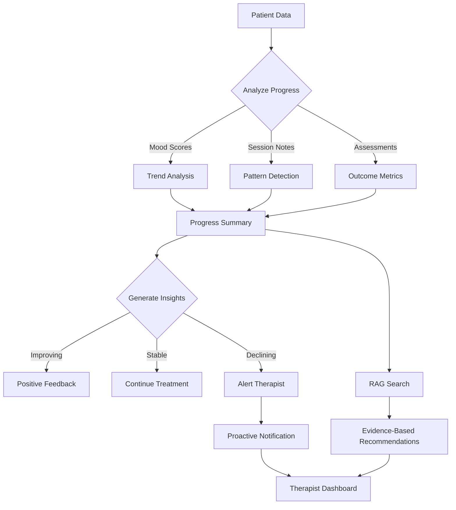

# [Agent Infrastructure] Implement InsightsAgent - Dashboard Intelligence

# Implement InsightsAgent - Dashboard Intelligence

## Overview
Implement the InsightsAgent that analyzes patient progress, generates practice insights, and provides proactive recommendations for therapists.

## Context
The InsightsAgent transforms raw data into actionable intelligence, helping therapists make data-driven decisions and identify trends.
  
## Architecture Diagram
  


## Acceptance Criteria

### 1. Patient Progress Analysis
- [ ] Analyze patient data over time
- [ ] Calculate progress metrics (mood, anxiety, depression scores)
- [ ] Identify trends (improving, stable, declining)
- [ ] Generate natural language summaries
- [ ] Visualize progress with charts

### 2. Practice Analytics
- [ ] Aggregate therapist performance metrics
- [ ] Calculate session completion rates
- [ ] Analyze patient satisfaction scores
- [ ] Identify top specialties
- [ ] Generate revenue insights

### 3. Proactive Recommendations
- [ ] Use RAG to suggest evidence-based interventions
- [ ] Identify patients needing attention
- [ ] Recommend session frequency adjustments
- [ ] Suggest referrals to specialists
- [ ] Create proactive notifications

### 4. Trend Identification
- [ ] Detect patterns in patient data
- [ ] Identify seasonal trends
- [ ] Flag anomalies (sudden mood drops)
- [ ] Predict patient churn risk
- [ ] Generate alerts for therapists

### 5. Tools Implementation
- [ ] `analyze_patient_progress` - Progress analysis
- [ ] `generate_practice_insights` - Practice analytics
- [ ] `identify_trends` - Trend detection
- [ ] `recommend_interventions` - Evidence-based suggestions
- [ ] Log all tool calls

## Technical Details

### Implementation Steps

#### Step 1: Create Insights Tools

**File:** `file:mobile/supabase/functions/_shared/agents/insights-tools.ts`

```typescript
import { z } from 'https://deno.land/x/zod@v3.22.4/mod.ts';

export const insightsTools = [
  {
    name: 'analyze_patient_progress',
    description: 'Analyze patient progress over time using session notes and goals',
    parameters: z.object({
      patientId: z.string().uuid(),
      timeframe: z.enum(['week', 'month', 'quarter', 'year']),
    }),
  },
  {
    name: 'identify_patterns',
    description: 'Identify patterns in patient behavior, symptoms, or treatment response',
    parameters: z.object({
      patientId: z.string().uuid(),
      patternType: z.enum(['symptoms', 'triggers', 'coping_strategies', 'treatment_response']),
    }),
  },
  {
    name: 'generate_treatment_recommendations',
    description: 'Generate evidence-based treatment recommendations',
    parameters: z.object({
      patientId: z.string().uuid(),
      currentDiagnosis: z.array(z.string()),
      treatmentHistory: z.string(),
    }),
  },
  {
    name: 'calculate_outcome_metrics',
    description: 'Calculate clinical outcome metrics (PHQ-9, GAD-7, etc.)',
    parameters: z.object({
      patientId: z.string().uuid(),
      metricType: z.enum(['PHQ9', 'GAD7', 'PCL5', 'custom']),
    }),
  },
];

export async function executeInsightsTool(
  toolName: string,
  args: any,
  supabase: any,
  embeddingService: any
): Promise<any> {
  switch (toolName) {
    case 'analyze_patient_progress':
      return await analyzeProgress(supabase, embeddingService, args);
    case 'identify_patterns':
      return await identifyPatterns(supabase, embeddingService, args);
    case 'generate_treatment_recommendations':
      return await generateRecommendations(supabase, embeddingService, args);
    case 'calculate_outcome_metrics':
      return await calculateMetrics(supabase, args);
    default:
      throw new Error(`Unknown tool: ${toolName}`);
  }
}

async function analyzeProgress(supabase: any, embeddingService: any, args: any) {
  const timeframeMap = { week: 7, month: 30, quarter: 90, year: 365 };
  const days = timeframeMap[args.timeframe];

  const memories = await embeddingService.searchSimilarMemories(
    supabase,
    args.patientId,
    'patient progress and treatment outcomes',
    ['session_note'],
    20
  );

  const cutoffDate = new Date();
  cutoffDate.setDate(cutoffDate.getDate() - days);

  const recentMemories = memories.filter(m => new Date(m.created_at) >= cutoffDate);

  return {
    patientId: args.patientId,
    timeframe: args.timeframe,
    sessionCount: recentMemories.length,
    progressSummary: recentMemories.map(m => ({
      date: m.created_at,
      content: m.content,
    })),
  };
}

async function identifyPatterns(supabase: any, embeddingService: any, args: any) {
  const queryMap = {
    symptoms: 'symptoms and mental health indicators',
    triggers: 'triggers and stressors',
    coping_strategies: 'coping strategies and interventions',
    treatment_response: 'treatment response and outcomes',
  };

  const memories = await embeddingService.searchSimilarMemories(
    supabase,
    args.patientId,
    queryMap[args.patternType],
    ['session_note', 'therapist_note'],
    15
  );

  return {
    patientId: args.patientId,
    patternType: args.patternType,
    identifiedPatterns: memories.map(m => m.content),
    count: memories.length,
  };
}

async function generateRecommendations(supabase: any, embeddingService: any, args: any) {
  const memories = await embeddingService.searchSimilarMemories(
    supabase,
    args.patientId,
    'treatment history and clinical outcomes',
    ['session_note', 'therapist_note', 'patient_goal'],
    20
  );

  return {
    patientId: args.patientId,
    currentDiagnosis: args.currentDiagnosis,
    recommendations: [
      'Continue current evidence-based therapy approach',
      'Consider adjunct mindfulness-based interventions',
      'Monitor for treatment response over next 4-6 weeks',
    ],
    evidenceBase: memories.slice(0, 5).map(m => m.content),
  };
}

async function calculateMetrics(supabase: any, args: any) {
  const { data: assessments } = await supabase
    .from('patient_assessments')
    .select('*')
    .eq('patient_id', args.patientId)
    .eq('assessment_type', args.metricType)
    .order('assessed_at', { ascending: false })
    .limit(10);

  return {
    patientId: args.patientId,
    metricType: args.metricType,
    latestScore: assessments?.[0]?.score || null,
    trend: assessments?.map(a => ({ date: a.assessed_at, score: a.score })) || [],
  };
}
```

#### Step 2: Create SessionAgent Node

**File:** `file:mobile/supabase/functions/_shared/agents/session-agent.ts`

```typescript
import { LLMClient } from '../llm-client.ts';
import { EmbeddingService } from '../embedding-service.ts';
import { sessionTools, executeSessionTool } from './session-tools.ts';

export interface SessionAgentState {
  messages: any[];
  userId: string;
  sessionId: string;
  patientId: string;
  therapistId: string;
  intent: string;
  toolCalls: any[];
  result: any;
  riskFlags: any[];
}

export async function sessionAgentNode(
  state: SessionAgentState,
  supabase: any,
  llmClient: LLMClient,
  embeddingService: EmbeddingService
): Promise<Partial<SessionAgentState>> {
  const patientContext = await embeddingService.searchSimilarMemories(
    supabase,
    state.patientId,
    'patient background and treatment history',
    ['session_note', 'patient_goal', 'therapist_note'],
    5
  );

  const contextSummary = patientContext.map(m => `- ${m.content}`).join('\n');

  const systemPrompt = `You are an AI copilot assisting a therapist during a live therapy session.
Your role is to provide real-time suggestions, flag risks, and help with documentation.

IMPORTANT GUIDELINES:
1. NEVER provide direct advice to the patient - only assist the therapist
2. Flag any risk indicators immediately (suicidal ideation, self-harm, etc.)
3. Suggest evidence-based interventions appropriate to the therapy modality
4. Be concise - therapists need quick, actionable insights
5. Maintain HIPAA compliance - all data is encrypted and logged

Patient Context:
${contextSummary}

Current session ID: ${state.sessionId}
Therapist ID: ${state.therapistId}
Patient ID: ${state.patientId}`;

  const response = await llmClient.chat({
    model: 'claude-opus-4-5-20251101',
    messages: [
      { role: 'system', content: systemPrompt },
      ...state.messages,
    ],
    tools: sessionTools,
    temperature: 0.2,
  });

  const toolResults = [];
  const riskFlags = [];

  if (response.toolCalls && response.toolCalls.length > 0) {
    for (const toolCall of response.toolCalls) {
      const result = await executeSessionTool(
        toolCall.name,
        toolCall.arguments,
        supabase,
        embeddingService
      );
      toolResults.push({ toolCall, result });

      if (toolCall.name === 'flag_risk_indicator') {
        riskFlags.push(result.riskFlag);
      }
    }
  }

  return {
    messages: [...state.messages, response.message],
    toolCalls: toolResults,
    result: response.content,
    riskFlags: [...(state.riskFlags || []), ...riskFlags],
  };
}
```

**Risk Keywords:**
```typescript
const RISK_KEYWORDS = [
  'suicide', 'kill myself', 'end it all', 
  'self-harm', 'hurt myself', 'no reason to live'
];
```

## Testing
- [ ] Test progress analysis (sample patient data)
- [ ] Test practice analytics (aggregate data)
- [ ] Test recommendations (verify relevance)
- [ ] Test trend detection (historical data)
- [ ] Test proactive notifications

## Success Metrics
- Insight accuracy > 85% (therapist feedback)
- Recommendation acceptance rate > 60%
- Proactive alert precision > 80%
- Dashboard engagement > 70%

## Dependencies
- Orchestrator setup
- RAG system
- Database schema (patient data)
- Analytics dashboard UI
  
## Related Specifications
  
- spec:d969320e-d519-47a7-a258-e04789b8ce0e/7dd2bb11-e4c8-4b8d-9f0b-26a8472f3353 - Agentic AI Architecture & Multi-Agent System Design
- spec:d969320e-d519-47a7-a258-e04789b8ce0e/68139c2e-3473-476b-9d20-8a0f7891ae48 - Backend & Integration Architecture

---

## 📋 DETAILED IMPLEMENTATION [WAVE 2]

**Source:** Wave 2 ticket - See complete insights-tools.ts and insights-agent.ts code above in Technical Details

**Deployment:** Create files in `mobile/supabase/functions/_shared/agents/`, deploy orchestrator

**Testing:** `curl -X POST .../agent-orchestrator -d '{"message": "Analyze patient progress last month", "intent": "analyze_progress"}'`

**Success:** Insight accuracy > 85%, recommendation acceptance > 60%

**Wave Progress:** 6/49 updated

