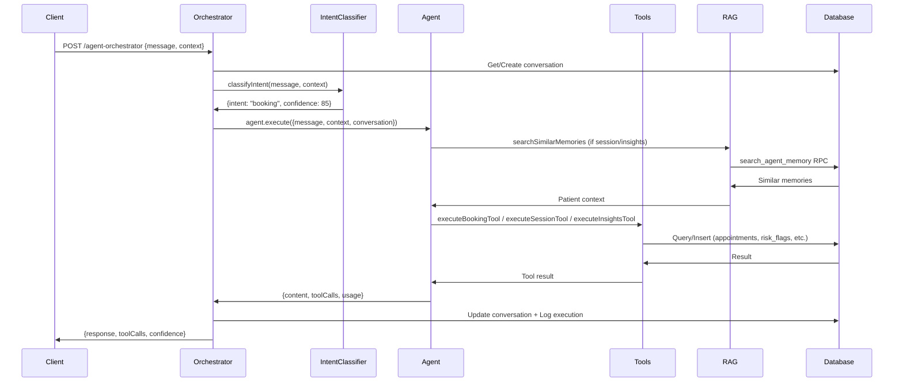

# Agentic AI Architecture

This document outlines the architecture for the Agentic AI system implemented in Wave 2.

## System Architecture

## Agent Capabilities Matrix

| Agent | Tools | LLM Model | Use Cases | RAG Enabled |
|-------|-------|-----------|-----------|-------------|
| BookingAgent | check_therapist_availability, create_appointment, send_booking_confirmation, suggest_alternative_slots | Claude Sonnet 4.5 | Appointment scheduling, availability checks | No |
| SessionAgent | retrieve_patient_history, suggest_intervention, flag_risk_indicator, generate_soap_note_draft | Claude Opus 4.5 | Real-time copilot, risk assessment, SOAP notes | Yes |
| InsightsAgent | analyze_patient_progress, identify_patterns, generate_treatment_recommendations, calculate_outcome_metrics | GPT-4 Turbo | Progress tracking, analytics, treatment planning | Yes |
| FollowupAgent | (Wave 3) | TBD | Post-session engagement, mood tracking | TBD |

## RAG System

The RAG (Retrieval-Augmented Generation) system uses `pgvector` with OpenAI `text-embedding-3-small` (1536 dimensions).

- **Table**: `agent_memory`
- **Function**: `search_agent_memory()`
- **Index**: HNSW on `embedding` column
- **Similarity**: Cosine distance (`<=>`) converted to `1 - distance`.
