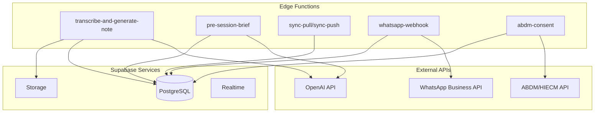

# Backend Services & AI Integration (Supabase Edge Functions)

# Backend Services & AI Integration (Supabase Edge Functions)

## Overview

Backend logic is implemented as Supabase Edge Functions (Deno runtime) deployed globally for low latency. Functions handle AI processing, external API integrations, and complex business logic.

## Edge Functions Architecture



## Function Implementations

### 1. transcribe-and-generate-note

**Purpose**: Transcribe session audio using Whisper, generate SOAP note using GPT-4o

**Trigger**: HTTP POST from web/mobile after session recording

**Flow**:
1. Download audio from Supabase Storage
2. Send to OpenAI Whisper API for transcription
3. Fetch patient history and biometric data
4. Generate SOAP note using GPT-4o with context
5. Insert draft note into database
6. Send notification to therapist

```typescript
// supabase/functions/transcribe-and-generate-note/index.ts
import { serve } from 'https://deno.land/std@0.168.0/http/server.ts'
import { createClient } from 'https://esm.sh/@supabase/supabase-js@2'
import OpenAI from 'https://esm.sh/openai@4'

const openai = new OpenAI({
  apiKey: Deno.env.get('OPENAI_API_KEY')!,
})

serve(async (req) => {
  try {
    const { sessionId, audioUrl, patientId } = await req.json()

    // Initialize Supabase client
    const supabase = createClient(
      Deno.env.get('SUPABASE_URL')!,
      Deno.env.get('SUPABASE_SERVICE_ROLE_KEY')!
    )

    // 1. Download audio from Storage
    const { data: audioData, error: downloadError } = await supabase.storage
      .from('session-audio')
      .download(audioUrl)

    if (downloadError) throw downloadError

    // 2. Transcribe with Whisper
    const transcription = await openai.audio.transcriptions.create({
      file: new File([audioData], 'audio.webm', { type: 'audio/webm' }),
      model: 'whisper-1',
      language: 'hi', // Hinglish support
      response_format: 'verbose_json',
      timestamp_granularities: ['segment'],
    })

    // 3. Fetch patient context
    const { data: patient } = await supabase
      .from('patients')
      .select('*, appointments(*, sessions(*, session_notes(*)))')
      .eq('id', patientId)
      .single()

    // 4. Fetch recent biometrics
    const { data: biometrics } = await supabase
      .from('biometrics')
      .select('*')
      .eq('patient_id', patientId)
      .gte('timestamp', new Date(Date.now() - 7 * 24 * 60 * 60 * 1000).toISOString())
      .order('timestamp', { ascending: false })

    // 5. Generate SOAP note with GPT-4o
    const completion = await openai.chat.completions.create({
      model: 'gpt-4o',
      messages: [
        {
          role: 'system',
          content: SYSTEM_PROMPT,
        },
        {
          role: 'user',
          content: buildPrompt(transcription, patient, biometrics),
        },
      ],
      response_format: { type: 'json_object' },
      temperature: 0.3,
    })

    const soapNote = JSON.parse(completion.choices[0].message.content!)

    // 6. Insert draft note
    const { data: note, error: insertError } = await supabase
      .from('session_notes')
      .insert({
        session_id: sessionId,
        practice_id: patient.practice_id,
        subjective: soapNote.subjective,
        objective: soapNote.objective,
        assessment: soapNote.assessment,
        plan: soapNote.plan,
        icd_codes: soapNote.icd_codes,
        status: 'draft',
      })
      .select()
      .single()

    if (insertError) throw insertError

    // 7. Send notification
    await supabase.functions.invoke('send-notification', {
      body: {
        userId: patient.therapist_id,
        title: 'Note Generated',
        body: `SOAP note ready for ${patient.name}`,
      },
    })

    return new Response(
      JSON.stringify({ success: true, noteId: note.id }),
      { headers: { 'Content-Type': 'application/json' } }
    )
  } catch (error) {
    console.error('Error:', error)
    return new Response(
      JSON.stringify({ error: error.message }),
      { status: 500, headers: { 'Content-Type': 'application/json' } }
    )
  }
})
```

### System Prompt for Clinical Notes

```typescript
const SYSTEM_PROMPT = `You are an expert clinical scribe for an Indian psychologist specializing in mental health.

ROLE: Generate structured SOAP notes from therapy session transcripts.

CONTEXT:
- Patient is in India (use culturally appropriate terms)
- Session language may be Hinglish (Hindi-English code-switching)
- Biometric data from wearables is available

OUTPUT FORMAT (JSON):
{
  "subjective": "Patient's reported symptoms, feelings, concerns",
  "objective": "Therapist's observations, biometric data, behavioral notes",
  "assessment": "Clinical impression, diagnosis, severity",
  "plan": "Treatment plan, interventions, follow-up",
  "icd_codes": ["F41.1", "G47.00"],
  "red_flags": ["self-harm", "suicidal ideation", "psychosis"]
}

CRITICAL RULES:
1. Use culturally appropriate terms (e.g., "exam pressure", "family expectations")
2. Flag biometric anomalies in Objective section (e.g., "HRV dropped 15%")
3. If ANY mention of self-harm/suicide, add to red_flags array
4. Use ICD-10 codes (Indian edition)
5. Keep language professional but accessible
6. Preserve patient's exact words in quotes when relevant

CONSTRAINTS:
- Subjective: 100-300 words
- Objective: 50-200 words (include biometric data if available)
- Assessment: 50-150 words
- Plan: 3-5 actionable items
- ICD codes: 1-3 most relevant codes`

function buildPrompt(transcription: any, patient: any, biometrics: any[]) {
  return `
TRANSCRIPT:
${transcription.text}

PATIENT HISTORY:
- Name: ${patient.name}
- Age: ${patient.demographics.age}
- Previous sessions: ${patient.appointments.length}
- Last diagnosis: ${patient.appointments[0]?.sessions[0]?.session_notes[0]?.assessment || 'N/A'}

BIOMETRIC DATA (Last 7 days):
${biometrics.map(b => `- ${b.type}: ${JSON.stringify(b.value)} (${new Date(b.timestamp).toLocaleDateString()})`).join('\n')}

Generate a SOAP note based on this information.
`
}
```

### 2. pre-session-brief

**Purpose**: Generate pre-session intelligence brief from biometric data

```typescript
// supabase/functions/pre-session-brief/index.ts
serve(async (req) => {
  const { patientId, appointmentId } = await req.json()

  const supabase = createClient(
    Deno.env.get('SUPABASE_URL')!,
    Deno.env.get('SUPABASE_SERVICE_ROLE_KEY')!
  )

  // Fetch biometrics (last 7 days)
  const { data: biometrics } = await supabase
    .from('biometrics')
    .select('*')
    .eq('patient_id', patientId)
    .gte('timestamp', new Date(Date.now() - 7 * 24 * 60 * 60 * 1000).toISOString())
    .order('timestamp', { ascending: false })

  // Fetch patient history
  const { data: patient } = await supabase
    .from('patients')
    .select('*, appointments(*, sessions(*, session_notes(*)))')
    .eq('id', patientId)
    .single()

  // Generate brief with GPT-4o
  const completion = await openai.chat.completions.create({
    model: 'gpt-4o-mini', // Cheaper for routine tasks
    messages: [
      {
        role: 'system',
        content: `You are a clinical assistant. Generate a concise pre-session intelligence brief for a therapist.

Focus on:
1. Significant biometric changes (HRV, sleep, activity)
2. Correlation with previous session notes
3. Potential areas of concern
4. Suggested discussion topics

Output format: 3-5 bullet points, max 200 words.`,
      },
      {
        role: 'user',
        content: `
Patient: ${patient.name}
Last session: ${patient.appointments[0]?.sessions[0]?.session_notes[0]?.assessment || 'N/A'}

Biometric trends:
${analyzeBiometrics(biometrics)}

Generate brief.`,
      },
    ],
    temperature: 0.5,
  })

  const brief = completion.choices[0].message.content

  return new Response(
    JSON.stringify({ brief }),
    { headers: { 'Content-Type': 'application/json' } }
  )
})

function analyzeBiometrics(biometrics: any[]) {
  // Calculate trends (HRV, sleep, activity)
  const hrvData = biometrics.filter(b => b.type === 'hrv')
  const sleepData = biometrics.filter(b => b.type === 'sleep')
  
  const hrvTrend = calculateTrend(hrvData)
  const sleepTrend = calculateTrend(sleepData)

  return `
- HRV: ${hrvTrend.direction} ${hrvTrend.percentage}% (avg: ${hrvTrend.average})
- Sleep: ${sleepTrend.direction} ${sleepTrend.percentage}% (avg: ${sleepTrend.average} hours)
`
}
```

### 3. sync-pull / sync-push

**Purpose**: Handle offline sync for mobile app (WatermelonDB)

```typescript
// supabase/functions/sync-pull/index.ts
serve(async (req) => {
  const { lastPulledAt, schemaVersion } = await req.json()

  const supabase = createClient(
    Deno.env.get('SUPABASE_URL')!,
    Deno.env.get('SUPABASE_SERVICE_ROLE_KEY')!
  )

  // Get user's practice_id from JWT
  const authHeader = req.headers.get('Authorization')!
  const token = authHeader.replace('Bearer ', '')
  const { data: { user } } = await supabase.auth.getUser(token)

  const { data: profile } = await supabase
    .from('profiles')
    .select('practice_id')
    .eq('id', user!.id)
    .single()

  const practiceId = profile!.practice_id

  // Fetch changes since lastPulledAt
  const changes = {
    patients: await getChanges('patients', practiceId, lastPulledAt),
    appointments: await getChanges('appointments', practiceId, lastPulledAt),
    sessions: await getChanges('sessions', practiceId, lastPulledAt),
  }

  return new Response(
    JSON.stringify({
      changes,
      timestamp: Date.now(),
    }),
    { headers: { 'Content-Type': 'application/json' } }
  )
})

async function getChanges(table: string, practiceId: string, since: number) {
  const { data } = await supabase
    .from(table)
    .select('*')
    .eq('practice_id', practiceId)
    .gte('updated_at', new Date(since).toISOString())

  return {
    created: data?.filter(r => new Date(r.created_at).getTime() > since) || [],
    updated: data?.filter(r => new Date(r.updated_at).getTime() > since && new Date(r.created_at).getTime() <= since) || [],
    deleted: [], // Implement soft deletes
  }
}
```

### 4. whatsapp-webhook

**Purpose**: Handle WhatsApp Business API webhooks for patient inquiries

```typescript
// supabase/functions/whatsapp-webhook/index.ts
serve(async (req) => {
  const { from, body } = await req.json()

  const supabase = createClient(
    Deno.env.get('SUPABASE_URL')!,
    Deno.env.get('SUPABASE_SERVICE_ROLE_KEY')!
  )

  // Check if patient exists
  const { data: patient } = await supabase
    .from('patients')
    .select('*')
    .eq('phone', from)
    .single()

  if (!patient) {
    // New inquiry - triage with AI
    const completion = await openai.chat.completions.create({
      model: 'gpt-4o-mini',
      messages: [
        {
          role: 'system',
          content: 'You are a triage assistant for a mental health practice. Classify the inquiry and suggest next steps.',
        },
        {
          role: 'user',
          content: body,
        },
      ],
    })

    const response = completion.choices[0].message.content

    // Send WhatsApp response
    await fetch('https://graph.facebook.com/v18.0/messages', {
      method: 'POST',
      headers: {
        'Authorization': `Bearer ${Deno.env.get('WHATSAPP_API_KEY')}`,
        'Content-Type': 'application/json',
      },
      body: JSON.stringify({
        messaging_product: 'whatsapp',
        to: from,
        text: { body: response },
      }),
    })

    // Log inquiry
    await supabase.from('inquiries').insert({
      phone: from,
      message: body,
      ai_response: response,
    })
  } else {
    // Existing patient - route to therapist
    await supabase.from('messages').insert({
      patient_id: patient.id,
      from: from,
      body: body,
      type: 'whatsapp',
    })
  }

  return new Response('OK', { status: 200 })
})
```

### 5. abdm-consent

**Purpose**: Create ABHA ID and manage HIECM consent

```typescript
// supabase/functions/abdm-consent/index.ts
serve(async (req) => {
  const { patientId, action } = await req.json() // action: 'create_abha' | 'request_consent'

  const supabase = createClient(
    Deno.env.get('SUPABASE_URL')!,
    Deno.env.get('SUPABASE_SERVICE_ROLE_KEY')!
  )

  if (action === 'create_abha') {
    // Call ABDM API to create ABHA ID
    const response = await fetch('https://healthidsbx.abdm.gov.in/api/v1/registration/aadhaar/generateOtp', {
      method: 'POST',
      headers: {
        'Content-Type': 'application/json',
        'Authorization': `Bearer ${Deno.env.get('ABDM_API_KEY')}`,
      },
      body: JSON.stringify({
        aadhaar: patient.aadhaar_number,
      }),
    })

    const data = await response.json()

    // Store transaction ID for OTP verification
    await supabase.from('abdm_transactions').insert({
      patient_id: patientId,
      transaction_id: data.txnId,
      type: 'abha_creation',
    })

    return new Response(JSON.stringify({ txnId: data.txnId }))
  }

  if (action === 'request_consent') {
    // Call HIECM API to request consent
    const response = await fetch('https://cm.abdm.gov.in/v0.5/consent-requests/init', {
      method: 'POST',
      headers: {
        'Content-Type': 'application/json',
        'Authorization': `Bearer ${Deno.env.get('HIECM_API_KEY')}`,
      },
      body: JSON.stringify({
        requestId: crypto.randomUUID(),
        timestamp: new Date().toISOString(),
        consent: {
          purpose: { code: 'CAREMGT' },
          patient: { id: patient.abha_id },
          hiu: { id: 'therapyflow-hiu-id' },
          requester: { name: 'TherapyFlow AI' },
          hiTypes: ['OPConsultation', 'Prescription'],
          permission: {
            accessMode: 'VIEW',
            dateRange: {
              from: new Date(Date.now() - 365 * 24 * 60 * 60 * 1000).toISOString(),
              to: new Date().toISOString(),
            },
            dataEraseAt: new Date(Date.now() + 365 * 24 * 60 * 60 * 1000).toISOString(),
          },
        },
      }),
    })

    const data = await response.json()

    // Store consent request
    await supabase.from('consents').insert({
      patient_id: patientId,
      practice_id: patient.practice_id,
      abha_id: patient.abha_id,
      consent_id: data.consentRequestId,
      status: 'pending',
    })

    return new Response(JSON.stringify({ consentRequestId: data.consentRequestId }))
  }
})
```

## AI Prompt Engineering

### SOAP Note Generation Prompt

```typescript
const SOAP_PROMPT_TEMPLATE = `
You are an expert clinical scribe for an Indian psychologist.

PATIENT CONTEXT:
- Name: {{patient_name}}
- Age: {{patient_age}}
- Gender: {{patient_gender}}
- Previous diagnosis: {{previous_diagnosis}}

SESSION TRANSCRIPT:
{{transcript}}

BIOMETRIC DATA (Last 7 days):
{{biometric_summary}}

TASK:
Generate a SOAP note following this structure:

1. SUBJECTIVE (Patient's Report):
   - Chief complaint
   - Symptoms and duration
   - Patient's own words (use quotes)
   - Relevant life events

2. OBJECTIVE (Observations & Data):
   - Mental status examination
   - Behavioral observations
   - Biometric data analysis
   - Physical appearance

3. ASSESSMENT (Clinical Impression):
   - Primary diagnosis (ICD-10 code)
   - Differential diagnoses
   - Severity assessment
   - Risk factors

4. PLAN (Treatment & Interventions):
   - Therapeutic interventions
   - Homework assignments
   - Medication recommendations (if any)
   - Follow-up schedule
   - Referrals (if needed)

CRITICAL SAFETY RULES:
- If patient mentions self-harm, suicide, or harm to others, add "RED ALERT" at the top
- Flag any psychotic symptoms
- Note any medication non-compliance
- Highlight significant biometric anomalies

OUTPUT: JSON object with keys: subjective, objective, assessment, plan, icd_codes (array), red_flags (array)
`
```

### Pre-Session Brief Prompt

```typescript
const BRIEF_PROMPT_TEMPLATE = `
You are a clinical assistant preparing a therapist for an upcoming session.

PATIENT: {{patient_name}}
LAST SESSION: {{last_session_date}}
LAST DIAGNOSIS: {{last_diagnosis}}

BIOMETRIC TRENDS (Last 7 days):
{{biometric_analysis}}

TASK:
Generate a concise pre-session intelligence brief (3-5 bullet points, max 200 words).

Focus on:
1. Significant biometric changes and what they might indicate
2. Correlation with previous session notes
3. Potential areas of concern or improvement
4. Suggested discussion topics

Example output:
• Alert: HRV dropped 15% on Tuesday, correlating with reported work stress. Check for burnout.
• Sleep duration improved from 4.5 to 6 hours average. Acknowledge progress.
• Activity levels remain low. Explore barriers to exercise.
• Last session focused on CBT for anxiety. Follow up on homework completion.

OUTPUT: Plain text, bullet points, actionable insights.
`
```

## Rate Limiting & Caching

```typescript
// supabase/functions/_shared/rate-limit.ts
import { createClient } from 'https://esm.sh/@supabase/supabase-js@2'

export async function checkRateLimit(
  userId: string,
  action: string,
  limit: number,
  windowSeconds: number
): Promise<boolean> {
  const supabase = createClient(
    Deno.env.get('SUPABASE_URL')!,
    Deno.env.get('SUPABASE_SERVICE_ROLE_KEY')!
  )

  const windowStart = new Date(Date.now() - windowSeconds * 1000)

  const { count } = await supabase
    .from('rate_limits')
    .select('*', { count: 'exact', head: true })
    .eq('user_id', userId)
    .eq('action', action)
    .gte('created_at', windowStart.toISOString())

  if (count && count >= limit) {
    return false // Rate limit exceeded
  }

  // Log request
  await supabase.from('rate_limits').insert({
    user_id: userId,
    action: action,
  })

  return true
}
```

## Error Handling & Monitoring

```typescript
// supabase/functions/_shared/error-handler.ts
export function handleError(error: Error, context: any) {
  // Log to Supabase
  const supabase = createClient(
    Deno.env.get('SUPABASE_URL')!,
    Deno.env.get('SUPABASE_SERVICE_ROLE_KEY')!
  )

  supabase.from('error_logs').insert({
    function_name: context.functionName,
    error_message: error.message,
    error_stack: error.stack,
    context: JSON.stringify(context),
  })

  // Send to Sentry (optional)
  // Sentry.captureException(error, { extra: context })

  return new Response(
    JSON.stringify({
      error: 'Internal server error',
      message: error.message,
    }),
    {
      status: 500,
      headers: { 'Content-Type': 'application/json' },
    }
  )
}
```

## Testing Edge Functions

```typescript
// supabase/functions/transcribe-and-generate-note/test.ts
import { assertEquals } from 'https://deno.land/std@0.168.0/testing/asserts.ts'

Deno.test('should generate SOAP note from transcript', async () => {
  const response = await fetch('http://localhost:54321/functions/v1/transcribe-and-generate-note', {
    method: 'POST',
    headers: {
      'Content-Type': 'application/json',
      'Authorization': `Bearer ${Deno.env.get('SUPABASE_ANON_KEY')}`,
    },
    body: JSON.stringify({
      sessionId: 'test-session-id',
      audioUrl: 'test-audio.webm',
      patientId: 'test-patient-id',
    }),
  })

  const data = await response.json()
  
  assertEquals(response.status, 200)
  assertEquals(data.success, true)
  assertEquals(typeof data.noteId, 'string')
})
```

## Deployment

```bash
# Deploy all functions
npx supabase functions deploy

# Deploy specific function
npx supabase functions deploy transcribe-and-generate-note

# Set secrets
npx supabase secrets set OPENAI_API_KEY=sk-xxx
npx supabase secrets set WHATSAPP_API_KEY=xxx
npx supabase secrets set ABDM_API_KEY=xxx
npx supabase secrets set HIECM_API_KEY=xxx

# View logs
npx supabase functions logs transcribe-and-generate-note
```

## Cost Optimization

### OpenAI API Usage

| Model | Use Case | Cost per 1M tokens | Monthly Est. (1000 sessions) |
|-------|----------|-------------------|------------------------------|
| **Whisper** | Transcription | $0.006/min | ~$360 (60 min avg) |
| **GPT-4o** | SOAP notes | $2.50 (input) / $10 (output) | ~$150 (500 tokens avg) |
| **GPT-4o-mini** | Pre-session briefs | $0.15 (input) / $0.60 (output) | ~$20 (200 tokens avg) |
| **Total** | - | - | **~$530/mo** |

### Optimization Strategies

1. **Caching**: Cache AI responses for identical inputs (deduplication)
2. **Batching**: Process multiple transcriptions in parallel
3. **Compression**: Compress audio before sending to Whisper
4. **Prompt Optimization**: Reduce token count in prompts
5. **Model Selection**: Use GPT-4o-mini for routine tasks

## Next Steps

1. **Setup Edge Functions**: Initialize Supabase functions directory
2. **Implement Transcription**: Build transcribe-and-generate-note function
3. **Implement Brief**: Build pre-session-brief function
4. **Implement Sync**: Build sync-pull and sync-push functions
5. **Test Locally**: Use Supabase CLI to test functions
6. **Deploy**: Deploy to Supabase production
7. **Monitor**: Setup logging and error tracking
8. **Optimize**: Implement caching and rate limiting