# BioSync Wearable Integration (Google Health Connect & Apple HealthKit)

# BioSync Wearable Integration

## Overview

BioSync integrates with consumer wearables (Noise, Boat, Mi Band via Google Health Connect on Android; Apple Watch via HealthKit on iOS) to provide objective physiological data for clinical insights.

## Supported Wearables (India Market)

### Android (via Google Health Connect)
- **Noise ColorFit** series (most popular in India)
- **Boat Wave** series
- **Mi Band** 6/7/8
- **Samsung Galaxy Watch**
- **Fitbit** (via Health Connect)
- **Google Fit** (legacy, migrating to Health Connect)

### iOS (via Apple HealthKit)
- **Apple Watch** Series 4+
- **Fitbit** (via HealthKit sync)
- **Garmin** watches
- **Oura Ring**

## Data Types Collected

| Metric | Android (Health Connect) | iOS (HealthKit) | Clinical Relevance |
|--------|-------------------------|-----------------|-------------------|
| **Heart Rate Variability (HRV)** | ✅ | ✅ | Stress, anxiety, autonomic function |
| **Sleep Duration** | ✅ | ✅ | Depression, anxiety, sleep disorders |
| **Sleep Stages** | ✅ | ✅ | Sleep quality, REM/deep sleep |
| **Steps** | ✅ | ✅ | Activity level, motivation |
| **Active Minutes** | ✅ | ✅ | Exercise adherence |
| **Resting Heart Rate** | ✅ | ✅ | Baseline health, anxiety |
| **Calories Burned** | ✅ | ✅ | Activity level |
| **Blood Oxygen (SpO2)** | ✅ | ✅ | Sleep apnea, respiratory issues |

## Integration Architecture


## Mobile Implementation

### Android (Health Connect)

```typescript
// lib/health/health-connect.ts
import {
  initialize,
  requestPermission,
  readRecords,
  SdkAvailabilityStatus,
} from 'expo-health-connect'

export async function setupHealthConnect() {
  const isAvailable = await initialize()
  
  if (isAvailable !== SdkAvailabilityStatus.SDK_AVAILABLE) {
    throw new Error('Health Connect not available. Please install from Play Store.')
  }

  const permissions = [
    { accessType: 'read', recordType: 'HeartRate' },
    { accessType: 'read', recordType: 'HeartRateVariabilityRmssd' },
    { accessType: 'read', recordType: 'Steps' },
    { accessType: 'read', recordType: 'SleepSession' },
    { accessType: 'read', recordType: 'ActiveCaloriesBurned' },
    { accessType: 'read', recordType: 'OxygenSaturation' },
  ]

  const granted = await requestPermission(permissions)
  return granted
}

export async function syncHealthData(patientId: string) {
  const endTime = new Date()
  const startTime = new Date(endTime.getTime() - 24 * 60 * 60 * 1000) // Last 24 hours

  const timeRange = {
    operator: 'between',
    startTime: startTime.toISOString(),
    endTime: endTime.toISOString(),
  }

  // Fetch all metrics in parallel
  const [hrv, sleep, steps, heartRate] = await Promise.all([
    readRecords('HeartRateVariabilityRmssd', { timeRangeFilter: timeRange }),
    readRecords('SleepSession', { timeRangeFilter: timeRange }),
    readRecords('Steps', { timeRangeFilter: timeRange }),
    readRecords('HeartRate', { timeRangeFilter: timeRange }),
  ])

  // Transform and batch insert to Supabase
  const biometrics = [
    ...hrv.records.map(r => ({
      patient_id: patientId,
      timestamp: r.time,
      type: 'hrv',
      value: { rmssd: r.heartRateVariabilityMillis },
      source: 'google_health_connect',
    })),
    ...sleep.records.map(r => ({
      patient_id: patientId,
      timestamp: r.startTime,
      type: 'sleep',
      value: {
        duration_minutes: (new Date(r.endTime).getTime() - new Date(r.startTime).getTime()) / 60000,
        stages: r.stages,
      },
      source: 'google_health_connect',
    })),
    ...steps.records.map(r => ({
      patient_id: patientId,
      timestamp: r.time,
      type: 'steps',
      value: { count: r.count },
      source: 'google_health_connect',
    })),
  ]

  // Insert to Supabase
  const { error } = await supabase.from('biometrics').insert(biometrics)

  if (error) throw error

  return biometrics.length
}
```

### iOS (HealthKit)

```typescript
// lib/health/healthkit.ts
import AppleHealthKit, { HealthValue } from 'react-native-health'

export async function setupHealthKit() {
  const permissions = {
    permissions: {
      read: [
        AppleHealthKit.Constants.Permissions.HeartRate,
        AppleHealthKit.Constants.Permissions.HeartRateVariability,
        AppleHealthKit.Constants.Permissions.Steps,
        AppleHealthKit.Constants.Permissions.SleepAnalysis,
        AppleHealthKit.Constants.Permissions.ActiveEnergyBurned,
      ],
      write: [],
    },
  }

  return new Promise((resolve, reject) => {
    AppleHealthKit.initHealthKit(permissions, (error) => {
      if (error) {
        reject(error)
      } else {
        resolve(true)
      }
    })
  })
}

export async function syncHealthData(patientId: string) {
  const endDate = new Date()
  const startDate = new Date(endDate.getTime() - 24 * 60 * 60 * 1000)

  const options = {
    startDate: startDate.toISOString(),
    endDate: endDate.toISOString(),
  }

  // Fetch all metrics
  const [hrv, sleep, steps, heartRate] = await Promise.all([
    getHRVData(options),
    getSleepData(options),
    getStepsData(options),
    getHeartRateData(options),
  ])

  // Transform and insert to Supabase
  const biometrics = [
    ...hrv.map(r => ({
      patient_id: patientId,
      timestamp: r.startDate,
      type: 'hrv',
      value: { rmssd: r.value },
      source: 'apple_healthkit',
    })),
    ...sleep.map(r => ({
      patient_id: patientId,
      timestamp: r.startDate,
      type: 'sleep',
      value: {
        duration_minutes: (new Date(r.endDate).getTime() - new Date(r.startDate).getTime()) / 60000,
        value: r.value, // 'INBED', 'ASLEEP', 'AWAKE'
      },
      source: 'apple_healthkit',
    })),
  ]

  const { error } = await supabase.from('biometrics').insert(biometrics)

  if (error) throw error

  return biometrics.length
}

function getHRVData(options: any): Promise<HealthValue[]> {
  return new Promise((resolve, reject) => {
    AppleHealthKit.getHeartRateVariabilitySamples(options, (error, results) => {
      if (error) reject(error)
      else resolve(results)
    })
  })
}
```

## Background Sync (Daily)

```typescript
// lib/health/background-sync.ts
import * as BackgroundFetch from 'expo-background-fetch'
import * as TaskManager from 'expo-task-manager'
import { syncHealthData as syncAndroid } from './health-connect'
import { syncHealthData as syncIOS } from './healthkit'
import { Platform } from 'react-native'

const BACKGROUND_SYNC_TASK = 'background-health-sync'

TaskManager.defineTask(BACKGROUND_SYNC_TASK, async () => {
  try {
    const patientId = await getPatientId() // From secure storage

    if (Platform.OS === 'android') {
      await syncAndroid(patientId)
    } else {
      await syncIOS(patientId)
    }

    return BackgroundFetch.BackgroundFetchResult.NewData
  } catch (error) {
    console.error('Background sync failed', error)
    return BackgroundFetch.BackgroundFetchResult.Failed
  }
})

export async function registerBackgroundSync() {
  await BackgroundFetch.registerTaskAsync(BACKGROUND_SYNC_TASK, {
    minimumInterval: 24 * 60 * 60, // 24 hours
    stopOnTerminate: false,
    startOnBoot: true,
  })
}
```

## Clinical Insights Dashboard

### Biometric Trends Wireframe (Mobile)

```wireframe
<!DOCTYPE html>
<html>
<head>
<style>
* { margin: 0; padding: 0; box-sizing: border-box; font-family: -apple-system, BlinkMacSystemFont, 'Segoe UI', sans-serif; }
body { background: #f5f5f5; display: flex; justify-content: center; align-items: center; min-height: 100vh; padding: 20px; }
.phone-frame { width: 375px; height: 667px; background: white; border-radius: 40px; box-shadow: 0 10px 40px rgba(0,0,0,0.2); padding: 20px; display: flex; flex-direction: column; overflow: hidden; }
.status-bar { height: 20px; display: flex; justify-content: space-between; align-items: center; font-size: 12px; color: #000; margin-bottom: 16px; }
.nav-header { display: flex; align-items: center; gap: 12px; margin-bottom: 24px; }
.back-button { width: 32px; height: 32px; border-radius: 8px; background: #f3f4f6; display: flex; align-items: center; justify-content: center; }
.nav-title { font-size: 18px; font-weight: 600; color: #111827; }
.patient-header { background: linear-gradient(135deg, #667eea 0%, #764ba2 100%); border-radius: 16px; padding: 20px; margin-bottom: 20px; color: white; }
.patient-name { font-size: 20px; font-weight: 700; margin-bottom: 4px; }
.sync-status { font-size: 12px; opacity: 0.9; display: flex; align-items: center; gap: 6px; }
.sync-icon { width: 12px; height: 12px; background: #10b981; border-radius: 50%; }
.content { flex: 1; overflow-y: auto; }
.metric-card { background: white; border-radius: 16px; padding: 20px; margin-bottom: 16px; border: 1px solid #e5e7eb; }
.metric-header { display: flex; justify-content: space-between; align-items: center; margin-bottom: 16px; }
.metric-title { font-size: 16px; font-weight: 600; color: #111827; }
.metric-trend { font-size: 14px; font-weight: 500; }
.trend-up { color: #10b981; }
.trend-down { color: #ef4444; }
.metric-value { font-size: 32px; font-weight: 700; color: #111827; margin-bottom: 8px; }
.metric-unit { font-size: 14px; color: #6b7280; }
.chart-placeholder { height: 120px; background: #f9fafb; border-radius: 8px; display: flex; align-items: center; justify-content: center; color: #9ca3af; font-size: 12px; margin-top: 12px; }
.insight-box { background: #fef3c7; border-left: 4px solid #f59e0b; padding: 12px; border-radius: 8px; margin-top: 12px; }
.insight-text { font-size: 13px; color: #92400e; line-height: 1.5; }
.alert-box { background: #fee2e2; border-left: 4px solid #dc2626; padding: 12px; border-radius: 8px; margin-top: 12px; }
.alert-text { font-size: 13px; color: #991b1b; line-height: 1.5; font-weight: 500; }
</style>
</head>
<body>
<div class="phone-frame">
  <div class="status-bar">
    <span>9:41</span>
    <span>●●●●● 100%</span>
  </div>
  
  <div class="nav-header">
    <div class="back-button" data-element-id="back-button">
      <svg width="20" height="20" fill="currentColor" viewBox="0 0 20 20"><path fill-rule="evenodd" d="M12.707 5.293a1 1 0 010 1.414L9.414 10l3.293 3.293a1 1 0 01-1.414 1.414l-4-4a1 1 0 010-1.414l4-4a1 1 0 011.414 0z" clip-rule="evenodd"/></svg>
    </div>
    <div class="nav-title">BioSync Insights</div>
  </div>
  
  <div class="patient-header">
    <div class="patient-name">Rahul Sharma</div>
    <div class="sync-status">
      <div class="sync-icon"></div>
      <span>Last synced: 2 hours ago</span>
    </div>
  </div>
  
  <div class="content">
    <div class="metric-card">
      <div class="metric-header">
        <div class="metric-title">Heart Rate Variability</div>
        <div class="metric-trend trend-down">↓ 15%</div>
      </div>
      <div>
        <span class="metric-value">42</span>
        <span class="metric-unit">ms (7-day avg)</span>
      </div>
      <div class="chart-placeholder">HRV trend chart (7 days)</div>
      <div class="alert-box">
        <div class="alert-text">⚠️ Significant drop on Tuesday. Correlates with reported work stress. Check for burnout symptoms.</div>
      </div>
    </div>
    
    <div class="metric-card">
      <div class="metric-header">
        <div class="metric-title">Sleep Duration</div>
        <div class="metric-trend trend-up">↑ 12%</div>
      </div>
      <div>
        <span class="metric-value">6.2</span>
        <span class="metric-unit">hours (7-day avg)</span>
      </div>
      <div class="chart-placeholder">Sleep trend chart (7 days)</div>
      <div class="insight-box">
        <div class="insight-text">💡 Improvement from 4.5 hours last week. Acknowledge progress in session.</div>
      </div>
    </div>
    
    <div class="metric-card">
      <div class="metric-header">
        <div class="metric-title">Daily Steps</div>
        <div class="metric-trend trend-down">↓ 8%</div>
      </div>
      <div>
        <span class="metric-value">4,250</span>
        <span class="metric-unit">steps (7-day avg)</span>
      </div>
      <div class="chart-placeholder">Steps trend chart (7 days)</div>
      <div class="insight-box">
        <div class="insight-text">💡 Activity levels remain low. Explore barriers to exercise and outdoor activities.</div>
      </div>
    </div>
    
    <div class="metric-card">
      <div class="metric-header">
        <div class="metric-title">Resting Heart Rate</div>
        <div class="metric-trend trend-up">↑ 5%</div>
      </div>
      <div>
        <span class="metric-value">72</span>
        <span class="metric-unit">bpm (7-day avg)</span>
      </div>
      <div class="chart-placeholder">Heart rate trend chart (7 days)</div>
    </div>
  </div>
</div>
</body>
</html>
```

### Sync Component

```typescript
// components/health/HealthSyncButton.tsx
import { useState } from 'react'
import { View, Platform } from 'react-native'
import { Button, Text } from 'react-native-paper'
import { syncHealthData as syncAndroid } from '@/lib/health/health-connect'
import { syncHealthData as syncIOS } from '@/lib/health/healthkit'
import { usePatient } from '@/lib/hooks/usePatient'

export function HealthSyncButton() {
  const { patient } = usePatient()
  const [syncing, setSyncing] = useState(false)
  const [lastSync, setLastSync] = useState<Date | null>(null)

  async function handleSync() {
    setSyncing(true)

    try {
      const count = Platform.OS === 'android'
        ? await syncAndroid(patient.id)
        : await syncIOS(patient.id)

      setLastSync(new Date())
      alert(`Synced ${count} data points`)
    } catch (error) {
      alert('Sync failed: ' + error.message)
    } finally {
      setSyncing(false)
    }
  }

  return (
    <View>
      <Button
        mode="contained"
        onPress={handleSync}
        loading={syncing}
        disabled={syncing}
        icon="sync"
      >
        Sync Health Data
      </Button>
      
      {lastSync && (
        <Text variant="bodySmall" style={{ marginTop: 8, textAlign: 'center' }}>
          Last synced: {lastSync.toLocaleTimeString()}
        </Text>
      )}
    </View>
  )
}
```

## AI-Powered Insights

### Trend Analysis

```typescript
// Edge Function: analyze-biometric-trends
export function analyzeTrends(biometrics: Biometric[]) {
  const hrvData = biometrics.filter(b => b.type === 'hrv')
  const sleepData = biometrics.filter(b => b.type === 'sleep')
  const stepsData = biometrics.filter(b => b.type === 'steps')

  return {
    hrv: {
      average: calculateAverage(hrvData),
      trend: calculateTrend(hrvData),
      anomalies: detectAnomalies(hrvData),
    },
    sleep: {
      average: calculateAverage(sleepData),
      trend: calculateTrend(sleepData),
      quality: assessSleepQuality(sleepData),
    },
    steps: {
      average: calculateAverage(stepsData),
      trend: calculateTrend(stepsData),
      sedentary_days: countSedentaryDays(stepsData),
    },
  }
}

function calculateTrend(data: Biometric[]) {
  if (data.length < 2) return { direction: 'stable', percentage: 0 }

  const recent = data.slice(0, 3).map(d => d.value)
  const older = data.slice(3, 6).map(d => d.value)

  const recentAvg = recent.reduce((a, b) => a + b, 0) / recent.length
  const olderAvg = older.reduce((a, b) => a + b, 0) / older.length

  const change = ((recentAvg - olderAvg) / olderAvg) * 100

  return {
    direction: change > 5 ? 'up' : change < -5 ? 'down' : 'stable',
    percentage: Math.abs(Math.round(change)),
  }
}

function detectAnomalies(data: Biometric[]) {
  const values = data.map(d => d.value)
  const mean = values.reduce((a, b) => a + b, 0) / values.length
  const stdDev = Math.sqrt(
    values.reduce((sq, n) => sq + Math.pow(n - mean, 2), 0) / values.length
  )

  return data.filter(d => Math.abs(d.value - mean) > 2 * stdDev)
}
```

### Predictive Alerts

```typescript
// Edge Function: predict-relapse-risk
export async function predictRelapseRisk(patientId: string) {
  const supabase = createClient(...)

  // Fetch 30 days of biometrics
  const { data: biometrics } = await supabase
    .from('biometrics')
    .select('*')
    .eq('patient_id', patientId)
    .gte('timestamp', new Date(Date.now() - 30 * 24 * 60 * 60 * 1000).toISOString())

  // Fetch session notes (last 3 months)
  const { data: notes } = await supabase
    .from('session_notes')
    .select('*')
    .eq('patient_id', patientId)
    .gte('created_at', new Date(Date.now() - 90 * 24 * 60 * 60 * 1000).toISOString())

  // Risk factors
  const riskFactors = []

  // 1. Sleep deprivation (< 5 hours for 3+ consecutive days)
  const sleepData = biometrics.filter(b => b.type === 'sleep')
  const consecutiveLowSleep = countConsecutiveLowSleep(sleepData)
  if (consecutiveLowSleep >= 3) {
    riskFactors.push({
      factor: 'sleep_deprivation',
      severity: 'high',
      message: `Sleep < 5 hours for ${consecutiveLowSleep} consecutive days`,
    })
  }

  // 2. HRV decline (> 20% drop from baseline)
  const hrvData = biometrics.filter(b => b.type === 'hrv')
  const hrvDecline = calculateHRVDecline(hrvData)
  if (hrvDecline > 20) {
    riskFactors.push({
      factor: 'hrv_decline',
      severity: 'medium',
      message: `HRV dropped ${hrvDecline}% from baseline`,
    })
  }

  // 3. Activity drop (< 2000 steps for 5+ days)
  const stepsData = biometrics.filter(b => b.type === 'steps')
  const sedentaryDays = countSedentaryDays(stepsData)
  if (sedentaryDays >= 5) {
    riskFactors.push({
      factor: 'sedentary_behavior',
      severity: 'medium',
      message: `< 2000 steps for ${sedentaryDays} days`,
    })
  }

  // 4. Worsening assessment scores in notes
  const assessmentTrend = analyzeAssessmentTrend(notes)
  if (assessmentTrend === 'worsening') {
    riskFactors.push({
      factor: 'clinical_deterioration',
      severity: 'high',
      message: 'Assessment scores worsening over last 3 sessions',
    })
  }

  // Calculate overall risk score
  const riskScore = riskFactors.reduce((score, factor) => {
    return score + (factor.severity === 'high' ? 3 : factor.severity === 'medium' ? 2 : 1)
  }, 0)

  return {
    riskLevel: riskScore > 6 ? 'high' : riskScore > 3 ? 'medium' : 'low',
    riskScore,
    riskFactors,
    recommendation: generateRecommendation(riskFactors),
  }
}
```

## Privacy & Consent

### Patient Consent Flow

```mermaid
sequenceDiagram
    participant P as Patient (Mobile)
    participant M as Mobile App
    participant DB as Supabase
    participant HC as Health Connect/HealthKit
    
    P->>M: Enable BioSync
    M->>M: Show consent screen
    P->>M: Accept consent
    M->>DB: INSERT consent record
    M->>HC: Request permissions
    HC-->>P: OS permission dialog
    P->>HC: Grant permissions
    HC-->>M: Permissions granted
    M->>HC: Fetch initial data
    HC-->>M: Health data
    M->>DB: INSERT biometrics
    M-->>P: BioSync enabled ✓
```



### Consent Screen Wireframe

```wireframe
<!DOCTYPE html>
<html>
<head>
<style>
* { margin: 0; padding: 0; box-sizing: border-box; font-family: -apple-system, BlinkMacSystemFont, 'Segoe UI', sans-serif; }
body { background: #f5f5f5; display: flex; justify-content: center; align-items: center; min-height: 100vh; padding: 20px; }
.phone-frame { width: 375px; height: 667px; background: white; border-radius: 40px; box-shadow: 0 10px 40px rgba(0,0,0,0.2); padding: 20px; display: flex; flex-direction: column; }
.status-bar { height: 20px; display: flex; justify-content: space-between; align-items: center; font-size: 12px; color: #000; margin-bottom: 16px; }
.header { text-align: center; margin-bottom: 32px; }
.icon { width: 80px; height: 80px; background: linear-gradient(135deg, #667eea 0%, #764ba2 100%); border-radius: 40px; margin: 0 auto 16px; display: flex; align-items: center; justify-content: center; font-size: 36px; }
.title { font-size: 24px; font-weight: 700; color: #111827; margin-bottom: 8px; }
.subtitle { font-size: 14px; color: #6b7280; line-height: 1.5; }
.content { flex: 1; overflow-y: auto; }
.section { margin-bottom: 24px; }
.section-title { font-size: 16px; font-weight: 600; color: #111827; margin-bottom: 12px; }
.permission-item { display: flex; align-items: flex-start; gap: 12px; padding: 12px; background: #f9fafb; border-radius: 8px; margin-bottom: 8px; }
.permission-icon { width: 24px; height: 24px; background: #667eea; border-radius: 6px; display: flex; align-items: center; justify-content: center; color: white; font-size: 14px; flex-shrink: 0; }
.permission-text { flex: 1; }
.permission-name { font-size: 14px; font-weight: 500; color: #111827; margin-bottom: 2px; }
.permission-desc { font-size: 12px; color: #6b7280; line-height: 1.4; }
.privacy-note { background: #eff6ff; border: 1px solid #bfdbfe; border-radius: 8px; padding: 16px; margin-bottom: 24px; }
.privacy-title { font-size: 14px; font-weight: 600; color: #1e40af; margin-bottom: 8px; display: flex; align-items: center; gap: 6px; }
.privacy-text { font-size: 13px; color: #1e40af; line-height: 1.5; }
.actions { display: flex; flex-direction: column; gap: 12px; }
.button { width: 100%; padding: 16px; border-radius: 12px; font-size: 16px; font-weight: 600; border: none; cursor: pointer; }
.button-primary { background: linear-gradient(135deg, #667eea 0%, #764ba2 100%); color: white; }
.button-secondary { background: white; color: #374151; border: 1px solid #d1d5db; }
</style>
</head>
<body>
<div class="phone-frame">
  <div class="status-bar">
    <span>9:41</span>
    <span>●●●●● 100%</span>
  </div>
  
  <div class="header">
    <div class="icon">💓</div>
    <div class="title">Enable BioSync</div>
    <div class="subtitle">Connect your wearable to get personalized insights</div>
  </div>
  
  <div class="content">
    <div class="section">
      <div class="section-title">We'll access:</div>
      
      <div class="permission-item">
        <div class="permission-icon">❤️</div>
        <div class="permission-text">
          <div class="permission-name">Heart Rate & HRV</div>
          <div class="permission-desc">Track stress and recovery patterns</div>
        </div>
      </div>
      
      <div class="permission-item">
        <div class="permission-icon">😴</div>
        <div class="permission-text">
          <div class="permission-name">Sleep Data</div>
          <div class="permission-desc">Monitor sleep quality and duration</div>
        </div>
      </div>
      
      <div class="permission-item">
        <div class="permission-icon">🚶</div>
        <div class="permission-text">
          <div class="permission-name">Activity & Steps</div>
          <div class="permission-desc">Understand activity levels and patterns</div>
        </div>
      </div>
    </div>
    
    <div class="privacy-note">
      <div class="privacy-title">
        <svg width="16" height="16" fill="currentColor" viewBox="0 0 20 20"><path fill-rule="evenodd" d="M5 9V7a5 5 0 0110 0v2a2 2 0 012 2v5a2 2 0 01-2 2H5a2 2 0 01-2-2v-5a2 2 0 012-2zm8-2v2H7V7a3 3 0 016 0z" clip-rule="evenodd"/></svg>
        Your Privacy Matters
      </div>
      <div class="privacy-text">
        • Your data is encrypted and stored securely<br/>
        • Only your therapist can access this data<br/>
        • You can revoke access anytime<br/>
        • We never share data with third parties
      </div>
    </div>
  </div>
  
  <div class="actions">
    <button class="button button-primary" data-element-id="enable-biosync">
      Enable BioSync
    </button>
    <button class="button button-secondary" data-element-id="maybe-later">
      Maybe Later
    </button>
  </div>
</div>
</body>
</html>
```

## Data Visualization

### Chart Library

```typescript
// Use react-native-chart-kit for visualizations
import { LineChart } from 'react-native-chart-kit'

<LineChart
  data={{
    labels: ['Mon', 'Tue', 'Wed', 'Thu', 'Fri', 'Sat', 'Sun'],
    datasets: [
      {
        data: [45, 42, 38, 41, 43, 44, 42], // HRV values
      },
    ],
  }}
  width={320}
  height={200}
  chartConfig={{
    backgroundColor: '#667eea',
    backgroundGradientFrom: '#667eea',
    backgroundGradientTo: '#764ba2',
    decimalPlaces: 0,
    color: (opacity = 1) => `rgba(255, 255, 255, ${opacity})`,
  }}
  bezier
/>
```

## Clinical Decision Support

### Alert Thresholds

| Metric | Normal Range | Warning Threshold | Alert Threshold |
|--------|--------------|-------------------|-----------------|
| **HRV (RMSSD)** | 40-100 ms | < 35 ms or > 15% drop | < 30 ms or > 25% drop |
| **Sleep Duration** | 6-9 hours | < 5 hours for 2+ days | < 4 hours for 3+ days |
| **Resting HR** | 60-100 bpm | > 90 bpm sustained | > 100 bpm sustained |
| **Steps** | > 5000/day | < 3000/day for 3+ days | < 2000/day for 5+ days |

### Alert Generation

```typescript
export function generateAlerts(biometrics: Biometric[], patient: Patient) {
  const alerts = []

  // Sleep deprivation alert
  const sleepData = biometrics.filter(b => b.type === 'sleep')
  const lowSleepDays = sleepData.filter(s => s.value.duration_minutes < 300).length
  
  if (lowSleepDays >= 3) {
    alerts.push({
      type: 'sleep_deprivation',
      severity: 'high',
      message: `Sleep < 5 hours for ${lowSleepDays} days. Risk of mood deterioration.`,
      action: 'Discuss sleep hygiene and consider sleep study referral.',
    })
  }

  // HRV drop alert
  const hrvTrend = calculateTrend(biometrics.filter(b => b.type === 'hrv'))
  if (hrvTrend.direction === 'down' && hrvTrend.percentage > 20) {
    alerts.push({
      type: 'hrv_decline',
      severity: 'medium',
      message: `HRV dropped ${hrvTrend.percentage}%. Indicates increased stress.`,
      action: 'Explore recent stressors and coping strategies.',
    })
  }

  return alerts
}
```

## Next Steps

1. **Setup Health Permissions**: Implement permission requests for both platforms
2. **Build Sync Logic**: Implement daily background sync
3. **Create Insights UI**: Build biometric trends dashboard
4. **Implement Alerts**: Build alert generation and notification system
5. **Test with Devices**: Test with actual wearables (Noise, Boat, Apple Watch)
6. **Privacy Compliance**: Implement consent management
7. **Clinical Validation**: Validate insights with therapists
8. **Documentation**: Create user guide for wearable setup