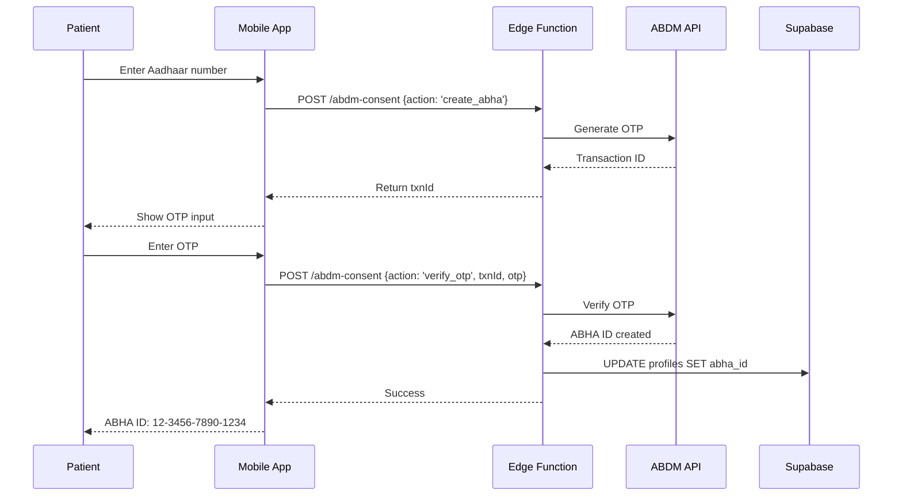
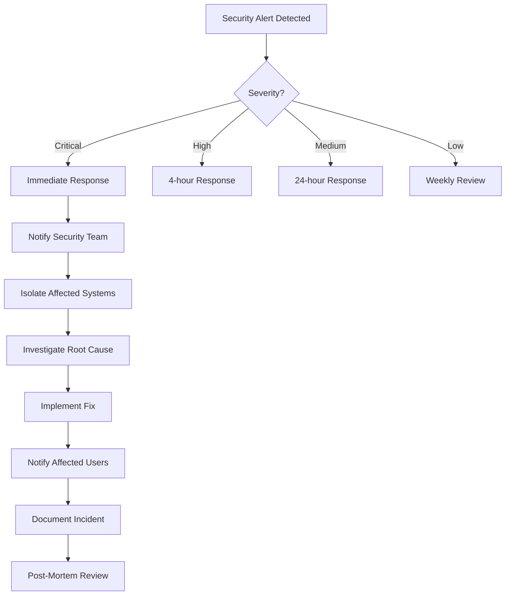

# Compliance & Security Implementation (ABDM, Audit Logging, Encryption)

# Compliance & Security Implementation

## Overview

TherapyFlow AI must comply with Indian healthcare regulations (ABDM, Mental Healthcare Act 2017) and international security standards (HIPAA-equivalent). This spec covers compliance features, security measures, and audit mechanisms.

## Regulatory Framework

### Indian Healthcare Regulations

| Regulation | Requirement | Implementation |
|------------|-------------|----------------|
| **Mental Healthcare Act 2017** | Patient consent for treatment | Consent management system |
| **ABDM (Ayushman Bharat Digital Mission)** | ABHA ID integration | ABHA creation via ABDM API |
| **HIECM (Health Information Exchange)** | Consent-based data sharing | HIECM consent artifacts |
| **IT Act 2000** | Data protection | Encryption, access controls |
| **DPDP Act 2023** | Data privacy | Right to erasure, data minimization |

### HIPAA-Equivalent Requirements

| Safeguard | Requirement | Implementation |
|-----------|-------------|----------------|
| **Administrative** | Policies, training, risk assessment | Documented policies, annual training |
| **Physical** | Facility access, device security | Cloud infrastructure (Supabase) |
| **Technical** | Encryption, access controls, audit logs | AES-256, RLS, audit_logs table |

## ABDM Integration

### ABHA ID Creation Flow



### ABHA Creation Implementation

```typescript
// supabase/functions/abdm-consent/create-abha.ts
export async function createABHA(aadhaarNumber: string) {
  // Step 1: Generate OTP
  const otpResponse = await fetch(
    'https://healthidsbx.abdm.gov.in/api/v1/registration/aadhaar/generateOtp',
    {
      method: 'POST',
      headers: {
        'Content-Type': 'application/json',
        'Authorization': `Bearer ${Deno.env.get('ABDM_API_KEY')}`,
      },
      body: JSON.stringify({
        aadhaar: aadhaarNumber,
      }),
    }
  )

  const { txnId } = await otpResponse.json()
  return { txnId }
}

export async function verifyOTPAndCreateABHA(txnId: string, otp: string) {
  // Step 2: Verify OTP
  const verifyResponse = await fetch(
    'https://healthidsbx.abdm.gov.in/api/v1/registration/aadhaar/verifyOTP',
    {
      method: 'POST',
      headers: {
        'Content-Type': 'application/json',
        'Authorization': `Bearer ${Deno.env.get('ABDM_API_KEY')}`,
      },
      body: JSON.stringify({
        otp,
        txnId,
      }),
    }
  )

  const { token } = await verifyResponse.json()

  // Step 3: Create ABHA ID
  const createResponse = await fetch(
    'https://healthidsbx.abdm.gov.in/api/v1/registration/aadhaar/createHealthIdWithPreVerified',
    {
      method: 'POST',
      headers: {
        'Content-Type': 'application/json',
        'Authorization': `Bearer ${token}`,
      },
      body: JSON.stringify({
        txnId,
      }),
    }
  )

  const { healthIdNumber, healthId } = await createResponse.json()

  return {
    abhaNumber: healthIdNumber, // 12-3456-7890-1234
    abhaAddress: healthId, // username@abdm
  }
}
```

### HIECM Consent Management

```typescript
// supabase/functions/abdm-consent/request-consent.ts
export async function requestHIECMConsent(
  patientAbhaId: string,
  practiceId: string,
  purpose: string
) {
  const consentRequest = {
    requestId: crypto.randomUUID(),
    timestamp: new Date().toISOString(),
    consent: {
      purpose: {
        text: 'Clinical Care',
        code: 'CAREMGT',
        refUri: 'http://terminology.hl7.org/ValueSet/v3-PurposeOfUse',
      },
      patient: {
        id: patientAbhaId,
      },
      hiu: {
        id: 'therapyflow-hiu-id', // Registered HIU ID
        name: 'TherapyFlow AI',
      },
      requester: {
        name: 'TherapyFlow AI',
        identifier: {
          type: 'REGNO',
          value: 'therapyflow-registration-number',
          system: 'https://www.mciindia.org',
        },
      },
      hiTypes: ['OPConsultation', 'Prescription', 'DiagnosticReport'],
      permission: {
        accessMode: 'VIEW',
        dateRange: {
          from: new Date(Date.now() - 365 * 24 * 60 * 60 * 1000).toISOString(),
          to: new Date().toISOString(),
        },
        dataEraseAt: new Date(Date.now() + 365 * 24 * 60 * 60 * 1000).toISOString(),
        frequency: {
          unit: 'HOUR',
          value: 1,
          repeats: 0,
        },
      },
    },
  }

  const response = await fetch(
    'https://cm.abdm.gov.in/v0.5/consent-requests/init',
    {
      method: 'POST',
      headers: {
        'Content-Type': 'application/json',
        'Authorization': `Bearer ${Deno.env.get('HIECM_API_KEY')}`,
        'X-CM-ID': 'therapyflow-cm-id',
      },
      body: JSON.stringify(consentRequest),
    }
  )

  const data = await response.json()

  return {
    consentRequestId: data.consentRequestId,
    status: 'REQUESTED',
  }
}
```

## Audit Logging

### Comprehensive Audit Trail

```sql
-- Enhanced audit_logs table
CREATE TABLE audit_logs (
  id UUID PRIMARY KEY DEFAULT gen_random_uuid(),
  user_id UUID REFERENCES profiles(id) ON DELETE SET NULL,
  practice_id UUID REFERENCES practices(id) ON DELETE CASCADE,
  action TEXT NOT NULL,  -- 'SELECT', 'INSERT', 'UPDATE', 'DELETE', 'LOGIN', 'LOGOUT'
  table_name TEXT,
  record_id UUID,
  old_data JSONB,
  new_data JSONB,
  ip_address INET,
  user_agent TEXT,
  session_id TEXT,
  request_id TEXT,
  created_at TIMESTAMPTZ DEFAULT now()
);

CREATE INDEX idx_audit_logs_user_time ON audit_logs(user_id, created_at DESC);
CREATE INDEX idx_audit_logs_practice_time ON audit_logs(practice_id, created_at DESC);
CREATE INDEX idx_audit_logs_action ON audit_logs(action);
CREATE INDEX idx_audit_logs_table ON audit_logs(table_name);
```

### Audit Log Triggers (All Sensitive Tables)

```sql
-- Apply to all sensitive tables
CREATE TRIGGER audit_patients AFTER INSERT OR UPDATE OR DELETE ON patients
  FOR EACH ROW EXECUTE FUNCTION log_audit_trail();

CREATE TRIGGER audit_appointments AFTER INSERT OR UPDATE OR DELETE ON appointments
  FOR EACH ROW EXECUTE FUNCTION log_audit_trail();

CREATE TRIGGER audit_sessions AFTER INSERT OR UPDATE OR DELETE ON sessions
  FOR EACH ROW EXECUTE FUNCTION log_audit_trail();

CREATE TRIGGER audit_session_notes AFTER INSERT OR UPDATE OR DELETE ON session_notes
  FOR EACH ROW EXECUTE FUNCTION log_audit_trail();

CREATE TRIGGER audit_biometrics AFTER INSERT OR UPDATE OR DELETE ON biometrics
  FOR EACH ROW EXECUTE FUNCTION log_audit_trail();

CREATE TRIGGER audit_consents AFTER INSERT OR UPDATE OR DELETE ON consents
  FOR EACH ROW EXECUTE FUNCTION log_audit_trail();
```

### Authentication Audit

```typescript
// lib/supabase/middleware.ts
import { createServerClient } from '@supabase/ssr'
import { NextResponse, type NextRequest } from 'next/server'

export async function updateSession(request: NextRequest) {
  let response = NextResponse.next({
    request: {
      headers: request.headers,
    },
  })

  const supabase = createServerClient(
    process.env.NEXT_PUBLIC_SUPABASE_URL!,
    process.env.NEXT_PUBLIC_SUPABASE_ANON_KEY!,
    {
      cookies: {
        get(name: string) {
          return request.cookies.get(name)?.value
        },
        set(name: string, value: string, options: CookieOptions) {
          request.cookies.set({ name, value, ...options })
          response = NextResponse.next({
            request: {
              headers: request.headers,
            },
          })
          response.cookies.set({ name, value, ...options })
        },
        remove(name: string, options: CookieOptions) {
          request.cookies.set({ name, value: '', ...options })
          response = NextResponse.next({
            request: {
              headers: request.headers,
            },
          })
          response.cookies.set({ name, value: '', ...options })
        },
      },
    }
  )

  const { data: { user } } = await supabase.auth.getUser()

  // Log authentication event
  if (user) {
    await supabase.from('audit_logs').insert({
      user_id: user.id,
      action: 'PAGE_VIEW',
      table_name: null,
      record_id: null,
      ip_address: request.ip,
      user_agent: request.headers.get('user-agent'),
      session_id: user.id,
      request_id: crypto.randomUUID(),
    })
  }

  return response
}
```

## Encryption

### Data at Rest

- **Database**: AES-256 encryption (Supabase default)
- **Storage**: AES-256 encryption (Supabase default)
- **Backups**: Encrypted with same key as primary data

### Data in Transit

- **API Calls**: TLS 1.3 (enforced by Supabase)
- **WebSockets**: WSS (TLS 1.3)
- **Mobile App**: Certificate pinning

```typescript
// lib/supabase/client.ts (mobile)
import { createClient } from '@supabase/supabase-js'

export const supabase = createClient(
  process.env.EXPO_PUBLIC_SUPABASE_URL!,
  process.env.EXPO_PUBLIC_SUPABASE_ANON_KEY!,
  {
    auth: {
      storage: AsyncStorage,
      autoRefreshToken: true,
      persistSession: true,
      detectSessionInUrl: false,
    },
    global: {
      headers: {
        'X-Client-Info': 'therapyflow-mobile',
      },
      fetch: (url, options) => {
        // Add certificate pinning here
        return fetch(url, {
          ...options,
          // SSL pinning configuration
        })
      },
    },
  }
)
```

### Sensitive Data Masking

```typescript
// lib/utils/mask-data.ts
export function maskPII(data: any) {
  return {
    ...data,
    email: maskEmail(data.email),
    phone: maskPhone(data.phone),
    aadhaar: maskAadhaar(data.aadhaar),
  }
}

function maskEmail(email: string) {
  const [local, domain] = email.split('@')
  return `${local[0]}***${local[local.length - 1]}@${domain}`
}

function maskPhone(phone: string) {
  return `******${phone.slice(-4)}`
}

function maskAadhaar(aadhaar: string) {
  return `XXXX-XXXX-${aadhaar.slice(-4)}`
}
```

## Access Control (RBAC)

### Role Definitions

```typescript
// lib/types/roles.ts
export enum Role {
  ADMIN = 'admin',        // Practice owner, full access
  THERAPIST = 'therapist', // Clinical staff, patient data access
  STAFF = 'staff',        // Front desk, scheduling only
  PATIENT = 'patient',    // Own data only
}

export const rolePermissions = {
  [Role.ADMIN]: [
    'patients:read',
    'patients:write',
    'patients:delete',
    'appointments:read',
    'appointments:write',
    'appointments:delete',
    'sessions:read',
    'sessions:write',
    'notes:read',
    'notes:write',
    'notes:approve',
    'biometrics:read',
    'settings:read',
    'settings:write',
    'audit_logs:read',
  ],
  [Role.THERAPIST]: [
    'patients:read',
    'patients:write',
    'appointments:read',
    'appointments:write',
    'sessions:read',
    'sessions:write',
    'notes:read',
    'notes:write',
    'notes:approve',
    'biometrics:read',
  ],
  [Role.STAFF]: [
    'patients:read',
    'appointments:read',
    'appointments:write',
  ],
  [Role.PATIENT]: [
    'appointments:read', // Own only
    'biometrics:read',   // Own only
    'notes:read',        // Own approved notes only
  ],
}
```

### Permission Checking

```typescript
// lib/utils/permissions.ts
export function hasPermission(
  userRole: Role,
  permission: string
): boolean {
  return rolePermissions[userRole]?.includes(permission) ?? false
}

export function requirePermission(
  userRole: Role,
  permission: string
) {
  if (!hasPermission(userRole, permission)) {
    throw new Error(`Insufficient permissions: ${permission}`)
  }
}
```

## Data Retention & Deletion

### Retention Policy

```sql
-- Soft delete function
CREATE OR REPLACE FUNCTION soft_delete()
RETURNS TRIGGER AS $$
BEGIN
  NEW.deleted_at = now();
  NEW.deleted_by = auth.uid();
  RETURN NEW;
END;
$$ LANGUAGE plpgsql;

-- Add deleted_at column to all tables
ALTER TABLE patients ADD COLUMN deleted_at TIMESTAMPTZ;
ALTER TABLE patients ADD COLUMN deleted_by UUID REFERENCES profiles(id);

-- Modify RLS policies to exclude deleted records
CREATE POLICY "Exclude deleted patients"
  ON patients FOR SELECT
  USING (
    deleted_at IS NULL
    AND practice_id = (SELECT practice_id FROM profiles WHERE id = auth.uid())
  );
```

### Hard Delete (After Retention Period)

```typescript
// supabase/functions/cleanup-expired-data/index.ts
serve(async (req) => {
  const supabase = createClient(
    Deno.env.get('SUPABASE_URL')!,
    Deno.env.get('SUPABASE_SERVICE_ROLE_KEY')!
  )

  const retentionPeriod = 7 * 365 * 24 * 60 * 60 * 1000 // 7 years in ms
  const cutoffDate = new Date(Date.now() - retentionPeriod)

  // Hard delete old session notes
  const { data: deletedNotes } = await supabase
    .from('session_notes')
    .delete()
    .lt('created_at', cutoffDate.toISOString())
    .select('id')

  // Hard delete old audio files
  const { data: deletedSessions } = await supabase
    .from('sessions')
    .select('audio_url')
    .lt('created_at', cutoffDate.toISOString())

  for (const session of deletedSessions || []) {
    if (session.audio_url) {
      await supabase.storage.from('session-audio').remove([session.audio_url])
    }
  }

  // Archive audit logs to S3 Glacier
  const { data: oldLogs } = await supabase
    .from('audit_logs')
    .select('*')
    .lt('created_at', cutoffDate.toISOString())

  // Upload to S3 Glacier (implementation depends on setup)
  // await archiveToGlacier(oldLogs)

  // Delete from Supabase
  await supabase
    .from('audit_logs')
    .delete()
    .lt('created_at', cutoffDate.toISOString())

  return new Response(
    JSON.stringify({
      deletedNotes: deletedNotes?.length || 0,
      deletedSessions: deletedSessions?.length || 0,
      archivedLogs: oldLogs?.length || 0,
    })
  )
})
```

## Right to Erasure (DPDP Act 2023)

```typescript
// lib/actions/data-deletion.ts
'use server'

import { createServerClient } from '@/lib/supabase/server'

export async function requestDataDeletion(userId: string) {
  const supabase = await createServerClient()

  // 1. Soft delete user profile
  await supabase
    .from('profiles')
    .update({ deleted_at: new Date().toISOString() })
    .eq('id', userId)

  // 2. Anonymize patient data (if user is a patient)
  await supabase
    .from('patients')
    .update({
      demographics: { anonymized: true },
      allergies: [],
      medications: [],
      emergency_contact: null,
    })
    .eq('profile_id', userId)

  // 3. Delete biometric data
  await supabase
    .from('biometrics')
    .delete()
    .in('patient_id', supabase.from('patients').select('id').eq('profile_id', userId))

  // 4. Anonymize session notes
  await supabase
    .from('session_notes')
    .update({
      subjective: '[REDACTED]',
      objective: '[REDACTED]',
      assessment: '[REDACTED]',
      plan: '[REDACTED]',
    })
    .in('session_id', supabase.from('sessions').select('id').in('appointment_id', 
      supabase.from('appointments').select('id').in('patient_id',
        supabase.from('patients').select('id').eq('profile_id', userId)
      )
    ))

  // 5. Delete audio files
  const { data: sessions } = await supabase
    .from('sessions')
    .select('audio_url')
    .in('appointment_id', 
      supabase.from('appointments').select('id').in('patient_id',
        supabase.from('patients').select('id').eq('profile_id', userId)
      )
    )

  for (const session of sessions || []) {
    if (session.audio_url) {
      await supabase.storage.from('session-audio').remove([session.audio_url])
    }
  }

  // 6. Log deletion request
  await supabase.from('audit_logs').insert({
    user_id: userId,
    action: 'DATA_DELETION_REQUESTED',
    table_name: 'profiles',
    record_id: userId,
  })

  // 7. Schedule hard delete after 30-day grace period
  await supabase.from('deletion_queue').insert({
    user_id: userId,
    scheduled_at: new Date(Date.now() + 30 * 24 * 60 * 60 * 1000).toISOString(),
  })

  return { success: true }
}
```

## Security Monitoring

### Intrusion Detection

```typescript
// supabase/functions/security-monitor/index.ts
serve(async (req) => {
  const supabase = createClient(
    Deno.env.get('SUPABASE_URL')!,
    Deno.env.get('SUPABASE_SERVICE_ROLE_KEY')!
  )

  // Detect suspicious patterns
  const alerts = []

  // 1. Multiple failed login attempts
  const { data: failedLogins } = await supabase
    .from('audit_logs')
    .select('*')
    .eq('action', 'LOGIN_FAILED')
    .gte('created_at', new Date(Date.now() - 60 * 60 * 1000).toISOString())
    .order('created_at', { ascending: false })

  const loginsByIP = groupBy(failedLogins, 'ip_address')
  for (const [ip, attempts] of Object.entries(loginsByIP)) {
    if (attempts.length >= 5) {
      alerts.push({
        type: 'brute_force_attempt',
        severity: 'high',
        ip,
        attempts: attempts.length,
        action: 'Block IP for 1 hour',
      })

      // Block IP
      await supabase.from('blocked_ips').insert({
        ip_address: ip,
        reason: 'Multiple failed login attempts',
        expires_at: new Date(Date.now() + 60 * 60 * 1000).toISOString(),
      })
    }
  }

  // 2. Unusual data access patterns
  const { data: dataAccess } = await supabase
    .from('audit_logs')
    .select('*')
    .eq('action', 'SELECT')
    .gte('created_at', new Date(Date.now() - 60 * 60 * 1000).toISOString())

  const accessByUser = groupBy(dataAccess, 'user_id')
  for (const [userId, accesses] of Object.entries(accessByUser)) {
    if (accesses.length > 1000) { // > 1000 queries in 1 hour
      alerts.push({
        type: 'unusual_data_access',
        severity: 'medium',
        userId,
        queries: accesses.length,
        action: 'Review user activity',
      })
    }
  }

  // 3. RLS policy violations
  const { data: violations } = await supabase
    .from('audit_logs')
    .select('*')
    .eq('action', 'RLS_VIOLATION')
    .gte('created_at', new Date(Date.now() - 24 * 60 * 60 * 1000).toISOString())

  if (violations && violations.length > 0) {
    alerts.push({
      type: 'rls_violations',
      severity: 'critical',
      count: violations.length,
      action: 'Immediate investigation required',
    })
  }

  // Send alerts to admin
  if (alerts.length > 0) {
    await supabase.functions.invoke('send-security-alert', {
      body: { alerts },
    })
  }

  return new Response(JSON.stringify({ alerts }))
})
```

## Compliance Reporting

### Audit Report Generation

```sql
-- Generate compliance report for a practice
CREATE OR REPLACE FUNCTION generate_compliance_report(
  p_practice_id UUID,
  p_start_date TIMESTAMPTZ,
  p_end_date TIMESTAMPTZ
)
RETURNS JSONB AS $$
DECLARE
  report JSONB;
BEGIN
  SELECT jsonb_build_object(
    'practice_id', p_practice_id,
    'period', jsonb_build_object(
      'start', p_start_date,
      'end', p_end_date
    ),
    'statistics', jsonb_build_object(
      'total_sessions', (
        SELECT COUNT(*) FROM sessions
        WHERE practice_id = p_practice_id
          AND created_at BETWEEN p_start_date AND p_end_date
      ),
      'total_patients', (
        SELECT COUNT(*) FROM patients
        WHERE practice_id = p_practice_id
          AND created_at BETWEEN p_start_date AND p_end_date
      ),
      'notes_approved', (
        SELECT COUNT(*) FROM session_notes
        WHERE practice_id = p_practice_id
          AND status = 'approved'
          AND created_at BETWEEN p_start_date AND p_end_date
      ),
      'consents_granted', (
        SELECT COUNT(*) FROM consents
        WHERE practice_id = p_practice_id
          AND status = 'granted'
          AND created_at BETWEEN p_start_date AND p_end_date
      )
    ),
    'audit_summary', jsonb_build_object(
      'total_events', (
        SELECT COUNT(*) FROM audit_logs
        WHERE practice_id = p_practice_id
          AND created_at BETWEEN p_start_date AND p_end_date
      ),
      'by_action', (
        SELECT jsonb_object_agg(action, count)
        FROM (
          SELECT action, COUNT(*) as count
          FROM audit_logs
          WHERE practice_id = p_practice_id
            AND created_at BETWEEN p_start_date AND p_end_date
          GROUP BY action
        ) subq
      )
    ),
    'security_events', (
      SELECT jsonb_agg(jsonb_build_object(
        'type', action,
        'count', count,
        'severity', CASE
          WHEN action = 'RLS_VIOLATION' THEN 'critical'
          WHEN action = 'LOGIN_FAILED' THEN 'medium'
          ELSE 'low'
        END
      ))
      FROM (
        SELECT action, COUNT(*) as count
        FROM audit_logs
        WHERE practice_id = p_practice_id
          AND created_at BETWEEN p_start_date AND p_end_date
          AND action IN ('RLS_VIOLATION', 'LOGIN_FAILED', 'UNAUTHORIZED_ACCESS')
        GROUP BY action
      ) subq
    )
  ) INTO report;

  RETURN report;
END;
$$ LANGUAGE plpgsql SECURITY DEFINER;
```

## Penetration Testing Checklist

### Security Audit Areas

- [ ] **Authentication**
  - [ ] Test password strength requirements
  - [ ] Test MFA bypass attempts
  - [ ] Test session hijacking
  - [ ] Test OAuth flow vulnerabilities

- [ ] **Authorization**
  - [ ] Test RLS policy bypass attempts
  - [ ] Test privilege escalation
  - [ ] Test cross-tenant data access
  - [ ] Test API endpoint authorization

- [ ] **Data Protection**
  - [ ] Test encryption at rest
  - [ ] Test encryption in transit
  - [ ] Test data leakage in logs
  - [ ] Test backup security

- [ ] **API Security**
  - [ ] Test SQL injection
  - [ ] Test XSS vulnerabilities
  - [ ] Test CSRF protection
  - [ ] Test rate limiting

- [ ] **Mobile Security**
  - [ ] Test local storage encryption
  - [ ] Test certificate pinning
  - [ ] Test reverse engineering protection
  - [ ] Test jailbreak/root detection

## Incident Response Plan

### Security Incident Workflow



### Incident Response Contacts

| Role | Responsibility | Contact |
|------|---------------|---------|
| **Security Lead** | Incident coordination | security@therapyflow.ai |
| **CTO** | Technical decisions | cto@therapyflow.ai |
| **Legal** | Regulatory compliance | legal@therapyflow.ai |
| **Supabase Support** | Infrastructure issues | support@supabase.com |
| **CERT-In** | Report to authorities | incident@cert-in.org.in |

## Compliance Certifications

### SOC 2 Type II (via Supabase)

- **Inherited**: Supabase Team plan includes SOC 2 Type II certification
- **Scope**: Infrastructure, database, storage, auth
- **Audit Frequency**: Annual
- **Report Access**: Available to enterprise customers

### HIPAA BAA (via Supabase)

- **Availability**: Team plan ($599/mo) and above
- **Coverage**: Database, storage, auth, edge functions
- **Limitations**: Does not cover application-level compliance
- **Responsibility**: TherapyFlow responsible for RLS, encryption, audit logs

### ABDM Compliance

- **Registration**: Register as Health Information User (HIU)
- **Certification**: ABDM sandbox testing → production approval
- **Timeline**: 3-6 months for full certification
- **Requirements**: ABHA integration, HIECM consent, data security audit

## Security Training

### Developer Training Topics

1. **Secure Coding Practices**
   - Input validation
   - SQL injection prevention
   - XSS prevention
   - CSRF protection

2. **Data Privacy**
   - PII handling
   - Data minimization
   - Consent management
   - Right to erasure

3. **Access Control**
   - RLS policy design
   - Role-based permissions
   - Least privilege principle

4. **Incident Response**
   - Recognizing security incidents
   - Escalation procedures
   - Communication protocols

### Therapist Training Topics

1. **Data Security**
   - Password hygiene
   - MFA setup
   - Device security
   - Phishing awareness

2. **Patient Privacy**
   - Consent requirements
   - Data sharing rules
   - ABDM compliance
   - Patient rights

3. **Clinical Documentation**
   - SOAP note standards
   - ICD-10 coding
   - AI-assisted documentation
   - HITL approval process

## Compliance Documentation

### Required Documents

1. **Privacy Policy** (public)
   - Data collection practices
   - Data usage and sharing
   - User rights
   - Contact information

2. **Terms of Service** (public)
   - Service description
   - User responsibilities
   - Liability limitations
   - Dispute resolution

3. **Security Policy** (internal)
   - Access control procedures
   - Encryption standards
   - Incident response plan
   - Audit procedures

4. **Data Retention Policy** (internal)
   - Retention periods by data type
   - Deletion procedures
   - Backup policies
   - Archive procedures

5. **Business Associate Agreement** (Supabase)
   - HIPAA compliance terms
   - Data processing agreement
   - Liability and indemnification

## Next Steps

1. **ABDM Registration**: Register as HIU, obtain credentials
2. **Implement ABHA**: Build ABHA creation flow
3. **Implement HIECM**: Build consent management
4. **Audit Logging**: Implement comprehensive audit trail
5. **Data Retention**: Implement retention policies and cleanup jobs
6. **Security Testing**: Conduct penetration testing
7. **Compliance Docs**: Draft privacy policy, terms of service
8. **Training**: Conduct security training for team
9. **Certification**: Apply for ABDM certification
10. **Monitoring**: Setup security monitoring and alerting