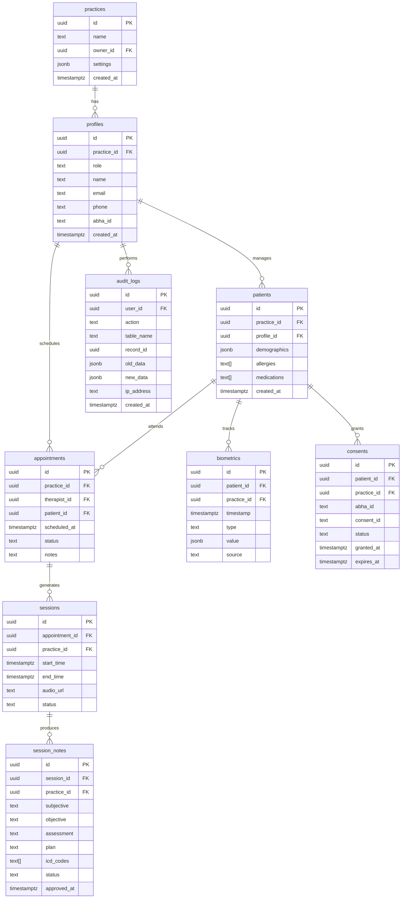

# Database Schema & Multi-Tenant Security

# Database Schema & Multi-Tenant Security

## Overview

TherapyFlow uses a **shared database, shared schema** multi-tenancy model with Row Level Security (RLS) for data isolation. All tables include a `practice_id` column as the tenant identifier.

## Entity Relationship Diagram



## Table Definitions

### 1. practices (Tenant Root)

```sql
CREATE TABLE practices (
  id UUID PRIMARY KEY DEFAULT gen_random_uuid(),
  name TEXT NOT NULL,
  owner_id UUID REFERENCES profiles(id) ON DELETE SET NULL,
  settings JSONB DEFAULT '{}'::jsonb,
  created_at TIMESTAMPTZ DEFAULT now(),
  updated_at TIMESTAMPTZ DEFAULT now()
);

CREATE INDEX idx_practices_owner ON practices(owner_id);

-- RLS Policies
ALTER TABLE practices ENABLE ROW LEVEL SECURITY;

CREATE POLICY "Users can view their own practice"
  ON practices FOR SELECT
  USING (id = (SELECT practice_id FROM profiles WHERE id = auth.uid()));

CREATE POLICY "Practice owners can update their practice"
  ON practices FOR UPDATE
  USING (owner_id = auth.uid());
```

### 2. profiles (User Metadata)

```sql
CREATE TYPE user_role AS ENUM ('admin', 'therapist', 'patient', 'staff');

CREATE TABLE profiles (
  id UUID PRIMARY KEY REFERENCES auth.users(id) ON DELETE CASCADE,
  practice_id UUID REFERENCES practices(id) ON DELETE CASCADE,
  role user_role NOT NULL,
  name TEXT NOT NULL,
  email TEXT UNIQUE NOT NULL,
  phone TEXT,
  abha_id TEXT UNIQUE,  -- ABDM Health ID
  avatar_url TEXT,
  created_at TIMESTAMPTZ DEFAULT now(),
  updated_at TIMESTAMPTZ DEFAULT now()
);

CREATE INDEX idx_profiles_practice ON profiles(practice_id);
CREATE INDEX idx_profiles_role ON profiles(role);
CREATE INDEX idx_profiles_abha ON profiles(abha_id) WHERE abha_id IS NOT NULL;

-- RLS Policies
ALTER TABLE profiles ENABLE ROW LEVEL SECURITY;

CREATE POLICY "Users can view profiles in their practice"
  ON profiles FOR SELECT
  USING (practice_id = (SELECT practice_id FROM profiles WHERE id = auth.uid()));

CREATE POLICY "Users can update their own profile"
  ON profiles FOR UPDATE
  USING (id = auth.uid());

CREATE POLICY "Admins can manage all profiles in their practice"
  ON profiles FOR ALL
  USING (
    practice_id = (SELECT practice_id FROM profiles WHERE id = auth.uid())
    AND (SELECT role FROM profiles WHERE id = auth.uid()) = 'admin'
  );
```

### 3. patients

```sql
CREATE TABLE patients (
  id UUID PRIMARY KEY DEFAULT gen_random_uuid(),
  practice_id UUID NOT NULL REFERENCES practices(id) ON DELETE CASCADE,
  profile_id UUID UNIQUE REFERENCES profiles(id) ON DELETE CASCADE,
  demographics JSONB DEFAULT '{}'::jsonb,  -- age, gender, occupation, etc.
  allergies TEXT[] DEFAULT '{}',
  medications TEXT[] DEFAULT '{}',
  emergency_contact JSONB,
  created_at TIMESTAMPTZ DEFAULT now(),
  updated_at TIMESTAMPTZ DEFAULT now()
);

CREATE INDEX idx_patients_practice ON patients(practice_id);
CREATE INDEX idx_patients_profile ON patients(profile_id);

-- RLS Policies
ALTER TABLE patients ENABLE ROW LEVEL SECURITY;

CREATE POLICY "Therapists can view patients in their practice"
  ON patients FOR SELECT
  USING (
    practice_id = (SELECT practice_id FROM profiles WHERE id = auth.uid())
    AND (SELECT role FROM profiles WHERE id = auth.uid()) IN ('therapist', 'admin')
  );

CREATE POLICY "Patients can view their own record"
  ON patients FOR SELECT
  USING (profile_id = auth.uid());

CREATE POLICY "Therapists can manage patients"
  ON patients FOR ALL
  USING (
    practice_id = (SELECT practice_id FROM profiles WHERE id = auth.uid())
    AND (SELECT role FROM profiles WHERE id = auth.uid()) IN ('therapist', 'admin')
  );
```

### 4. appointments

```sql
CREATE TYPE appointment_status AS ENUM ('scheduled', 'confirmed', 'completed', 'cancelled', 'no_show');

CREATE TABLE appointments (
  id UUID PRIMARY KEY DEFAULT gen_random_uuid(),
  practice_id UUID NOT NULL REFERENCES practices(id) ON DELETE CASCADE,
  therapist_id UUID NOT NULL REFERENCES profiles(id) ON DELETE CASCADE,
  patient_id UUID NOT NULL REFERENCES patients(id) ON DELETE CASCADE,
  scheduled_at TIMESTAMPTZ NOT NULL,
  duration_minutes INTEGER DEFAULT 60,
  status appointment_status DEFAULT 'scheduled',
  notes TEXT,
  created_at TIMESTAMPTZ DEFAULT now(),
  updated_at TIMESTAMPTZ DEFAULT now()
);

CREATE INDEX idx_appointments_practice ON appointments(practice_id);
CREATE INDEX idx_appointments_therapist ON appointments(therapist_id, scheduled_at);
CREATE INDEX idx_appointments_patient ON appointments(patient_id, scheduled_at);
CREATE INDEX idx_appointments_status ON appointments(status);

-- RLS Policies
ALTER TABLE appointments ENABLE ROW LEVEL SECURITY;

CREATE POLICY "Therapists can view appointments in their practice"
  ON appointments FOR SELECT
  USING (
    practice_id = (SELECT practice_id FROM profiles WHERE id = auth.uid())
    AND (SELECT role FROM profiles WHERE id = auth.uid()) IN ('therapist', 'admin')
  );

CREATE POLICY "Patients can view their own appointments"
  ON appointments FOR SELECT
  USING (
    patient_id IN (SELECT id FROM patients WHERE profile_id = auth.uid())
  );

CREATE POLICY "Therapists can manage appointments"
  ON appointments FOR ALL
  USING (
    practice_id = (SELECT practice_id FROM profiles WHERE id = auth.uid())
    AND (SELECT role FROM profiles WHERE id = auth.uid()) IN ('therapist', 'admin')
  );
```

### 5. sessions

```sql
CREATE TYPE session_status AS ENUM ('in_progress', 'completed', 'cancelled');

CREATE TABLE sessions (
  id UUID PRIMARY KEY DEFAULT gen_random_uuid(),
  appointment_id UUID NOT NULL REFERENCES appointments(id) ON DELETE CASCADE,
  practice_id UUID NOT NULL REFERENCES practices(id) ON DELETE CASCADE,
  start_time TIMESTAMPTZ NOT NULL DEFAULT now(),
  end_time TIMESTAMPTZ,
  audio_url TEXT,  -- Supabase Storage path
  audio_duration_seconds INTEGER,
  status session_status DEFAULT 'in_progress',
  created_at TIMESTAMPTZ DEFAULT now(),
  updated_at TIMESTAMPTZ DEFAULT now()
);

CREATE INDEX idx_sessions_practice ON sessions(practice_id);
CREATE INDEX idx_sessions_appointment ON sessions(appointment_id);
CREATE INDEX idx_sessions_status ON sessions(status);

-- RLS Policies
ALTER TABLE sessions ENABLE ROW LEVEL SECURITY;

CREATE POLICY "Therapists can view sessions in their practice"
  ON sessions FOR SELECT
  USING (
    practice_id = (SELECT practice_id FROM profiles WHERE id = auth.uid())
    AND (SELECT role FROM profiles WHERE id = auth.uid()) IN ('therapist', 'admin')
  );

CREATE POLICY "Therapists can manage sessions"
  ON sessions FOR ALL
  USING (
    practice_id = (SELECT practice_id FROM profiles WHERE id = auth.uid())
    AND (SELECT role FROM profiles WHERE id = auth.uid()) IN ('therapist', 'admin')
  );
```

### 6. session_notes (SOAP Format)

```sql
CREATE TYPE note_status AS ENUM ('draft', 'approved', 'archived');

CREATE TABLE session_notes (
  id UUID PRIMARY KEY DEFAULT gen_random_uuid(),
  session_id UUID NOT NULL REFERENCES sessions(id) ON DELETE CASCADE,
  practice_id UUID NOT NULL REFERENCES practices(id) ON DELETE CASCADE,
  subjective TEXT,  -- Patient's reported symptoms/feelings
  objective TEXT,   -- Therapist's observations + biometric data
  assessment TEXT,  -- Diagnosis/clinical impression
  plan TEXT,        -- Treatment plan/interventions
  icd_codes TEXT[] DEFAULT '{}',  -- ICD-10 diagnostic codes
  status note_status DEFAULT 'draft',
  approved_by UUID REFERENCES profiles(id),
  approved_at TIMESTAMPTZ,
  created_at TIMESTAMPTZ DEFAULT now(),
  updated_at TIMESTAMPTZ DEFAULT now()
);

CREATE INDEX idx_session_notes_practice ON session_notes(practice_id);
CREATE INDEX idx_session_notes_session ON session_notes(session_id);
CREATE INDEX idx_session_notes_status ON session_notes(status);

-- RLS Policies
ALTER TABLE session_notes ENABLE ROW LEVEL SECURITY;

CREATE POLICY "Therapists can view approved notes in their practice"
  ON session_notes FOR SELECT
  USING (
    practice_id = (SELECT practice_id FROM profiles WHERE id = auth.uid())
    AND (
      status = 'approved'
      OR (SELECT role FROM profiles WHERE id = auth.uid()) IN ('therapist', 'admin')
    )
  );

CREATE POLICY "Therapists can manage notes"
  ON session_notes FOR ALL
  USING (
    practice_id = (SELECT practice_id FROM profiles WHERE id = auth.uid())
    AND (SELECT role FROM profiles WHERE id = auth.uid()) IN ('therapist', 'admin')
  );
```

### 7. biometrics (BioSync Data)

```sql
CREATE TYPE biometric_type AS ENUM ('hrv', 'sleep', 'activity', 'heart_rate', 'steps', 'calories');

CREATE TABLE biometrics (
  id UUID PRIMARY KEY DEFAULT gen_random_uuid(),
  patient_id UUID NOT NULL REFERENCES patients(id) ON DELETE CASCADE,
  practice_id UUID NOT NULL REFERENCES practices(id) ON DELETE CASCADE,
  timestamp TIMESTAMPTZ NOT NULL,
  type biometric_type NOT NULL,
  value JSONB NOT NULL,  -- Flexible schema for different metrics
  source TEXT,  -- 'google_health_connect', 'apple_healthkit', 'manual'
  created_at TIMESTAMPTZ DEFAULT now()
);

CREATE INDEX idx_biometrics_practice ON biometrics(practice_id);
CREATE INDEX idx_biometrics_patient_time ON biometrics(patient_id, timestamp DESC);
CREATE INDEX idx_biometrics_type ON biometrics(type);
CREATE INDEX idx_biometrics_value_gin ON biometrics USING gin(value);  -- For JSONB queries

-- Partitioning by month for scalability
CREATE TABLE biometrics_2026_01 PARTITION OF biometrics
  FOR VALUES FROM ('2026-01-01') TO ('2026-02-01');
-- Add more partitions as needed

-- RLS Policies
ALTER TABLE biometrics ENABLE ROW LEVEL SECURITY;

CREATE POLICY "Therapists can view biometrics in their practice"
  ON biometrics FOR SELECT
  USING (
    practice_id = (SELECT practice_id FROM profiles WHERE id = auth.uid())
    AND (SELECT role FROM profiles WHERE id = auth.uid()) IN ('therapist', 'admin')
  );

CREATE POLICY "Patients can view their own biometrics"
  ON biometrics FOR SELECT
  USING (
    patient_id IN (SELECT id FROM patients WHERE profile_id = auth.uid())
  );

CREATE POLICY "Mobile app can insert biometrics"
  ON biometrics FOR INSERT
  WITH CHECK (
    patient_id IN (SELECT id FROM patients WHERE profile_id = auth.uid())
  );
```

### 8. consents (ABDM/HIECM)

```sql
CREATE TYPE consent_status AS ENUM ('pending', 'granted', 'denied', 'revoked', 'expired');

CREATE TABLE consents (
  id UUID PRIMARY KEY DEFAULT gen_random_uuid(),
  patient_id UUID NOT NULL REFERENCES patients(id) ON DELETE CASCADE,
  practice_id UUID NOT NULL REFERENCES practices(id) ON DELETE CASCADE,
  abha_id TEXT NOT NULL,  -- ABDM Health ID
  consent_id TEXT UNIQUE,  -- HIECM consent artifact ID
  purpose TEXT NOT NULL,  -- 'clinical_care', 'research', etc.
  status consent_status DEFAULT 'pending',
  granted_at TIMESTAMPTZ,
  expires_at TIMESTAMPTZ,
  revoked_at TIMESTAMPTZ,
  consent_artifact JSONB,  -- Full HIECM consent JSON
  created_at TIMESTAMPTZ DEFAULT now(),
  updated_at TIMESTAMPTZ DEFAULT now()
);

CREATE INDEX idx_consents_practice ON consents(practice_id);
CREATE INDEX idx_consents_patient ON consents(patient_id);
CREATE INDEX idx_consents_abha ON consents(abha_id);
CREATE INDEX idx_consents_status ON consents(status);

-- RLS Policies
ALTER TABLE consents ENABLE ROW LEVEL SECURITY;

CREATE POLICY "Therapists can view consents in their practice"
  ON consents FOR SELECT
  USING (
    practice_id = (SELECT practice_id FROM profiles WHERE id = auth.uid())
    AND (SELECT role FROM profiles WHERE id = auth.uid()) IN ('therapist', 'admin')
  );

CREATE POLICY "Patients can view their own consents"
  ON consents FOR SELECT
  USING (
    patient_id IN (SELECT id FROM patients WHERE profile_id = auth.uid())
  );
```

### 9. audit_logs (Compliance)

```sql
CREATE TABLE audit_logs (
  id UUID PRIMARY KEY DEFAULT gen_random_uuid(),
  user_id UUID REFERENCES profiles(id) ON DELETE SET NULL,
  action TEXT NOT NULL,  -- 'SELECT', 'INSERT', 'UPDATE', 'DELETE'
  table_name TEXT NOT NULL,
  record_id UUID,
  old_data JSONB,
  new_data JSONB,
  ip_address INET,
  user_agent TEXT,
  created_at TIMESTAMPTZ DEFAULT now()
);

CREATE INDEX idx_audit_logs_user ON audit_logs(user_id, created_at DESC);
CREATE INDEX idx_audit_logs_table ON audit_logs(table_name, created_at DESC);
CREATE INDEX idx_audit_logs_record ON audit_logs(record_id);

-- RLS Policies (append-only, admins can read)
ALTER TABLE audit_logs ENABLE ROW LEVEL SECURITY;

CREATE POLICY "Anyone can insert audit logs"
  ON audit_logs FOR INSERT
  WITH CHECK (true);

CREATE POLICY "Admins can view audit logs"
  ON audit_logs FOR SELECT
  USING (
    (SELECT role FROM profiles WHERE id = auth.uid()) = 'admin'
  );
```

## Database Functions & Triggers

### Auto-Update Timestamps

```sql
CREATE OR REPLACE FUNCTION update_updated_at_column()
RETURNS TRIGGER AS $$
BEGIN
  NEW.updated_at = now();
  RETURN NEW;
END;
$$ LANGUAGE plpgsql;

-- Apply to all tables with updated_at
CREATE TRIGGER update_practices_updated_at BEFORE UPDATE ON practices
  FOR EACH ROW EXECUTE FUNCTION update_updated_at_column();

CREATE TRIGGER update_profiles_updated_at BEFORE UPDATE ON profiles
  FOR EACH ROW EXECUTE FUNCTION update_updated_at_column();

-- Repeat for other tables...
```

### Audit Log Trigger

```sql
CREATE OR REPLACE FUNCTION log_audit_trail()
RETURNS TRIGGER AS $$
BEGIN
  IF TG_OP = 'DELETE' THEN
    INSERT INTO audit_logs (user_id, action, table_name, record_id, old_data, ip_address)
    VALUES (auth.uid(), 'DELETE', TG_TABLE_NAME, OLD.id, to_jsonb(OLD), inet_client_addr());
    RETURN OLD;
  ELSIF TG_OP = 'UPDATE' THEN
    INSERT INTO audit_logs (user_id, action, table_name, record_id, old_data, new_data, ip_address)
    VALUES (auth.uid(), 'UPDATE', TG_TABLE_NAME, NEW.id, to_jsonb(OLD), to_jsonb(NEW), inet_client_addr());
    RETURN NEW;
  ELSIF TG_OP = 'INSERT' THEN
    INSERT INTO audit_logs (user_id, action, table_name, record_id, new_data, ip_address)
    VALUES (auth.uid(), 'INSERT', TG_TABLE_NAME, NEW.id, to_jsonb(NEW), inet_client_addr());
    RETURN NEW;
  END IF;
END;
$$ LANGUAGE plpgsql SECURITY DEFINER;

-- Apply to sensitive tables
CREATE TRIGGER audit_session_notes AFTER INSERT OR UPDATE OR DELETE ON session_notes
  FOR EACH ROW EXECUTE FUNCTION log_audit_trail();

CREATE TRIGGER audit_patients AFTER INSERT OR UPDATE OR DELETE ON patients
  FOR EACH ROW EXECUTE FUNCTION log_audit_trail();

-- Repeat for other sensitive tables...
```

### Practice ID Injection (Helper Function)

```sql
CREATE OR REPLACE FUNCTION current_practice_id()
RETURNS UUID AS $$
  SELECT practice_id FROM profiles WHERE id = auth.uid();
$$ LANGUAGE sql STABLE;

-- Usage in queries:
-- SELECT * FROM patients WHERE practice_id = current_practice_id();
```

## Seed Data (Development)

```sql
-- Create test practice
INSERT INTO practices (id, name, owner_id)
VALUES ('00000000-0000-0000-0000-000000000001', 'Test Practice', NULL);

-- Create test therapist
INSERT INTO auth.users (id, email)
VALUES ('00000000-0000-0000-0000-000000000002', 'therapist@test.com');

INSERT INTO profiles (id, practice_id, role, name, email)
VALUES (
  '00000000-0000-0000-0000-000000000002',
  '00000000-0000-0000-0000-000000000001',
  'therapist',
  'Dr. Test Therapist',
  'therapist@test.com'
);

-- Update practice owner
UPDATE practices SET owner_id = '00000000-0000-0000-0000-000000000002'
WHERE id = '00000000-0000-0000-0000-000000000001';

-- Create test patient
INSERT INTO auth.users (id, email)
VALUES ('00000000-0000-0000-0000-000000000003', 'patient@test.com');

INSERT INTO profiles (id, practice_id, role, name, email)
VALUES (
  '00000000-0000-0000-0000-000000000003',
  '00000000-0000-0000-0000-000000000001',
  'patient',
  'Test Patient',
  'patient@test.com'
);

INSERT INTO patients (id, practice_id, profile_id, demographics)
VALUES (
  '00000000-0000-0000-0000-000000000004',
  '00000000-0000-0000-0000-000000000001',
  '00000000-0000-0000-0000-000000000003',
  '{"age": 28, "gender": "female", "occupation": "software engineer"}'::jsonb
);
```

## Migration Strategy

### Initial Setup

```bash
# Initialize Supabase project
npx supabase init

# Create migration
npx supabase migration new initial_schema

# Apply migration locally
npx supabase db reset

# Push to remote
npx supabase db push
```

### Schema Changes

```bash
# Create new migration
npx supabase migration new add_biometrics_partitions

# Test locally
npx supabase db reset

# Deploy to staging
npx supabase db push --db-url $STAGING_DB_URL

# Deploy to production (after approval)
npx supabase db push --db-url $PRODUCTION_DB_URL
```

## Performance Optimization

### Query Patterns

```sql
-- Efficient: Uses index on (practice_id, scheduled_at)
SELECT * FROM appointments
WHERE practice_id = current_practice_id()
  AND scheduled_at >= now()
ORDER BY scheduled_at ASC
LIMIT 10;

-- Inefficient: Full table scan
SELECT * FROM appointments
WHERE therapist_id = auth.uid()
ORDER BY scheduled_at DESC;  -- Missing composite index

-- Add index:
CREATE INDEX idx_appointments_therapist_time ON appointments(therapist_id, scheduled_at DESC);
```

### Connection Pooling

```typescript
// supabase/config.ts
import { createClient } from '@supabase/supabase-js'

export const supabase = createClient(
  process.env.NEXT_PUBLIC_SUPABASE_URL!,
  process.env.NEXT_PUBLIC_SUPABASE_ANON_KEY!,
  {
    db: {
      schema: 'public',
    },
    auth: {
      persistSession: true,
      autoRefreshToken: true,
    },
    global: {
      headers: {
        'x-application-name': 'therapyflow-web',
      },
    },
  }
)
```

## Security Checklist

- [x] RLS enabled on all tables
- [x] Policies enforce `practice_id` isolation
- [x] Audit logging on sensitive tables
- [x] Encryption at rest (Supabase default)
- [x] TLS 1.3 for all connections
- [x] Service role key never exposed to client
- [x] JWT tokens expire after 1 hour
- [x] MFA enforced for therapists
- [x] Soft deletes with `deleted_at` column
- [x] Data retention policies configured
- [x] Backup strategy (daily, 28-day retention)
- [x] Disaster recovery plan documented

## Testing Strategy

### Unit Tests (SQL)

```sql
-- Test RLS policy: Therapist can only see their practice's patients
BEGIN;
  SET LOCAL role TO authenticated;
  SET LOCAL request.jwt.claims TO '{"sub": "therapist-uuid", "role": "therapist"}';
  
  SELECT COUNT(*) FROM patients;  -- Should return only practice's patients
  
  -- Attempt to access another practice's patient
  SELECT * FROM patients WHERE practice_id = 'other-practice-uuid';  -- Should return 0 rows
ROLLBACK;
```

### Integration Tests (TypeScript)

```typescript
import { createClient } from '@supabase/supabase-js'

describe('Multi-tenant isolation', () => {
  it('should not allow therapist to access other practice data', async () => {
    const therapist1 = createClient(url, anonKey, {
      auth: { persistSession: false },
    })
    await therapist1.auth.signInWithPassword({
      email: 'therapist1@practice1.com',
      password: 'password',
    })

    const { data, error } = await therapist1
      .from('patients')
      .select('*')
      .eq('practice_id', 'practice2-uuid')

    expect(data).toHaveLength(0)  // RLS blocks access
  })
})
```

## Monitoring & Alerts

### Slow Query Alerts

```sql
-- Enable pg_stat_statements extension
CREATE EXTENSION IF NOT EXISTS pg_stat_statements;

-- Query to find slow queries
SELECT
  query,
  calls,
  total_exec_time,
  mean_exec_time,
  max_exec_time
FROM pg_stat_statements
WHERE mean_exec_time > 100  -- > 100ms average
ORDER BY mean_exec_time DESC
LIMIT 10;
```

### RLS Policy Violations

```sql
-- Monitor failed RLS checks (requires logging)
SELECT
  user_id,
  table_name,
  COUNT(*) as violation_count
FROM audit_logs
WHERE action = 'RLS_VIOLATION'
  AND created_at > now() - interval '1 day'
GROUP BY user_id, table_name
ORDER BY violation_count DESC;
```

## Disaster Recovery

### Backup Strategy

- **Automated Backups**: Daily at 2 AM IST (Supabase Team plan)
- **Retention**: 28 days
- **Point-in-Time Recovery**: Available (additional $100/mo per 7 days)
- **Manual Backups**: Before major migrations

### Restore Procedure

```bash
# Download backup
npx supabase db dump --db-url $PRODUCTION_DB_URL > backup.sql

# Restore to new instance
psql $NEW_DB_URL < backup.sql

# Verify data integrity
psql $NEW_DB_URL -c "SELECT COUNT(*) FROM practices;"
```

## Compliance Documentation

### Data Retention Policy

| Data Type | Retention Period | Deletion Method |
|-----------|------------------|-----------------|
| **Session Notes** | 7 years (Indian law) | Soft delete, then hard delete |
| **Audio Recordings** | 1 year | Move to cold storage, then delete |
| **Biometric Data** | 2 years | Hard delete |
| **Audit Logs** | 7 years | Archive to S3 Glacier |
| **User Accounts** | Until deletion request | Hard delete after 30-day grace period |

### ABDM Compliance

- **ABHA ID**: Stored in `profiles.abha_id` and `consents.abha_id`
- **Consent Artifacts**: Stored in `consents.consent_artifact` (JSONB)
- **HIECM Integration**: Edge Function calls HIECM API for consent verification
- **Data Sharing**: Only with explicit patient consent (tracked in `consents` table)

## Next Steps

1. **Implement Schema**: Run migrations in Supabase
2. **Test RLS Policies**: Write unit tests for each policy
3. **Seed Data**: Create test practices, therapists, patients
4. **Performance Testing**: Load test with 10,000 concurrent users
5. **Security Audit**: Penetration testing by third-party firm
6. **Documentation**: API docs for frontend developers