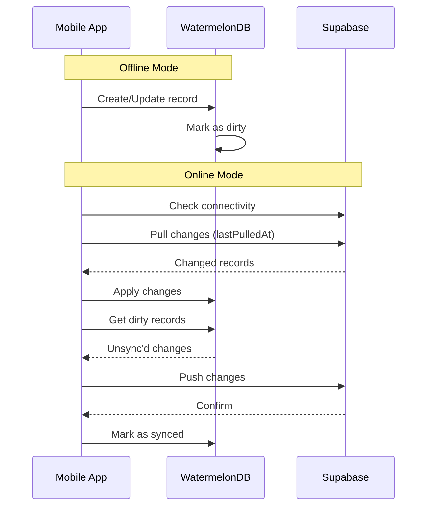

# Frontend Implementation - Mobile (React Native with Expo)

# Frontend Implementation - Mobile (React Native with Expo)

## Overview

The mobile application is built with React Native using Expo SDK 52+ for both iOS and Android. It provides therapists with on-the-go access to clinical workflows and enables patients to sync wearable data.

## Project Structure

```
mobile/
├── app/
│   ├── (auth)/
│   │   ├── login.tsx
│   │   ├── signup.tsx
│   │   └── _layout.tsx
│   ├── (tabs)/
│   │   ├── index.tsx  # Dashboard
│   │   ├── patients.tsx
│   │   ├── appointments.tsx
│   │   ├── sessions.tsx
│   │   └── _layout.tsx
│   ├── patients/
│   │   ├── [id].tsx
│   │   └── new.tsx
│   ├── sessions/
│   │   ├── [id]/
│   │   │   ├── index.tsx
│   │   │   └── record.tsx
│   │   └── notes/
│   │       └── [id].tsx
│   └── _layout.tsx
├── components/
│   ├── ui/  # Reusable UI components
│   ├── dashboard/
│   │   ├── StatsCard.tsx
│   │   ├── AppointmentList.tsx
│   │   └── QuickActions.tsx
│   ├── patients/
│   │   ├── PatientCard.tsx
│   │   ├── PatientForm.tsx
│   │   └── PatientSearch.tsx
│   ├── sessions/
│   │   ├── AudioRecorder.tsx
│   │   ├── NoteEditor.tsx
│   │   └── BiometricInsights.tsx
│   └── shared/
│       ├── LoadingSpinner.tsx
│       └── ErrorBoundary.tsx
├── lib/
│   ├── supabase/
│   │   ├── client.ts
│   │   └── sync.ts  # Offline sync logic
│   ├── storage/
│   │   ├── secure-store.ts
│   │   └── watermelon.ts  # WatermelonDB setup
│   ├── health/
│   │   ├── health-connect.ts  # Android
│   │   └── healthkit.ts  # iOS
│   ├── hooks/
│   │   ├── useAuth.ts
│   │   ├── usePatients.ts
│   │   ├── useOfflineSync.ts
│   │   └── useHealthData.ts
│   └── utils/
│       ├── date.ts
│       └── validation.ts
├── models/  # WatermelonDB models
│   ├── Patient.ts
│   ├── Appointment.ts
│   ├── Session.ts
│   └── schema.ts
├── app.json
├── eas.json
├── package.json
└── tsconfig.json
```

## Technology Stack

| Component | Technology | Version | Justification |
|-----------|-----------|---------|---------------|
| **Framework** | Expo | SDK 52+ | Managed workflow, OTA updates, faster iteration |
| **Navigation** | Expo Router | 4.0+ | File-based routing, deep linking, type-safe |
| **UI Library** | React Native Paper | 5.x | Material Design, accessibility, theming |
| **State** | Zustand | 5.x | Lightweight, simple API, DevTools support |
| **Server State** | TanStack Query | 5.x | Caching, optimistic updates, offline support |
| **Forms** | React Hook Form | 7.x | Performance, validation, minimal re-renders |
| **Validation** | Zod | 3.x | Type-safe schemas, runtime validation |
| **Offline DB** | WatermelonDB | 0.28+ | Reactive, fast, SQLite-based, sync support |
| **Secure Storage** | expo-secure-store | 13.x | Keychain/Keystore integration |
| **Audio** | expo-av | 14.x | Recording, playback, background support |
| **Health (iOS)** | react-native-health | 1.x | HealthKit integration |
| **Health (Android)** | expo-health-connect | 1.x | Health Connect integration |
| **Notifications** | expo-notifications | 0.28+ | Local & push notifications |
| **Build** | EAS Build | Latest | Cloud builds, app signing |
| **Updates** | EAS Update | Latest | OTA updates, rollback support |

## Mobile App Wireframes

### Login Screen (Mobile)

```wireframe
<!DOCTYPE html>
<html>
<head>
<style>
* { margin: 0; padding: 0; box-sizing: border-box; font-family: -apple-system, BlinkMacSystemFont, 'Segoe UI', sans-serif; }
body { background: #f5f5f5; display: flex; justify-content: center; align-items: center; min-height: 100vh; padding: 20px; }
.phone-frame { width: 375px; height: 667px; background: white; border-radius: 40px; box-shadow: 0 10px 40px rgba(0,0,0,0.2); padding: 20px; display: flex; flex-direction: column; overflow: hidden; }
.status-bar { height: 20px; display: flex; justify-content: space-between; align-items: center; font-size: 12px; color: #000; margin-bottom: 20px; }
.content { flex: 1; display: flex; flex-direction: column; justify-content: center; padding: 0 20px; }
.logo-container { text-align: center; margin-bottom: 48px; }
.logo-icon { width: 80px; height: 80px; background: linear-gradient(135deg, #667eea 0%, #764ba2 100%); border-radius: 20px; margin: 0 auto 16px; display: flex; align-items: center; justify-content: center; color: white; font-size: 36px; font-weight: 700; }
.logo-text { font-size: 24px; font-weight: 700; color: #111827; }
.logo-subtitle { font-size: 14px; color: #6b7280; margin-top: 4px; }
.form-group { margin-bottom: 20px; }
.label { display: block; font-size: 14px; font-weight: 500; color: #374151; margin-bottom: 8px; }
.input { width: 100%; padding: 16px; border: 1px solid #d1d5db; border-radius: 12px; font-size: 16px; background: #f9fafb; }
.input:focus { outline: none; border-color: #667eea; background: white; }
.forgot-link { text-align: right; margin-top: 8px; }
.forgot-link a { color: #667eea; font-size: 14px; text-decoration: none; }
.button { width: 100%; padding: 16px; border-radius: 12px; font-size: 16px; font-weight: 600; cursor: pointer; border: none; margin-top: 8px; }
.button-primary { background: linear-gradient(135deg, #667eea 0%, #764ba2 100%); color: white; }
.divider { margin: 24px 0; text-align: center; color: #9ca3af; font-size: 14px; position: relative; }
.divider::before, .divider::after { content: ''; position: absolute; top: 50%; width: 40%; height: 1px; background: #e5e7eb; }
.divider::before { left: 0; }
.divider::after { right: 0; }
.button-outline { background: white; color: #374151; border: 1px solid #d1d5db; display: flex; align-items: center; justify-content: center; gap: 8px; }
.signup-link { text-align: center; margin-top: 24px; font-size: 14px; color: #6b7280; }
.signup-link a { color: #667eea; font-weight: 500; text-decoration: none; }
</style>
</head>
<body>
<div class="phone-frame">
  <div class="status-bar">
    <span>9:41</span>
    <span>●●●●● 100%</span>
  </div>
  
  <div class="content">
    <div class="logo-container">
      <div class="logo-icon">TF</div>
      <div class="logo-text">TherapyFlow AI</div>
      <div class="logo-subtitle">Your Practice, Simplified</div>
    </div>
    
    <form data-element-id="login-form">
      <div class="form-group">
        <label class="label" for="email">Email Address</label>
        <input type="email" id="email" class="input" placeholder="therapist@example.com" data-element-id="email-input" />
      </div>
      
      <div class="form-group">
        <label class="label" for="password">Password</label>
        <input type="password" id="password" class="input" placeholder="••••••••" data-element-id="password-input" />
        <div class="forgot-link">
          <a href="#" data-element-id="forgot-password">Forgot password?</a>
        </div>
      </div>
      
      <button type="submit" class="button button-primary" data-element-id="login-button">
        Sign In
      </button>
    </form>
    
    <div class="divider">OR</div>
    
    <button class="button button-outline" data-element-id="google-login">
      <svg width="20" height="20" viewBox="0 0 20 20"><path fill="#4285F4" d="M19.6 10.23c0-.82-.1-1.39-.25-2.04H10v3.68h5.5c-.12.83-.53 1.7-1.12 2.37v2.08h1.8c1.06-1.03 1.67-2.54 1.67-4.09z"/><path fill="#34A853" d="M10 20c2.7 0 4.96-.89 6.62-2.42l-1.8-2.08c-.86.58-1.96.92-3.32.92-2.55 0-4.71-1.72-5.48-4.04H3.9v2.15A9.996 9.996 0 0010 20z"/><path fill="#FBBC05" d="M4.52 11.38c-.2-.58-.31-1.2-.31-1.84s.11-1.26.31-1.84V5.55H2.18A9.996 9.996 0 000 10c0 1.61.39 3.14 1.08 4.49l2.34-2.11z"/><path fill="#EA4335" d="M10 3.96c1.44 0 2.73.49 3.75 1.46l2.81-2.81C14.96.99 12.7 0 10 0 6.09 0 2.71 2.24 1.08 5.49l2.34 2.11C4.29 5.68 6.45 3.96 10 3.96z"/></svg>
      Continue with Google
    </button>
    
    <div class="signup-link">
      Don't have an account? <a href="#" data-element-id="signup-link">Sign up</a>
    </div>
  </div>
</div>
</body>
</html>
```

### Dashboard Screen (Mobile)

```wireframe
<!DOCTYPE html>
<html>
<head>
<style>
* { margin: 0; padding: 0; box-sizing: border-box; font-family: -apple-system, BlinkMacSystemFont, 'Segoe UI', sans-serif; }
body { background: #f5f5f5; display: flex; justify-content: center; align-items: center; min-height: 100vh; padding: 20px; }
.phone-frame { width: 375px; height: 667px; background: #f5f5f5; border-radius: 40px; box-shadow: 0 10px 40px rgba(0,0,0,0.2); padding: 20px; display: flex; flex-direction: column; overflow: hidden; }
.status-bar { height: 20px; display: flex; justify-content: space-between; align-items: center; font-size: 12px; color: #000; margin-bottom: 16px; }
.header { margin-bottom: 24px; }
.greeting { font-size: 14px; color: #6b7280; }
.user-name { font-size: 24px; font-weight: 700; color: #111827; margin-top: 4px; }
.stats-grid { display: grid; grid-template-columns: 1fr 1fr; gap: 12px; margin-bottom: 24px; }
.stat-card { background: white; border-radius: 16px; padding: 16px; box-shadow: 0 1px 3px rgba(0,0,0,0.1); }
.stat-icon { width: 40px; height: 40px; border-radius: 12px; display: flex; align-items: center; justify-content: center; margin-bottom: 12px; font-size: 20px; }
.stat-icon-blue { background: #dbeafe; }
.stat-icon-green { background: #dcfce7; }
.stat-icon-yellow { background: #fef3c7; }
.stat-icon-purple { background: #f3e8ff; }
.stat-value { font-size: 24px; font-weight: 700; color: #111827; }
.stat-label { font-size: 12px; color: #6b7280; margin-top: 4px; }
.section-header { display: flex; justify-content: space-between; align-items: center; margin-bottom: 16px; }
.section-title { font-size: 18px; font-weight: 600; color: #111827; }
.view-all { color: #667eea; font-size: 14px; font-weight: 500; text-decoration: none; }
.appointment-card { background: white; border-radius: 16px; padding: 16px; margin-bottom: 12px; box-shadow: 0 1px 3px rgba(0,0,0,0.1); }
.appointment-time { font-size: 12px; color: #667eea; font-weight: 500; margin-bottom: 8px; }
.appointment-patient { font-size: 16px; font-weight: 600; color: #111827; margin-bottom: 4px; }
.appointment-type { font-size: 14px; color: #6b7280; }
.badge { display: inline-block; padding: 4px 8px; border-radius: 6px; font-size: 11px; font-weight: 500; margin-top: 8px; }
.badge-scheduled { background: #dbeafe; color: #1e40af; }
.tab-bar { background: white; border-radius: 24px 24px 0 0; padding: 12px 0; display: flex; justify-content: space-around; box-shadow: 0 -2px 10px rgba(0,0,0,0.1); }
.tab-item { display: flex; flex-direction: column; align-items: center; gap: 4px; padding: 8px 16px; color: #9ca3af; font-size: 11px; }
.tab-item.active { color: #667eea; }
.fab { position: absolute; bottom: 80px; right: 20px; width: 56px; height: 56px; border-radius: 28px; background: linear-gradient(135deg, #667eea 0%, #764ba2 100%); color: white; display: flex; align-items: center; justify-content: center; font-size: 24px; box-shadow: 0 4px 12px rgba(102, 126, 234, 0.4); }
</style>
</head>
<body>
<div class="phone-frame">
  <div class="status-bar">
    <span>9:41</span>
    <span>●●●●● 100%</span>
  </div>
  
  <div class="header">
    <div class="greeting">Good morning,</div>
    <div class="user-name">Dr. Priya</div>
  </div>
  
  <div class="stats-grid">
    <div class="stat-card">
      <div class="stat-icon stat-icon-blue">📅</div>
      <div class="stat-value">8</div>
      <div class="stat-label">Today's Sessions</div>
    </div>
    <div class="stat-card">
      <div class="stat-icon stat-icon-green">👥</div>
      <div class="stat-value">142</div>
      <div class="stat-label">Active Patients</div>
    </div>
    <div class="stat-card">
      <div class="stat-icon stat-icon-yellow">📝</div>
      <div class="stat-value">3</div>
      <div class="stat-label">Pending Notes</div>
    </div>
    <div class="stat-card">
      <div class="stat-icon stat-icon-purple">⏱️</div>
      <div class="stat-value">24h</div>
      <div class="stat-label">Time Saved</div>
    </div>
  </div>
  
  <div class="section-header">
    <div class="section-title">Upcoming</div>
    <a href="#" class="view-all" data-element-id="view-all">View All</a>
  </div>
  
  <div style="flex: 1; overflow-y: auto;">
    <div class="appointment-card" data-element-id="appointment-1">
      <div class="appointment-time">TODAY, 10:00 AM</div>
      <div class="appointment-patient">Rahul Sharma</div>
      <div class="appointment-type">Follow-up Session</div>
      <span class="badge badge-scheduled">Scheduled</span>
    </div>
    
    <div class="appointment-card" data-element-id="appointment-2">
      <div class="appointment-time">TODAY, 2:00 PM</div>
      <div class="appointment-patient">Priya Patel</div>
      <div class="appointment-type">Initial Consultation</div>
      <span class="badge badge-scheduled">Scheduled</span>
    </div>
    
    <div class="appointment-card" data-element-id="appointment-3">
      <div class="appointment-time">TOMORROW, 11:00 AM</div>
      <div class="appointment-patient">Amit Kumar</div>
      <div class="appointment-type">Therapy Session</div>
      <span class="badge badge-scheduled">Scheduled</span>
    </div>
  </div>
  
  <div class="fab" data-element-id="new-appointment">+</div>
  
  <div class="tab-bar">
    <div class="tab-item active" data-element-id="tab-home">
      <svg width="24" height="24" fill="currentColor" viewBox="0 0 20 20"><path d="M10.707 2.293a1 1 0 00-1.414 0l-7 7a1 1 0 001.414 1.414L4 10.414V17a1 1 0 001 1h2a1 1 0 001-1v-2a1 1 0 011-1h2a1 1 0 011 1v2a1 1 0 001 1h2a1 1 0 001-1v-6.586l.293.293a1 1 0 001.414-1.414l-7-7z"/></svg>
      <span>Home</span>
    </div>
    <div class="tab-item" data-element-id="tab-patients">
      <svg width="24" height="24" fill="currentColor" viewBox="0 0 20 20"><path d="M9 6a3 3 0 11-6 0 3 3 0 016 0zM17 6a3 3 0 11-6 0 3 3 0 016 0zM12.93 17c.046-.327.07-.66.07-1a6.97 6.97 0 00-1.5-4.33A5 5 0 0119 16v1h-6.07zM6 11a5 5 0 015 5v1H1v-1a5 5 0 015-5z"/></svg>
      <span>Patients</span>
    </div>
    <div class="tab-item" data-element-id="tab-calendar">
      <svg width="24" height="24" fill="currentColor" viewBox="0 0 20 20"><path fill-rule="evenodd" d="M6 2a1 1 0 00-1 1v1H4a2 2 0 00-2 2v10a2 2 0 002 2h12a2 2 0 002-2V6a2 2 0 00-2-2h-1V3a1 1 0 10-2 0v1H7V3a1 1 0 00-1-1zm0 5a1 1 0 000 2h8a1 1 0 100-2H6z" clip-rule="evenodd"/></svg>
      <span>Calendar</span>
    </div>
    <div class="tab-item" data-element-id="tab-profile">
      <svg width="24" height="24" fill="currentColor" viewBox="0 0 20 20"><path fill-rule="evenodd" d="M10 9a3 3 0 100-6 3 3 0 000 6zm-7 9a7 7 0 1114 0H3z" clip-rule="evenodd"/></svg>
      <span>Profile</span>
    </div>
  </div>
</div>
</body>
</html>
```

### Session Recording Screen (Mobile)

```wireframe
<!DOCTYPE html>
<html>
<head>
<style>
* { margin: 0; padding: 0; box-sizing: border-box; font-family: -apple-system, BlinkMacSystemFont, 'Segoe UI', sans-serif; }
body { background: #f5f5f5; display: flex; justify-content: center; align-items: center; min-height: 100vh; padding: 20px; }
.phone-frame { width: 375px; height: 667px; background: white; border-radius: 40px; box-shadow: 0 10px 40px rgba(0,0,0,0.2); padding: 20px; display: flex; flex-direction: column; overflow: hidden; }
.status-bar { height: 20px; display: flex; justify-content: space-between; align-items: center; font-size: 12px; color: #000; margin-bottom: 16px; }
.nav-header { display: flex; align-items: center; gap: 12px; margin-bottom: 24px; }
.back-button { width: 32px; height: 32px; border-radius: 8px; background: #f3f4f6; display: flex; align-items: center; justify-content: center; cursor: pointer; }
.nav-title { font-size: 18px; font-weight: 600; color: #111827; }
.patient-card { background: linear-gradient(135deg, #667eea 0%, #764ba2 100%); border-radius: 16px; padding: 20px; margin-bottom: 24px; color: white; }
.patient-name { font-size: 20px; font-weight: 700; margin-bottom: 4px; }
.session-info { font-size: 14px; opacity: 0.9; }
.recorder-container { flex: 1; display: flex; flex-direction: column; justify-content: center; align-items: center; }
.timer { font-size: 56px; font-weight: 700; color: #111827; margin-bottom: 32px; letter-spacing: -2px; }
.waveform { width: 100%; height: 100px; background: #f3f4f6; border-radius: 12px; margin-bottom: 32px; display: flex; align-items: center; justify-content: center; color: #9ca3af; font-size: 14px; }
.recording-indicator { display: flex; align-items: center; gap: 8px; margin-bottom: 32px; }
.pulse { width: 12px; height: 12px; background: #dc2626; border-radius: 50%; animation: pulse 1.5s infinite; }
@keyframes pulse { 0%, 100% { opacity: 1; } 50% { opacity: 0.5; } }
.recording-text { font-size: 14px; color: #dc2626; font-weight: 500; }
.controls { display: flex; gap: 16px; justify-content: center; }
.control-button { width: 64px; height: 64px; border-radius: 32px; border: none; display: flex; align-items: center; justify-content: center; cursor: pointer; box-shadow: 0 4px 12px rgba(0,0,0,0.1); }
.button-pause { background: #f59e0b; color: white; }
.button-stop { background: #dc2626; color: white; }
.button-record { background: linear-gradient(135deg, #667eea 0%, #764ba2 100%); color: white; }
.notes-preview { background: #f9fafb; border-radius: 12px; padding: 16px; margin-top: 24px; }
.notes-title { font-size: 14px; font-weight: 600; color: #111827; margin-bottom: 8px; }
.notes-text { font-size: 12px; color: #6b7280; line-height: 1.5; }
</style>
</head>
<body>
<div class="phone-frame">
  <div class="status-bar">
    <span>9:41</span>
    <span>●●●●● 100%</span>
  </div>
  
  <div class="nav-header">
    <div class="back-button" data-element-id="back-button">
      <svg width="20" height="20" fill="currentColor" viewBox="0 0 20 20"><path fill-rule="evenodd" d="M12.707 5.293a1 1 0 010 1.414L9.414 10l3.293 3.293a1 1 0 01-1.414 1.414l-4-4a1 1 0 010-1.414l4-4a1 1 0 011.414 0z" clip-rule="evenodd"/></svg>
    </div>
    <div class="nav-title">Session Recording</div>
  </div>
  
  <div class="patient-card">
    <div class="patient-name">Rahul Sharma</div>
    <div class="session-info">Follow-up Session • 10:00 AM</div>
  </div>
  
  <div class="recorder-container">
    <div class="timer" data-element-id="timer">00:15:32</div>
    
    <div class="recording-indicator">
      <div class="pulse"></div>
      <span class="recording-text">Recording in progress</span>
    </div>
    
    <div class="waveform" data-element-id="waveform">
      Audio waveform visualization
    </div>
    
    <div class="controls">
      <button class="control-button button-pause" data-element-id="pause-button">
        <svg width="24" height="24" fill="currentColor" viewBox="0 0 20 20"><path fill-rule="evenodd" d="M18 10a8 8 0 11-16 0 8 8 0 0116 0zM7 8a1 1 0 012 0v4a1 1 0 11-2 0V8zm5-1a1 1 0 00-1 1v4a1 1 0 102 0V8a1 1 0 00-1-1z" clip-rule="evenodd"/></svg>
      </button>
      <button class="control-button button-stop" data-element-id="stop-button">
        <svg width="28" height="28" fill="currentColor" viewBox="0 0 20 20"><path fill-rule="evenodd" d="M10 18a8 8 0 100-16 8 8 0 000 16zM8 7a1 1 0 00-1 1v4a1 1 0 001 1h4a1 1 0 001-1V8a1 1 0 00-1-1H8z" clip-rule="evenodd"/></svg>
      </button>
    </div>
  </div>
  
  <div class="notes-preview">
    <div class="notes-title">Quick Notes</div>
    <div class="notes-text">Tap to add observations during the session...</div>
  </div>
  
  <div class="tab-bar">
    <div class="tab-item" data-element-id="tab-home">
      <svg width="24" height="24" fill="currentColor" viewBox="0 0 20 20"><path d="M10.707 2.293a1 1 0 00-1.414 0l-7 7a1 1 0 001.414 1.414L4 10.414V17a1 1 0 001 1h2a1 1 0 001-1v-2a1 1 0 011-1h2a1 1 0 011 1v2a1 1 0 001 1h2a1 1 0 001-1v-6.586l.293.293a1 1 0 001.414-1.414l-7-7z"/></svg>
      <span>Home</span>
    </div>
    <div class="tab-item" data-element-id="tab-patients">
      <svg width="24" height="24" fill="currentColor" viewBox="0 0 20 20"><path d="M9 6a3 3 0 11-6 0 3 3 0 016 0zM17 6a3 3 0 11-6 0 3 3 0 016 0zM12.93 17c.046-.327.07-.66.07-1a6.97 6.97 0 00-1.5-4.33A5 5 0 0119 16v1h-6.07zM6 11a5 5 0 015 5v1H1v-1a5 5 0 015-5z"/></svg>
      <span>Patients</span>
    </div>
    <div class="tab-item active" data-element-id="tab-sessions">
      <svg width="24" height="24" fill="currentColor" viewBox="0 0 20 20"><path fill-rule="evenodd" d="M7 4a3 3 0 016 0v4a3 3 0 11-6 0V4zm4 10.93A7.001 7.001 0 0017 8a1 1 0 10-2 0A5 5 0 015 8a1 1 0 00-2 0 7.001 7.001 0 006 6.93V17H6a1 1 0 100 2h8a1 1 0 100-2h-3v-2.07z" clip-rule="evenodd"/></svg>
      <span>Sessions</span>
    </div>
    <div class="tab-item" data-element-id="tab-profile">
      <svg width="24" height="24" fill="currentColor" viewBox="0 0 20 20"><path fill-rule="evenodd" d="M10 9a3 3 0 100-6 3 3 0 000 6zm-7 9a7 7 0 1114 0H3z" clip-rule="evenodd"/></svg>
      <span>Profile</span>
    </div>
  </div>
</div>
</body>
</html>
```

## Authentication Implementation

```typescript
// app/(auth)/login.tsx
import { useState } from 'react'
import { View, StyleSheet } from 'react-native'
import { TextInput, Button, Text } from 'react-native-paper'
import { useRouter } from 'expo-router'
import { supabase } from '@/lib/supabase/client'
import * as SecureStore from 'expo-secure-store'

export default function LoginScreen() {
  const router = useRouter()
  const [email, setEmail] = useState('')
  const [password, setPassword] = useState('')
  const [loading, setLoading] = useState(false)

  async function handleLogin() {
    setLoading(true)
    
    const { data, error } = await supabase.auth.signInWithPassword({
      email,
      password,
    })

    if (error) {
      alert(error.message)
      setLoading(false)
      return
    }

    // Store session securely
    await SecureStore.setItemAsync('session', JSON.stringify(data.session))
    
    router.replace('/(tabs)')
  }

  return (
    <View style={styles.container}>
      <Text variant="headlineLarge" style={styles.title}>
        TherapyFlow AI
      </Text>
      
      <TextInput
        label="Email"
        value={email}
        onChangeText={setEmail}
        autoCapitalize="none"
        keyboardType="email-address"
        style={styles.input}
      />
      
      <TextInput
        label="Password"
        value={password}
        onChangeText={setPassword}
        secureTextEntry
        style={styles.input}
      />
      
      <Button
        mode="contained"
        onPress={handleLogin}
        loading={loading}
        disabled={loading}
        style={styles.button}
      >
        Sign In
      </Button>
    </View>
  )
}
```

## Offline-First Architecture

### WatermelonDB Setup

```typescript
// models/schema.ts
import { appSchema, tableSchema } from '@nozbe/watermelondb'

export const schema = appSchema({
  version: 1,
  tables: [
    tableSchema({
      name: 'patients',
      columns: [
        { name: 'practice_id', type: 'string', isIndexed: true },
        { name: 'name', type: 'string' },
        { name: 'email', type: 'string', isOptional: true },
        { name: 'phone', type: 'string', isOptional: true },
        { name: 'demographics', type: 'string' }, // JSON string
        { name: 'synced_at', type: 'number', isOptional: true },
        { name: 'created_at', type: 'number' },
        { name: 'updated_at', type: 'number' },
      ],
    }),
    tableSchema({
      name: 'appointments',
      columns: [
        { name: 'practice_id', type: 'string', isIndexed: true },
        { name: 'therapist_id', type: 'string', isIndexed: true },
        { name: 'patient_id', type: 'string', isIndexed: true },
        { name: 'scheduled_at', type: 'number', isIndexed: true },
        { name: 'duration_minutes', type: 'number' },
        { name: 'status', type: 'string' },
        { name: 'notes', type: 'string', isOptional: true },
        { name: 'synced_at', type: 'number', isOptional: true },
        { name: 'created_at', type: 'number' },
        { name: 'updated_at', type: 'number' },
      ],
    }),
    tableSchema({
      name: 'sessions',
      columns: [
        { name: 'appointment_id', type: 'string', isIndexed: true },
        { name: 'practice_id', type: 'string', isIndexed: true },
        { name: 'start_time', type: 'number' },
        { name: 'end_time', type: 'number', isOptional: true },
        { name: 'audio_url', type: 'string', isOptional: true },
        { name: 'audio_duration_seconds', type: 'number', isOptional: true },
        { name: 'status', type: 'string' },
        { name: 'synced_at', type: 'number', isOptional: true },
        { name: 'created_at', type: 'number' },
        { name: 'updated_at', type: 'number' },
      ],
    }),
  ],
})
```

### Sync Strategy

```typescript
// lib/supabase/sync.ts
import { Database } from '@nozbe/watermelondb'
import { synchronize } from '@nozbe/watermelondb/sync'
import { supabase } from './client'

export async function syncDatabase(database: Database) {
  await synchronize({
    database,
    pullChanges: async ({ lastPulledAt, schemaVersion, migration }) => {
      const { data, error } = await supabase.functions.invoke('sync-pull', {
        body: {
          lastPulledAt,
          schemaVersion,
          migration,
        },
      })

      if (error) throw error

      return {
        changes: data.changes,
        timestamp: data.timestamp,
      }
    },
    pushChanges: async ({ changes, lastPulledAt }) => {
      const { error } = await supabase.functions.invoke('sync-push', {
        body: {
          changes,
          lastPulledAt,
        },
      })

      if (error) throw error
    },
  })
}
```

## Audio Recording (Background Support)

```typescript
// components/sessions/AudioRecorder.tsx
import { useState, useEffect } from 'react'
import { View, StyleSheet } from 'react-native'
import { Button, Text } from 'react-native-paper'
import { Audio } from 'expo-av'
import * as FileSystem from 'expo-file-system'
import { supabase } from '@/lib/supabase/client'

export function AudioRecorder({ sessionId }: { sessionId: string }) {
  const [recording, setRecording] = useState<Audio.Recording | null>(null)
  const [duration, setDuration] = useState(0)
  const [isRecording, setIsRecording] = useState(false)

  useEffect(() => {
    // Request permissions
    Audio.requestPermissionsAsync()
    
    // Configure audio mode for recording
    Audio.setAudioModeAsync({
      allowsRecordingIOS: true,
      playsInSilentModeIOS: true,
      staysActiveInBackground: true,
    })
  }, [])

  async function startRecording() {
    try {
      const { recording } = await Audio.Recording.createAsync(
        Audio.RecordingOptionsPresets.HIGH_QUALITY,
        (status) => {
          if (status.isRecording) {
            setDuration(Math.floor(status.durationMillis / 1000))
          }
        },
        100 // Update interval (ms)
      )

      setRecording(recording)
      setIsRecording(true)
    } catch (error) {
      console.error('Failed to start recording', error)
    }
  }

  async function stopRecording() {
    if (!recording) return

    setIsRecording(false)
    await recording.stopAndUnloadAsync()
    const uri = recording.getURI()

    if (!uri) return

    // Upload to Supabase Storage
    const fileName = `session-${sessionId}-${Date.now()}.m4a`
    const fileData = await FileSystem.readAsStringAsync(uri, {
      encoding: FileSystem.EncodingType.Base64,
    })

    const { data, error } = await supabase.storage
      .from('session-audio')
      .upload(fileName, decode(fileData), {
        contentType: 'audio/m4a',
      })

    if (error) {
      console.error('Upload failed', error)
      return
    }

    // Trigger AI processing
    await supabase.functions.invoke('transcribe-and-generate-note', {
      body: { sessionId, audioUrl: data.path },
    })

    setRecording(null)
  }

  return (
    <View style={styles.container}>
      <Text variant="displayLarge" style={styles.timer}>
        {formatDuration(duration)}
      </Text>

      {isRecording ? (
        <>
          <Button
            mode="contained"
            onPress={stopRecording}
            buttonColor="#dc2626"
            style={styles.button}
          >
            Stop & Generate Note
          </Button>
        </>
      ) : (
        <Button
          mode="contained"
          onPress={startRecording}
          style={styles.button}
        >
          Start Recording
        </Button>
      )}
    </View>
  )
}

function formatDuration(seconds: number): string {
  const hrs = Math.floor(seconds / 3600)
  const mins = Math.floor((seconds % 3600) / 60)
  const secs = seconds % 60
  return `${hrs.toString().padStart(2, '0')}:${mins.toString().padStart(2, '0')}:${secs.toString().padStart(2, '0')}`
}

function decode(base64: string): ArrayBuffer {
  const binary = atob(base64)
  const bytes = new Uint8Array(binary.length)
  for (let i = 0; i < binary.length; i++) {
    bytes[i] = binary.charCodeAt(i)
  }
  return bytes.buffer
}
```

## Push Notifications

```typescript
// lib/notifications/setup.ts
import * as Notifications from 'expo-notifications'
import * as Device from 'expo-device'
import { Platform } from 'react-native'
import { supabase } from '@/lib/supabase/client'

Notifications.setNotificationHandler({
  handleNotification: async () => ({
    shouldShowAlert: true,
    shouldPlaySound: true,
    shouldSetBadge: true,
  }),
})

export async function registerForPushNotifications() {
  if (!Device.isDevice) {
    return null
  }

  const { status: existingStatus } = await Notifications.getPermissionsAsync()
  let finalStatus = existingStatus

  if (existingStatus !== 'granted') {
    const { status } = await Notifications.requestPermissionsAsync()
    finalStatus = status
  }

  if (finalStatus !== 'granted') {
    return null
  }

  const token = await Notifications.getExpoPushTokenAsync({
    projectId: 'your-expo-project-id',
  })

  // Save token to Supabase
  await supabase
    .from('profiles')
    .update({ push_token: token.data })
    .eq('id', (await supabase.auth.getUser()).data.user?.id)

  if (Platform.OS === 'android') {
    Notifications.setNotificationChannelAsync('default', {
      name: 'default',
      importance: Notifications.AndroidImportance.MAX,
      vibrationPattern: [0, 250, 250, 250],
      lightColor: '#667eea',
    })
  }

  return token.data
}
```

## Offline Sync Strategy

### Sync Flow



### Conflict Resolution

```typescript
// lib/supabase/sync.ts
export async function resolveConflict(
  localRecord: any,
  remoteRecord: any
) {
  // Strategy: Last-write-wins based on updated_at
  if (localRecord.updated_at > remoteRecord.updated_at) {
    return { winner: 'local', record: localRecord }
  } else {
    return { winner: 'remote', record: remoteRecord }
  }
}
```

## Performance Optimization

### Image Caching

```typescript
// Use expo-image for better performance
import { Image } from 'expo-image'

<Image
  source={{ uri: patient.avatar_url }}
  placeholder={blurhash}
  contentFit="cover"
  transition={200}
  cachePolicy="memory-disk"
/>
```

### List Optimization

```typescript
// Use FlashList instead of FlatList
import { FlashList } from '@shopify/flash-list'

<FlashList
  data={patients}
  renderItem={({ item }) => <PatientCard patient={item} />}
  estimatedItemSize={100}
  keyExtractor={(item) => item.id}
/>
```

## Testing Strategy

### Unit Tests (Jest)

```typescript
// __tests__/components/AudioRecorder.test.tsx
import { render, fireEvent, waitFor } from '@testing-library/react-native'
import { AudioRecorder } from '@/components/sessions/AudioRecorder'

jest.mock('expo-av', () => ({
  Audio: {
    requestPermissionsAsync: jest.fn().mockResolvedValue({ status: 'granted' }),
    setAudioModeAsync: jest.fn(),
    Recording: {
      createAsync: jest.fn().mockResolvedValue({
        recording: {
          stopAndUnloadAsync: jest.fn(),
          getURI: jest.fn().mockReturnValue('file://test.m4a'),
        },
      }),
    },
  },
}))

describe('AudioRecorder', () => {
  it('should start recording when button pressed', async () => {
    const { getByText } = render(<AudioRecorder sessionId="test" />)
    
    const startButton = getByText('Start Recording')
    fireEvent.press(startButton)

    await waitFor(() => {
      expect(getByText('Stop & Generate Note')).toBeTruthy()
    })
  })
})
```

### E2E Tests (Detox)

```typescript
// e2e/session-recording.e2e.ts
describe('Session Recording Flow', () => {
  beforeAll(async () => {
    await device.launchApp()
  })

  it('should record session and generate note', async () => {
    // Login
    await element(by.id('email-input')).typeText('therapist@test.com')
    await element(by.id('password-input')).typeText('password')
    await element(by.id('login-button')).tap()

    // Navigate to session
    await element(by.id('tab-sessions')).tap()
    await element(by.id('appointment-1')).tap()
    await element(by.id('start-recording')).tap()

    // Wait 5 seconds
    await new Promise((resolve) => setTimeout(resolve, 5000))

    // Stop recording
    await element(by.id('stop-button')).tap()

    // Verify note generated
    await waitFor(element(by.text('AI Generated')))
      .toBeVisible()
      .withTimeout(30000)
  })
})
```

## Build Configuration

### EAS Build (eas.json)

```json
{
  "cli": {
    "version": ">= 13.2.0"
  },
  "build": {
    "development": {
      "developmentClient": true,
      "distribution": "internal",
      "ios": {
        "simulator": true
      }
    },
    "preview": {
      "distribution": "internal",
      "ios": {
        "simulator": false
      }
    },
    "production": {
      "autoIncrement": true,
      "env": {
        "EXPO_PUBLIC_SUPABASE_URL": "https://xxx.supabase.co",
        "EXPO_PUBLIC_SUPABASE_ANON_KEY": "eyJxxx"
      }
    }
  },
  "submit": {
    "production": {
      "ios": {
        "appleId": "your-apple-id@example.com",
        "ascAppId": "1234567890",
        "appleTeamId": "ABCDE12345"
      },
      "android": {
        "serviceAccountKeyPath": "./google-service-account.json",
        "track": "production"
      }
    }
  }
}
```

### App Configuration (app.json)

```json
{
  "expo": {
    "name": "TherapyFlow AI",
    "slug": "therapyflow-ai",
    "version": "1.0.0",
    "orientation": "portrait",
    "icon": "./assets/icon.png",
    "userInterfaceStyle": "automatic",
    "splash": {
      "image": "./assets/splash.png",
      "resizeMode": "contain",
      "backgroundColor": "#667eea"
    },
    "ios": {
      "supportsTablet": true,
      "bundleIdentifier": "ai.therapyflow.app",
      "infoPlist": {
        "NSHealthShareUsageDescription": "We need access to your health data to provide biometric insights.",
        "NSHealthUpdateUsageDescription": "We need to update your health data.",
        "NSMicrophoneUsageDescription": "We need access to your microphone to record therapy sessions.",
        "UIBackgroundModes": ["audio"]
      }
    },
    "android": {
      "adaptiveIcon": {
        "foregroundImage": "./assets/adaptive-icon.png",
        "backgroundColor": "#667eea"
      },
      "package": "ai.therapyflow.app",
      "permissions": [
        "android.permission.RECORD_AUDIO",
        "android.permission.health.READ_HEART_RATE",
        "android.permission.health.READ_STEPS",
        "android.permission.health.READ_SLEEP"
      ]
    },
    "plugins": [
      "expo-router",
      "expo-secure-store",
      "expo-av",
      "expo-health-connect",
      [
        "expo-build-properties",
        {
          "android": {
            "compileSdkVersion": 34,
            "targetSdkVersion": 34,
            "minSdkVersion": 26
          },
          "ios": {
            "deploymentTarget": "15.0"
          }
        }
      ]
    ],
    "extra": {
      "eas": {
        "projectId": "your-eas-project-id"
      }
    }
  }
}
```

## Platform-Specific Features

### iOS HealthKit Integration

```typescript
// lib/health/healthkit.ts
import AppleHealthKit, {
  HealthValue,
  HealthKitPermissions,
} from 'react-native-health'

const permissions: HealthKitPermissions = {
  permissions: {
    read: [
      AppleHealthKit.Constants.Permissions.HeartRate,
      AppleHealthKit.Constants.Permissions.Steps,
      AppleHealthKit.Constants.Permissions.SleepAnalysis,
      AppleHealthKit.Constants.Permissions.ActiveEnergyBurned,
    ],
    write: [],
  },
}

export async function initHealthKit() {
  return new Promise((resolve, reject) => {
    AppleHealthKit.initHealthKit(permissions, (error) => {
      if (error) {
        reject(error)
      } else {
        resolve(true)
      }
    })
  })
}

export async function getHeartRateData(startDate: Date, endDate: Date) {
  return new Promise<HealthValue[]>((resolve, reject) => {
    AppleHealthKit.getHeartRateSamples(
      { startDate: startDate.toISOString(), endDate: endDate.toISOString() },
      (error, results) => {
        if (error) {
          reject(error)
        } else {
          resolve(results)
        }
      }
    )
  })
}
```

### Android Health Connect Integration

```typescript
// lib/health/health-connect.ts
import {
  initialize,
  requestPermission,
  readRecords,
  SdkAvailabilityStatus,
} from 'expo-health-connect'

export async function initHealthConnect() {
  const isAvailable = await initialize()
  
  if (isAvailable !== SdkAvailabilityStatus.SDK_AVAILABLE) {
    throw new Error('Health Connect not available')
  }

  const granted = await requestPermission([
    { accessType: 'read', recordType: 'HeartRate' },
    { accessType: 'read', recordType: 'Steps' },
    { accessType: 'read', recordType: 'SleepSession' },
  ])

  return granted
}

export async function getHeartRateData(startTime: Date, endTime: Date) {
  const result = await readRecords('HeartRate', {
    timeRangeFilter: {
      operator: 'between',
      startTime: startTime.toISOString(),
      endTime: endTime.toISOString(),
    },
  })

  return result.records
}
```

## Security Implementation

### Secure Token Storage

```typescript
// lib/storage/secure-store.ts
import * as SecureStore from 'expo-secure-store'

export async function saveToken(key: string, value: string) {
  await SecureStore.setItemAsync(key, value, {
    keychainAccessible: SecureStore.WHEN_UNLOCKED,
  })
}

export async function getToken(key: string) {
  return await SecureStore.getItemAsync(key)
}

export async function deleteToken(key: string) {
  await SecureStore.deleteItemAsync(key)
}
```

### Biometric Authentication

```typescript
// lib/auth/biometric.ts
import * as LocalAuthentication from 'expo-local-authentication'

export async function authenticateWithBiometrics() {
  const hasHardware = await LocalAuthentication.hasHardwareAsync()
  if (!hasHardware) {
    return { success: false, error: 'No biometric hardware' }
  }

  const isEnrolled = await LocalAuthentication.isEnrolledAsync()
  if (!isEnrolled) {
    return { success: false, error: 'No biometrics enrolled' }
  }

  const result = await LocalAuthentication.authenticateAsync({
    promptMessage: 'Authenticate to access TherapyFlow',
    fallbackLabel: 'Use passcode',
    disableDeviceFallback: false,
  })

  return result
}
```

## Deployment

### Build Commands

```bash
# Development build
eas build --profile development --platform all

# Preview build (internal testing)
eas build --profile preview --platform all

# Production build
eas build --profile production --platform all

# Submit to stores
eas submit --platform ios
eas submit --platform android
```

### OTA Updates

```bash
# Publish update to production
eas update --branch production --message "Bug fixes and improvements"

# Rollback to previous version
eas update --branch production --message "Rollback" --republish
```

## App Store Metadata

### iOS App Store

- **App Name**: TherapyFlow AI - Practice Management
- **Subtitle**: AI-Powered Clinical Documentation
- **Keywords**: therapy, mental health, practice management, clinical notes, SOAP, therapist
- **Category**: Medical
- **Age Rating**: 17+ (Medical/Treatment Information)
- **Privacy Policy**: Required (link to website)

### Google Play Store

- **App Name**: TherapyFlow AI - Practice Management
- **Short Description**: AI-powered practice management for mental health therapists
- **Full Description**: (500 words highlighting features, ABDM compliance, security)
- **Category**: Medical
- **Content Rating**: Mature 17+
- **Data Safety**: Detailed disclosure of health data collection

## Next Steps

1. **Setup Expo Project**: Initialize with TypeScript + Expo Router
2. **Install Dependencies**: Supabase client, WatermelonDB, React Native Paper
3. **Configure Auth**: Implement Supabase Auth with secure storage
4. **Build Navigation**: Tab-based navigation with Expo Router
5. **Offline Sync**: Implement WatermelonDB + Supabase sync
6. **Audio Recording**: Implement background recording with expo-av
7. **Health Integration**: Implement HealthKit (iOS) + Health Connect (Android)
8. **Push Notifications**: Setup Expo Notifications
9. **Testing**: Unit tests + E2E tests with Detox
10. **Build & Deploy**: EAS Build + Submit to app stores