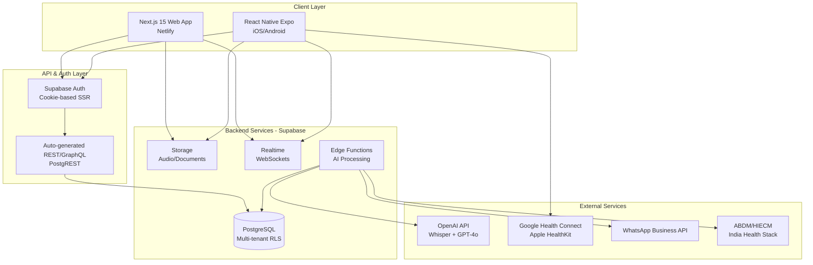
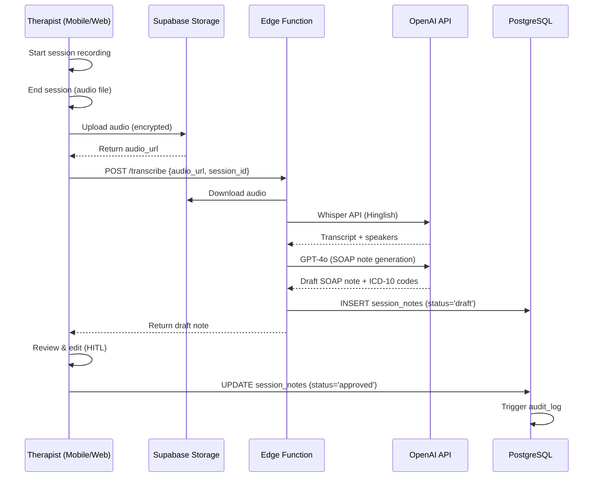
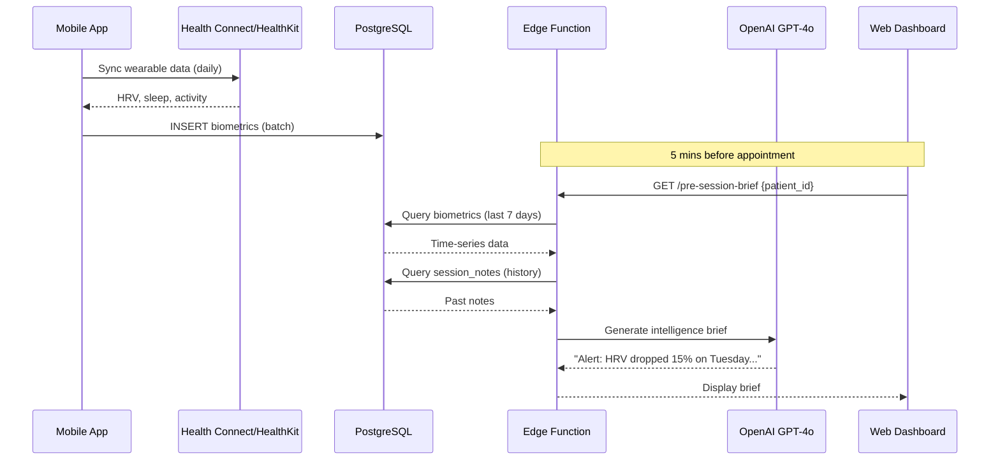
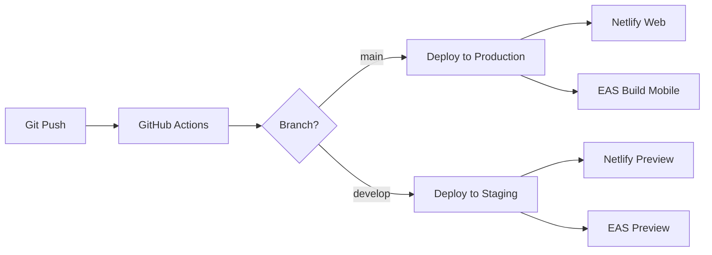

# System Architecture & Technical Stack

# System Architecture & Technical Stack

## Overview

TherapyFlow AI + BioSync is a multi-tenant SaaS platform for Indian mental health practitioners, combining practice management with AI-powered clinical documentation and wearable biometric integration.

## Architecture Diagram



## Technology Stack

### Frontend - Web (Next.js 15)

| Component | Technology | Justification |
|-----------|-----------|---------------|
| **Framework** | Next.js 15.5+ with App Router | Latest stable version with Turbopack, Server Components, Server Actions |
| **Language** | TypeScript 5.7+ | Type safety, better DX, reduced runtime errors |
| **Styling** | Tailwind CSS 4.0 | Utility-first, fast development, small bundle size |
| **UI Components** | shadcn/ui + Radix UI | Accessible, customizable, production-ready |
| **State Management** | Zustand + React Query | Lightweight, server state caching, optimistic updates |
| **Forms** | React Hook Form + Zod | Performance, validation, type-safe schemas |
| **Audio Recording** | MediaRecorder API | Native browser API, no dependencies |
| **Deployment** | Netlify | Edge functions, automatic deployments, CDN |

### Frontend - Mobile (React Native)

| Component | Technology | Justification |
|-----------|-----------|---------------|
| **Framework** | React Native 0.76+ with Expo SDK 52+ | Managed workflow, OTA updates, faster development |
| **Language** | TypeScript 5.7+ | Consistency with web, type safety |
| **Navigation** | Expo Router (file-based) | Consistent with Next.js, deep linking support |
| **State Management** | Zustand + TanStack Query | Same as web for code sharing |
| **UI Library** | React Native Paper + Tamagui | Material Design, cross-platform consistency |
| **Secure Storage** | expo-secure-store | Keychain (iOS) / Keystore (Android) integration |
| **Audio Recording** | expo-av | Background recording, permissions handling |
| **Health Data** | react-native-health (iOS)<br/>expo-health-connect (Android) | HealthKit & Health Connect integration |
| **Offline Sync** | WatermelonDB + Supabase sync | Offline-first, reactive, fast queries |
| **Deployment** | EAS Build + EAS Submit | Managed builds, app store automation |

### Backend - Supabase

| Component | Technology | Justification |
|-----------|-----------|---------------|
| **Database** | PostgreSQL 15+ | ACID compliance, JSON support, extensions |
| **Auth** | Supabase Auth (GoTrue) | Cookie-based SSR, MFA, OAuth, magic links |
| **Storage** | Supabase Storage (S3-compatible) | Encrypted, RLS-protected, CDN delivery |
| **Realtime** | Supabase Realtime (Phoenix) | WebSocket subscriptions, Postgres LISTEN/NOTIFY |
| **Functions** | Supabase Edge Functions (Deno) | Serverless, globally distributed, TypeScript |
| **Security** | Row Level Security (RLS) | Database-level multi-tenancy, HIPAA-ready |
| **Plan** | Team Plan ($599/mo) | HIPAA BAA, 28-day logs, SSO, priority support |

### AI Services

| Component | Technology | Justification |
|-----------|-----------|---------------|
| **Transcription** | OpenAI Whisper (large-v3) | Best Hinglish accuracy, speaker diarization |
| **Clinical Notes** | OpenAI GPT-4o | High reasoning, medical knowledge, structured output |
| **Embeddings** | OpenAI text-embedding-3-large | Future: semantic search on notes |
| **Vector Store** | pgvector (Supabase extension) | Native Postgres, no separate service |

### Infrastructure & DevOps

| Component | Technology | Justification |
|-----------|-----------|---------------|
| **Version Control** | GitHub | Industry standard, Actions integration |
| **CI/CD** | GitHub Actions + EAS Build | Automated testing, deployments |
| **Monitoring** | Sentry | Error tracking, performance monitoring |
| **Analytics** | PostHog (self-hosted on Supabase) | Privacy-first, event tracking |
| **Logging** | Supabase Log Drains → Datadog | Centralized logs, compliance audits |
| **Secrets** | GitHub Secrets + Supabase Vault | Encrypted, rotatable, audit trail |

## Data Flow Architecture

### Session Recording & Transcription Flow



### BioSync Pre-Session Intelligence Flow



## Security Architecture

### Multi-Tenant Isolation

- **Tenant Identifier**: `practice_id` (UUID) on all tables
- **RLS Policies**: Enforce `practice_id = current_user.practice_id` at database level
- **Auth Context**: JWT contains `practice_id` claim, injected by Supabase Auth
- **API Keys**: Separate `anon` (client) and `service_role` (server-only) keys per environment

### Encryption Strategy

| Data Type | At Rest | In Transit | Key Management |
|-----------|---------|------------|----------------|
| **Database** | AES-256 (Supabase default) | TLS 1.3 | Supabase managed |
| **Storage (audio/docs)** | AES-256 | TLS 1.3 | Supabase managed |
| **Mobile local storage** | Keychain/Keystore | N/A | OS-managed |
| **API calls** | N/A | TLS 1.3 + cert pinning | Let's Encrypt |
| **Backups** | AES-256 | TLS 1.3 | Supabase managed |

### Compliance Features

- **Audit Logging**: All data access/modifications logged to `audit_logs` table
- **Data Retention**: Configurable per practice (default: 7 years per Indian law)
- **Right to Erasure**: Soft delete with `deleted_at` timestamp, hard delete after retention period
- **Consent Management**: `consents` table tracks ABDM/HIECM consent artifacts
- **Access Controls**: RBAC with roles (admin, therapist, patient, staff)

## Scalability Considerations

### Database

- **Connection Pooling**: Supavisor (built-in) handles 500+ concurrent connections
- **Read Replicas**: Available on Team plan for analytics queries
- **Partitioning**: Time-based partitioning on `biometrics` table (monthly)
- **Indexes**: Composite indexes on `(practice_id, created_at)` for common queries

### Storage

- **CDN**: Cloudflare CDN for static assets and audio playback
- **Compression**: Audio files compressed to Opus format (50% size reduction)
- **Lifecycle Policies**: Archive old sessions to cold storage after 1 year

### Edge Functions

- **Regional Invocations**: Execute functions in Mumbai region (closest to DB)
- **Caching**: Redis-compatible caching for AI responses (deduplication)
- **Rate Limiting**: 100 requests/min per user, 1000/min per practice

## Development Workflow

### Local Development

```bash
# Web
cd web
npm install
npm run dev  # Next.js dev server with Turbopack

# Mobile
cd mobile
npm install
npx expo start  # Expo dev server

# Supabase (local)
npx supabase start  # Docker-based local instance
npx supabase db reset  # Reset with seed data
```

### Environment Variables

```bash
# .env.local (web/mobile)
NEXT_PUBLIC_SUPABASE_URL=https://xxx.supabase.co
NEXT_PUBLIC_SUPABASE_ANON_KEY=eyJxxx
SUPABASE_SERVICE_ROLE_KEY=eyJxxx  # Server-side only
OPENAI_API_KEY=sk-xxx  # Edge Functions only
WHATSAPP_API_KEY=xxx  # Edge Functions only
```

### Deployment Pipeline



## Cost Estimation (Monthly)

| Service | Plan | Cost (USD) | Notes |
|---------|------|------------|-------|
| **Supabase** | Team | $599 | HIPAA BAA, 8GB DB, 250GB egress |
| **Netlify** | Pro | $19 | 1TB bandwidth, edge functions |
| **OpenAI API** | Pay-as-you-go | ~$500 | Est. 1000 sessions/mo @ $0.50 each |
| **EAS Build** | Production | $99 | Unlimited builds |
| **Sentry** | Team | $26 | Error tracking |
| **Domain & SSL** | - | $15 | therapyflow.ai |
| **WhatsApp Business** | Pay-per-message | ~$100 | Est. 5000 messages/mo |
| **Total** | - | **~$1,358** | For 100 active practices |

**Per-Practice Cost**: ~$13.58/mo (at 100 practices)  
**Target Pricing**: ₹999/mo (~$12) for Pro, ₹1,999/mo (~$24) for BioSync

## Phase 1 MVP Scope

### Included
- ✅ Therapist authentication (email/password + MFA)
- ✅ Practice management (single practice per therapist initially)
- ✅ Patient CRUD
- ✅ Appointment scheduling (basic calendar)
- ✅ Session recording (web + mobile)
- ✅ AI transcription (Whisper)
- ✅ SOAP note generation (GPT-4o)
- ✅ HITL approval workflow
- ✅ Basic dashboard (upcoming appointments, recent notes)

### Deferred to Phase 2
- ⏸️ BioSync wearable integration
- ⏸️ WhatsApp bot
- ⏸️ ABDM/HIECM integration
- ⏸️ Payment processing (UPI)
- ⏸️ Multi-therapist practices
- ⏸️ EAP partnerships

## Success Metrics

### Technical KPIs
- **Uptime**: 99.9% (measured via Supabase + Netlify)
- **API Latency**: p95 < 500ms (Supabase queries)
- **Transcription Accuracy**: >95% (manual review of 100 samples)
- **Mobile Crash Rate**: <0.1% (Sentry)
- **Time to First Byte (TTFB)**: <200ms (Netlify CDN)

### Business KPIs
- **Billable Hours Saved**: 30 mins/session (therapist self-reported)
- **Session Adherence**: 80% (patients attend scheduled appointments)
- **Hallucination Rate**: <2% edit distance on AI-generated notes
- **User Activation**: 70% of signups complete first session within 7 days

## Risk Mitigation

| Risk | Mitigation |
|------|------------|
| **AI Hallucination** | HITL approval mandatory, link to source transcript, confidence scores |
| **Data Breach** | RLS + encryption + audit logs + penetration testing (quarterly) |
| **Vendor Lock-in** | Supabase is open-source, self-hostable; export scripts for data portability |
| **Regulatory Changes** | Legal review (quarterly), compliance automation (Vanta/Drata) |
| **Scalability Bottleneck** | Load testing (k6), read replicas, caching, CDN |
| **OpenAI API Downtime** | Fallback to manual note-taking, queue for retry |

## Next Steps

1. **Infrastructure Setup**: Provision Supabase Team plan, configure Netlify
2. **Database Schema**: Implement tables + RLS policies + seed data
3. **Auth Flow**: Implement Supabase Auth with cookie-based SSR
4. **Web MVP**: Build Next.js app (dashboard, scheduling, recording)
5. **Mobile MVP**: Build Expo app (recording, offline sync)
6. **AI Integration**: Implement Edge Functions for Whisper + GPT-4o
7. **Testing**: Unit tests (Jest), E2E tests (Playwright/Detox), load tests (k6)
8. **Deployment**: CI/CD pipeline, staging environment, production launch