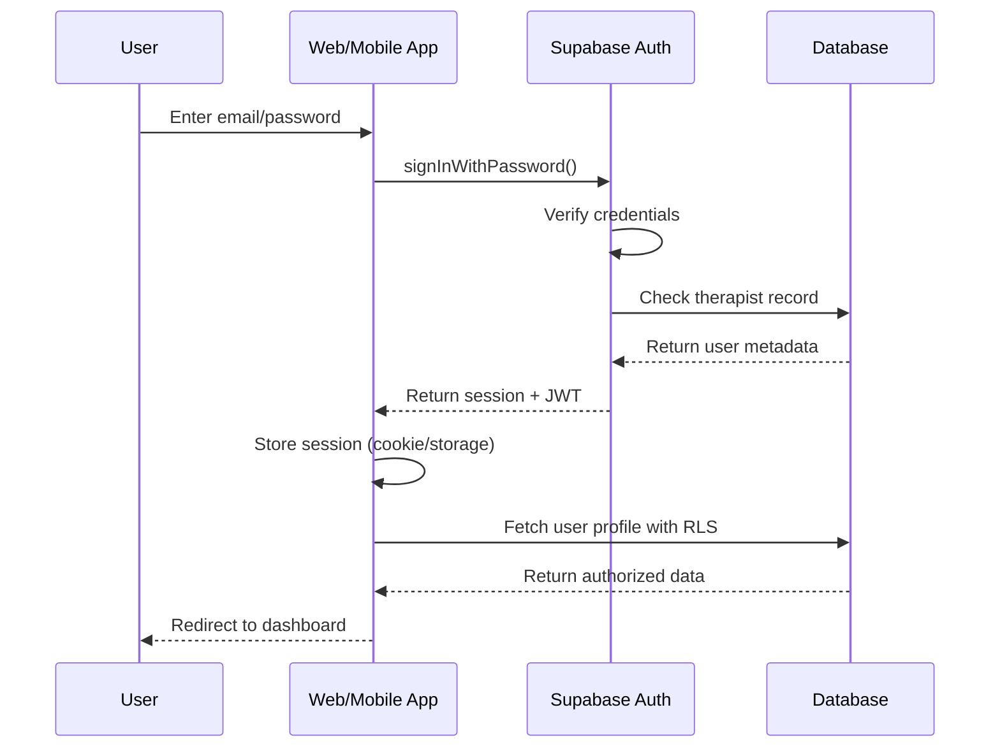

# [Backend] Authentication System Implementation

## Overview
Implement complete authentication system using Supabase Auth with email/password, MFA support, and role-based access control.

## Context
Reference: `spec:df06a57d-bbce-4623-8e1c-cd129f15f2cf/9205213b-7551-4266-99b1-915e78111a8d` (Frontend Web - Authentication)

Authentication is the foundation for secure access to TherapyFlow, supporting therapists, admins, and future patient portal access.

## Authentication Flow



## Technical Requirements

### 1. Supabase Auth Configuration
- Email/password authentication enabled
- Email confirmation required for new signups
- Password requirements: min 8 chars, 1 uppercase, 1 number
- JWT expiry: 1 hour (access), 30 days (refresh)
- MFA support enabled (TOTP)

### 2. Custom Email Templates
Create branded email templates in Supabase dashboard:

**Confirmation Email:**
```html
<h2>Welcome to TherapyFlow!</h2>
<p>Click the link below to confirm your email:</p>
<a href="{{ .ConfirmationURL }}">Confirm Email</a>
```

**Password Reset:**
```html
<h2>Reset Your Password</h2>
<p>Click the link below to reset your password:</p>
<a href="{{ .ConfirmationURL }}">Reset Password</a>
```

### 3. Database Trigger for User Creation
Automatically create therapist record when auth user is created:
```sql
CREATE OR REPLACE FUNCTION public.handle_new_user()
RETURNS trigger AS $$
BEGIN
  INSERT INTO public.therapists (id, email, full_name, user_id)
  VALUES (
    NEW.id,
    NEW.email,
    NEW.raw_user_meta_data->>'full_name',
    NEW.id
  );
  RETURN NEW;
END;
$$ LANGUAGE plpgsql SECURITY DEFINER;

CREATE TRIGGER on_auth_user_created
  AFTER INSERT ON auth.users
  FOR EACH ROW EXECUTE FUNCTION public.handle_new_user();
```

### 4. Web App Auth Implementation
Implement auth helpers in `lib/supabase/auth.ts`:
- `signUp(email, password, metadata)`
- `signIn(email, password)`
- `signOut()`
- `resetPassword(email)`
- `updatePassword(newPassword)`
- `getSession()`
- `refreshSession()`

### 5. Mobile App Auth Implementation
Implement auth with secure storage:
- Use `expo-secure-store` for token storage
- Implement biometric authentication (Face ID/Fingerprint)
- Handle deep links for email confirmation

### 6. Protected Routes
**Web (Next.js Middleware):**
```typescript
// middleware.ts
export async function middleware(request: NextRequest) {
  const { supabase, response } = createMiddlewareClient({ req, res });
  const { data: { session } } = await supabase.auth.getSession();
  
  if (!session && request.nextUrl.pathname.startsWith('/dashboard')) {
    return NextResponse.redirect(new URL('/login', request.url));
  }
  
  return response;
}
```

**Mobile (Expo Router):**
```typescript
// app/_layout.tsx
export default function RootLayout() {
  const { session, loading } = useAuth();
  
  if (loading) return <LoadingScreen />;
  if (!session) return <Redirect href="/login" />;
  
  return <Slot />;
}
```

### 7. Role-Based Access Control
Store user role in therapist table:
- `therapist`: Standard access
- `admin`: Full org access
- `owner`: Billing and org management

Implement role checks in components:
```typescript
const { user, role } = useAuth();
if (role === 'admin') {
  // Show admin features
}
```

### 8. Session Management
- Auto-refresh tokens before expiry
- Handle session expiry gracefully
- Implement "Remember Me" functionality
- Log out on all devices feature

## Acceptance Criteria
- [ ] Email/password authentication working
- [ ] Email confirmation flow tested
- [ ] Password reset flow tested
- [ ] MFA enrollment and verification working
- [ ] Custom email templates configured
- [ ] Database trigger creates therapist record
- [ ] Web app auth helpers implemented
- [ ] Mobile app auth with secure storage implemented
- [ ] Protected routes working on web and mobile
- [ ] Role-based access control implemented
- [ ] Session refresh working automatically
- [ ] Logout functionality working
- [ ] Error handling for all auth scenarios
- [ ] Auth state persists across app restarts

## Dependencies
- Requires: Supabase Project Setup
- Requires: Database Schema Implementation

## Estimated Effort
6-8 hours