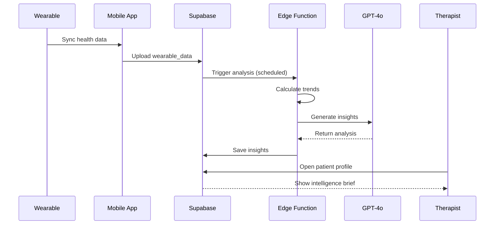

# [Backend] BioSync Agent - Wearable Data Processing

## Overview
Implement the BioSync Agent that processes wearable data from Google Health Connect and Apple HealthKit to generate pre-session intelligence briefs for therapists.

## Context
Reference: `spec:df06a57d-bbce-4623-8e1c-cd129f15f2cf/6bd132cb-1ab4-4b86-a1d0-dfb2c8f5ef62` (BioSync Wearable Integration)
Reference: `spec:df06a57d-bbce-4623-8e1c-cd129f15f2cf/ee62c42e-f732-4ef7-a4d1-6108899dc8a5` (Backend Services)

BioSync provides objective physiological data to complement subjective patient reports, enabling data-driven therapy.

## Data Processing Flow



## Technical Requirements

### 1. Wearable Data Schema
```sql
CREATE TABLE wearable_data (
  id uuid PRIMARY KEY DEFAULT gen_random_uuid(),
  patient_id uuid REFERENCES patients(id) ON DELETE CASCADE,
  data_type text NOT NULL, -- 'heart_rate', 'hrv', 'sleep', 'steps', 'activity'
  metrics jsonb NOT NULL,
  recorded_at timestamptz NOT NULL,
  synced_at timestamptz DEFAULT now(),
  source text -- 'google_health_connect', 'apple_healthkit'
);

CREATE INDEX idx_wearable_patient_time ON wearable_data(patient_id, recorded_at DESC);
CREATE INDEX idx_wearable_type ON wearable_data(data_type, recorded_at DESC);
```

### 2. Data Sync Edge Function
Create `supabase/functions/sync-wearable-data/index.ts`:
```typescript
serve(async (req) => {
  const { patientId, dataPoints } = await req.json();
  
  // Batch insert wearable data
  const { error } = await supabase
    .from('wearable_data')
    .insert(
      dataPoints.map(dp => ({
        patient_id: patientId,
        data_type: dp.type,
        metrics: dp.metrics,
        recorded_at: dp.timestamp,
        source: dp.source
      }))
    );
  
  if (error) throw error;
  
  // Trigger analysis if new data
  await triggerAnalysis(patientId);
  
  return new Response(JSON.stringify({ success: true }));
});
```

### 3. Trend Analysis Edge Function
Create `supabase/functions/analyze-biosync/index.ts`:
```typescript
serve(async (req) => {
  const { patientId, sessionDate } = await req.json();
  
  // Fetch last 7 days of data
  const { data: wearableData } = await supabase
    .from('wearable_data')
    .select('*')
    .eq('patient_id', patientId)
    .gte('recorded_at', new Date(Date.now() - 7 * 24 * 60 * 60 * 1000))
    .order('recorded_at', { ascending: false });
  
  // Calculate trends
  const trends = calculateTrends(wearableData);
  
  // Generate insights with GPT-4o
  const insights = await generateInsights(trends, patientId);
  
  // Save to database
  await supabase
    .from('biosync_insights')
    .insert({
      patient_id: patientId,
      session_date: sessionDate,
      trends: trends,
      insights: insights,
      alert_level: determineAlertLevel(trends)
    });
  
  return new Response(JSON.stringify(insights));
});

function calculateTrends(data: WearableData[]) {
  const grouped = groupBy(data, 'data_type');
  
  return {
    sleep: {
      avg_duration: average(grouped.sleep, 'metrics.duration'),
      trend: calculateTrend(grouped.sleep, 'metrics.duration'),
      quality_score: average(grouped.sleep, 'metrics.quality')
    },
    hrv: {
      avg_hrv: average(grouped.heart_rate, 'metrics.hrv'),
      trend: calculateTrend(grouped.heart_rate, 'metrics.hrv'),
      stress_indicator: calculateStressScore(grouped.heart_rate)
    },
    activity: {
      avg_steps: average(grouped.steps, 'metrics.count'),
      trend: calculateTrend(grouped.steps, 'metrics.count'),
      sedentary_hours: calculateSedentaryTime(grouped.activity)
    }
  };
}

async function generateInsights(trends: any, patientId: string) {
  // Fetch patient history
  const { data: patient } = await supabase
    .from('patients')
    .select('demographics, clinical_history')
    .eq('id', patientId)
    .single();
  
  const prompt = `Analyze the following wearable data trends for a therapy patient:

Sleep: ${trends.sleep.avg_duration} hours/night (${trends.sleep.trend})
HRV: ${trends.hrv.avg_hrv} ms (${trends.hrv.trend})
Activity: ${trends.activity.avg_steps} steps/day (${trends.activity.trend})

Patient Context: ${patient.demographics.age} years old, ${patient.clinical_history}

Generate a brief pre-session intelligence report highlighting:
1. Key physiological changes
2. Potential correlations with mental health
3. Suggested discussion points for therapist

Keep it concise (3-4 bullet points).`;

  const completion = await openai.chat.completions.create({
    model: 'gpt-4o',
    messages: [
      { role: 'system', content: 'You are a clinical psychologist analyzing wearable data.' },
      { role: 'user', content: prompt }
    ],
    temperature: 0.5
  });
  
  return completion.choices[0].message.content;
}
```

### 4. Alert System
Implement alerts for concerning patterns:
```typescript
function determineAlertLevel(trends: any): 'none' | 'low' | 'medium' | 'high' {
  let score = 0;
  
  // Sleep deprivation
  if (trends.sleep.avg_duration < 5) score += 3;
  else if (trends.sleep.avg_duration < 6) score += 2;
  
  // HRV decline (stress indicator)
  if (trends.hrv.trend === 'declining' && trends.hrv.avg_hrv < 30) score += 3;
  
  // Sedentary behavior
  if (trends.activity.sedentary_hours > 10) score += 2;
  
  if (score >= 6) return 'high';
  if (score >= 4) return 'medium';
  if (score >= 2) return 'low';
  return 'none';
}
```

### 5. Pre-Session Intelligence Brief UI
Display in therapist dashboard before session:
```typescript
// Component: PreSessionBrief.tsx
export function PreSessionBrief({ patientId, sessionDate }) {
  const { data: insights } = useQuery({
    queryKey: ['biosync-insights', patientId, sessionDate],
    queryFn: () => fetchBioSyncInsights(patientId, sessionDate)
  });
  
  return (
    <Card className={`border-l-4 ${alertColors[insights.alert_level]}`}>
      <CardHeader>
        <CardTitle>BioSync Intelligence Brief</CardTitle>
      </CardHeader>
      <CardContent>
        <div className="space-y-2">
          {insights.insights.map((insight, i) => (
            <div key={i} className="flex items-start gap-2">
              <AlertCircle className="w-4 h-4 mt-1" />
              <p>{insight}</p>
            </div>
          ))}
        </div>
        <Button onClick={() => viewDetailedTrends()}>
          View Detailed Trends
        </Button>
      </CardContent>
    </Card>
  );
}
```

### 6. Scheduled Analysis Job
Run analysis daily for upcoming sessions:
```sql
SELECT cron.schedule(
  'daily-biosync-analysis',
  '0 6 * * *', -- 6 AM daily
  $$
  SELECT net.http_post(
    url := 'https://your-project.supabase.co/functions/v1/analyze-biosync',
    headers := '{"Authorization": "Bearer ' || current_setting('app.service_role_key') || '"}'::jsonb,
    body := jsonb_build_object(
      'sessionDate', current_date + interval '1 day'
    )
  );
  $$
);
```

## Acceptance Criteria
- [ ] Wearable data schema created
- [ ] Data sync Edge Function deployed
- [ ] Trend analysis Edge Function deployed
- [ ] Insight generation with GPT-4o working
- [ ] Alert system implemented
- [ ] Pre-session intelligence brief UI created
- [ ] Scheduled analysis job configured
- [ ] Mobile app syncs data successfully
- [ ] Trends calculated accurately
- [ ] Insights are clinically relevant
- [ ] Alert thresholds validated with clinicians
- [ ] Performance: Analysis completes in < 10 seconds

## Dependencies
- Requires: Database Schema Implementation
- Requires: OpenAI Integration
- Requires: Mobile App Setup

## Estimated Effort
10-12 hours