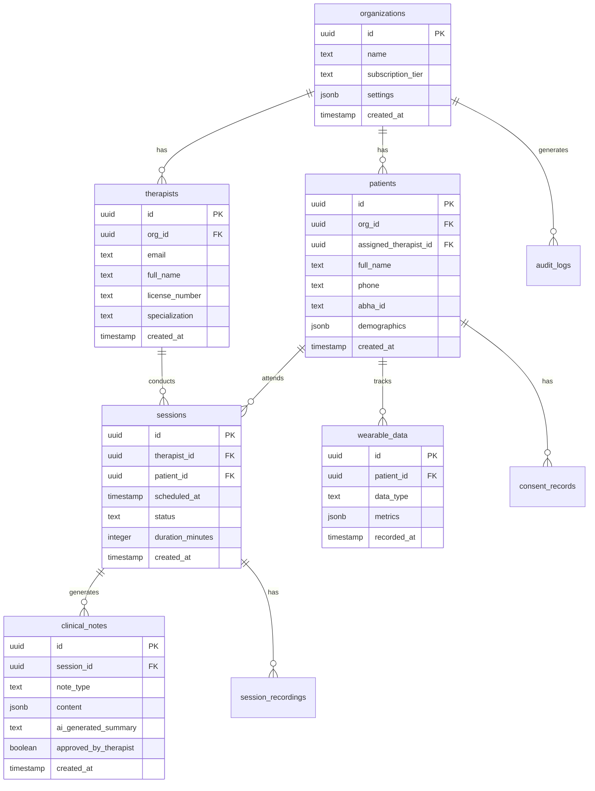

# [Backend] Database Schema Implementation

## Overview
Implement the complete PostgreSQL database schema with all tables, relationships, indexes, and constraints for TherapyFlow AI + BioSync.

## Context
Reference: `spec:df06a57d-bbce-4623-8e1c-cd129f15f2cf/ac8fa530-233d-4e59-a7a2-9affe9e328b0` (Database Schema)

The database schema supports multi-tenant architecture with organizations, therapists, patients, sessions, clinical notes, and wearable data.

## Database Schema



## Technical Requirements

### 1. Core Tables Creation
Execute SQL migrations for all 9 core tables:
- organizations
- therapists
- patients
- sessions
- clinical_notes
- session_recordings
- wearable_data
- consent_records
- audit_logs

### 2. Indexes for Performance
```sql
-- Patient lookup by therapist
CREATE INDEX idx_patients_therapist ON patients(assigned_therapist_id);

-- Session queries
CREATE INDEX idx_sessions_therapist_date ON sessions(therapist_id, scheduled_at DESC);
CREATE INDEX idx_sessions_patient_date ON sessions(patient_id, scheduled_at DESC);

-- Wearable data time-series
CREATE INDEX idx_wearable_patient_time ON wearable_data(patient_id, recorded_at DESC);

-- Audit log queries
CREATE INDEX idx_audit_org_time ON audit_logs(org_id, created_at DESC);
```

### 3. Foreign Key Constraints
Ensure referential integrity with CASCADE deletes where appropriate:
- Deleting organization cascades to therapists and patients
- Deleting session cascades to clinical notes and recordings
- Deleting patient cascades to wearable data and consent records

### 4. Check Constraints
```sql
-- Subscription tier validation
ALTER TABLE organizations ADD CONSTRAINT check_subscription_tier 
  CHECK (subscription_tier IN ('free', 'pro', 'biosync'));

-- Session status validation
ALTER TABLE sessions ADD CONSTRAINT check_session_status 
  CHECK (status IN ('scheduled', 'in_progress', 'completed', 'cancelled'));

-- Note type validation
ALTER TABLE clinical_notes ADD CONSTRAINT check_note_type 
  CHECK (note_type IN ('soap', 'dap', 'progress'));
```

### 5. Default Values
- All `created_at` fields default to `now()`
- All `updated_at` fields auto-update via trigger
- UUIDs auto-generate via `gen_random_uuid()`

### 6. Triggers
Create trigger for automatic `updated_at` timestamp:
```sql
CREATE OR REPLACE FUNCTION update_updated_at_column()
RETURNS TRIGGER AS $$
BEGIN
    NEW.updated_at = now();
    RETURN NEW;
END;
$$ language 'plpgsql';
```

### 7. Views for Common Queries
```sql
-- Upcoming sessions view
CREATE VIEW upcoming_sessions AS
SELECT s.*, t.full_name as therapist_name, p.full_name as patient_name
FROM sessions s
JOIN therapists t ON s.therapist_id = t.id
JOIN patients p ON s.patient_id = p.id
WHERE s.scheduled_at > now() AND s.status = 'scheduled';
```

## Acceptance Criteria
- [ ] All 9 tables created with correct schema
- [ ] All foreign key relationships established
- [ ] Performance indexes created
- [ ] Check constraints applied
- [ ] Default values configured
- [ ] Updated_at trigger created and applied
- [ ] Common views created
- [ ] Schema documented in Supabase dashboard
- [ ] Migration files version controlled
- [ ] Rollback scripts prepared

## Dependencies
- Requires: Supabase Project Setup ticket completion

## Estimated Effort
4-5 hours