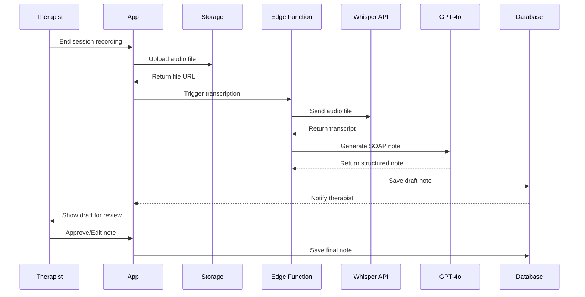

# [Backend] OpenAI Integration & Scribe Agent Implementation

## Overview
Implement the Scribe Agent using OpenAI Whisper for transcription and GPT-4o for clinical note generation from therapy session recordings.

## Context
Reference: `spec:df06a57d-bbce-4623-8e1c-cd129f15f2cf/ee62c42e-f732-4ef7-a4d1-6108899dc8a5` (Backend Services & AI Integration)

The Scribe Agent is the core AI feature that reduces therapist documentation burden by automatically generating structured clinical notes from session audio.

## AI Processing Flow



## Technical Requirements

### 1. OpenAI Client Setup
```typescript
// lib/openai.ts
import OpenAI from 'openai';

export const openai = new OpenAI({
  apiKey: Deno.env.get('OPENAI_API_KEY'),
});
```

### 2. Audio Transcription Edge Function
Create `supabase/functions/transcribe-session/index.ts`:
```typescript
import { serve } from 'https://deno.land/std@0.168.0/http/server.ts';
import { createClient } from '@supabase/supabase-js';
import OpenAI from 'openai';

serve(async (req) => {
  const { sessionId, audioUrl } = await req.json();
  
  // Download audio from storage
  const audioResponse = await fetch(audioUrl);
  const audioBuffer = await audioResponse.arrayBuffer();
  
  // Transcribe with Whisper
  const transcription = await openai.audio.transcriptions.create({
    file: new File([audioBuffer], 'session.m4a'),
    model: 'whisper-1',
    language: 'en', // Supports Hinglish
    response_format: 'verbose_json',
    timestamp_granularities: ['segment']
  });
  
  // Save transcript
  await supabase
    .from('session_recordings')
    .update({ 
      transcript: transcription.text,
      transcript_segments: transcription.segments 
    })
    .eq('session_id', sessionId);
  
  return new Response(JSON.stringify({ success: true }), {
    headers: { 'Content-Type': 'application/json' }
  });
});
```

### 3. Clinical Note Generation Edge Function
Create `supabase/functions/generate-note/index.ts`:
```typescript
serve(async (req) => {
  const { sessionId, transcript, patientHistory } = await req.json();
  
  const systemPrompt = `You are an expert clinical scribe for an Indian psychologist.
Your task is to generate a structured SOAP note from the session transcript.

Guidelines:
- Use culturally appropriate terms for Indian context
- Flag any mentions of self-harm or suicidal ideation with RED ALERT
- Include ICD-10 codes where applicable
- Keep language professional but accessible
- Separate therapist and patient statements clearly`;

  const userPrompt = `Patient History: ${patientHistory}

Session Transcript:
${transcript}

Generate a SOAP note with the following sections:
1. Subjective: Patient's reported concerns and feelings
2. Objective: Therapist's observations and mental status exam
3. Assessment: Clinical impressions and diagnosis
4. Plan: Treatment plan and interventions used`;

  const completion = await openai.chat.completions.create({
    model: 'gpt-4o',
    messages: [
      { role: 'system', content: systemPrompt },
      { role: 'user', content: userPrompt }
    ],
    temperature: 0.3, // Lower for consistency
    response_format: { type: 'json_object' }
  });
  
  const note = JSON.parse(completion.choices[0].message.content);
  
  // Save draft note
  await supabase
    .from('clinical_notes')
    .insert({
      session_id: sessionId,
      note_type: 'soap',
      content: note,
      ai_generated_summary: note.assessment,
      approved_by_therapist: false
    });
  
  return new Response(JSON.stringify(note), {
    headers: { 'Content-Type': 'application/json' }
  });
});
```

### 4. System Prompt Templates
Create configurable prompts for different note types:
- SOAP (Subjective, Objective, Assessment, Plan)
- DAP (Data, Assessment, Plan)
- Progress Notes

Store in database for easy updates:
```sql
CREATE TABLE prompt_templates (
  id uuid PRIMARY KEY DEFAULT gen_random_uuid(),
  name text NOT NULL,
  note_type text NOT NULL,
  system_prompt text NOT NULL,
  user_prompt_template text NOT NULL,
  version integer DEFAULT 1,
  created_at timestamptz DEFAULT now()
);
```

### 5. Human-in-the-Loop (HITL) Workflow
Implement approval workflow:
1. AI generates draft note
2. Therapist reviews in UI
3. Therapist can edit any section
4. Therapist clicks "Approve"
5. Note marked as approved, timestamp recorded

### 6. Quality Metrics Tracking
Track AI performance:
```sql
CREATE TABLE ai_metrics (
  id uuid PRIMARY KEY DEFAULT gen_random_uuid(),
  session_id uuid REFERENCES sessions(id),
  transcription_duration_ms integer,
  note_generation_duration_ms integer,
  edit_distance integer, -- Levenshtein distance between AI and final
  therapist_rating integer, -- 1-5 stars
  created_at timestamptz DEFAULT now()
);
```

### 7. Cost Optimization
- Use Whisper for transcription (~$0.006/min)
- Use GPT-4o-mini for routine notes (~$0.15/1M tokens)
- Use GPT-4o only for complex cases
- Implement caching for patient history context

### 8. Error Handling
- Retry logic for API failures (3 attempts)
- Fallback to manual note entry if AI fails
- Alert admin if error rate > 5%
- Store failed requests for debugging

## Acceptance Criteria
- [ ] OpenAI client configured in Edge Functions
- [ ] Transcription Edge Function deployed and tested
- [ ] Note generation Edge Function deployed and tested
- [ ] System prompt templates created
- [ ] HITL approval workflow implemented
- [ ] Quality metrics tracking implemented
- [ ] Cost tracking implemented
- [ ] Error handling and retry logic working
- [ ] Hinglish transcription accuracy > 90%
- [ ] Note generation latency < 30 seconds
- [ ] Edit distance (therapist changes) < 15%
- [ ] Self-harm detection working (RED ALERT)

## Dependencies
- Requires: Database Schema Implementation
- Requires: Authentication System Implementation
- Requires: Supabase Project Setup

## Estimated Effort
8-10 hours