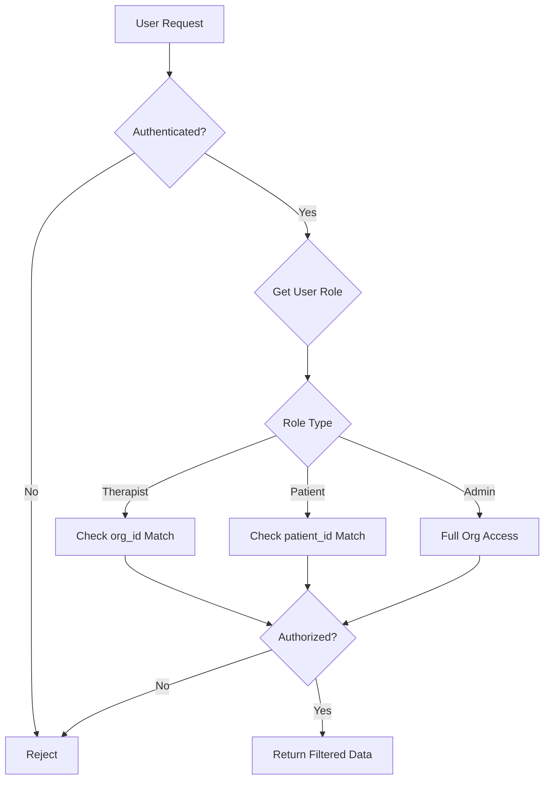

# [Backend] Row Level Security (RLS) Policies Implementation

## Overview
Implement comprehensive Row Level Security (RLS) policies to enforce multi-tenant data isolation and role-based access control.

## Context
Reference: `spec:df06a57d-bbce-4623-8e1c-cd129f15f2cf/ac8fa530-233d-4e59-a7a2-9affe9e328b0` (Database Schema - RLS Section)

RLS ensures that therapists can only access data within their organization and patients can only view their own records.

## Security Model



## Technical Requirements

### 1. Enable RLS on All Tables
```sql
ALTER TABLE organizations ENABLE ROW LEVEL SECURITY;
ALTER TABLE therapists ENABLE ROW LEVEL SECURITY;
ALTER TABLE patients ENABLE ROW LEVEL SECURITY;
ALTER TABLE sessions ENABLE ROW LEVEL SECURITY;
ALTER TABLE clinical_notes ENABLE ROW LEVEL SECURITY;
ALTER TABLE session_recordings ENABLE ROW LEVEL SECURITY;
ALTER TABLE wearable_data ENABLE ROW LEVEL SECURITY;
ALTER TABLE consent_records ENABLE ROW LEVEL SECURITY;
ALTER TABLE audit_logs ENABLE ROW LEVEL SECURITY;
```

### 2. Helper Functions
```sql
-- Get current user's therapist record
CREATE OR REPLACE FUNCTION auth.current_therapist_id()
RETURNS uuid AS $$
  SELECT id FROM therapists WHERE auth.uid() = user_id;
$$ LANGUAGE sql STABLE;

-- Get current user's organization
CREATE OR REPLACE FUNCTION auth.current_org_id()
RETURNS uuid AS $$
  SELECT org_id FROM therapists WHERE auth.uid() = user_id;
$$ LANGUAGE sql STABLE;
```

### 3. Therapist Policies
```sql
-- Therapists can view all patients in their org
CREATE POLICY "Therapists view org patients" ON patients
  FOR SELECT
  USING (org_id = auth.current_org_id());

-- Therapists can view their own sessions
CREATE POLICY "Therapists view own sessions" ON sessions
  FOR SELECT
  USING (therapist_id = auth.current_therapist_id());

-- Therapists can create sessions
CREATE POLICY "Therapists create sessions" ON sessions
  FOR INSERT
  WITH CHECK (therapist_id = auth.current_therapist_id());

-- Therapists can view clinical notes for their sessions
CREATE POLICY "Therapists view own notes" ON clinical_notes
  FOR SELECT
  USING (
    session_id IN (
      SELECT id FROM sessions WHERE therapist_id = auth.current_therapist_id()
    )
  );
```

### 4. Patient Policies (Future Patient Portal)
```sql
-- Patients can view their own records
CREATE POLICY "Patients view own data" ON patients
  FOR SELECT
  USING (id = auth.current_patient_id());

-- Patients can view their own sessions
CREATE POLICY "Patients view own sessions" ON sessions
  FOR SELECT
  USING (patient_id = auth.current_patient_id());
```

### 5. Admin Policies
```sql
-- Org admins can view all org data
CREATE POLICY "Admins view org data" ON patients
  FOR ALL
  USING (
    org_id IN (
      SELECT org_id FROM therapists 
      WHERE user_id = auth.uid() AND role = 'admin'
    )
  );
```

### 6. Audit Log Policies
```sql
-- Only admins can view audit logs
CREATE POLICY "Admins view audit logs" ON audit_logs
  FOR SELECT
  USING (
    org_id IN (
      SELECT org_id FROM therapists 
      WHERE user_id = auth.uid() AND role = 'admin'
    )
  );
```

### 7. Service Role Bypass
Ensure Edge Functions using service role key can bypass RLS for AI processing:
```sql
-- Service role has full access (default behavior)
-- No additional policies needed
```

## Testing Requirements

### 1. Test Scenarios
- Therapist A cannot see Therapist B's patients (different orgs)
- Therapist can see all patients in their org
- Therapist can only edit their own sessions
- Patient can only view their own data
- Admin can view all org data
- Unauthenticated users see nothing

### 2. Test Script
Create SQL test script to verify all policies:
```sql
-- Set session to therapist user
SET LOCAL role TO authenticated;
SET LOCAL request.jwt.claims TO '{"sub": "therapist-uuid"}';

-- Attempt to query patients
SELECT * FROM patients; -- Should only return org patients
```

## Acceptance Criteria
- [ ] RLS enabled on all tables
- [ ] Helper functions created
- [ ] Therapist policies implemented and tested
- [ ] Patient policies implemented (for future portal)
- [ ] Admin policies implemented
- [ ] Audit log policies implemented
- [ ] Service role bypass verified
- [ ] All test scenarios pass
- [ ] Policy documentation created
- [ ] Performance impact assessed (should be minimal)

## Dependencies
- Requires: Database Schema Implementation ticket completion

## Estimated Effort
5-6 hours