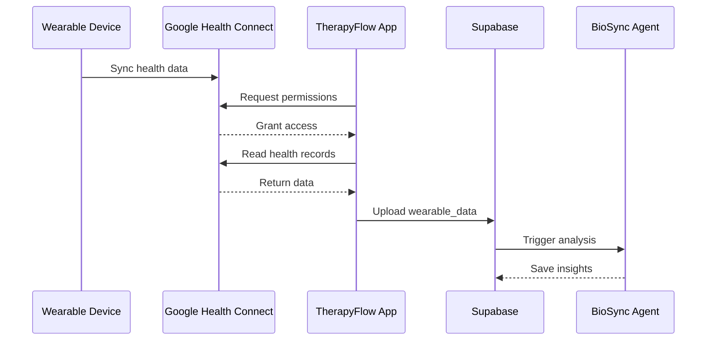

# [BioSync] Google Health Connect Integration (Android)

## Overview
Implement Google Health Connect integration for Android devices to sync wearable data (heart rate, HRV, sleep, steps, activity) from popular Indian wearables like Noise, Boat, and Fitbit.

## Context
Reference: `spec:df06a57d-bbce-4623-8e1c-cd129f15f2cf/6bd132cb-1ab4-4b86-a1d0-dfb2c8f5ef62` (BioSync Wearable Integration - Android Section)

Google Health Connect is the unified API for accessing health data on Android, supporting most budget wearables popular in India.

## Data Flow



## Technical Requirements

### 1. Install Health Connect Package
```bash
npx expo install react-native-health-connect
```

### 2. Configure Android Permissions
```xml
<!-- android/app/src/main/AndroidManifest.xml -->
<manifest>
  <uses-permission android:name="android.permission.health.READ_HEART_RATE"/>
  <uses-permission android:name="android.permission.health.READ_SLEEP"/>
  <uses-permission android:name="android.permission.health.READ_STEPS"/>
  <uses-permission android:name="android.permission.health.READ_ACTIVE_CALORIES_BURNED"/>
  
  <application>
    <activity android:name=".MainActivity">
      <intent-filter>
        <action android:name="androidx.health.ACTION_SHOW_PERMISSIONS_RATIONALE" />
      </intent-filter>
    </activity>
  </application>
</manifest>
```

### 3. Health Connect Client Setup
```typescript
// lib/health/googleHealthConnect.ts
import { initialize, requestPermission, readRecords } from 'react-native-health-connect';

export async function initializeHealthConnect() {
  const isInitialized = await initialize();
  if (!isInitialized) {
    throw new Error('Health Connect not available on this device');
  }
  return true;
}

export async function requestHealthPermissions() {
  const permissions = [
    { accessType: 'read', recordType: 'HeartRate' },
    { accessType: 'read', recordType: 'HeartRateVariabilityRmssd' },
    { accessType: 'read', recordType: 'SleepSession' },
    { accessType: 'read', recordType: 'Steps' },
    { accessType: 'read', recordType: 'ActiveCaloriesBurned' },
    { accessType: 'read', recordType: 'Distance' },
  ];
  
  const granted = await requestPermission(permissions);
  return granted;
}
```

### 4. Data Sync Functions
```typescript
export async function syncHeartRateData(patientId: string, days: number = 7) {
  const endDate = new Date();
  const startDate = new Date();
  startDate.setDate(startDate.getDate() - days);
  
  const records = await readRecords('HeartRate', {
    timeRangeFilter: {
      operator: 'between',
      startTime: startDate.toISOString(),
      endTime: endDate.toISOString(),
    },
  });
  
  // Transform and upload to Supabase
  const dataPoints = records.map(record => ({
    patient_id: patientId,
    data_type: 'heart_rate',
    metrics: {
      bpm: record.beatsPerMinute,
      measurement_location: record.measurementLocation,
    },
    recorded_at: record.time,
    source: 'google_health_connect'
  }));
  
  await supabase.from('wearable_data').insert(dataPoints);
  
  return dataPoints.length;
}

export async function syncHRVData(patientId: string, days: number = 7) {
  const endDate = new Date();
  const startDate = new Date();
  startDate.setDate(startDate.getDate() - days);
  
  const records = await readRecords('HeartRateVariabilityRmssd', {
    timeRangeFilter: {
      operator: 'between',
      startTime: startDate.toISOString(),
      endTime: endDate.toISOString(),
    },
  });
  
  const dataPoints = records.map(record => ({
    patient_id: patientId,
    data_type: 'hrv',
    metrics: {
      rmssd: record.heartRateVariabilityMillis,
    },
    recorded_at: record.time,
    source: 'google_health_connect'
  }));
  
  await supabase.from('wearable_data').insert(dataPoints);
  
  return dataPoints.length;
}

export async function syncSleepData(patientId: string, days: number = 7) {
  const endDate = new Date();
  const startDate = new Date();
  startDate.setDate(startDate.getDate() - days);
  
  const records = await readRecords('SleepSession', {
    timeRangeFilter: {
      operator: 'between',
      startTime: startDate.toISOString(),
      endTime: endDate.toISOString(),
    },
  });
  
  const dataPoints = records.map(record => {
    const durationHours = (new Date(record.endTime).getTime() - new Date(record.startTime).getTime()) / (1000 * 60 * 60);
    
    return {
      patient_id: patientId,
      data_type: 'sleep',
      metrics: {
        duration_hours: durationHours,
        start_time: record.startTime,
        end_time: record.endTime,
        stages: record.stages, // Deep, Light, REM, Awake
      },
      recorded_at: record.startTime,
      source: 'google_health_connect'
    };
  });
  
  await supabase.from('wearable_data').insert(dataPoints);
  
  return dataPoints.length;
}

export async function syncStepsData(patientId: string, days: number = 7) {
  const endDate = new Date();
  const startDate = new Date();
  startDate.setDate(startDate.getDate() - days);
  
  const records = await readRecords('Steps', {
    timeRangeFilter: {
      operator: 'between',
      startTime: startDate.toISOString(),
      endTime: endDate.toISOString(),
    },
  });
  
  // Aggregate by day
  const dailySteps = aggregateByDay(records, 'count');
  
  const dataPoints = dailySteps.map(day => ({
    patient_id: patientId,
    data_type: 'steps',
    metrics: {
      count: day.total,
    },
    recorded_at: day.date,
    source: 'google_health_connect'
  }));
  
  await supabase.from('wearable_data').insert(dataPoints);
  
  return dataPoints.length;
}
```

### 5. Sync Orchestrator
```typescript
// lib/health/syncOrchestrator.ts
export async function syncAllHealthData(patientId: string) {
  try {
    const results = await Promise.allSettled([
      syncHeartRateData(patientId),
      syncHRVData(patientId),
      syncSleepData(patientId),
      syncStepsData(patientId),
    ]);
    
    const summary = {
      heartRate: results[0].status === 'fulfilled' ? results[0].value : 0,
      hrv: results[1].status === 'fulfilled' ? results[1].value : 0,
      sleep: results[2].status === 'fulfilled' ? results[2].value : 0,
      steps: results[3].status === 'fulfilled' ? results[3].value : 0,
    };
    
    // Trigger BioSync analysis
    await supabase.functions.invoke('analyze-biosync', {
      body: { patientId }
    });
    
    return summary;
  } catch (error) {
    console.error('Health data sync failed:', error);
    throw error;
  }
}
```

### 6. Settings Screen for Health Connect
```wireframe
┌─────────────────────────┐
│  ← Settings             │
│                         │
│  BioSync Integration    │
│                         │
│  Google Health Connect  │
│  ┌───────────────────┐  │
│  │ ✅ Connected      │  │
│  │                   │  │
│  │ Last sync:        │  │
│  │ 2 hours ago       │  │
│  │                   │  │
│  │ [Sync Now]        │  │
│  └───────────────────┘  │
│                         │
│  Data Permissions       │
│  ✅ Heart Rate          │
│  ✅ HRV                 │
│  ✅ Sleep               │
│  ✅ Steps               │
│  ✅ Activity            │
│                         │
│  [Manage Permissions]   │
│                         │
│  Auto Sync              │
│  ☑️ Daily at 6:00 AM    │
│                         │
│  [Disconnect]           │
└─────────────────────────┘
```

### 7. Settings Component
```typescript
// app/settings/biosync.tsx
export default function BioSyncSettingsScreen() {
  const [isConnected, setIsConnected] = useState(false);
  const [lastSync, setLastSync] = useState<Date | null>(null);
  const [syncing, setSyncing] = useState(false);
  const { user } = useAuth();
  
  useEffect(() => {
    checkHealthConnectStatus();
  }, []);
  
  const checkHealthConnectStatus = async () => {
    const initialized = await initializeHealthConnect();
    setIsConnected(initialized);
    
    // Get last sync time from database
    const { data } = await supabase
      .from('wearable_data')
      .select('synced_at')
      .eq('patient_id', user.patientId)
      .order('synced_at', { ascending: false })
      .limit(1)
      .single();
    
    if (data) setLastSync(new Date(data.synced_at));
  };
  
  const handleConnect = async () => {
    const granted = await requestHealthPermissions();
    if (granted) {
      setIsConnected(true);
      await handleSync();
    }
  };
  
  const handleSync = async () => {
    setSyncing(true);
    try {
      const summary = await syncAllHealthData(user.patientId);
      setLastSync(new Date());
      Alert.alert(
        'Sync Complete',
        `Synced ${summary.heartRate + summary.hrv + summary.sleep + summary.steps} data points`
      );
    } catch (error) {
      Alert.alert('Sync Failed', error.message);
    } finally {
      setSyncing(false);
    }
  };
  
  return (
    <ScrollView style={styles.container}>
      <Text style={styles.title}>BioSync Integration</Text>
      
      {isConnected ? (
        <View style={styles.connectedCard}>
          <Text>✅ Connected to Google Health Connect</Text>
          <Text>Last sync: {formatRelativeTime(lastSync)}</Text>
          <Button 
            title={syncing ? 'Syncing...' : 'Sync Now'}
            onPress={handleSync}
            disabled={syncing}
          />
        </View>
      ) : (
        <Button title="Connect Health Connect" onPress={handleConnect} />
      )}
    </ScrollView>
  );
}
```

## Acceptance Criteria
- [ ] Google Health Connect initialized successfully
- [ ] Permission request flow working
- [ ] Heart rate data syncing correctly
- [ ] HRV data syncing correctly
- [ ] Sleep data syncing correctly
- [ ] Steps data syncing correctly
- [ ] Activity data syncing correctly
- [ ] Data uploaded to Supabase correctly
- [ ] Sync orchestrator working
- [ ] BioSync analysis triggered after sync
- [ ] Settings screen implemented
- [ ] Manual sync working
- [ ] Auto sync scheduled
- [ ] Error handling for sync failures
- [ ] Tested with Noise/Boat wearables

## Dependencies
- Requires: React Native Mobile App Setup
- Requires: Database Schema Implementation
- Requires: BioSync Agent Implementation

## Estimated Effort
10-12 hours