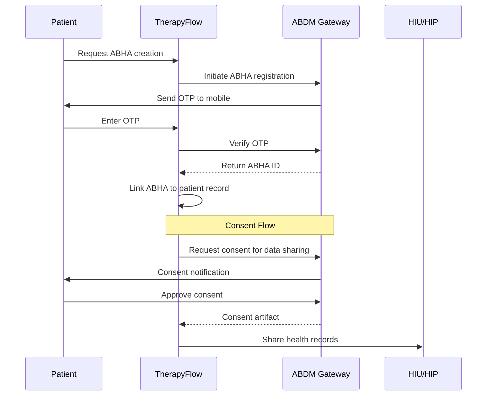

# [Compliance] ABDM/ABHA Integration for Digital Health Compliance

## Overview

Implement integration with India's Ayushman Bharat Digital Mission (ABDM) for ABHA ID creation, consent management, and health information exchange compliance.

## Context

Reference: spec:df06a57d-bbce-4623-8e1c-cd129f15f2cf/b4037edb-59e9-4001-b90c-a3700ed5e98e (Compliance & Security - ABDM Section)

ABDM compliance is mandatory for digital health applications in India, enabling interoperability and patient consent management.

## ABDM Architecture



## Technical Requirements

### 1. ABDM Gateway Client Setup

```typescript
// lib/abdm/client.ts
import axios from 'axios';

const ABDM_BASE_URL = process.env.ABDM_GATEWAY_URL;
const CLIENT_ID = process.env.ABDM_CLIENT_ID;
const CLIENT_SECRET = process.env.ABDM_CLIENT_SECRET;

class ABDMClient {
  private accessToken: string | null = null;
  private tokenExpiry: Date | null = null;
  
  async getAccessToken(): Promise<string> {
    if (this.accessToken && this.tokenExpiry && this.tokenExpiry > new Date()) {
      return this.accessToken;
    }
    
    const response = await axios.post(`${ABDM_BASE_URL}/v0.5/sessions`, {
      clientId: CLIENT_ID,
      clientSecret: CLIENT_SECRET,
    });
    
    this.accessToken = response.data.accessToken;
    this.tokenExpiry = new Date(Date.now() + response.data.expiresIn * 1000);
    
    return this.accessToken;
  }
  
  async makeRequest(endpoint: string, method: string, data?: any) {
    const token = await this.getAccessToken();
    
    return axios({
      method,
      url: `${ABDM_BASE_URL}${endpoint}`,
      headers: {
        'Authorization': `Bearer ${token}`,
        'Content-Type': 'application/json',
        'X-CM-ID': 'sbx', // Sandbox mode
      },
      data,
    });
  }
}

export const abdmClient = new ABDMClient();
```

### 2. ABHA ID Creation Flow

```typescript
// lib/abdm/abha.ts
export async function initiateABHACreation(mobileNumber: string) {
  const response = await abdmClient.makeRequest(
    '/v2/registration/aadhaar/generateOtp',
    'POST',
    { mobile: mobileNumber }
  );
  
  return {
    txnId: response.data.txnId,
    message: 'OTP sent to mobile number'
  };
}

export async function verifyOTPAndCreateABHA(txnId: string, otp: string) {
  // Verify OTP
  const verifyResponse = await abdmClient.makeRequest(
    '/v2/registration/aadhaar/verifyOTP',
    'POST',
    { txnId, otp }
  );
  
  if (!verifyResponse.data.token) {
    throw new Error('OTP verification failed');
  }
  
  // Create ABHA
  const createResponse = await abdmClient.makeRequest(
    '/v2/registration/aadhaar/createHealthIdWithPreVerified',
    'POST',
    {
      txnId: verifyResponse.data.txnId,
      token: verifyResponse.data.token,
    }
  );
  
  return {
    abhaId: createResponse.data.healthIdNumber,
    abhaAddress: createResponse.data.healthId,
    name: createResponse.data.name,
    gender: createResponse.data.gender,
    yearOfBirth: createResponse.data.yearOfBirth,
  };
}

export async function linkABHAToPatient(patientId: string, abhaData: any) {
  const { error } = await supabase
    .from('patients')
    .update({
      abha_id: abhaData.abhaId,
      abha_address: abhaData.abhaAddress,
      demographics: {
        ...abhaData,
        verified: true,
      }
    })
    .eq('id', patientId);
  
  if (error) throw error;
  
  // Log audit
  await logAudit({
    orgId: patient.org_id,
    userId: currentUser.id,
    action: 'CREATE',
    tableName: 'abha_records',
    recordId: patientId,
    newData: abhaData,
  });
}
```

### 3. Consent Management

```typescript
// lib/abdm/consent.ts
export async function requestConsent(params: {
  patientAbhaId: string;
  purpose: string;
  hiTypes: string[]; // ['Prescription', 'DiagnosticReport', 'OPConsultation']
  dateRange: { from: string; to: string };
}) {
  const consentRequest = {
    consent: {
      purpose: {
        text: params.purpose,
        code: 'CAREMGT', // Care Management
      },
      patient: {
        id: params.patientAbhaId,
      },
      hiu: {
        id: 'therapyflow-hiu-id', // Your HIU ID
      },
      requester: {
        name: 'TherapyFlow',
        identifier: {
          type: 'REGNO',
          value: 'THERAPYFLOW-001',
        },
      },
      hiTypes: params.hiTypes,
      permission: {
        accessMode: 'VIEW',
        dateRange: params.dateRange,
        dataEraseAt: new Date(Date.now() + 365 * 24 * 60 * 60 * 1000).toISOString(), // 1 year
        frequency: {
          unit: 'HOUR',
          value: 1,
          repeats: 0,
        },
      },
    },
  };
  
  const response = await abdmClient.makeRequest(
    '/v0.5/consent-requests/init',
    'POST',
    consentRequest
  );
  
  // Save consent request
  await supabase.from('consent_records').insert({
    patient_id: params.patientId,
    consent_request_id: response.data.id,
    status: 'REQUESTED',
    purpose: params.purpose,
    hi_types: params.hiTypes,
    date_range: params.dateRange,
  });
  
  return response.data;
}

export async function checkConsentStatus(consentRequestId: string) {
  const response = await abdmClient.makeRequest(
    `/v0.5/consent-requests/${consentRequestId}`,
    'GET'
  );
  
  // Update consent record
  await supabase
    .from('consent_records')
    .update({
      status: response.data.status,
      consent_artifact_id: response.data.consentArtefacts?.[0]?.id,
    })
    .eq('consent_request_id', consentRequestId);
  
  return response.data;
}
```

### 4. Health Information Exchange

```typescript
// lib/abdm/hie.ts
export async function shareHealthRecords(params: {
  consentArtifactId: string;
  patientId: string;
  sessionIds: string[];
}) {
  // Fetch session data
  const { data: sessions } = await supabase
    .from('sessions')
    .select('*, clinical_notes(*)')
    .in('id', params.sessionIds);
  
  // Transform to FHIR format
  const fhirBundle = transformToFHIR(sessions);
  
  // Encrypt data
  const encryptedData = await encryptHealthData(fhirBundle);
  
  // Send to ABDM Gateway
  const response = await abdmClient.makeRequest(
    '/v0.5/health-information/transfer',
    'POST',
    {
      pageNumber: 1,
      pageCount: 1,
      transactionId: params.consentArtifactId,
      entries: [
        {
          content: encryptedData,
          media: 'application/fhir+json',
          checksum: calculateChecksum(encryptedData),
        },
      ],
    }
  );
  
  // Log data sharing
  await logAudit({
    orgId: patient.org_id,
    userId: currentUser.id,
    action: 'SHARE',
    tableName: 'health_information_exchange',
    recordId: params.consentArtifactId,
    newData: {
      sessionIds: params.sessionIds,
      sharedAt: new Date(),
    },
  });
  
  return response.data;
}

function transformToFHIR(sessions: any[]) {
  // Transform TherapyFlow data to FHIR Bundle
  return {
    resourceType: 'Bundle',
    type: 'collection',
    entry: sessions.map(session => ({
      resource: {
        resourceType: 'Encounter',
        id: session.id,
        status: 'finished',
        class: {
          system: 'http://terminology.hl7.org/CodeSystem/v3-ActCode',
          code: 'AMB',
          display: 'ambulatory',
        },
        subject: {
          reference: `Patient/${session.patient_id}`,
        },
        period: {
          start: session.scheduled_at,
          end: session.completed_at,
        },
        // Add clinical notes as DocumentReference
      },
    })),
  };
}
```

### 5. ABHA Creation UI (Mobile)

```wireframe
┌─────────────────────────┐
│  ← Back                 │
│                         │
│  Create ABHA ID         │
│                         │
│  ABHA (Ayushman Bharat  │
│  Health Account) is     │
│  your digital health ID │
│                         │
│  ┌───────────────────┐  │
│  │ Mobile Number     │  │
│  │ +91               │  │
│  └───────────────────┘  │
│                         │
│  ┌───────────────────┐  │
│  │ Send OTP          │  │
│  └───────────────────┘  │
│                         │
│  ─────────────────────  │
│                         │
│  Already have ABHA?     │
│  Link existing ABHA     │
└─────────────────────────┘
```

### 6. ABHA Component

```typescript
// components/abdm/ABHACreation.tsx
export function ABHACreationFlow({ patientId }: { patientId: string }) {
  const [step, setStep] = useState<'mobile' | 'otp' | 'success'>('mobile');
  const [mobile, setMobile] = useState('');
  const [otp, setOtp] = useState('');
  const [txnId, setTxnId] = useState('');
  const [loading, setLoading] = useState(false);
  
  const handleSendOTP = async () => {
    setLoading(true);
    try {
      const result = await initiateABHACreation(mobile);
      setTxnId(result.txnId);
      setStep('otp');
      toast.success('OTP sent to your mobile');
    } catch (error) {
      toast.error('Failed to send OTP');
    } finally {
      setLoading(false);
    }
  };
  
  const handleVerifyOTP = async () => {
    setLoading(true);
    try {
      const abhaData = await verifyOTPAndCreateABHA(txnId, otp);
      await linkABHAToPatient(patientId, abhaData);
      setStep('success');
      toast.success('ABHA ID created successfully');
    } catch (error) {
      toast.error('OTP verification failed');
    } finally {
      setLoading(false);
    }
  };
  
  return (
    <View>
      {step === 'mobile' && (
        <MobileInput 
          value={mobile}
          onChange={setMobile}
          onSubmit={handleSendOTP}
          loading={loading}
        />
      )}
      
      {step === 'otp' && (
        <OTPInput
          value={otp}
          onChange={setOtp}
          onSubmit={handleVerifyOTP}
          loading={loading}
        />
      )}
      
      {step === 'success' && (
        <SuccessScreen />
      )}
    </View>
  );
}
```

## Acceptance Criteria

- [ ] ABDM Gateway client configured
- [ ] Access token management working
- [ ] ABHA ID creation flow working
- [ ] OTP verification working
- [ ] ABHA linking to patient records
- [ ] Consent request flow implemented
- [ ] Consent status checking working
- [ ] Health information exchange implemented
- [ ] FHIR transformation working
- [ ] Data encryption for HIE working
- [ ] Audit logging for all ABDM operations
- [ ] ABHA creation UI implemented
- [ ] Error handling for ABDM API failures
- [ ] Tested in ABDM sandbox environment

## Dependencies

- Requires: Database Schema Implementation
- Requires: Audit Logging System
- Requires: Authentication System

## Estimated Effort

14-16 hours