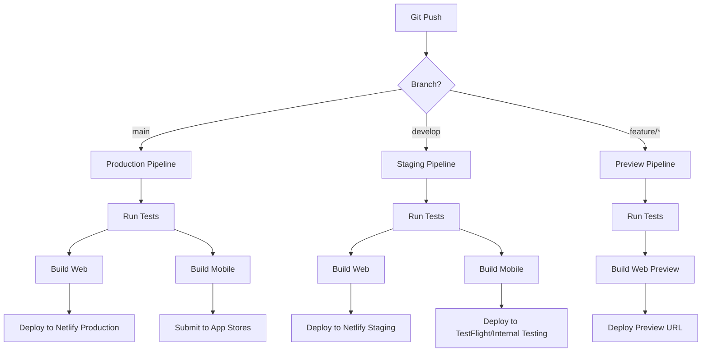

# [Infrastructure] CI/CD Pipeline Setup (Netlify + Expo EAS)

## Overview
Set up continuous integration and deployment pipelines for the web application (Netlify) and mobile applications (Expo EAS Build).

## Context
Reference: `spec:df06a57d-bbce-4623-8e1c-cd129f15f2cf/7908b42c-2ce4-4d34-b8de-fb6ce905a7b6` (System Architecture - Deployment Section)

Automated CI/CD ensures rapid, reliable deployments with proper testing and quality gates.

## Pipeline Architecture



## Technical Requirements

### 1. Netlify Configuration for Web App
Create `netlify.toml`:
```toml
[build]
  command = "npm run build"
  publish = ".next"

[build.environment]
  NODE_VERSION = "20"
  NPM_VERSION = "10"

[[plugins]]
  package = "@netlify/plugin-nextjs"

[context.production]
  environment = { NEXT_PUBLIC_ENV = "production" }

[context.deploy-preview]
  environment = { NEXT_PUBLIC_ENV = "preview" }

[context.branch-deploy]
  environment = { NEXT_PUBLIC_ENV = "staging" }

[[redirects]]
  from = "/*"
  to = "/index.html"
  status = 200

[[headers]]
  for = "/*"
  [headers.values]
    X-Frame-Options = "DENY"
    X-Content-Type-Options = "nosniff"
    Referrer-Policy = "strict-origin-when-cross-origin"
    Permissions-Policy = "camera=(), microphone=(), geolocation=()"
```

### 2. GitHub Actions for Web Testing
Create `.github/workflows/web-ci.yml`:
```yaml
name: Web CI

on:
  push:
    branches: [main, develop]
    paths:
      - 'therapyflow-web/**'
  pull_request:
    branches: [main, develop]
    paths:
      - 'therapyflow-web/**'

jobs:
  test:
    runs-on: ubuntu-latest
    
    steps:
      - uses: actions/checkout@v4
      
      - name: Setup Node.js
        uses: actions/setup-node@v4
        with:
          node-version: '20'
          cache: 'npm'
          cache-dependency-path: therapyflow-web/package-lock.json
      
      - name: Install dependencies
        working-directory: therapyflow-web
        run: npm ci
      
      - name: Run linter
        working-directory: therapyflow-web
        run: npm run lint
      
      - name: Run type check
        working-directory: therapyflow-web
        run: npm run type-check
      
      - name: Run tests
        working-directory: therapyflow-web
        run: npm run test
      
      - name: Build
        working-directory: therapyflow-web
        run: npm run build
        env:
          NEXT_PUBLIC_SUPABASE_URL: ${{ secrets.SUPABASE_URL }}
          NEXT_PUBLIC_SUPABASE_ANON_KEY: ${{ secrets.SUPABASE_ANON_KEY }}
```

### 3. Expo EAS Configuration
Create `eas.json`:
```json
{
  "cli": {
    "version": ">= 5.0.0"
  },
  "build": {
    "development": {
      "developmentClient": true,
      "distribution": "internal",
      "ios": {
        "simulator": true
      }
    },
    "preview": {
      "distribution": "internal",
      "ios": {
        "simulator": false
      },
      "android": {
        "buildType": "apk"
      }
    },
    "production": {
      "ios": {
        "autoIncrement": true
      },
      "android": {
        "autoIncrement": true
      }
    }
  },
  "submit": {
    "production": {
      "ios": {
        "appleId": "your-apple-id@email.com",
        "ascAppId": "your-asc-app-id",
        "appleTeamId": "your-team-id"
      },
      "android": {
        "serviceAccountKeyPath": "./google-service-account.json",
        "track": "internal"
      }
    }
  }
}
```

### 4. GitHub Actions for Mobile CI
Create `.github/workflows/mobile-ci.yml`:
```yaml
name: Mobile CI

on:
  push:
    branches: [main, develop]
    paths:
      - 'therapyflow-mobile/**'
  pull_request:
    branches: [main, develop]
    paths:
      - 'therapyflow-mobile/**'

jobs:
  test:
    runs-on: ubuntu-latest
    
    steps:
      - uses: actions/checkout@v4
      
      - name: Setup Node.js
        uses: actions/setup-node@v4
        with:
          node-version: '20'
          cache: 'npm'
          cache-dependency-path: therapyflow-mobile/package-lock.json
      
      - name: Install dependencies
        working-directory: therapyflow-mobile
        run: npm ci
      
      - name: Run linter
        working-directory: therapyflow-mobile
        run: npm run lint
      
      - name: Run type check
        working-directory: therapyflow-mobile
        run: npm run type-check
      
      - name: Run tests
        working-directory: therapyflow-mobile
        run: npm run test

  build-preview:
    needs: test
    if: github.event_name == 'pull_request'
    runs-on: ubuntu-latest
    
    steps:
      - uses: actions/checkout@v4
      
      - name: Setup Expo
        uses: expo/expo-github-action@v8
        with:
          expo-version: latest
          eas-version: latest
          token: ${{ secrets.EXPO_TOKEN }}
      
      - name: Install dependencies
        working-directory: therapyflow-mobile
        run: npm ci
      
      - name: Build preview
        working-directory: therapyflow-mobile
        run: eas build --platform all --profile preview --non-interactive

  build-production:
    needs: test
    if: github.ref == 'refs/heads/main'
    runs-on: ubuntu-latest
    
    steps:
      - uses: actions/checkout@v4
      
      - name: Setup Expo
        uses: expo/expo-github-action@v8
        with:
          expo-version: latest
          eas-version: latest
          token: ${{ secrets.EXPO_TOKEN }}
      
      - name: Install dependencies
        working-directory: therapyflow-mobile
        run: npm ci
      
      - name: Build production
        working-directory: therapyflow-mobile
        run: eas build --platform all --profile production --non-interactive
      
      - name: Submit to stores
        working-directory: therapyflow-mobile
        run: eas submit --platform all --profile production --non-interactive
```

### 5. Environment Variables Management
Create `.env.example` files:

**Web (.env.example):**
```
NEXT_PUBLIC_SUPABASE_URL=
NEXT_PUBLIC_SUPABASE_ANON_KEY=
SUPABASE_SERVICE_ROLE_KEY=
NEXT_PUBLIC_APP_URL=
```

**Mobile (.env.example):**
```
EXPO_PUBLIC_SUPABASE_URL=
EXPO_PUBLIC_SUPABASE_ANON_KEY=
EXPO_PUBLIC_API_URL=
```

### 6. Deployment Scripts
Create `scripts/deploy.sh`:
```bash
#!/bin/bash

set -e

echo "🚀 Starting deployment..."

# Check environment
if [ "$1" == "production" ]; then
  echo "📦 Deploying to PRODUCTION"
  BRANCH="main"
elif [ "$1" == "staging" ]; then
  echo "📦 Deploying to STAGING"
  BRANCH="develop"
else
  echo "❌ Invalid environment. Use: production or staging"
  exit 1
fi

# Web deployment
echo "🌐 Deploying web app..."
cd therapyflow-web
npm run build
netlify deploy --prod --dir=.next

# Mobile deployment
echo "📱 Building mobile apps..."
cd ../therapyflow-mobile
eas build --platform all --profile $1 --non-interactive

echo "✅ Deployment complete!"
```

### 7. Monitoring and Alerts
Set up deployment notifications in Slack:
```yaml
# .github/workflows/notify.yml
name: Deployment Notifications

on:
  deployment_status:

jobs:
  notify:
    runs-on: ubuntu-latest
    steps:
      - name: Notify Slack
        uses: 8398a7/action-slack@v3
        with:
          status: ${{ job.status }}
          text: |
            Deployment ${{ github.event.deployment_status.state }}
            Environment: ${{ github.event.deployment.environment }}
            Commit: ${{ github.sha }}
          webhook_url: ${{ secrets.SLACK_WEBHOOK }}
```

## Acceptance Criteria
- [ ] Netlify configuration file created
- [ ] Web CI pipeline working
- [ ] Web deployment to Netlify working
- [ ] Preview deployments for PRs working
- [ ] EAS configuration file created
- [ ] Mobile CI pipeline working
- [ ] Mobile builds on EAS working
- [ ] App store submission automated
- [ ] Environment variables configured
- [ ] Deployment scripts created
- [ ] Slack notifications working
- [ ] Rollback procedure documented
- [ ] Build artifacts stored
- [ ] Deployment logs accessible

## Dependencies
- Requires: Next.js Web App Setup
- Requires: React Native Mobile App Setup

## Estimated Effort
6-8 hours