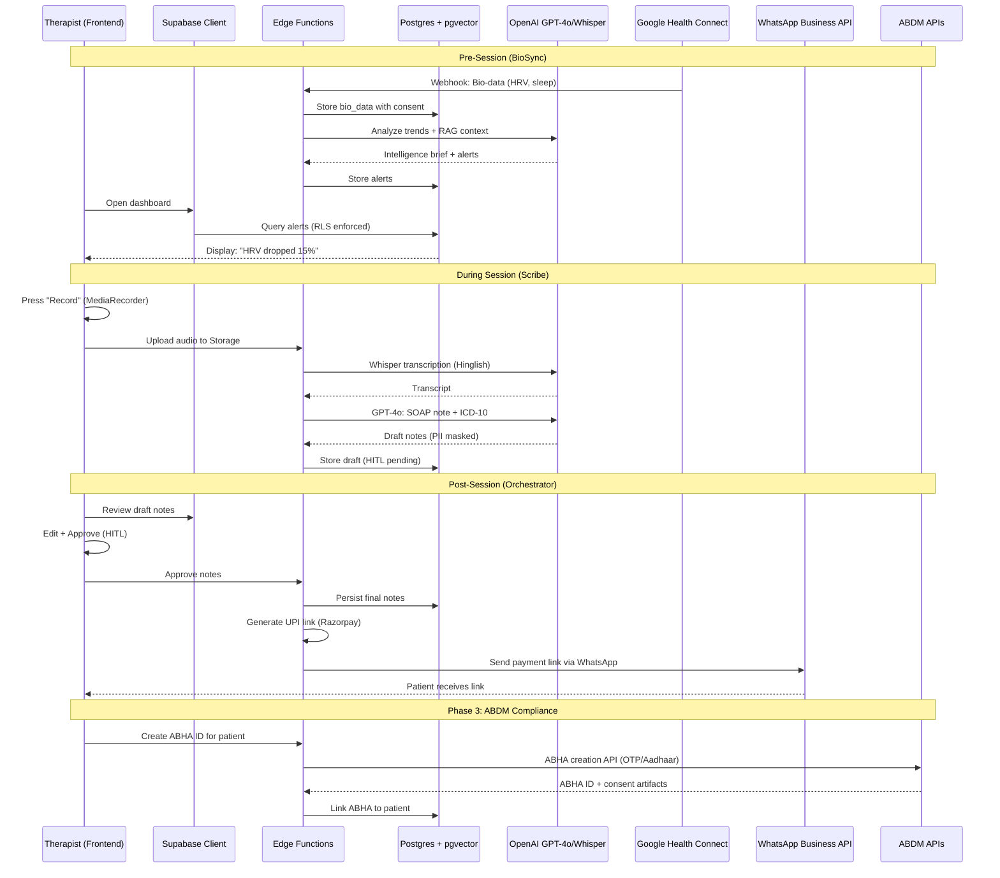

# TherapyFlow AI + BioSync - Technical Architecture

**Version:** 1.0  
**Date:** January 9, 2026  
**Market:** India (Mental Health Practitioners)  
**Hosting:** Frontend (Netlify) | Backend (Supabase)  
**Monitoring:** Rollbar (Frontend + Backend)

---

## Key Observations

The system is an AI-powered practice management system with advanced wearable integration for the Indian mental health market. It leverages a **multi-agent architecture** (Scribe, BioSync, Compliance, Growth agents) orchestrated through Supabase Edge Functions. Key differentiators include **Hinglish transcription**, **Google Health Connect integration** for budget wearables (Noise, Boat), **ABDM compliance** (ABHA/HIE-CM), and **WhatsApp-native workflows**. The tech stack uses **Next.js 16 App Router**, **Supabase with pgvector for RAG**, **OpenAI GPT-4o/Whisper**, and **Rollbar instrumentation**.

---

## Approach & Planning Strategy

The implementation follows a **three-phase delivery model** with clear **frontend/backend demarcation**:
1. **Phase 1: MVP**: Ambient Scribe + Basic Scheduling.
2. **Phase 2: BioSync**: Wearable integrations + WhatsApp Bots.
3. **Phase 3: Compliance**: ABDM Certification + EAP Partnerships.

The architecture enforces **strict separation of concerns**:
- **Frontend**: Next.js (Netlify) handles UI/UX with Server Components for efficiency.
- **Backend**: Supabase Edge Functions (Deno) handles AI processing, external integrations, and compliance.
- **Human-in-the-Loop (HITL)**: Mandatory for clinical outputs.
- **Security**: Row-Level Security (RLS) enforces therapist-patient data isolation.

---

## System Architecture



---

## Technical Stack

| Layer | Technology | Purpose |
|-------|-----------|---------|
| **Frontend** | Next.js 16.1.1, React 19, Tailwind CSS | UI Framework & Styling |
| **State/Data** | TanStack Query v5, Zustand, React Hook Form | Data fetching & State management |
| **Backend** | Supabase (Postgres + RLS + pgvector) | Database & Realtime |
| **Logic** | Supabase Edge Functions (Deno) | Serverless execution & API integration |
| **AI/ML** | OpenAI GPT-4o, Whisper | NLP, Transcription, & Clinical reasoning |
| **Integrations**| Google Health Connect, WhatsApp API, Razorpay | External data, Communications, Payments |
| **Monitoring** | Rollbar | Error tracking & Observation |
| **Deployment** | Netlify (FE), Supabase Cloud (BE) | CI/CD and Hosting |

---

## Database Schema

### Core Tables & RLS

The database uses **UUID** for primary keys and **pgvector** for RAG capabilities.

```sql
-- Core entities
profiles (id, user_id, role, full_name, abha_id, etc.)
patients (id, therapist_id, profile_id, name, abha_id, etc.)
sessions (id, therapist_id, patient_id, audio_url, transcript, notes_draft, notes_final, red_alert, etc.)
bio_data (id, patient_id, timestamp, hrv, sleep_hours, embedding VECTOR(1536), etc.)
alerts (id, patient_id, type, severity, message, acknowledged, etc.)
payments (id, session_id, amount, status, upi_link, etc.)
audit_logs (id, user_id, action, table_name, record_id, old_values, new_values, etc.)
```

**Row-Level Security (RLS)**:
- `profiles`: Users access own profile only.
- `patients`: Therapists manage their own patients only.
- `sessions`: Therapists manage their own sessions only.
- `bio_data`: Only with `consent_given = TRUE` and if patient belongs to therapist.

---

## Edge Functions Architecture

Edge functions are isolated agents communicating with Supabase and external APIs.

- `scribe-process`: Audio -> Whisper -> PII Mask -> GPT-4o -> SOAP Draft.
- `biosync-analyze`: Health Data Webhook -> Vectorization -> RAG Analysis -> Alerts.
- `compliance-abha`: Patient Info -> ABDM API -> ABHA ID -> Consent Linking.
- `payments-upi`: Session ID -> Razorpay -> UPI Link -> WhatsApp Outbound.

---

## Frontend Architecture

- **App Router**: Uses server components for speed and client components for interactivity.
- **Folder Structure**:
    - `app/(auth)`: Parallel routes for Login/Signup.
    - `app/(dashboard)`: Protected routes for Scheduling, Sessions, BioSync.
    - `components/ui`: shadcn/ui components.
    - `lib/supabase`: Server and Client fetchers.
- **State Management**:
    - `TanStack Query`: Server state (caching/mutations).
    - `Zustand`: UI state (theme, sidebar, notifications).

---

## Security & Compliance

1. **PII Masking**: Custom logic to anonymize patient data before AI processing.
2. **ABDM Compliance**: ABHA creation (M1), Health Info Provider (M2), Health Info User (M3).
3. **Audit Logging**: Postgres triggers track every change for 7-year retention.
4. **Encryption**: Storage and DB columns encrypted; data resides in AWS Mumbai.

---

## Deployment Pipeline

- **Backend**: `supabase db push` for migrations; `supabase functions deploy --all`.
- **Frontend**: Netlify CI/CD linked to GitHub; automatic builds on push to `main`.
- **Monitoring**: Rollbar instrumented in Edge Functions and React Root Layout.

---

## Success Metrics

- **Hallucination Rate**: <2% edit distance between draft and final notes.
- **BioSync Recall**: >70% relapses flagged 48 hours in advance.
- **Performance**: Edge function latency <2s.
- **Security**: 100% RLS coverage on all PII tables.
