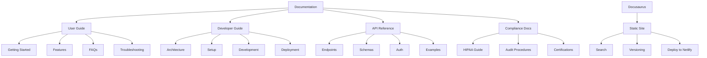

# [Documentation] Create Comprehensive Agent Documentation & Developer Guide

# Create Comprehensive Agent Documentation & Developer Guide

## Overview
Create comprehensive documentation for the agent system, including user guides, developer documentation, API references, and troubleshooting guides.

## Context
Good documentation is essential for adoption, maintenance, and compliance. This documentation serves users, developers, and auditors.
  
## Architecture Diagram
  

## Acceptance Criteria

### 1. User Documentation
- [ ] Getting started guide (how to use AI features)
- [ ] Agent capabilities (what each agent can do)
- [ ] Best practices (when to use AI vs. manual)
- [ ] Troubleshooting (common issues)
- [ ] FAQ (frequently asked questions)
- [ ] Video tutorials (YouTube)

### 2. Developer Documentation
- [ ] Architecture overview (system design)
- [ ] Agent implementation guide (how to add new agents)
- [ ] Tool development guide (how to add new tools)
- [ ] Testing guide (how to test agents)
- [ ] Deployment guide (how to deploy)

### 3. API Reference
- [ ] Edge Function endpoints (all agents)
- [ ] Request/response schemas (OpenAPI spec)
- [ ] Authentication (how to authenticate)
- [ ] Rate limits (documented limits)
- [ ] Error codes (all possible errors)

### 4. Compliance Documentation
- [ ] HIPAA compliance guide (how we comply)
- [ ] Data retention policies (what we keep, how long)
- [ ] Audit procedures (how to audit)
- [ ] Incident response (what to do if breach)
- [ ] Certification documents (SOC 2, HIPAA)

### 5. Runbooks
- [ ] Agent deployment runbook
- [ ] Incident response runbook
- [ ] Cost optimization runbook
- [ ] Performance tuning runbook
- [ ] Disaster recovery runbook

## Technical Details

**Files to Create:**
- `file:docs/user-guide.md`
- `file:docs/developer-guide.md`
- `file:docs/api-reference.md`
- `file:docs/compliance-guide.md`
- `file:docs/runbooks/`

**Documentation Site:**
- Use Docusaurus or similar
- Host on Netlify
- Search functionality
- Version control (docs for each release)

## Testing
- [ ] Review by users (clarity, completeness)
- [ ] Review by developers (accuracy, usefulness)
- [ ] Review by compliance team (correctness)
- [ ] Test all code examples (verify they work)
- [ ] Test all links (no broken links)

## Success Metrics
- Documentation coverage > 90%
- User satisfaction > 4.5/5
- Support ticket reduction > 30% (self-service)
- Developer onboarding time < 2 days

## Dependencies
- All system components implemented
- API finalized
  
## Related Specifications
  
- spec:d969320e-d519-47a7-a258-e04789b8ce0e/7dd2bb11-e4c8-4b8d-9f0b-26a8472f3353 - Agentic AI Architecture
- spec:d969320e-d519-47a7-a258-e04789b8ce0e/68139c2e-3473-476b-9d20-8a0f7891ae48 - Backend & Integration Architecture
- spec:d969320e-d519-47a7-a258-e04789b8ce0e/51f8a991-4bf2-4282-98c1-e8d8b4e3d7ee - HIPAA Compliance & Healthcare AI Governance

---

## 📋 DETAILED IMPLEMENTATION [WAVE 7]

**Source:** Wave 7 ticket - See STEP 4 for complete documentation structure

**Files:**
- `docs/API_DOCUMENTATION.md` - Complete API reference with endpoints, schemas, auth, rate limits
- `docs/DEVELOPER_GUIDE.md` - Setup, project structure, workflow, deployment, troubleshooting
- `docs/USER_GUIDE.md` - Getting started, features, privacy, FAQs
- `docs/PRODUCTION_LAUNCH_CHECKLIST.md` - Pre-launch checklist

**Documentation Site:** Docusaurus or similar, hosted on Netlify

**Success:** Coverage > 90%, satisfaction > 4.5/5, support tickets -30%

**Wave Progress:** 44/49 updated

