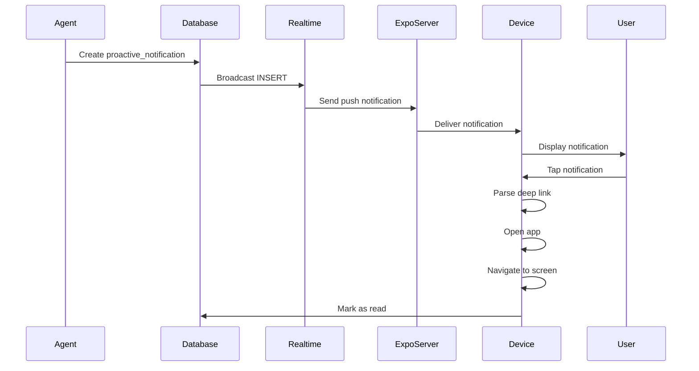

# [Frontend Mobile] Implement Push Notifications for Proactive Agents

# Implement Push Notifications for Proactive Agents

## Overview
Implement Expo push notifications for proactive agent messages, including session prep reminders, insights, follow-ups, and alerts.

## Context
Mobile users need proactive notifications to stay engaged. Push notifications deliver timely, actionable messages from agents.
  
## Architecture Diagram
  


## Acceptance Criteria

### 1. Expo Notifications Setup
- [ ] Configure Expo notifications
- [ ] Request permissions (iOS and Android)
- [ ] Get Expo push token
- [ ] Store token in `user_push_tokens` table
- [ ] Handle token refresh

### 2. Notification Types
- [ ] Session prep (5 mins before session)
- [ ] Insights (daily summary for therapists)
- [ ] Follow-up (post-session check-in)
- [ ] Alerts (high-priority, immediate)
- [ ] Custom notification sounds per type

### 3. Real-time Delivery
- [ ] Subscribe to `proactive_notifications` table
- [ ] Send push notification on INSERT
- [ ] Include action data (deep link)
- [ ] Handle notification tap (navigate to screen)
- [ ] Track delivery and open rates

### 4. In-App Notification Center
- [ ] Display all notifications (chronological)
- [ ] Mark as read on view
- [ ] Swipe to dismiss
- [ ] Filter by type
- [ ] Clear all button

### 5. User Preferences
- [ ] Settings screen for notification preferences
- [ ] Toggle push notifications on/off
- [ ] Set quiet hours (no notifications)
- [ ] Choose notification types
- [ ] Test notification button

## Technical Details

**Files to Create:**
- `file:mobile/src/services/notificationService.ts`
- `file:mobile/src/features/notifications/components/NotificationCenter.tsx`
- `file:mobile/src/features/notifications/hooks/useNotifications.ts`

**Implementation:**
```typescript
import * as Notifications from 'expo-notifications';

export async function setupNotifications(userId: string) {
  const { status } = await Notifications.requestPermissionsAsync();
  if (status !== 'granted') return;

  const token = (await Notifications.getExpoPushTokenAsync()).data;

  await supabase
    .from('user_push_tokens')
    .upsert({ user_id: userId, token });

  // Subscribe to real-time notifications
  const channel = supabase
    .channel(`notifications:${userId}`)
    .on('postgres_changes', {
      event: 'INSERT',
      schema: 'public',
      table: 'proactive_notifications',
      filter: `user_id=eq.${userId}`,
    }, (payload) => {
      Notifications.scheduleNotificationAsync({
        content: {
          title: payload.new.title,
          body: payload.new.message,
          data: payload.new.action,
        },
        trigger: null,
      });
    })
    .subscribe();
}
```

## Testing
- [ ] Test permission request (iOS and Android)
- [ ] Test push delivery (sandbox)
- [ ] Test notification tap (deep linking)
- [ ] Test notification center (display all)
- [ ] Test user preferences (respect settings)

## Success Metrics
- Push delivery rate > 95%
- Open rate > 40%
- Opt-out rate < 10%
- Deep link success rate > 90%

## Dependencies
- Expo notifications
- Supabase Realtime
- React Navigation (deep linking)
  
## Related Specifications
  
- spec:d969320e-d519-47a7-a258-e04789b8ce0e/339a9b00-068b-4a6c-969d-e84e8bba1ff0 - Frontend Mobile Implementation
- spec:d969320e-d519-47a7-a258-e04789b8ce0e/719895d0-e8a7-46cc-b5f9-829428065e26 - UX Patterns & Conversational Interface Design

---

## 📋 DETAILED IMPLEMENTATION [WAVE 5]

**Source:** Wave 5 ticket - See STEP 2 for complete push notification implementation

**File:** `mobile/src/services/pushNotificationService.ts` - Complete PushNotificationService class

**File:** `mobile/App.tsx` - Integration with app lifecycle

**Features:**
- Permission request (iOS/Android)
- Expo push token registration
- Real-time notification listeners
- Deep linking on tap
- Badge count management

**Config:** `mobile/app.json` - Add expo-notifications plugin

**Deploy:** `eas build --platform all`

**Success:** Delivery > 95%, open rate > 40%

**Wave Progress:** 20/49 updated

