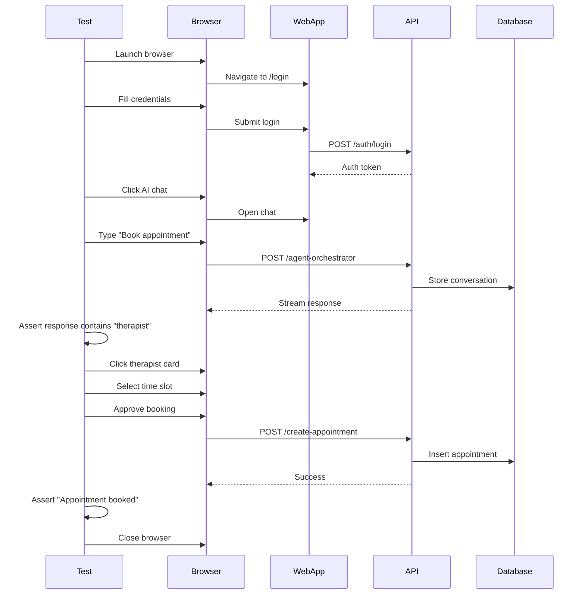

# [Testing] Implement E2E Testing for Agent Workflows

# Implement E2E Testing for Agent Workflows

## Overview
Implement comprehensive end-to-end testing for all agent workflows, including booking flow, session flow, insights flow, and handoff flow.

## Context
E2E tests ensure the entire system works together correctly, catching integration issues that unit tests miss.
  
## Architecture Diagram
  


## Acceptance Criteria

### 1. Booking Flow E2E Test
- [ ] User opens chat
- [ ] User types "Book appointment for anxiety"
- [ ] Agent searches therapists
- [ ] Agent displays results
- [ ] User selects therapist
- [ ] Agent shows available slots
- [ ] User selects slot
- [ ] Agent requests approval
- [ ] User approves
- [ ] Appointment created
- [ ] Confirmation sent

### 2. Session Flow E2E Test
- [ ] Therapist starts session
- [ ] Audio recording begins
- [ ] Transcription streams to copilot
- [ ] Insights displayed in real-time
- [ ] SOAP note generated
- [ ] Therapist reviews and approves
- [ ] Session marked complete
- [ ] Follow-up scheduled

### 3. Insights Flow E2E Test
- [ ] Therapist opens dashboard
- [ ] InsightsAgent generates daily insights
- [ ] Proactive notification displayed
- [ ] Therapist clicks notification
- [ ] Detailed insights shown
- [ ] Therapist takes action (e.g., contact patient)
- [ ] Action logged

### 4. Handoff Flow E2E Test
- [ ] User asks complex question
- [ ] Agent attempts to help (multiple turns)
- [ ] Agent detects inability to help
- [ ] Handoff modal displayed
- [ ] User approves transfer
- [ ] Context sent to support
- [ ] Support ticket created
- [ ] User notified

### 5. Test Infrastructure
- [ ] Use Playwright for web E2E tests
- [ ] Use Detox for mobile E2E tests
- [ ] Mock external APIs (OpenAI, WhatsApp)
- [ ] Seed test database (realistic data)
- [ ] Run in CI/CD pipeline

## Technical Details

**Files to Create:**
- `file:tests/e2e/booking-flow.spec.ts`
- `file:tests/e2e/session-flow.spec.ts`
- `file:tests/e2e/insights-flow.spec.ts`
- `file:tests/e2e/handoff-flow.spec.ts`
- `file:tests/e2e/helpers/agent-mocks.ts`

**Example Test:**
```typescript
test('Booking flow - full journey', async ({ page }) => {
  // Login
  await page.goto('/login');
  await page.fill('[data-testid="email"]', 'test@example.com');
  await page.fill('[data-testid="password"]', 'password');
  await page.click('[data-testid="login-btn"]');

  // Open chat
  await page.click('[data-testid="ai-chat-toggle"]');

  // Send message
  await page.fill('[data-testid="chat-input"]', 'Book appointment for anxiety');
  await page.press('[data-testid="chat-input"]', 'Enter');

  // Wait for agent response
  await expect(page.locator('text=Found therapists')).toBeVisible();

  // Select therapist
  await page.click('[data-testid="therapist-card-0"]');

  // Select slot
  await page.click('[data-testid="slot-0"]');

  // Approve booking
  await page.click('[data-testid="approve-booking"]');

  // Verify confirmation
  await expect(page.locator('text=Appointment booked')).toBeVisible();
});
```

## Testing
- [ ] Run all E2E tests (100% pass rate)
- [ ] Test on multiple browsers (Chrome, Firefox, Safari)
- [ ] Test on multiple devices (iOS, Android)
- [ ] Test with different user roles (patient, therapist, admin)
- [ ] Test error scenarios (API failures, network issues)

## Success Metrics
- E2E test pass rate 100%
- Test execution time < 10 minutes
- Test coverage > 80% (critical paths)
- Zero flaky tests

## Dependencies
- All agent implementations
- Frontend implementations (web and mobile)
- Test database with seed data
  
## Related Specifications
  
- spec:d969320e-d519-47a7-a258-e04789b8ce0e/7dd2bb11-e4c8-4b8d-9f0b-26a8472f3353 - Agentic AI Architecture
- spec:d969320e-d519-47a7-a258-e04789b8ce0e/b4c0579d-02d4-44b4-991b-076b73106254 - Frontend Web Implementation
- spec:d969320e-d519-47a7-a258-e04789b8ce0e/339a9b00-068b-4a6c-969d-e84e8bba1ff0 - Frontend Mobile Implementation

---

## 📋 DETAILED IMPLEMENTATION [WAVE 7]

**Source:** Wave 7 ticket - See STEP 2 for complete E2E testing implementation

**Files:**
- `web/playwright.config.ts` - Playwright configuration
- `web/tests/e2e/ai-chat.spec.ts` - Chat E2E tests
- `web/tests/e2e/copilot-sidebar.spec.ts` - Copilot E2E tests
- `.github/workflows/e2e-tests.yml` - CI/CD integration

**Test Flows:**
- Booking flow (11 steps)
- Session flow (8 steps)
- Insights flow (7 steps)
- Handoff flow (8 steps)

**Install:** `cd web && pnpm add -D @playwright/test && npx playwright install`

**Run:** `pnpm test:e2e`

**Success:** Pass rate 100%, execution < 10min

**Wave Progress:** 39/49 updated

