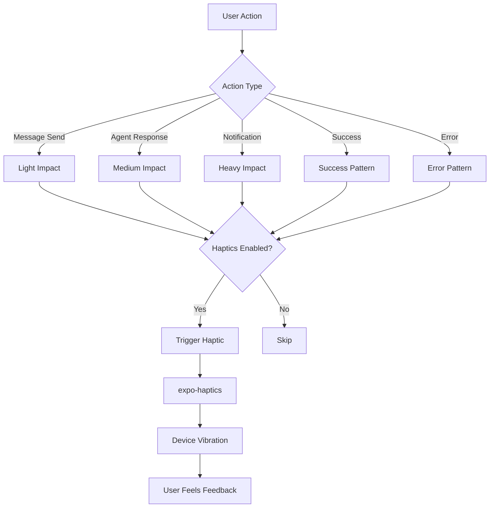

# [Frontend Mobile] Implement Haptic Feedback for Agent Interactions

# Implement Haptic Feedback for Agent Interactions

## Overview
Implement haptic feedback for agent interactions on mobile, providing tactile confirmation of actions and enhancing the user experience.

## Context
Haptic feedback makes interactions feel more responsive and provides non-visual confirmation, improving accessibility and user satisfaction.
  
## Architecture Diagram
  


## Acceptance Criteria

### 1. Haptic Patterns
- [ ] Light tap: Message sent
- [ ] Medium tap: Agent response received
- [ ] Heavy tap: Important notification (alert)
- [ ] Success pattern: Action completed (booking confirmed)
- [ ] Error pattern: Action failed

### 2. Integration Points
- [ ] Chat message send
- [ ] Agent response received
- [ ] Tool execution started
- [ ] Tool execution completed
- [ ] Approval requested
- [ ] Notification received
- [ ] Error occurred

### 3. User Preferences
- [ ] Toggle haptics on/off (settings)
- [ ] Set intensity (light, medium, strong)
- [ ] Respect system settings (iOS/Android)
- [ ] Disable in quiet mode

### 4. Accessibility
- [ ] Provide alternative feedback (visual, audio)
- [ ] Support users with haptic sensitivity
- [ ] Configurable patterns

## Technical Details

**Files to Create:**
- `file:mobile/src/services/hapticService.ts`
- `file:mobile/src/hooks/useHaptics.ts`

**Implementation:**
```typescript
import * as Haptics from 'expo-haptics';

export const HapticPatterns = {
  messageSent: () => Haptics.impactAsync(Haptics.ImpactFeedbackStyle.Light),
  agentResponse: () => Haptics.impactAsync(Haptics.ImpactFeedbackStyle.Medium),
  alert: () => Haptics.notificationAsync(Haptics.NotificationFeedbackType.Warning),
  success: () => Haptics.notificationAsync(Haptics.NotificationFeedbackType.Success),
  error: () => Haptics.notificationAsync(Haptics.NotificationFeedbackType.Error),
};

export function useHaptics() {
  const { preferences } = useAgentSettings();

  const trigger = (pattern: keyof typeof HapticPatterns) => {
    if (preferences.haptics_enabled) {
      HapticPatterns[pattern]();
    }
  };

  return { trigger };
}
```

## Testing
- [ ] Test all haptic patterns (iOS and Android)
- [ ] Test user preferences (respect settings)
- [ ] Test accessibility (alternative feedback)
- [ ] User testing (subjective feedback)

## Success Metrics
- Haptic usage > 80% (users keep enabled)
- User satisfaction > 4.5/5
- Accessibility compliance 100%

## Dependencies
- Expo Haptics
- Agent settings
  
## Related Specifications
  
- spec:d969320e-d519-47a7-a258-e04789b8ce0e/339a9b00-068b-4a6c-969d-e84e8bba1ff0 - Frontend Mobile Implementation
- spec:d969320e-d519-47a7-a258-e04789b8ce0e/719895d0-e8a7-46cc-b5f9-829428065e26 - UX Patterns & Conversational Interface Design

---

## 📋 DETAILED IMPLEMENTATION [WAVE 5]

**Source:** Wave 5 ticket - Haptic feedback integrated throughout mobile app

**File:** `mobile/src/services/hapticService.ts` - Haptic patterns for all interactions

**Integration:** Used in AIChatScreen (message send/receive), notifications, buttons

**Patterns:** Light (send), Medium (receive), Success (booking), Error (failure)

**Install:** `npx expo install expo-haptics`

**Success:** Usage > 80%, satisfaction > 4.5/5

**Wave Progress:** 25/49 updated

