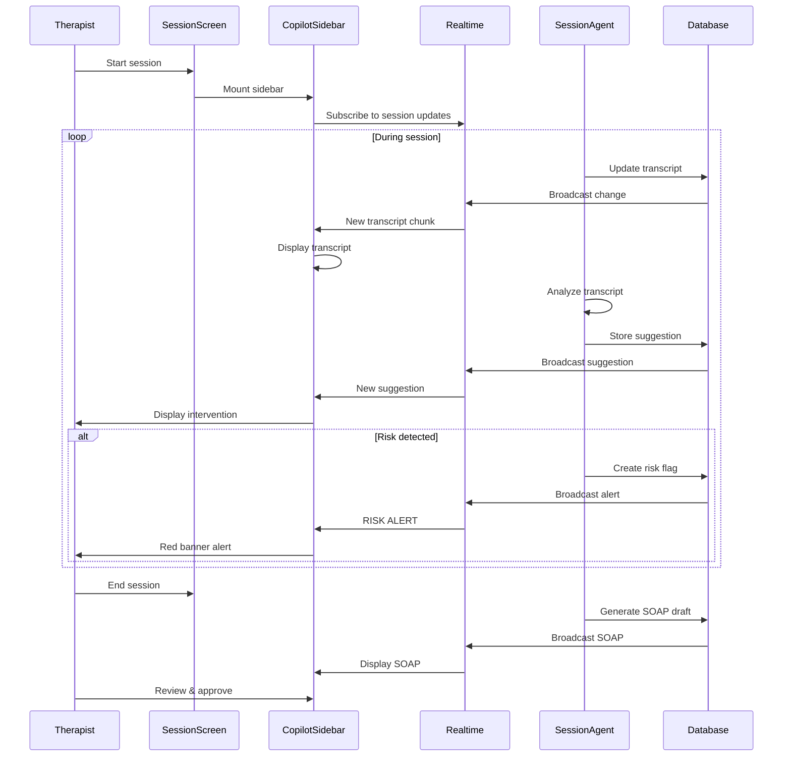

# [Frontend Web] Implement Copilot Sidebar for Therapist Sessions

# Implement Copilot Sidebar for Therapist Sessions

## Overview
Implement the copilot sidebar that displays real-time session insights, live transcription, intervention suggestions, and SOAP note drafts during therapy sessions.

## Context
The copilot sidebar is the therapist's AI assistant during sessions, providing real-time support without interrupting the therapeutic flow.
  
## Architecture Diagram
  


## Acceptance Criteria

### 1. Sidebar Layout
- [ ] Create `CopilotSidebar` component (360px width)
- [ ] Fixed position on right side of session screen
- [ ] Collapsible (toggle button)
- [ ] Responsive (hide on mobile, show in modal)
- [ ] Smooth animations (slide in/out)

### 2. Real-time Insights
- [ ] Display patient alerts (HRV drops, mood changes)
- [ ] Display intervention suggestions (CBT/DBT techniques)
- [ ] Display session goals (from patient record)
- [ ] Display previous session summary
- [ ] Update in real-time (Supabase Realtime)

### 3. Live Transcription
- [ ] Display transcript as it's generated
- [ ] Show speaker labels (Therapist, Patient)
- [ ] Auto-scroll to latest message
- [ ] Search transcript (Cmd+F)
- [ ] Export transcript (download button)

### 4. SOAP Note Draft
- [ ] Display SOAP sections as they're generated (streaming)
- [ ] Editable text area (inline editing)
- [ ] Save draft (auto-save every 30s)
- [ ] Approve button (mark as final)
- [ ] Link to source transcript (click to jump)

### 5. Risk Alerts
- [ ] Display high-priority alerts (red banner)
- [ ] Show risk context (what triggered alert)
- [ ] Provide recommended actions
- [ ] Acknowledge button (mark as reviewed)
- [ ] Log acknowledgment to audit trail

## Technical Details

**Files to Create:**
- `file:web/components/ai/copilot-sidebar.tsx`
- `file:web/components/ai/insight-card.tsx`
- `file:web/components/ai/transcript-viewer.tsx`
- `file:web/components/ai/soap-editor.tsx`
- `file:web/hooks/use-session-copilot.ts`

**Real-time Subscription:**
```typescript
useEffect(() => {
  const channel = supabase
    .channel(`session:${sessionId}`)
    .on('postgres_changes', {
      event: 'UPDATE',
      schema: 'public',
      table: 'sessions',
      filter: `id=eq.${sessionId}`,
    }, (payload) => {
      setTranscript(payload.new.transcript);
      setSoapDraft(payload.new.notes_draft);
    })
    .subscribe();

  return () => supabase.removeChannel(channel);
}, [sessionId]);
```

## Testing
- [ ] Unit tests (component rendering)
- [ ] Integration tests (real-time updates)
- [ ] E2E tests (full session flow)
- [ ] Accessibility tests (keyboard navigation)
- [ ] Performance tests (render time < 100ms)

## Success Metrics
- Copilot usage rate > 80% (therapists use during sessions)
- SOAP edit rate < 20% (minimal changes needed)
- Real-time latency < 1s
- User satisfaction > 4.5/5

## Dependencies
- SessionAgent implementation
- Supabase Realtime
- Database schema (sessions table)
  
## Related Specifications
  
- spec:d969320e-d519-47a7-a258-e04789b8ce0e/b4c0579d-02d4-44b4-991b-076b73106254 - Frontend Web Implementation
- spec:d969320e-d519-47a7-a258-e04789b8ce0e/719895d0-e8a7-46cc-b5f9-829428065e26 - UX Patterns & Conversational Interface Design
- spec:d969320e-d519-47a7-a258-e04789b8ce0e/7dd2bb11-e4c8-4b8d-9f0b-26a8472f3353 - Agentic AI Architecture

---

## 📋 DETAILED IMPLEMENTATION [WAVE 4]

**Source:** Wave 4 ticket - See STEP 2 for complete CopilotSidebar component

**File:** `web/components/ai-chat/copilot-sidebar.tsx` - Complete implementation with:
- Real-time suggestions during sessions
- Risk flags with prominent display
- SOAP note generation
- Collapsible interface
- Auto-updates with transcript

**File:** `web/app/therapist/sessions/[id]/page.tsx` - Session page with integrated copilot

**Deploy:** Included in web deployment

**Test:** Navigate to `/therapist/sessions/[id]` during active session

**Success:** Usage > 80%, SOAP edits < 20%

**Wave Progress:** 12/49 updated

