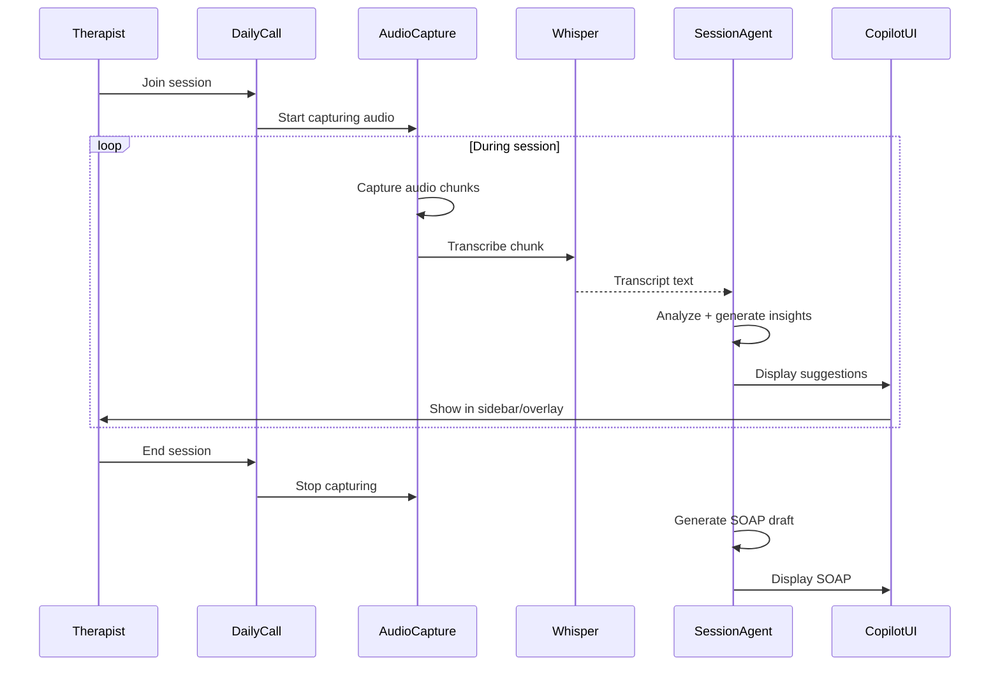

# [Integration] Enhance Daily.co Video Integration for AI Copilot

# Enhance Daily.co Video Integration for AI Copilot

## Overview
Enhance the existing Daily.co video integration to support AI copilot features, including real-time transcription, recording management, and session analytics.

## Context
The current video integration supports basic calls. This enhancement adds AI capabilities like live transcription and copilot overlay.
  
## Architecture Diagram
  

  
## Architecture Diagram
  


## Acceptance Criteria

### 1. Real-time Audio Capture
- [ ] Capture audio stream from Daily.co call
- [ ] Send audio chunks to SessionAgent (streaming)
- [ ] Support speaker diarization (therapist vs. patient)
- [ ] Handle audio quality issues (noise reduction)
- [ ] Respect recording consent (check before capture)

### 2. Recording Management
- [ ] Start/stop recording via API
- [ ] Store recordings in Supabase Storage (encrypted)
- [ ] Generate signed URLs for playback
- [ ] Implement retention policy (delete after 7 years)
- [ ] Track recording status (in-progress, completed, failed)

### 3. Session Analytics
- [ ] Track session duration
- [ ] Track participant join/leave times
- [ ] Track audio quality metrics
- [ ] Track network quality (latency, packet loss)
- [ ] Generate session quality report

### 4. Copilot Integration
- [ ] Send audio to SessionAgent for transcription
- [ ] Display copilot sidebar during call
- [ ] Sync copilot state with video state
- [ ] Handle copilot errors gracefully (don't break video)

### 5. HIPAA Compliance
- [ ] Enable end-to-end encryption (E2EE)
- [ ] Store recordings in HIPAA-compliant storage
- [ ] Audit all recording access
- [ ] Implement consent workflow (before recording)
- [ ] Support right to erasure (delete recordings)

## Technical Details

**Files to Enhance:**
- `file:web/hooks/use-daily-call.ts`
- `file:mobile/src/features/appointments/screens/VideoCallScreen.tsx`
- `file:mobile/supabase/functions/session-agent/audio-handler.ts`

**Implementation:**
```typescript
export function useDailyCall(sessionId: string) {
  const callFrame = useDaily();
  const [isRecording, setIsRecording] = useState(false);

  const startRecording = async () => {
    // Check consent
    const hasConsent = await checkRecordingConsent(sessionId);
    if (!hasConsent) {
      toast.error('Recording consent required');
      return;
    }

    // Start Daily.co recording
    await callFrame.startRecording();
    setIsRecording(true);

    // Start AI transcription
    const audioStream = callFrame.getLocalAudioTrack();
    await startAITranscription(sessionId, audioStream);
  };

  const stopRecording = async () => {
    await callFrame.stopRecording();
    setIsRecording(false);
    await stopAITranscription(sessionId);
  };

  return { startRecording, stopRecording, isRecording };
}
```

## Testing
- [ ] Test audio capture (verify quality)
- [ ] Test recording start/stop (verify storage)
- [ ] Test transcription (accuracy)
- [ ] Test consent workflow (block if not consented)
- [ ] E2E test (full video session with copilot)

## Success Metrics
- Recording success rate > 99%
- Transcription accuracy > 95%
- Audio quality score > 4.0/5
- Zero HIPAA violations

## Dependencies
- SessionAgent implementation
- Supabase Storage
- Recording consent system
  
## Related Specifications
  
- spec:d969320e-d519-47a7-a258-e04789b8ce0e/68139c2e-3473-476b-9d20-8a0f7891ae48 - Backend & Integration Architecture
- spec:d969320e-d519-47a7-a258-e04789b8ce0e/7dd2bb11-e4c8-4b8d-9f0b-26a8472f3353 - Agentic AI Architecture
- spec:d969320e-d519-47a7-a258-e04789b8ce0e/51f8a991-4bf2-4282-98c1-e8d8b4e3d7ee - HIPAA Compliance & Healthcare AI Governance
  
## Related Specifications
  
- spec:d969320e-d519-47a7-a258-e04789b8ce0e/68139c2e-3473-476b-9d20-8a0f7891ae48 - Backend & Integration Architecture
- spec:d969320e-d519-47a7-a258-e04789b8ce0e/7dd2bb11-e4c8-4b8d-9f0b-26a8472f3353 - Agentic AI Architecture
- spec:d969320e-d519-47a7-a258-e04789b8ce0e/51f8a991-4bf2-4282-98c1-e8d8b4e3d7ee - HIPAA Compliance & Healthcare AI Governance

---

## 📋 DETAILED IMPLEMENTATION [WAVE 6]

**Source:** Wave 6 ticket - Daily.co enhancement for AI copilot

**Features:** Real-time audio capture, recording management, session analytics, copilot integration, E2EE

**Files:** `web/hooks/use-daily-call.ts`, audio-handler.ts

**Success:** Recording > 99%, transcription > 95%

**Wave Progress:** 28/49 updated

