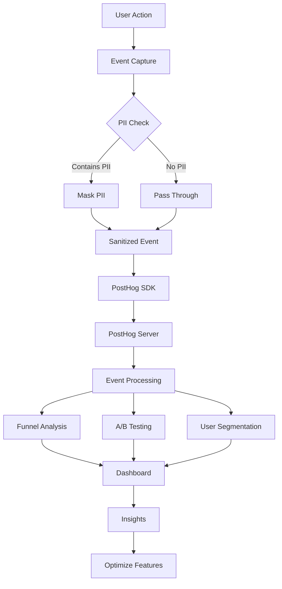

# [Integration] Implement Agent Analytics with PostHog

# Implement Agent Analytics with PostHog

## Overview
Integrate PostHog for comprehensive agent analytics, including user behavior tracking, A/B testing, feature flags, and funnel analysis.

## Context
PostHog provides privacy-first analytics (can be self-hosted on Supabase) and supports A/B testing for gradual rollout.
  
## Architecture Diagram
  


## Acceptance Criteria

### 1. PostHog Setup
- [ ] Install PostHog SDK (web and mobile)
- [ ] Configure PostHog project
- [ ] Set up self-hosted instance on Supabase (optional)
- [ ] Configure event tracking
- [ ] Implement user identification

### 2. Event Tracking
- [ ] Track agent interactions (chat opened, message sent)
- [ ] Track tool executions (booking, insights, etc.)
- [ ] Track user actions (approve, reject, edit)
- [ ] Track errors (agent failures, API errors)
- [ ] Track performance (latency, token usage)

### 3. Funnel Analysis
- [ ] Define funnels (e.g., Chat → Tool Call → Approval → Success)
- [ ] Track conversion rates at each step
- [ ] Identify drop-off points
- [ ] Generate funnel reports
- [ ] Optimize based on insights

### 4. A/B Testing
- [ ] Create experiments (AI vs. Classic, different prompts)
- [ ] Assign users to variants (consistent assignment)
- [ ] Track variant performance
- [ ] Calculate statistical significance
- [ ] Roll out winning variant

### 5. User Segmentation
- [ ] Segment by role (patient, therapist, admin)
- [ ] Segment by engagement (high, medium, low)
- [ ] Segment by satisfaction (NPS score)
- [ ] Segment by feature usage (AI adopters vs. non-adopters)
- [ ] Create targeted campaigns

## Technical Details

**Files to Create:**
- `file:web/lib/analytics.ts`
- `file:mobile/src/services/analytics.ts`
- `file:web/components/providers/analytics-provider.tsx`

**Implementation:**
```typescript
import posthog from 'posthog-js';

export function initAnalytics() {
  posthog.init(process.env.NEXT_PUBLIC_POSTHOG_KEY!, {
    api_host: process.env.NEXT_PUBLIC_POSTHOG_HOST,
    autocapture: false, // Manual tracking for privacy
  });
}

export function trackAgentInteraction(
  agentType: string,
  action: string,
  properties: Record<string, any> = {}
) {
  posthog.capture('agent_interaction', {
    agent_type: agentType,
    action,
    ...properties,
  });
}

export function trackToolExecution(
  toolName: string,
  success: boolean,
  duration: number
) {
  posthog.capture('tool_execution', {
    tool_name: toolName,
    success,
    duration_ms: duration,
  });
}
```

## Testing
- [ ] Test event tracking (verify events in PostHog)
- [ ] Test funnel analysis (verify conversion rates)
- [ ] Test A/B experiments (verify variant assignment)
- [ ] Test user segmentation (verify segments)
- [ ] Test privacy (no PII in events)

## Success Metrics
- Event capture rate > 99%
- Funnel conversion rate > 70%
- A/B test statistical significance (p < 0.05)
- Zero PII in analytics data

## Dependencies
- PostHog account
- PII masking implementation
  
## Related Specifications
  
- spec:d969320e-d519-47a7-a258-e04789b8ce0e/68139c2e-3473-476b-9d20-8a0f7891ae48 - Backend & Integration Architecture
- spec:d969320e-d519-47a7-a258-e04789b8ce0e/51f8a991-4bf2-4282-98c1-e8d8b4e3d7ee - HIPAA Compliance & Healthcare AI Governance

---

## 📋 DETAILED IMPLEMENTATION [WAVE 6]

**Source:** Wave 6 ticket - See STEP 2 for complete PostHog integration

**Files:**
- `web/lib/posthog.ts` - PostHog initialization
- `web/lib/analytics.ts` - Event tracking functions
- `mobile/src/services/analyticsService.ts` - Mobile analytics

**Events:** agent_interaction, tool_execution, chat_message, feature_used, pageview

**Install:**
```bash
cd web && pnpm add posthog-js
cd mobile && npx expo install posthog-react-native
```

**Success:** Capture > 99%, zero PII in events

**Wave Progress:** 30/49 updated

