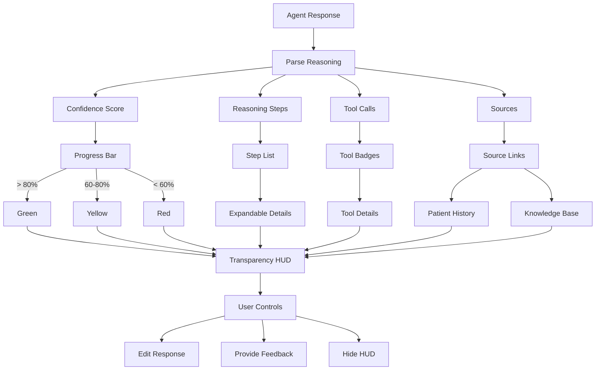

# [Frontend Web] Implement Transparency HUD - Agent Reasoning Display

# Implement Transparency HUD - Agent Reasoning Display

## Overview
Implement the transparency HUD that displays agent reasoning, confidence scores, tool usage, and edit controls to build user trust.

## Context
Transparency is critical for user trust in AI systems. The HUD shows users what the agent is doing, why, and how, with controls to override or refine.
  
## Architecture Diagram
  


## Acceptance Criteria

### 1. Confidence Score Display
- [ ] Show confidence percentage (0-100%)
- [ ] Visual progress bar (color-coded: green > 80%, yellow 60-80%, red < 60%)
- [ ] Tooltip explaining confidence calculation
- [ ] Flag low-confidence responses for review

### 2. Reasoning Chain Display
- [ ] Expandable "How I decided this" section
- [ ] Step-by-step reasoning (numbered list)
- [ ] Highlight key decision points
- [ ] Link to source data (e.g., patient history)
- [ ] Collapsible by default (progressive disclosure)

### 3. Tool Usage Display
- [ ] Show "Tools used" badges
- [ ] Display tool names (human-readable)
- [ ] Show tool inputs/outputs (expandable)
- [ ] Link to tool documentation
- [ ] Track tool usage analytics

### 4. Edit Controls
- [ ] Inline edit button for agent responses
- [ ] Text area for modifications
- [ ] Save edited version
- [ ] Track edit rate (measure accuracy)
- [ ] Feedback mechanism ("Was this helpful?")

### 5. Activity Timeline
- [ ] Display "Agent actions today" timeline
- [ ] Show all agent interactions (chronological)
- [ ] Filter by agent type
- [ ] Export timeline (CSV, PDF)
- [ ] Privacy controls (hide sensitive actions)

## Technical Details

**Files to Create:**
- `file:web/components/ai/transparency-hud.tsx`
- `file:web/components/ai/confidence-bar.tsx`
- `file:web/components/ai/reasoning-chain.tsx`
- `file:web/components/ai/tool-badges.tsx`
- `file:web/components/ai/activity-timeline.tsx`

**Implementation:**
```typescript
interface AgentResponse {
  content: string;
  confidence: number;
  reasoning: ReasoningStep[];
  toolCalls: ToolCall[];
  sources: Source[];
}

export function TransparencyHUD({ response }: { response: AgentResponse }) {
  return (
    <div className="transparency-hud">
      <ConfidenceBar score={response.confidence} />
      <ReasoningChain steps={response.reasoning} />
      <ToolBadges tools={response.toolCalls} />
      <FeedbackButtons />
    </div>
  );
}
```

## Testing
- [ ] Test all components (unit tests)
- [ ] Test expandable sections (interaction)
- [ ] Test edit controls (save changes)
- [ ] Test accessibility (keyboard, screen reader)
- [ ] E2E tests (full transparency flow)

## Success Metrics
- Transparency engagement > 30% (users expand reasoning)
- Edit rate < 15% (high accuracy)
- User trust score > 4.5/5
- Accessibility score 100%

## Dependencies
- Agent orchestrator (provides reasoning data)
- Database schema (agent_executions)
  
## Related Specifications
  
- spec:d969320e-d519-47a7-a258-e04789b8ce0e/b4c0579d-02d4-44b4-991b-076b73106254 - Frontend Web Implementation
- spec:d969320e-d519-47a7-a258-e04789b8ce0e/719895d0-e8a7-46cc-b5f9-829428065e26 - UX Patterns & Conversational Interface Design
- spec:d969320e-d519-47a7-a258-e04789b8ce0e/7dd2bb11-e4c8-4b8d-9f0b-26a8472f3353 - Agentic AI Architecture

---

## 📋 DETAILED IMPLEMENTATION [WAVE 4]

**Source:** Wave 4 ticket - See STEP 3 for complete TransparencyHUD component

**File:** `web/components/ai-chat/transparency-hud.tsx` - Shows agent reasoning steps, tool calls, results with toggleable visibility

**Integration:** Add `<TransparencyHUD agentSteps={agentSteps} />` to chat interface

**Features:**
- Step-by-step reasoning display
- Tool usage indicators
- Result previews
- Timestamp tracking
- Toggle show/hide

**Deploy:** Included in web deployment

**Success:** Engagement > 30%, trust score > 4.5/5

**Wave Progress:** 13/49 updated

