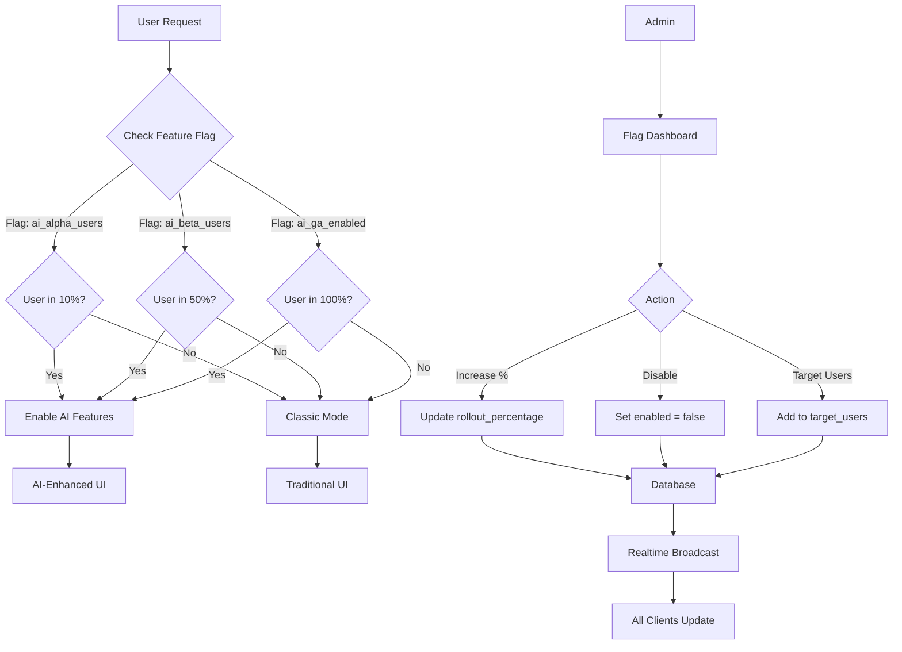

# [UX] Implement Feature Flags & Gradual Rollout System

# Implement Feature Flags & Gradual Rollout System

## Overview
Implement a feature flag system for gradual rollout of AI features, enabling safe deployment with percentage-based rollout and instant rollback capabilities.

## Context
Feature flags enable safe parallel deployments and gradual rollout (10% → 50% → 100%), reducing risk and allowing quick rollback if issues arise.
  
## Architecture Diagram
  


## Acceptance Criteria

### 1. Feature Flag System
- [ ] Setup feature flag infrastructure (PostHog or Supabase-based)
- [ ] Create flags for all AI features
- [ ] Support percentage-based rollout
- [ ] Support user-based targeting
- [ ] Support instant enable/disable

### 2. Core Flags
- [ ] `ai_alpha_users` - 10% rollout
- [ ] `ai_beta_users` - 50% rollout
- [ ] `ai_ga_enabled` - 100% rollout
- [ ] `booking_agent_enabled` - BookingAgent
- [ ] `session_agent_enabled` - SessionAgent
- [ ] `insights_agent_enabled` - InsightsAgent
- [ ] `followup_agent_enabled` - FollowupAgent

### 3. Flag Evaluation
- [ ] Client-side evaluation (web and mobile)
- [ ] Server-side evaluation (Edge Functions)
- [ ] Consistent evaluation (same user, same result)
- [ ] Cache flag values (reduce API calls)
- [ ] Real-time updates (flag changes propagate)

### 4. Admin Interface
- [ ] Dashboard to manage flags
- [ ] Toggle flags on/off
- [ ] Set rollout percentage
- [ ] Target specific users
- [ ] View flag usage analytics

### 5. Rollback Strategy
- [ ] Instant disable via flag toggle
- [ ] Automatic rollback on error rate > 5%
- [ ] Preserve user state during rollback
- [ ] Notify users of rollback (if needed)
- [ ] Log all rollback events

## Technical Details

**Files to Create:**
- `file:web/lib/feature-flags.ts`
- `file:mobile/src/services/featureFlags.ts`
- `file:mobile/supabase/functions/_shared/feature-flags.ts`
- `file:mobile/supabase/migrations/029_feature_flags.sql`

**Implementation:**
```typescript
import posthog from 'posthog-js';

export function useFeatureFlag(flagName: string): boolean {
  const [isEnabled, setIsEnabled] = useState(false);

  useEffect(() => {
    const enabled = posthog.isFeatureEnabled(flagName);
    setIsEnabled(enabled ?? false);

    // Listen for flag changes
    posthog.onFeatureFlags(() => {
      const updated = posthog.isFeatureEnabled(flagName);
      setIsEnabled(updated ?? false);
    });
  }, [flagName]);

  return isEnabled;
}

// Usage
export function BookingButton() {
  const isBookingAgentEnabled = useFeatureFlag('booking_agent_enabled');

  if (!isBookingAgentEnabled) {
    return <ClassicBookingButton />;
  }

  return <AIBookingButton />;
}
```

**Server-side Evaluation:**
```typescript
export async function checkFeatureFlag(
  userId: string,
  flagName: string
): Promise<boolean> {
  const { data } = await supabase
    .from('feature_flags')
    .select('*')
    .eq('name', flagName)
    .single();

  if (!data || !data.enabled) return false;

  // Percentage-based rollout
  if (data.rollout_percentage < 100) {
    const userHash = hashUserId(userId);
    return userHash % 100 < data.rollout_percentage;
  }

  return true;
}
```

## Testing
- [ ] Test flag evaluation (client and server)
- [ ] Test percentage rollout (verify distribution)
- [ ] Test user targeting (specific users)
- [ ] Test real-time updates (flag changes)
- [ ] Test rollback (disable flag)

## Success Metrics
- Flag evaluation latency < 10ms
- Rollout accuracy ± 2% (e.g., 10% → 8-12%)
- Rollback time < 1 minute
- Zero flag-related incidents

## Dependencies
- PostHog or Supabase
- Database schema (feature_flags table)
  
## Related Specifications
  
- spec:d969320e-d519-47a7-a258-e04789b8ce0e/96421d80-e1ba-4066-8cbb-4a15a7773f5a - Migration Strategy & Phased Rollout Plan
- spec:d969320e-d519-47a7-a258-e04789b8ce0e/68139c2e-3473-476b-9d20-8a0f7891ae48 - Backend & Integration Architecture

---

## 📋 DETAILED IMPLEMENTATION [WAVE 1]

**Source:** Wave 1 migration 033

**Table:** feature_flags with percentage rollout

**Function:** is_feature_enabled() with consistent hashing

**Flags:** ai_alpha (10%), ai_beta (50%), ai_ga (100%)

**Success:** Evaluation < 10ms

**Wave Progress:** 33/49 updated

