# [Integration] Implement Agent-to-Agent Communication Protocol

# Implement Agent-to-Agent Communication Protocol

## Overview
Implement communication protocol for multi-agent collaboration, enabling agents to share context, hand off tasks, and coordinate actions.

## Context
Complex workflows require multiple agents working together. Agent-to-agent communication enables seamless handoffs and shared intelligence.
  
## Architecture Diagram

```mermaid
graph TD
    A[Orchestrator] --> B[BookingAgent]
    A --> C[SessionAgent]
    A --> D[InsightsAgent]
    A --> E[FollowupAgent]
      
    B <-->|Handoff| C
    C <-->|Share Context| D
    D <-->|Trigger| E
      
    B --> F[Shared Context Store]
    C --> F
    D --> F
    E --> F
      
    F --> G[Conversation History]
    F --> H[User Preferences]
    F --> I[Tool Results]
      
    A --> J[Coordination Layer]
    J -->|Sequential| K[A→B→C]
    J -->|Parallel| L[A+B simultaneously]
    J -->|Event-driven| M[Subscribe/Publish]
```
  


## Acceptance Criteria

### 1. Communication Protocol
- [ ] Define message format (JSON schema)
- [ ] Support message types (request, response, notification, handoff)
- [ ] Include sender/receiver agent IDs
- [ ] Include conversation context
- [ ] Include priority levels

### 2. Handoff Mechanism
- [ ] Agent A requests handoff to Agent B
- [ ] Transfer conversation context
- [ ] Transfer user preferences
- [ ] Transfer partial results
- [ ] Notify user of handoff ("Now working with InsightsAgent")

### 3. Shared Context
- [ ] Agents access shared conversation history
- [ ] Agents access shared user context
- [ ] Agents access shared tool results
- [ ] Prevent context duplication
- [ ] Maintain context consistency

### 4. Coordination Patterns
- [ ] Sequential: Agent A → Agent B → Agent C
- [ ] Parallel: Agent A + Agent B simultaneously
- [ ] Hierarchical: Orchestrator → Specialist agents
- [ ] Event-driven: Agent subscribes to events from other agents

### 5. Conflict Resolution
- [ ] Detect conflicting actions (e.g., double booking)
- [ ] Resolve conflicts (priority-based)
- [ ] Notify user of conflicts
- [ ] Log all conflicts for analysis

## Technical Details

**Files to Create:**
- `file:mobile/supabase/functions/_shared/agent-protocol.ts`
- `file:mobile/supabase/functions/_shared/agent-handoff.ts`
- `file:mobile/supabase/functions/_shared/agent-coordinator.ts`

**Protocol Definition:**
```typescript
interface AgentMessage {
  id: string;
  sender: AgentType;
  receiver: AgentType;
  type: 'request' | 'response' | 'notification' | 'handoff';
  payload: any;
  context: {
    conversation_id: string;
    user_id: string;
    priority: 'low' | 'normal' | 'high';
  };
  timestamp: string;
}

export async function sendToAgent(
  message: AgentMessage
): Promise<AgentMessage> {
  // Route message to appropriate agent
  const response = await routeMessage(message);
  
  // Log communication
  await logAgentCommunication(message, response);
  
  return response;
}
```

## Testing
- [ ] Test all message types (request, response, handoff)
- [ ] Test handoff flow (Agent A → Agent B)
- [ ] Test parallel execution (Agent A + Agent B)
- [ ] Test conflict detection (double booking)
- [ ] Test error handling (agent unavailable)

## Success Metrics
- Handoff success rate > 95%
- Communication latency < 500ms
- Conflict detection accuracy 100%
- Zero context loss during handoffs

## Dependencies
- Orchestrator setup
- All agent implementations
  
## Related Specifications
  
- spec:d969320e-d519-47a7-a258-e04789b8ce0e/7dd2bb11-e4c8-4b8d-9f0b-26a8472f3353 - Agentic AI Architecture & Multi-Agent System Design
- spec:d969320e-d519-47a7-a258-e04789b8ce0e/68139c2e-3473-476b-9d20-8a0f7891ae48 - Backend & Integration Architecture

---

## 📋 DETAILED IMPLEMENTATION [WAVE 6]

**Source:** Wave 6 ticket - Agent-to-agent communication protocol

**Features:** Message protocol, handoff mechanism, shared context, coordination patterns, conflict resolution

**Files:** `agent-protocol.ts`, `agent-handoff.ts`, `agent-coordinator.ts`

**Success:** Handoff > 95%, latency < 500ms

**Wave Progress:** 29/49 updated

